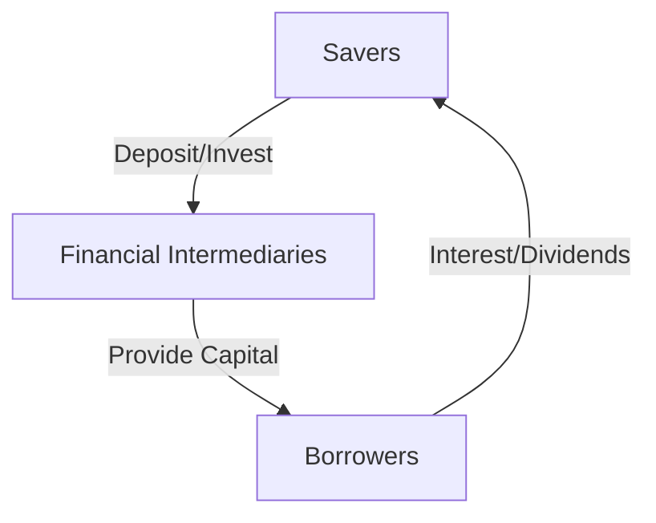

## 1.1 What Are Financial Markets?

In the vast landscape of the global economy, financial markets serve as the pivotal arenas where financial instruments such as stocks, bonds, and other securities are bought and sold. These markets are not just physical locations like the New York Stock Exchange, but also encompass virtual platforms and networks where transactions occur. Understanding financial markets is crucial for anyone looking to delve into the world of investing, as they are the backbone of economic activities, facilitating the flow of funds and enabling economic growth.

### Defining Financial Markets

At their core, financial markets are platforms or systems that facilitate the exchange of financial assets. These assets can range from equities and bonds to currencies and derivatives. The primary function of financial markets is to bring together savers, who have surplus funds, and borrowers, who need funds to finance various activities. This interaction helps in the efficient allocation of resources, ensuring that capital is available where it is most needed.

**Key Components of Financial Markets:**

- **Savers:** Individuals or institutions, such as pension funds or insurance companies, that have excess funds and are looking to invest them for future returns.
- **Borrowers:** Entities, including corporations, governments, and individuals, that require funds to finance operations, projects, or consumption.
- **Financial Instruments:** The various products traded in financial markets, including stocks, bonds, derivatives, and currencies.
- **Intermediaries:** Entities like banks, brokers, and investment funds that facilitate transactions between savers and borrowers.

### The Flow of Funds: From Savers to Borrowers

Financial markets play a critical role in channeling funds from savers to borrowers. This process involves several steps and participants, each contributing to the efficient functioning of the markets.

1. **Savers Deposit Funds:** Savers deposit their surplus funds in financial institutions or invest directly in financial instruments.
   
2. **Intermediaries Facilitate Transactions:** Financial intermediaries, such as banks, investment funds, and brokers, play a crucial role in linking savers with borrowers. They assess the creditworthiness of borrowers and allocate funds accordingly.

3. **Borrowers Access Capital:** Borrowers, whether they are businesses seeking to expand operations or governments funding infrastructure projects, access the capital they need through loans, bonds, or equity financing.

4. **Returns to Savers:** In return for their investment, savers receive interest, dividends, or capital gains, depending on the type of financial instrument they have invested in.

This flow of funds is essential for economic growth, as it ensures that resources are allocated efficiently, supporting innovation, infrastructure development, and overall economic stability.

### Significance of Financial Markets in Economic Activities

The importance of financial markets in supporting economic activities cannot be overstated. They provide a structured environment for the trading of financial instruments, helping to determine prices and allocate resources efficiently. Here are some key functions of financial markets:

- **Price Discovery:** Financial markets help in the discovery of prices for financial instruments through the interaction of supply and demand. This process ensures that prices reflect the true value of assets, guiding investment decisions.

- **Liquidity Provision:** Markets provide liquidity, allowing participants to buy and sell assets with ease. This liquidity is crucial for investors who need to convert their investments into cash quickly.

- **Risk Management:** Through various financial instruments like derivatives, participants can hedge against risks, protecting themselves from adverse price movements.

- **Capital Formation:** By facilitating the flow of funds from savers to borrowers, financial markets enable capital formation, supporting business expansion and economic growth.

- **Economic Indicators:** The performance of financial markets often serves as an indicator of economic health, with stock market indices and bond yields reflecting investor sentiment and economic conditions.

### Practical Examples and Real-World Scenarios

To better understand the role of financial markets, let's consider a few practical examples:

- **Corporate Expansion:** A technology company looking to expand its operations may issue bonds or stocks to raise capital. Investors, attracted by the company's growth prospects, purchase these securities, providing the company with the necessary funds to invest in new projects.

- **Government Infrastructure Projects:** Governments often issue bonds to finance infrastructure projects like roads and bridges. Savers, seeking stable returns, invest in these bonds, enabling the government to undertake large-scale projects that stimulate economic growth.

- **Individual Investment:** An individual looking to save for retirement may invest in a diversified portfolio of stocks and bonds through a mutual fund. This investment not only provides the individual with potential returns but also channels funds to various companies and government projects.

### Diagrams and Visual Representations

To further illustrate the flow of funds and the structure of financial markets, let's consider a diagram that outlines the interaction between savers, intermediaries, and borrowers:

This diagram highlights the cyclical nature of financial markets, where funds flow from savers to borrowers and returns flow back to savers, completing the cycle.

### Best Practices and Common Pitfalls

When engaging with financial markets, it's important to consider best practices and be aware of common pitfalls:

- **Diversification:** Avoid putting all your eggs in one basket. Diversifying your investments across different asset classes and sectors can help mitigate risks.

- **Research and Analysis:** Conduct thorough research and analysis before making investment decisions. Understanding market trends and economic indicators can guide your investment strategy.

- **Long-Term Perspective:** While financial markets can be volatile, maintaining a long-term perspective can help weather short-term fluctuations and achieve financial goals.

- **Regulatory Compliance:** Ensure compliance with financial regulations and seek advice from licensed professionals to avoid legal issues and protect your investments.

### Encouraging Continuous Learning and Application

As we explore the intricacies of financial markets, it's important to continuously learn and apply these concepts in real-world scenarios. Whether you're managing a personal investment portfolio or making decisions for a business, understanding financial markets can provide valuable insights and strategies for success.

### Conclusion

In conclusion, financial markets are the lifeblood of the global economy, facilitating the flow of funds and supporting economic activities. By understanding their structure and functions, we can make informed investment decisions and contribute to economic growth. Let's continue to explore these concepts and apply them to our financial planning and investment strategies.

---

## Quiz Time!



### What is the primary function of financial markets?

- [x] To facilitate the exchange of financial assets
- [ ] To provide employment opportunities
- [ ] To regulate interest rates
- [ ] To control inflation

> **Explanation:** The primary function of financial markets is to facilitate the exchange of financial assets, enabling the flow of funds from savers to borrowers.

### Who are considered savers in financial markets?

- [x] Individuals with surplus funds
- [x] Institutions with excess funds
- [ ] Governments requiring funds
- [ ] Corporations issuing bonds

> **Explanation:** Savers are individuals or institutions that have surplus funds to invest, such as pension funds or insurance companies.

### How do financial markets support economic activities?

- [x] By providing liquidity and enabling capital formation
- [ ] By increasing unemployment rates
- [ ] By decreasing consumer spending
- [ ] By limiting access to credit

> **Explanation:** Financial markets support economic activities by providing liquidity, enabling capital formation, and facilitating efficient resource allocation.

### What role do financial intermediaries play in financial markets?

- [x] They link savers with borrowers
- [ ] They create financial regulations
- [ ] They issue government bonds
- [ ] They set interest rates

> **Explanation:** Financial intermediaries, such as banks and brokers, link savers with borrowers, facilitating the flow of funds in financial markets.

### What is the significance of price discovery in financial markets?

- [x] It helps determine the true value of assets
- [ ] It increases market volatility
- [ ] It reduces investor confidence
- [ ] It limits trading opportunities

> **Explanation:** Price discovery in financial markets helps determine the true value of assets through the interaction of supply and demand, guiding investment decisions.

### What is a common pitfall to avoid in financial markets?

- [x] Lack of diversification
- [ ] Investing in mutual funds
- [ ] Following market trends
- [ ] Conducting research

> **Explanation:** A common pitfall in financial markets is the lack of diversification, which can increase risk by concentrating investments in a single asset class or sector.

### What is a practical example of financial markets facilitating economic growth?

- [x] A company issuing stocks to fund expansion
- [ ] A government increasing taxes
- [ ] An individual saving cash under a mattress
- [ ] A corporation reducing its workforce

> **Explanation:** A practical example of financial markets facilitating economic growth is a company issuing stocks to raise capital for expansion, enabling business growth and job creation.

### How do financial markets provide liquidity?

- [x] By allowing participants to buy and sell assets easily
- [ ] By restricting access to credit
- [ ] By increasing transaction costs
- [ ] By limiting market participation

> **Explanation:** Financial markets provide liquidity by allowing participants to buy and sell assets easily, ensuring that investments can be converted into cash quickly.

### What is a key benefit of understanding financial markets?

- [x] Making informed investment decisions
- [ ] Avoiding all financial risks
- [ ] Guaranteeing high returns
- [ ] Eliminating market volatility

> **Explanation:** Understanding financial markets enables individuals to make informed investment decisions, although it does not eliminate risks or guarantee returns.

### True or False: Financial markets are essential for the efficient allocation of resources.

- [x] True
- [ ] False

> **Explanation:** True. Financial markets are essential for the efficient allocation of resources, ensuring that capital is available where it is most needed.


