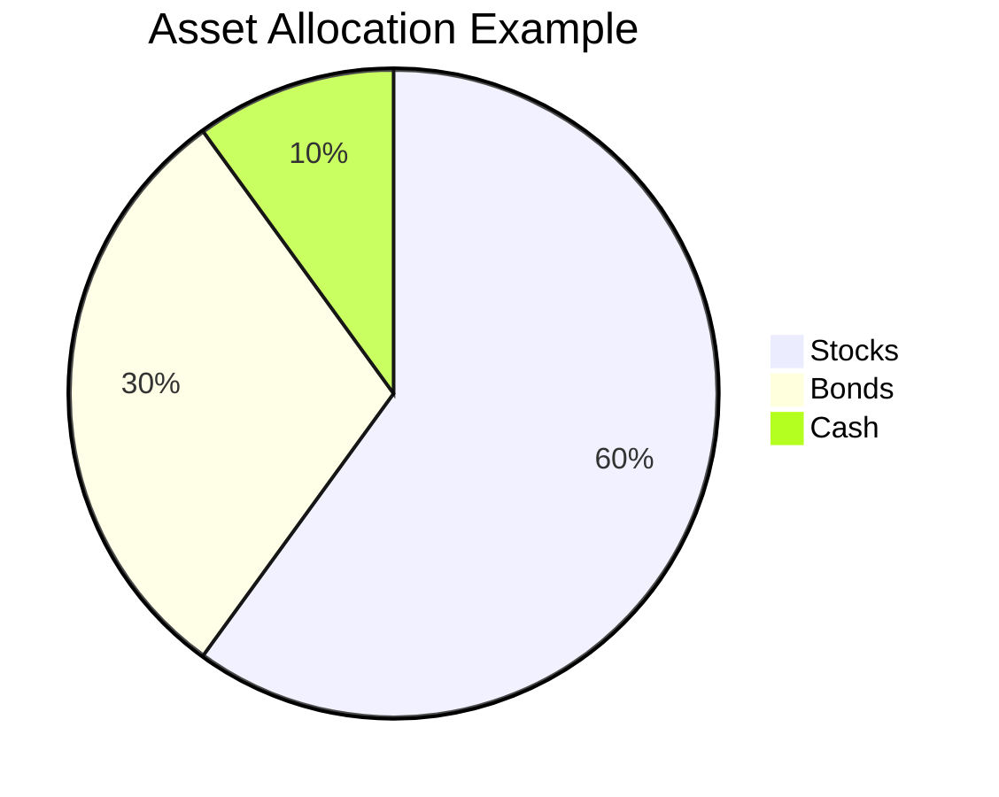
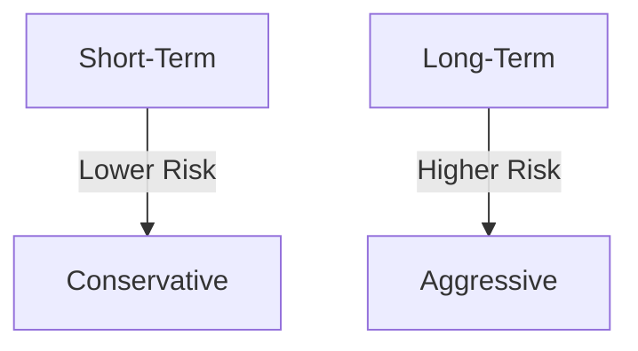

## 10. Building an Investment Portfolio

In the world of investing, constructing an investment portfolio is akin to building a house. Just as a house requires a solid foundation, careful planning, and regular maintenance, so too does a successful investment portfolio. In this chapter, we will guide you through the process of building a portfolio that aligns with your financial goals and risk tolerance, emphasizing the importance of ongoing management and adjustments.

### 10.1 Assessing Your Risk Tolerance

Before diving into the construction of an investment portfolio, it's crucial to understand your risk tolerance. Risk tolerance refers to your ability and willingness to endure fluctuations in the value of your investments. It is influenced by various factors, including your financial situation, investment goals, time horizon, and personal comfort with risk.

#### Factors Influencing Risk Tolerance

1. **Financial Situation:** Your current financial status, including income, expenses, and savings, will determine how much risk you can afford to take. Individuals with stable incomes and substantial savings may have a higher risk tolerance.

2. **Investment Goals:** Your objectives, such as retirement, buying a home, or funding education, will influence your risk tolerance. Long-term goals often allow for higher risk tolerance due to the potential for greater returns over time.

3. **Time Horizon:** The length of time you plan to invest before needing to access your funds affects your risk tolerance. Longer time horizons typically allow for more risk as there is time to recover from market downturns.

4. **Personal Comfort with Risk:** Your psychological comfort with risk plays a significant role. Some individuals are naturally more risk-averse, while others are more willing to take risks for potential rewards.

#### Assessing Your Risk Profile

To assess your risk tolerance, consider taking a risk assessment questionnaire provided by financial institutions or advisors. These assessments evaluate your financial situation, goals, and comfort with risk to provide a risk profile. This profile will guide your asset allocation decisions.

### 10.2 Portfolio Construction Strategies

Once you understand your risk tolerance, the next step is to construct a diversified portfolio that aligns with your financial goals. Diversification is the practice of spreading investments across different asset classes to reduce risk.

#### Asset Allocation

Asset allocation is the process of deciding how to distribute your investments among various asset classes, such as stocks, bonds, and cash. The goal is to balance risk and return according to your risk tolerance and investment objectives.

**Key Asset Classes:**

- **Stocks (Equities):** Represent ownership in a company and offer potential for high returns but come with higher risk.
- **Bonds (Debt Securities):** Provide fixed income and are generally considered less risky than stocks.
- **Cash and Cash Equivalents:** Include savings accounts and money market funds, offering liquidity and stability but low returns.

#### Strategic vs. Tactical Asset Allocation

- **Strategic Asset Allocation:** Involves setting target allocations for each asset class and periodically rebalancing to maintain these targets. It is a long-term strategy based on your risk profile and goals.

- **Tactical Asset Allocation:** Allows for short-term adjustments to take advantage of market opportunities or to mitigate risks. It requires active management and market analysis.

#### Example of Asset Allocation

Let's consider an example of a balanced portfolio for an investor with moderate risk tolerance:

- **60% Stocks:** Diversified across different sectors and regions.
- **30% Bonds:** A mix of government and corporate bonds.
- **10% Cash:** For liquidity and stability.

#### Diagram: Example of Asset Allocation

### 10.3 Rebalancing and Managing Your Portfolio

Building a portfolio is just the beginning. Ongoing management and adjustments are crucial to maintaining alignment with your financial goals and risk tolerance.

#### The Importance of Rebalancing

Rebalancing involves adjusting your portfolio to maintain your desired asset allocation. Over time, market fluctuations can cause your portfolio to drift from its original allocation. Regular rebalancing ensures that your portfolio remains aligned with your risk profile.

**Steps for Rebalancing:**

1. **Review Your Portfolio:** Regularly assess the performance of your investments and compare them to your target allocation.

2. **Identify Deviations:** Determine if any asset class has deviated significantly from its target allocation.

3. **Make Adjustments:** Buy or sell assets to bring your portfolio back to its original allocation.

4. **Consider Tax Implications:** Be mindful of capital gains taxes when selling assets to rebalance.

#### Monitoring Performance

Regularly monitoring your portfolio's performance is essential to ensure it meets your financial goals. Use benchmarks and indices to evaluate how your investments are performing relative to the market.

**Key Performance Metrics:**

- **Return on Investment (ROI):** Measures the gain or loss on an investment relative to its cost.
- **Volatility:** Indicates the degree of variation in investment returns over time.
- **Sharpe Ratio:** Assesses risk-adjusted returns by comparing the excess return of an investment to its volatility.

### 10.4 Passive vs. Active Investing

When managing your portfolio, you can choose between passive and active investing strategies.

#### Passive Investing

Passive investing involves building a portfolio that mirrors a market index, such as the S&P 500. It is a long-term strategy that aims to achieve market returns with low fees and minimal trading.

**Advantages of Passive Investing:**

- **Lower Costs:** Passive funds typically have lower expense ratios due to less frequent trading.
- **Simplicity:** Requires less time and effort to manage.
- **Market Performance:** Historically, passive funds have performed well over the long term.

#### Active Investing

Active investing involves selecting individual securities and making frequent trades to outperform the market. It requires in-depth research and analysis.

**Advantages of Active Investing:**

- **Potential for Higher Returns:** Skilled managers can potentially outperform the market.
- **Flexibility:** Allows for tactical adjustments based on market conditions.

**Challenges of Active Investing:**

- **Higher Costs:** Active funds often have higher fees due to frequent trading.
- **Increased Risk:** The potential for higher returns comes with increased risk.

### 10.5 Monitoring Performance and Making Adjustments

Continuous monitoring and adjustments are essential to ensure your portfolio remains aligned with your financial goals and risk tolerance.

#### Setting Financial Goals

Clearly defined financial goals provide direction for your investment strategy. Whether you're saving for retirement, a home, or education, your goals will influence your asset allocation and risk tolerance.

**SMART Goals:**

- **Specific:** Clearly define what you want to achieve.
- **Measurable:** Establish criteria to track progress.
- **Achievable:** Set realistic and attainable goals.
- **Relevant:** Ensure goals align with your overall financial plan.
- **Time-Bound:** Set a timeline for achieving your goals.

#### Understanding Investment Horizons

Your investment horizon, or the time you plan to hold your investments, is a critical factor in portfolio construction. Longer horizons allow for more aggressive strategies, while shorter horizons require more conservative approaches.

#### Diagram: Investment Horizon and Risk

### 10.6 Best Practices for Portfolio Management

To effectively manage your investment portfolio, consider the following best practices:

1. **Diversification:** Spread investments across different asset classes to reduce risk.
2. **Regular Review:** Periodically assess your portfolio's performance and make necessary adjustments.
3. **Stay Informed:** Keep up with market trends and economic indicators that may impact your investments.
4. **Avoid Emotional Decisions:** Base investment decisions on research and analysis, not emotions.
5. **Consult Professionals:** Seek advice from financial advisors or professionals when needed.

### 10.7 Common Pitfalls and Challenges

Building and managing an investment portfolio comes with challenges. Being aware of common pitfalls can help you avoid costly mistakes.

**Common Pitfalls:**

- **Lack of Diversification:** Concentrating investments in a single asset class increases risk.
- **Ignoring Risk Tolerance:** Investing without considering your risk tolerance can lead to discomfort and poor decisions.
- **Overreacting to Market Volatility:** Making impulsive decisions during market downturns can harm long-term performance.
- **Neglecting Rebalancing:** Failing to rebalance can lead to an unbalanced portfolio and increased risk.

### 10.8 Case Study: Building a Sample Investment Portfolio

Let's examine a hypothetical case study to illustrate the process of building an investment portfolio.

**Investor Profile:**

- **Age:** 35
- **Risk Tolerance:** Moderate
- **Investment Horizon:** 20 years
- **Financial Goal:** Retirement savings

**Portfolio Construction:**

- **50% Stocks:** Diversified across U.S. and international markets.
- **30% Bonds:** A mix of government and corporate bonds.
- **20% Real Estate Investment Trusts (REITs):** To add diversification and potential income.

**Rebalancing Strategy:**

- **Annual Review:** Assess portfolio performance and rebalance to maintain target allocation.
- **Consider Tax Implications:** Use tax-advantaged accounts to minimize tax impact.

**Outcome:**

By following a disciplined approach to portfolio construction and management, the investor aims to achieve their retirement savings goal while managing risk.

### Conclusion

Building an investment portfolio is a dynamic process that requires careful planning, ongoing management, and regular adjustments. By assessing your risk tolerance, setting clear financial goals, and employing effective asset allocation strategies, you can construct a portfolio that aligns with your objectives. Remember to stay informed, avoid common pitfalls, and seek professional advice when needed. With dedication and discipline, you can navigate the complexities of investing and work towards achieving your financial goals.

## Quiz Time!



### What is the primary goal of asset allocation?

- [x] To balance risk and return according to an investor's risk tolerance and investment objectives.
- [ ] To maximize returns regardless of risk.
- [ ] To minimize tax liabilities.
- [ ] To invest solely in stocks.

> **Explanation:** Asset allocation aims to balance risk and return according to an investor's risk tolerance and investment objectives, ensuring a diversified portfolio.

### Which of the following is a key advantage of passive investing?

- [x] Lower costs due to minimal trading.
- [ ] Potential for higher returns than the market.
- [ ] Flexibility to adjust to market conditions.
- [ ] Requires more time and effort to manage.

> **Explanation:** Passive investing typically involves lower costs due to minimal trading, as it aims to replicate market indices.

### What is rebalancing in portfolio management?

- [x] Adjusting the portfolio to maintain the desired asset allocation.
- [ ] Selling all investments and starting over.
- [ ] Focusing solely on high-risk investments.
- [ ] Ignoring market conditions.

> **Explanation:** Rebalancing involves adjusting the portfolio to maintain the desired asset allocation, ensuring alignment with the investor's risk profile.

### What does the Sharpe Ratio measure?

- [x] Risk-adjusted returns by comparing excess return to volatility.
- [ ] Total return of an investment.
- [ ] The amount of dividends received.
- [ ] The liquidity of an asset.

> **Explanation:** The Sharpe Ratio measures risk-adjusted returns by comparing the excess return of an investment to its volatility.

### Which of the following is a common pitfall in portfolio management?

- [x] Lack of diversification.
- [ ] Regularly reviewing the portfolio.
- [ ] Setting clear financial goals.
- [ ] Consulting financial advisors.

> **Explanation:** Lack of diversification is a common pitfall, as concentrating investments in a single asset class increases risk.

### What is the purpose of setting SMART goals in investing?

- [x] To provide clear direction and criteria for tracking progress.
- [ ] To invest only in technology stocks.
- [ ] To avoid all risks.
- [ ] To maximize short-term gains.

> **Explanation:** SMART goals provide clear direction and criteria for tracking progress, ensuring alignment with the investor's financial plan.

### What does the term 'risk tolerance' refer to?

- [x] An investor's ability and willingness to endure fluctuations in investment value.
- [ ] The amount of money an investor is willing to invest.
- [ ] The number of stocks in a portfolio.
- [ ] The interest rate on a bond.

> **Explanation:** Risk tolerance refers to an investor's ability and willingness to endure fluctuations in the value of their investments.

### Which of the following is a characteristic of tactical asset allocation?

- [x] Allows for short-term adjustments based on market conditions.
- [ ] Involves setting fixed target allocations.
- [ ] Focuses solely on long-term goals.
- [ ] Ignores market trends.

> **Explanation:** Tactical asset allocation allows for short-term adjustments based on market conditions, requiring active management.

### What is a key factor in assessing an investor's risk tolerance?

- [x] Financial situation, including income and savings.
- [ ] The number of stocks in a portfolio.
- [ ] The interest rate on a bond.
- [ ] The color of a company's logo.

> **Explanation:** An investor's financial situation, including income and savings, is a key factor in assessing risk tolerance.

### True or False: Rebalancing a portfolio should consider tax implications.

- [x] True
- [ ] False

> **Explanation:** Rebalancing should consider tax implications, as selling assets may result in capital gains taxes.


