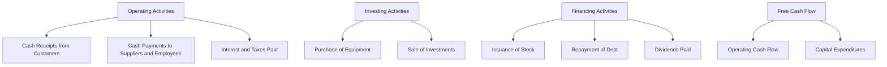

## 11.4 Understanding Cash Flow Statements

In the realm of financial analysis, the cash flow statement stands as a crucial document, offering insights into a company's financial health that are not readily apparent from the income statement or balance sheet alone. Understanding cash flow statements is essential for investors, analysts, and anyone interested in the financial well-being of a business. In this section, we will explore the components of cash flow statements, their significance, and how they can be used to assess a company's financial flexibility.

### The Structure of Cash Flow Statements

A cash flow statement is divided into three main sections: operating activities, investing activities, and financing activities. Each section provides detailed information about the cash inflows and outflows related to specific business activities.

#### Operating Activities

Operating activities include the primary revenue-generating activities of a company. This section of the cash flow statement reflects the cash generated or used by the core business operations. It typically includes:

- **Cash Receipts from Customers:** Cash collected from selling goods or services.
- **Cash Payments to Suppliers and Employees:** Cash paid for inventory, salaries, and other operating expenses.
- **Interest and Taxes Paid:** Cash paid for interest on debt and taxes.

Operating cash flow is a critical indicator of a company's ability to generate sufficient cash to maintain and grow its operations. It is often adjusted for changes in working capital, which includes accounts receivable, accounts payable, and inventory.

#### Investing Activities

Investing activities relate to the acquisition and disposal of long-term assets and investments. This section includes:

- **Purchases of Property, Plant, and Equipment (PPE):** Cash spent on acquiring physical assets.
- **Proceeds from the Sale of Assets:** Cash received from selling assets.
- **Investments in Securities:** Cash used to purchase or sell investments in stocks, bonds, or other securities.

Investing activities provide insights into a company's growth strategy and its ability to reinvest in its business. Positive cash flow from investing activities might indicate asset sales, while negative cash flow could suggest significant capital expenditures.

#### Financing Activities

Financing activities involve changes in the company's capital structure. This section includes:

- **Issuance of Equity or Debt:** Cash received from issuing stocks or bonds.
- **Repayment of Debt:** Cash paid to reduce outstanding liabilities.
- **Dividends Paid:** Cash distributed to shareholders.

Financing activities reveal how a company funds its operations and growth. A company with strong operating cash flow might use financing activities to return capital to shareholders or reduce debt.

### Cash Flow vs. Net Income

While net income is a measure of profitability, cash flow provides a more accurate picture of a company's liquidity and financial health. Here's how they differ:

- **Net Income:** Calculated on an accrual basis, net income includes non-cash items such as depreciation and amortization. It reflects the company's profitability over a specific period.
- **Cash Flow:** Focuses on actual cash movements, providing insights into the company's ability to generate cash to fund operations, pay debts, and invest in growth.

A company can report positive net income while experiencing negative cash flow, which may indicate issues with cash management or working capital. Conversely, a company with negative net income but positive cash flow might be investing heavily in growth.

### The Significance of Free Cash Flow

Free cash flow (FCF) is a key metric for assessing a company's financial flexibility. It represents the cash available after accounting for capital expenditures necessary to maintain or expand the asset base. Free cash flow is calculated as follows:

**Free Cash Flow = Operating Cash Flow - Capital Expenditures**

Free cash flow is significant for several reasons:

- **Financial Health:** A company with strong free cash flow can invest in growth opportunities, pay dividends, and reduce debt.
- **Valuation:** Investors often use free cash flow to assess a company's intrinsic value and potential for future growth.
- **Flexibility:** Free cash flow provides a buffer against economic downturns, allowing a company to maintain operations and pursue strategic initiatives.

### Practical Example: Analyzing a Cash Flow Statement

Let's consider a hypothetical company, ABC Corp, to illustrate how to analyze a cash flow statement.

**Operating Activities:**

- Cash receipts from customers: $500,000
- Cash payments to suppliers and employees: $300,000
- Interest and taxes paid: $50,000

**Operating Cash Flow:** $150,000

**Investing Activities:**

- Purchase of equipment: $100,000
- Sale of investments: $20,000

**Net Cash Used in Investing Activities:** -$80,000

**Financing Activities:**

- Issuance of stock: $50,000
- Repayment of debt: $30,000
- Dividends paid: $20,000

**Net Cash Provided by Financing Activities:** $0

**Free Cash Flow:** $150,000 (Operating Cash Flow) - $100,000 (Capital Expenditures) = $50,000

In this example, ABC Corp generated positive operating cash flow, indicating strong core business operations. However, the company also invested heavily in equipment, resulting in negative cash flow from investing activities. The issuance of stock offset debt repayment and dividends, leading to neutral cash flow from financing activities. The positive free cash flow suggests financial flexibility and the potential for future growth.

### Diagrams and Visuals

To further enhance understanding, let's include a diagram illustrating the flow of cash through the different sections of a cash flow statement:

This diagram provides a visual representation of how cash flows through a company's operations, investments, and financing activities, ultimately leading to the calculation of free cash flow.

### Best Practices and Common Pitfalls

When analyzing cash flow statements, consider the following best practices and common pitfalls:

- **Consistency:** Look for consistent positive operating cash flow over multiple periods, indicating reliable core operations.
- **Capital Expenditures:** Assess whether capital expenditures align with the company's growth strategy and industry norms.
- **Debt Management:** Monitor cash flow from financing activities to ensure sustainable debt levels.
- **Working Capital:** Analyze changes in working capital to identify potential cash flow issues.

Common pitfalls include focusing solely on net income without considering cash flow, ignoring significant changes in working capital, and failing to assess the sustainability of cash flow from financing activities.

### Regulatory Considerations and Resources

In the U.S., the Securities and Exchange Commission (SEC) requires publicly traded companies to file cash flow statements as part of their financial reporting. Investors and analysts can access these statements through the SEC's EDGAR database.

For further exploration, consider the following resources:

- **Books:** "Financial Statements: A Step-by-Step Guide to Understanding and Creating Financial Reports" by Thomas Ittelson.
- **Online Courses:** "Financial Accounting Fundamentals" by the University of Virginia on Coursera.
- **Articles:** "The Importance of Cash Flow Statements" on Investopedia.

### Conclusion

Understanding cash flow statements is vital for assessing a company's financial health and investment potential. By analyzing operating, investing, and financing activities, investors can gain insights into a company's liquidity, growth strategy, and financial flexibility. Free cash flow serves as a critical metric for evaluating financial health and making informed investment decisions.

As you continue your journey in securities investing, remember to consider the cash flow statement alongside the income statement and balance sheet to form a comprehensive view of a company's financial position.

## Quiz Time!



### What are the three main sections of a cash flow statement?

- [x] Operating activities, investing activities, and financing activities
- [ ] Revenue activities, cost activities, and profit activities
- [ ] Asset activities, liability activities, and equity activities
- [ ] Income activities, expense activities, and capital activities

> **Explanation:** The three main sections of a cash flow statement are operating activities, investing activities, and financing activities, each reflecting different aspects of cash flow.

### How does cash flow differ from net income?

- [x] Cash flow focuses on actual cash movements, while net income includes non-cash items.
- [ ] Cash flow is always higher than net income.
- [ ] Net income reflects cash movements, while cash flow includes all transactions.
- [ ] Cash flow and net income are the same.

> **Explanation:** Cash flow focuses on actual cash movements, providing insights into liquidity, while net income includes non-cash items like depreciation.

### What is free cash flow?

- [x] Cash generated after accounting for capital expenditures
- [ ] Total cash inflow from all activities
- [ ] Cash available before paying dividends
- [ ] Cash used in financing activities

> **Explanation:** Free cash flow is the cash generated by a company after accounting for capital expenditures, indicating financial flexibility.

### Which section of the cash flow statement includes cash payments for inventory and salaries?

- [x] Operating activities
- [ ] Investing activities
- [ ] Financing activities
- [ ] Revenue activities

> **Explanation:** Operating activities include cash payments for inventory and salaries, reflecting core business operations.

### What does negative cash flow from investing activities typically indicate?

- [x] Significant capital expenditures
- [ ] Poor operating performance
- [ ] High dividend payments
- [ ] Excessive debt repayment

> **Explanation:** Negative cash flow from investing activities often indicates significant capital expenditures, such as purchasing new equipment.

### Which cash flow statement section reflects changes in a company's capital structure?

- [x] Financing activities
- [ ] Operating activities
- [ ] Investing activities
- [ ] Revenue activities

> **Explanation:** Financing activities reflect changes in a company's capital structure, including issuing equity or debt and repaying liabilities.

### What is a common pitfall when analyzing cash flow statements?

- [x] Focusing solely on net income without considering cash flow
- [ ] Ignoring net income and focusing only on cash flow
- [ ] Overemphasizing capital expenditures
- [ ] Analyzing changes in working capital

> **Explanation:** A common pitfall is focusing solely on net income without considering cash flow, which provides insights into liquidity.

### How can free cash flow be used in valuation?

- [x] To assess a company's intrinsic value and growth potential
- [ ] To determine dividend payments
- [ ] To calculate tax obligations
- [ ] To evaluate employee performance

> **Explanation:** Free cash flow is used to assess a company's intrinsic value and growth potential, making it a key metric in valuation.

### What does consistent positive operating cash flow indicate?

- [x] Reliable core operations
- [ ] Excessive debt levels
- [ ] Inefficient working capital management
- [ ] High dividend payments

> **Explanation:** Consistent positive operating cash flow indicates reliable core operations, suggesting a healthy business.

### True or False: The SEC requires publicly traded companies to file cash flow statements.

- [x] True
- [ ] False

> **Explanation:** True. The SEC requires publicly traded companies to file cash flow statements as part of their financial reporting.


