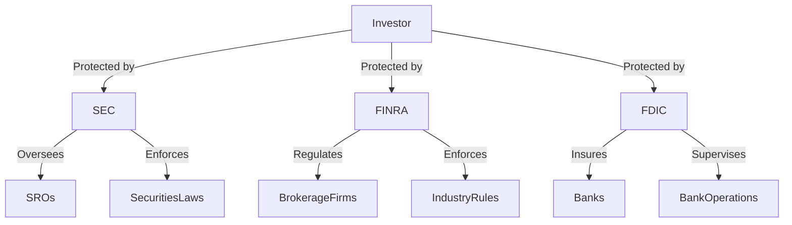

## 12.2 Key Regulatory Bodies: SEC, FINRA, FDIC

In the complex world of finance and investing, regulatory bodies play a crucial role in maintaining market integrity, protecting investors, and ensuring the smooth functioning of financial systems. In the United States, three key regulatory bodies stand out: the Securities and Exchange Commission (SEC), the Financial Industry Regulatory Authority (FINRA), and the Federal Deposit Insurance Corporation (FDIC). Each of these organizations has distinct responsibilities and functions, but together they form a robust framework that supports the stability and transparency of the financial markets.

### Securities and Exchange Commission (SEC)

#### Overview of the SEC

The Securities and Exchange Commission (SEC) is a federal agency established in 1934, primarily to oversee the securities markets and protect investors. The creation of the SEC was a direct response to the stock market crash of 1929 and the subsequent Great Depression, which highlighted the need for more stringent regulation of the financial markets.

#### Roles and Responsibilities

The SEC's mission is to protect investors, maintain fair, orderly, and efficient markets, and facilitate capital formation. To achieve these goals, the SEC has several key responsibilities:

1. **Regulation of Securities Markets:** The SEC regulates the securities markets to ensure transparency and prevent fraudulent activities. This includes overseeing the registration of securities, monitoring disclosures, and enforcing compliance with securities laws.

2. **Investor Protection:** The SEC works to protect investors by ensuring that they have access to essential information about investment products. This involves enforcing disclosure requirements for public companies and investment funds.

3. **Enforcement of Securities Laws:** The SEC has the authority to investigate and take action against individuals and companies that violate securities laws. This includes pursuing cases of insider trading, accounting fraud, and other forms of securities fraud.

4. **Oversight of Self-Regulatory Organizations (SROs):** The SEC oversees SROs, such as FINRA and stock exchanges, to ensure they are effectively regulating their members and maintaining industry standards.

5. **Facilitating Capital Formation:** By maintaining a fair and efficient market, the SEC helps businesses raise capital through the issuance of securities, which in turn supports economic growth.

#### Practical Example

Consider a company planning to go public through an Initial Public Offering (IPO). The SEC requires the company to file a registration statement, which includes detailed financial information and risk factors. This ensures potential investors have the necessary information to make informed decisions.

### Financial Industry Regulatory Authority (FINRA)

#### Overview of FINRA

The Financial Industry Regulatory Authority (FINRA) is a self-regulatory organization (SRO) that oversees brokerage firms and exchange markets in the United States. Established in 2007 through the consolidation of the National Association of Securities Dealers (NASD) and the regulatory arm of the New York Stock Exchange, FINRA plays a vital role in maintaining the integrity of the securities industry.

#### Roles and Responsibilities

FINRA's primary mission is to protect investors and ensure the integrity of the financial markets. Its key responsibilities include:

1. **Regulation of Brokerage Firms:** FINRA regulates brokerage firms and their registered representatives, ensuring they comply with industry rules and standards. This includes licensing, registration, and ongoing compliance monitoring.

2. **Market Surveillance:** FINRA conducts market surveillance to detect and prevent fraudulent and manipulative activities. This involves monitoring trading activities and investigating potential violations.

3. **Dispute Resolution:** FINRA provides a forum for resolving disputes between investors and brokerage firms through arbitration and mediation services.

4. **Investor Education:** FINRA is committed to educating investors about their rights and responsibilities. It provides resources and tools to help investors make informed decisions and avoid fraud.

5. **Rulemaking and Enforcement:** FINRA develops and enforces rules that govern the conduct of brokerage firms and their representatives. This helps maintain fair and transparent markets.

#### Practical Example

Imagine an investor who believes they have been misled by their broker. They can file a complaint with FINRA, which will investigate the matter and, if necessary, take disciplinary action against the broker.

### Federal Deposit Insurance Corporation (FDIC)

#### Overview of the FDIC

The Federal Deposit Insurance Corporation (FDIC) is an independent agency created in 1933 to maintain stability and public confidence in the nation's financial system. The FDIC's primary function is to insure deposits at banks and thrift institutions, protecting depositors in the event of a bank failure.

#### Roles and Responsibilities

The FDIC's key responsibilities include:

1. **Deposit Insurance:** The FDIC insures deposits at member banks up to a specified limit, currently $250,000 per depositor, per insured bank, for each account ownership category. This insurance protects depositors from losing their money if a bank fails.

2. **Bank Supervision:** The FDIC supervises and examines banks to ensure they operate safely and soundly. This involves assessing the financial health of banks and enforcing compliance with banking laws and regulations.

3. **Resolution of Failed Banks:** When a bank fails, the FDIC steps in to manage the resolution process. This may involve selling the bank to another institution or liquidating its assets to pay depositors and creditors.

4. **Consumer Protection:** The FDIC promotes consumer protection by enforcing laws and regulations that ensure fair treatment of bank customers.

5. **Risk Management:** The FDIC monitors and assesses risks to the banking system, working to mitigate potential threats to financial stability.

#### Practical Example

Consider a scenario where a bank is on the brink of failure. The FDIC would step in to protect depositors, ensuring they have access to their insured funds while managing the resolution process to minimize disruption to the financial system.

### Glossary

- **Self-Regulatory Organization (SRO):** An organization that regulates its members and enforces industry standards. SROs, such as FINRA, play a critical role in maintaining market integrity by overseeing the conduct of their members.

### Visual Representation

To better understand the relationships and roles of these regulatory bodies, let's visualize their interactions and responsibilities:

### Conclusion

Understanding the roles and responsibilities of the SEC, FINRA, and FDIC is crucial for anyone involved in the financial markets. These regulatory bodies work together to ensure market integrity, protect investors, and maintain the stability of the financial system. By familiarizing ourselves with their functions, we can better navigate the complex landscape of investing and make informed decisions.

## Quiz Time!



### Which organization is primarily responsible for overseeing securities markets in the U.S.?

- [x] SEC
- [ ] FINRA
- [ ] FDIC
- [ ] CFTC

> **Explanation:** The SEC is the primary federal agency overseeing securities markets in the United States.

### What is one of FINRA's main roles?

- [ ] Insuring deposits
- [x] Regulating brokerage firms
- [ ] Supervising banks
- [ ] Enforcing banking laws

> **Explanation:** FINRA regulates brokerage firms and their representatives to ensure compliance with industry standards.

### Which regulatory body insures deposits at banks?

- [ ] SEC
- [ ] FINRA
- [x] FDIC
- [ ] OCC

> **Explanation:** The FDIC insures deposits at banks and thrift institutions to protect depositors.

### What does the SEC primarily enforce?

- [ ] Banking laws
- [x] Securities laws
- [ ] Insurance regulations
- [ ] Tax codes

> **Explanation:** The SEC enforces securities laws to protect investors and maintain market integrity.

### How does FINRA help investors?

- [x] By providing dispute resolution services
- [ ] By insuring deposits
- [ ] By supervising banks
- [ ] By issuing securities

> **Explanation:** FINRA offers arbitration and mediation services to resolve disputes between investors and brokerage firms.

### What is the current deposit insurance limit per depositor at an FDIC-insured bank?

- [ ] $100,000
- [ ] $500,000
- [x] $250,000
- [ ] $1,000,000

> **Explanation:** The FDIC insures deposits up to $250,000 per depositor, per insured bank, for each account ownership category.

### Which organization is a self-regulatory organization (SRO)?

- [ ] SEC
- [x] FINRA
- [ ] FDIC
- [ ] Federal Reserve

> **Explanation:** FINRA is a self-regulatory organization that oversees brokerage firms and exchange markets.

### What is one of the FDIC's responsibilities?

- [ ] Regulating securities markets
- [ ] Enforcing industry rules
- [x] Supervising banks
- [ ] Monitoring trading activities

> **Explanation:** The FDIC supervises banks to ensure they operate safely and soundly.

### Which body was created in response to the 1929 stock market crash?

- [x] SEC
- [ ] FINRA
- [ ] FDIC
- [ ] CFPB

> **Explanation:** The SEC was established in 1934 in response to the stock market crash of 1929 to regulate securities markets and protect investors.

### True or False: The FDIC provides a forum for resolving disputes between investors and brokerage firms.

- [ ] True
- [x] False

> **Explanation:** FINRA, not the FDIC, provides a forum for resolving disputes between investors and brokerage firms through arbitration and mediation.


