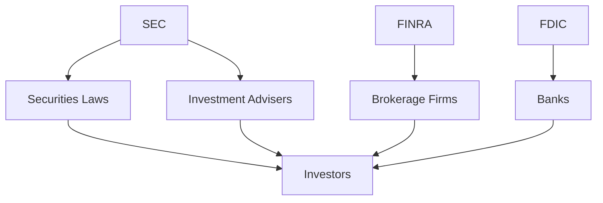

## 12. Regulations and Ethics in Investing

Investing in securities is not just about making profits; it's also about navigating a complex landscape of regulations and maintaining ethical standards. As investors, we must understand the framework of laws and regulations that govern financial markets to protect our interests and ensure fair play. In this chapter, we delve into the essential regulations and ethics in investing, exploring the legal framework, key regulatory bodies, investor protection laws, and the ethical considerations that guide responsible investing.

### 12.1 Overview of Financial Regulations

Financial regulations are the backbone of the securities market, ensuring transparency, fairness, and integrity. They are designed to protect investors, maintain orderly markets, and facilitate capital formation. Let's explore the key components of financial regulations:

#### 12.1.1 Securities Laws

Securities laws are a set of regulations that govern the issuance, trading, and enforcement of securities. In the United States, the primary laws include:

- **Securities Act of 1933:** This law requires issuers to provide full and fair disclosure of material information through registration statements and prospectuses before offering securities to the public.
- **Securities Exchange Act of 1934:** This act established the Securities and Exchange Commission (SEC) and regulates the trading of securities, including the secondary market.
- **Investment Company Act of 1940:** This law regulates mutual funds and other investment companies, ensuring they operate in the best interest of investors.
- **Investment Advisers Act of 1940:** This act governs the conduct of investment advisers, requiring them to register with the SEC and adhere to fiduciary standards.

#### 12.1.2 Key Regulatory Bodies

Several regulatory bodies oversee the securities industry, ensuring compliance with laws and protecting investors. The primary agencies include:

- **Securities and Exchange Commission (SEC):** The SEC is the main regulatory body overseeing the securities industry, enforcing securities laws, and protecting investors from fraud.
- **Financial Industry Regulatory Authority (FINRA):** FINRA is a self-regulatory organization that oversees brokerage firms and exchange markets, ensuring compliance with industry standards.
- **Federal Deposit Insurance Corporation (FDIC):** The FDIC insures deposits in banks and thrift institutions, protecting consumers in the event of a bank failure.

Below is a diagram illustrating the relationship between these regulatory bodies:

### 12.2 Investor Protection Laws

Investor protection is a critical aspect of financial regulations, ensuring that investors have access to necessary information and are protected from fraudulent activities.

#### 12.2.1 Disclosure Requirements

Disclosure requirements mandate that companies provide accurate and timely information about their financial condition and operations. This transparency allows investors to make informed decisions. Key disclosure documents include:

- **Prospectus:** A legal document issued by companies offering securities, detailing financial statements, risks, and management information.
- **Annual Reports (10-K):** Comprehensive reports filed annually, providing a detailed overview of a company's financial performance and operations.
- **Quarterly Reports (10-Q):** Reports filed quarterly, updating investors on a company's financial status and market conditions.

#### 12.2.2 Anti-Fraud Provisions

Anti-fraud provisions are designed to prevent misleading or deceptive practices in the securities market. Key provisions include:

- **Rule 10b-5:** Prohibits any act or omission resulting in fraud or deceit in connection with the purchase or sale of securities.
- **Sarbanes-Oxley Act of 2002:** Enhances corporate responsibility and financial disclosures, combating corporate and accounting fraud.

### 12.3 Ethical Considerations and Investor Rights

Ethical behavior is paramount in the investment industry, fostering trust and confidence among investors. Let's explore the ethical considerations and investor rights that guide responsible investing.

#### 12.3.1 Fiduciary Duty

Fiduciary duty is the legal obligation of investment advisers to act in the best interests of their clients. This duty includes:

- **Duty of Care:** Advisers must provide competent and diligent advice, considering the client's financial situation and investment goals.
- **Duty of Loyalty:** Advisers must prioritize the client's interests above their own, avoiding conflicts of interest.

#### 12.3.2 Insider Trading

Insider trading refers to buying or selling securities based on non-public, material information. It is illegal and unethical, as it undermines market integrity and investor confidence. The SEC actively monitors and prosecutes insider trading violations.

#### 12.3.3 Corporate Governance

Corporate governance involves the systems and processes by which companies are directed and controlled. Good governance practices ensure accountability, fairness, and transparency, aligning the interests of management with those of shareholders.

### 12.4 Recognizing and Avoiding Fraud

Fraudulent activities can have devastating effects on investors and the market. Being vigilant and informed can help us recognize and avoid fraud.

#### 12.4.1 Common Types of Investment Fraud

- **Ponzi Schemes:** Fraudulent investment operations where returns are paid to earlier investors using the capital of new investors, rather than profit.
- **Pyramid Schemes:** Similar to Ponzi schemes, these involve recruiting new participants to pay returns to earlier participants.
- **Pump and Dump Schemes:** Fraudsters artificially inflate the price of a stock to sell their shares at a profit, leaving investors with worthless stocks.

#### 12.4.2 Red Flags of Fraud

- **Unrealistic Returns:** Promises of high returns with little or no risk are often a sign of fraud.
- **Pressure to Invest Quickly:** Fraudsters may pressure investors to act quickly, preventing them from conducting due diligence.
- **Lack of Documentation:** Legitimate investments come with comprehensive documentation, including prospectuses and financial statements.

### 12.5 Best Practices for Ethical Investing

Ethical investing involves aligning our investment strategies with our values, considering the social and environmental impact of our investments.

#### 12.5.1 Sustainable and Responsible Investing (SRI)

SRI involves investing in companies that prioritize sustainability, ethical practices, and social responsibility. This approach considers environmental, social, and governance (ESG) factors in investment decisions.

#### 12.5.2 Impact Investing

Impact investing seeks to generate positive social or environmental impact alongside financial returns. Investors focus on sectors such as renewable energy, education, and healthcare, aiming to address global challenges.

#### 12.5.3 Ethical Investment Funds

Ethical investment funds, such as ESG funds, screen companies based on their ethical practices, excluding those involved in harmful activities like tobacco or weapons manufacturing.

### Summary

Understanding the regulations and ethics in investing is crucial for navigating the financial markets responsibly. By adhering to securities laws, recognizing investor rights, and embracing ethical investing practices, we can protect our investments and contribute to a fair and transparent market. As we continue our investment journey, let's remain vigilant, informed, and committed to ethical standards, ensuring a sustainable and prosperous future for all investors.

## Quiz Time!



### Which law requires issuers to provide full and fair disclosure before offering securities to the public?

- [x] Securities Act of 1933
- [ ] Securities Exchange Act of 1934
- [ ] Investment Company Act of 1940
- [ ] Sarbanes-Oxley Act of 2002

> **Explanation:** The Securities Act of 1933 requires issuers to provide full and fair disclosure of material information through registration statements and prospectuses before offering securities to the public.

### What is the primary role of the SEC?

- [x] To enforce securities laws and protect investors
- [ ] To insure deposits in banks
- [ ] To regulate mutual funds
- [ ] To oversee monetary policy

> **Explanation:** The SEC is the main regulatory body overseeing the securities industry, enforcing securities laws, and protecting investors from fraud.

### What is insider trading?

- [x] Buying or selling securities based on non-public, material information
- [ ] Trading securities on a public exchange
- [ ] Investing in mutual funds
- [ ] Trading based on public information

> **Explanation:** Insider trading refers to buying or selling securities based on non-public, material information, which is illegal and unethical.

### What is a Ponzi scheme?

- [x] A fraudulent investment operation where returns are paid to earlier investors using the capital of new investors
- [ ] A legitimate investment strategy
- [ ] A type of mutual fund
- [ ] A government bond

> **Explanation:** A Ponzi scheme is a fraudulent investment operation where returns are paid to earlier investors using the capital of new investors, rather than profit.

### What is the fiduciary duty of investment advisers?

- [x] Duty of Care
- [x] Duty of Loyalty
- [ ] Duty of Profit
- [ ] Duty of Secrecy

> **Explanation:** Fiduciary duty includes the Duty of Care and Duty of Loyalty, requiring advisers to act in the best interests of their clients.

### What are the red flags of investment fraud?

- [x] Unrealistic Returns
- [x] Pressure to Invest Quickly
- [ ] Comprehensive Documentation
- [ ] Low Risk

> **Explanation:** Unrealistic returns and pressure to invest quickly are common red flags of investment fraud, while comprehensive documentation is a sign of legitimacy.

### What is sustainable and responsible investing (SRI)?

- [x] Investing in companies that prioritize sustainability and ethical practices
- [ ] Investing solely for financial returns
- [ ] Investing in high-risk ventures
- [ ] Avoiding all investments in the stock market

> **Explanation:** SRI involves investing in companies that prioritize sustainability, ethical practices, and social responsibility, considering ESG factors.

### What is the purpose of the Sarbanes-Oxley Act of 2002?

- [x] To enhance corporate responsibility and financial disclosures
- [ ] To regulate mutual funds
- [ ] To insure bank deposits
- [ ] To set interest rates

> **Explanation:** The Sarbanes-Oxley Act of 2002 enhances corporate responsibility and financial disclosures, combating corporate and accounting fraud.

### What is impact investing?

- [x] Investing to generate positive social or environmental impact alongside financial returns
- [ ] Investing solely for profit
- [ ] Investing in speculative assets
- [ ] Avoiding all investments in the stock market

> **Explanation:** Impact investing seeks to generate positive social or environmental impact alongside financial returns, focusing on sectors like renewable energy and healthcare.

### True or False: Ethical investing involves aligning investment strategies with personal values.

- [x] True
- [ ] False

> **Explanation:** Ethical investing involves aligning investment strategies with personal values, considering the social and environmental impact of investments.


