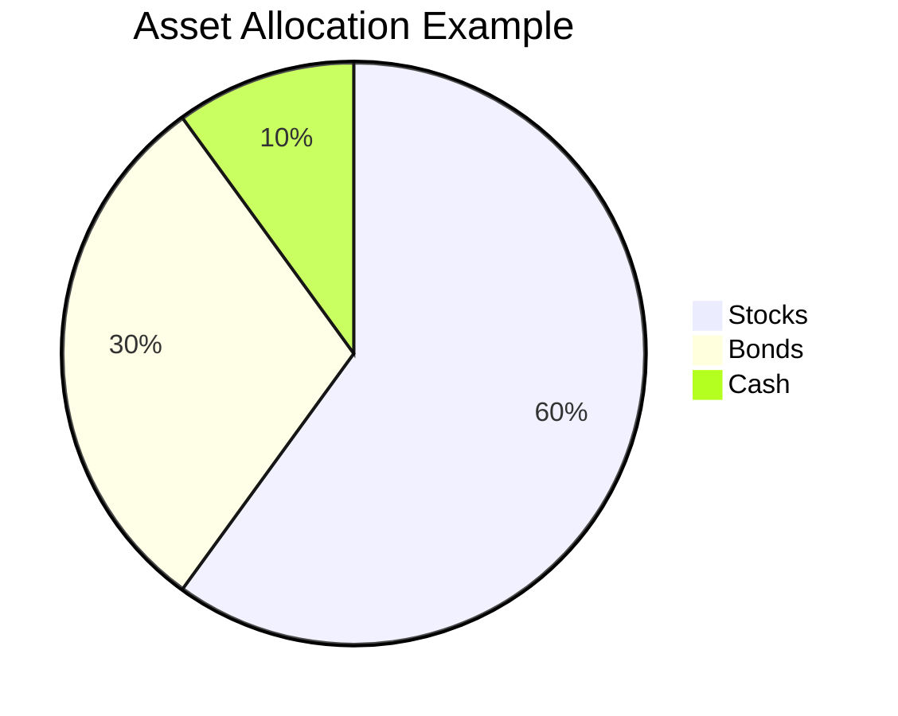

## 13.4 Setting Up an Investment Plan

Creating a well-structured investment plan is a cornerstone of financial success. It serves as a roadmap, guiding you through the complexities of the financial markets and helping you make informed decisions that align with your goals and risk tolerance. In this section, we will explore the essential components of an investment plan, including goal setting, budgeting, and the automation of contributions. We'll also provide practical templates and examples to help you craft a personalized plan.

### The Importance of a Written Investment Plan

A written investment plan is not just a document; it is a strategic tool that helps you stay focused and disciplined in your investment journey. Here are some key reasons why having a written plan is crucial:

- **Clarity and Focus:** A written plan clarifies your financial goals and the steps needed to achieve them. It helps you focus on what truly matters and avoid distractions.
- **Consistency:** By documenting your investment strategy, you can maintain consistency in your decision-making process, reducing the likelihood of impulsive actions driven by market volatility.
- **Measurement and Adjustment:** A written plan allows you to measure your progress and make necessary adjustments over time, ensuring that you stay on track to meet your objectives.

### Aligning Your Investment Plan with Goals and Risk Tolerance

The foundation of any investment plan is a clear understanding of your financial goals and risk tolerance. Let's explore how to define these critical elements:

#### Setting Financial Goals

Financial goals are the targets you aim to achieve through your investments. They can be short-term, medium-term, or long-term, depending on your needs and aspirations. Here are some examples:

- **Short-Term Goals:** Saving for a vacation, building an emergency fund, or purchasing a car within the next 1-3 years.
- **Medium-Term Goals:** Buying a home, funding a child's education, or starting a business within 3-10 years.
- **Long-Term Goals:** Retirement planning, wealth accumulation, or leaving a legacy, typically spanning 10 years or more.

**Exercise:** Take a moment to list your financial goals and categorize them into short-term, medium-term, and long-term objectives. Consider the time horizon and the amount needed for each goal.

#### Assessing Risk Tolerance

Risk tolerance is your ability and willingness to endure fluctuations in the value of your investments. It is influenced by factors such as your financial situation, investment experience, and emotional response to market changes. Here are some steps to assess your risk tolerance:

- **Financial Situation:** Evaluate your income, expenses, and savings. A stable financial situation may allow for higher risk-taking.
- **Investment Experience:** Consider your familiarity with different asset classes and market dynamics. More experience can lead to greater comfort with risk.
- **Emotional Response:** Reflect on how you react to market volatility. Are you comfortable with potential losses, or do they cause significant stress?

**Tip:** Use online risk tolerance questionnaires to gain insights into your risk profile. These tools can help you understand your comfort level with different investment scenarios.

### Budgeting for Investments

Budgeting is a critical component of an investment plan, as it determines how much you can allocate toward your financial goals. Here are some steps to create an effective investment budget:

#### Analyzing Your Cash Flow

Start by analyzing your cash flow to understand your income and expenses. This analysis will help you identify how much you can realistically invest each month. Here's how to do it:

1. **List Your Income:** Include all sources of income, such as salary, rental income, or dividends.
2. **Track Your Expenses:** Categorize your expenses into fixed (e.g., rent, utilities) and variable (e.g., dining out, entertainment) costs.
3. **Calculate Your Surplus:** Subtract your total expenses from your total income to determine your monthly surplus.

#### Setting an Investment Budget

Once you have a clear picture of your cash flow, set an investment budget that aligns with your financial goals. Consider the following guidelines:

- **Emergency Fund:** Ensure you have an emergency fund covering 3-6 months of living expenses before investing.
- **Debt Management:** Prioritize paying off high-interest debt to free up more funds for investment.
- **Investment Allocation:** Decide on a percentage of your surplus to allocate toward investments. A common recommendation is to invest 10-20% of your income.

#### Automating Contributions

Automating your investment contributions is a powerful strategy to ensure consistency and discipline. Here's how to implement it:

- **Automatic Transfers:** Set up automatic transfers from your checking account to your investment accounts. This approach ensures that you invest regularly, regardless of market conditions.
- **Dollar-Cost Averaging:** This strategy involves investing a fixed amount of money at regular intervals, regardless of market fluctuations. It reduces the impact of market volatility and helps you buy more shares when prices are low and fewer when prices are high.

### Creating a Personalized Investment Plan

Now that we have covered the foundational elements, let's delve into creating a personalized investment plan. We'll provide a step-by-step outline to guide you through the process.

#### Step 1: Define Your Goals and Time Horizon

Start by clearly defining your financial goals and the time horizon for each. Use the exercise from the previous section to categorize your goals.

#### Step 2: Assess Your Risk Tolerance

Use the insights gained from the risk tolerance assessment to determine the appropriate level of risk for your investment plan.

#### Step 3: Develop an Asset Allocation Strategy

Asset allocation is the process of dividing your investments among different asset classes, such as stocks, bonds, and cash, to balance risk and reward. Here's a general guideline:

- **Aggressive Portfolio:** Higher allocation to stocks for long-term growth, suitable for investors with high risk tolerance.
- **Moderate Portfolio:** Balanced allocation between stocks and bonds, suitable for investors with moderate risk tolerance.
- **Conservative Portfolio:** Higher allocation to bonds and cash for stability, suitable for investors with low risk tolerance.

**Example Portfolio Allocation:**

#### Step 4: Select Investment Vehicles

Choose the investment vehicles that align with your goals and risk tolerance. Consider options such as:

- **Individual Stocks and Bonds:** For those comfortable with direct investment and research.
- **Mutual Funds and ETFs:** For diversification and professional management.
- **Real Estate Investment Trusts (REITs):** For exposure to real estate markets.

#### Step 5: Implement and Monitor Your Plan

Once your plan is in place, implement it by purchasing the selected investments. Regularly monitor your portfolio's performance and make adjustments as needed to stay aligned with your goals.

#### Step 6: Review and Adjust Periodically

Investment plans are not static. Review your plan periodically, especially when there are significant life changes or market shifts. Adjust your asset allocation and investment choices to reflect any changes in your goals or risk tolerance.

### Templates and Outlines for Creating an Investment Plan

To assist you in creating your investment plan, we provide a basic template that you can customize to suit your needs:

**Investment Plan Template:**

1. **Personal Information:**
   - Name:
   - Date:
   - Investment Experience:

2. **Financial Goals:**
   - Short-Term Goals:
   - Medium-Term Goals:
   - Long-Term Goals:

3. **Risk Tolerance:**
   - Risk Profile:
   - Assessment Results:

4. **Budgeting and Cash Flow:**
   - Income Sources:
   - Expenses:
   - Monthly Surplus:

5. **Asset Allocation Strategy:**
   - Target Allocation:
   - Rationale:

6. **Investment Vehicles:**
   - Selected Investments:
   - Diversification Strategy:

7. **Implementation and Monitoring:**
   - Contribution Schedule:
   - Review Frequency:

8. **Review and Adjustment:**
   - Life Changes:
   - Market Conditions:

### Best Practices and Common Pitfalls

As you embark on your investment journey, keep these best practices and common pitfalls in mind:

#### Best Practices

- **Stay Disciplined:** Stick to your plan and avoid making impulsive decisions based on short-term market movements.
- **Diversify:** Spread your investments across different asset classes to reduce risk.
- **Educate Yourself:** Continuously learn about investment strategies and market trends to make informed decisions.

#### Common Pitfalls

- **Overreacting to Market Volatility:** Avoid making drastic changes to your plan based on temporary market fluctuations.
- **Neglecting to Review and Adjust:** Regularly review your plan and make adjustments as needed to stay on track.
- **Ignoring Fees and Expenses:** Be mindful of the fees associated with your investments, as they can impact your returns over time.

### Conclusion

Setting up an investment plan is a crucial step toward achieving your financial goals. By aligning your plan with your goals and risk tolerance, budgeting effectively, and automating contributions, you can build a solid foundation for long-term success. Remember to review and adjust your plan periodically to ensure it remains relevant and effective.

### Glossary

- **Dollar-Cost Averaging:** Investing a fixed amount of money at regular intervals, regardless of market conditions, to reduce the impact of volatility.

### Additional Resources

For further exploration of investment planning, consider the following resources:

- **Books:** "The Intelligent Investor" by Benjamin Graham, "A Random Walk Down Wall Street" by Burton Malkiel.
- **Websites:** Investopedia, Morningstar, FINRA Investor Education Foundation.
- **Courses:** Online courses on platforms like Coursera, Udemy, or Khan Academy.

---

## Quiz Time!



### What is the primary purpose of a written investment plan?

- [x] To provide clarity and focus on financial goals
- [ ] To guarantee high returns
- [ ] To eliminate all investment risks
- [ ] To predict market movements

> **Explanation:** A written investment plan provides clarity and focus on financial goals, helping investors stay disciplined and consistent in their approach.

### Which of the following is NOT a factor influencing risk tolerance?

- [ ] Financial situation
- [ ] Investment experience
- [ ] Emotional response to market changes
- [x] The color of your investment portfolio

> **Explanation:** Risk tolerance is influenced by financial situation, investment experience, and emotional response to market changes, not by the color of your investment portfolio.

### What is dollar-cost averaging?

- [x] Investing a fixed amount of money at regular intervals
- [ ] Investing all your money at once
- [ ] Only investing when the market is up
- [ ] Avoiding investments during market downturns

> **Explanation:** Dollar-cost averaging involves investing a fixed amount of money at regular intervals, regardless of market conditions, to reduce the impact of volatility.

### What is the recommended emergency fund coverage before investing?

- [x] 3-6 months of living expenses
- [ ] 1 month of living expenses
- [ ] 12 months of living expenses
- [ ] No emergency fund is needed

> **Explanation:** It is recommended to have an emergency fund covering 3-6 months of living expenses before investing to ensure financial stability.

### Which asset class is typically associated with higher risk and potential long-term growth?

- [x] Stocks
- [ ] Bonds
- [ ] Cash
- [ ] Certificates of Deposit (CDs)

> **Explanation:** Stocks are typically associated with higher risk and potential long-term growth compared to bonds, cash, or CDs.

### What should you do if your financial goals or risk tolerance change?

- [x] Review and adjust your investment plan
- [ ] Ignore the changes and stick to the original plan
- [ ] Withdraw all investments immediately
- [ ] Invest in high-risk assets

> **Explanation:** If your financial goals or risk tolerance change, it's important to review and adjust your investment plan to ensure it remains aligned with your current situation.

### What is a common pitfall in investment planning?

- [x] Overreacting to market volatility
- [ ] Diversifying investments
- [ ] Educating yourself about investments
- [ ] Automating contributions

> **Explanation:** Overreacting to market volatility is a common pitfall that can lead to impulsive decisions and negatively impact long-term investment success.

### Why is it important to automate investment contributions?

- [x] To ensure consistency and discipline
- [ ] To guarantee high returns
- [ ] To eliminate all risks
- [ ] To avoid paying taxes

> **Explanation:** Automating investment contributions ensures consistency and discipline, helping investors stick to their plan and invest regularly.

### What is the purpose of asset allocation in an investment plan?

- [x] To balance risk and reward by dividing investments among different asset classes
- [ ] To maximize short-term gains
- [ ] To invest only in stocks
- [ ] To avoid all risks

> **Explanation:** Asset allocation balances risk and reward by dividing investments among different asset classes, helping investors achieve their financial goals.

### True or False: An investment plan should remain static and never be adjusted.

- [ ] True
- [x] False

> **Explanation:** An investment plan should be reviewed and adjusted periodically to reflect changes in financial goals, risk tolerance, and market conditions.


