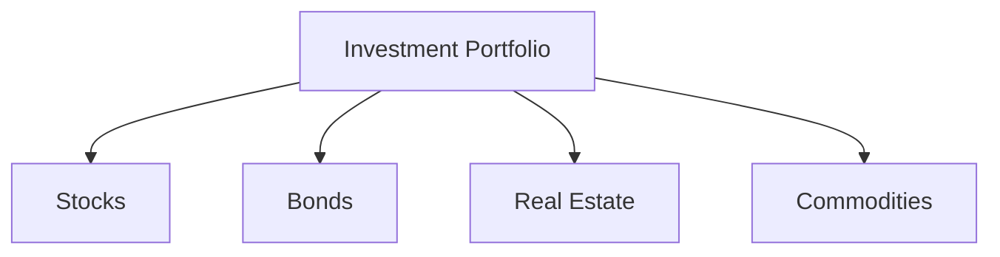

## 13.5 Common Mistakes to Avoid

Investing in securities can be a rewarding endeavor, but it is not without its pitfalls. Many investors, both beginners and seasoned professionals, fall prey to common mistakes that can significantly impact their financial outcomes. In this section, we will explore these frequent errors and provide strategies to mitigate them, ensuring a more informed and strategic approach to investing.

### 1. Lack of Diversification

**Diversification** is a fundamental principle in investing that involves spreading investments across various asset classes, sectors, or geographic regions to reduce risk. One of the most common mistakes investors make is failing to diversify their portfolios adequately. 

#### Why Diversification Matters

Diversification helps mitigate the risk of significant losses by ensuring that a downturn in one investment or sector does not disproportionately affect the entire portfolio. For example, if an investor only holds stocks in the technology sector, they are highly exposed to sector-specific risks. By diversifying across different sectors, such as healthcare, consumer goods, and energy, the investor can cushion the impact of a downturn in any single sector.

#### Strategies for Effective Diversification

- **Asset Allocation:** Allocate investments across different asset classes such as stocks, bonds, and real estate. This can be visualized using the following diagram:

- **Sector Diversification:** Invest in a variety of sectors to avoid overexposure to any single industry.
- **Geographic Diversification:** Consider international investments to spread risk across different economic environments.
- **Rebalancing:** Regularly review and adjust the portfolio to maintain the desired level of diversification.

### 2. Emotional Trading

**Emotional trading** refers to making investment decisions based on psychological factors rather than rational analysis. This can lead to impulsive actions, such as panic selling during market downturns or exuberant buying during bull markets.

#### The Dangers of Emotional Trading

Emotional trading often results in buying high and selling low, which is the opposite of a successful investment strategy. For instance, during a market correction, an emotionally-driven investor might sell their holdings out of fear, locking in losses and missing potential recovery gains.

#### Strategies to Avoid Emotional Trading

- **Set Clear Goals:** Define long-term investment objectives and stick to them, regardless of short-term market fluctuations.
- **Develop a Plan:** Create a detailed investment plan that outlines entry and exit strategies, and adhere to it.
- **Stay Informed:** Regularly educate yourself about market trends and economic indicators to make informed decisions.
- **Practice Mindfulness:** Be aware of emotional triggers and practice techniques to manage stress and anxiety.

### 3. Timing the Market

Many investors attempt to time the market by predicting its future movements to buy low and sell high. However, this approach is fraught with challenges and often leads to suboptimal results.

#### The Pitfalls of Market Timing

Market timing requires accurate predictions of both market highs and lows, which is notoriously difficult even for experienced investors. Missing just a few of the best-performing days in the market can significantly reduce overall returns.

#### Strategies to Avoid Market Timing

- **Adopt a Long-Term Perspective:** Focus on long-term growth rather than short-term gains.
- **Dollar-Cost Averaging:** Invest a fixed amount regularly, regardless of market conditions, to reduce the impact of volatility.
- **Stay the Course:** Resist the temptation to make frequent changes to your investment strategy based on market fluctuations.

### 4. Not Doing Due Diligence

Due diligence involves thoroughly researching and analyzing potential investments before committing capital. Failing to conduct due diligence can lead to uninformed decisions and increased risk.

#### Importance of Due Diligence

Proper due diligence helps investors understand the fundamentals of an investment, assess its risks, and determine its alignment with their financial goals. For example, before investing in a stock, an investor should analyze the company's financial statements, industry position, and growth prospects.

#### Steps for Effective Due Diligence

- **Research the Company:** Examine financial reports, management team, competitive landscape, and industry trends.
- **Analyze Financial Metrics:** Evaluate key financial ratios such as price-to-earnings (P/E), debt-to-equity, and return on equity (ROE).
- **Consider External Factors:** Assess macroeconomic indicators and regulatory changes that may impact the investment.
- **Seek Professional Advice:** Consult with financial advisors or experts when necessary.

### 5. Overlooking Fees and Expenses

Investment fees and expenses can significantly erode returns over time, yet many investors overlook them when making investment decisions.

#### Understanding the Impact of Fees

Fees such as management fees, trading commissions, and expense ratios can add up, reducing the overall return on investment. For instance, a mutual fund with a high expense ratio can underperform a similar fund with lower fees.

#### Strategies to Minimize Fees

- **Compare Expense Ratios:** Choose funds with lower expense ratios to maximize returns.
- **Consider No-Load Funds:** Opt for mutual funds that do not charge sales commissions.
- **Limit Trading Activity:** Reduce trading frequency to minimize transaction costs.

### 6. Ignoring Tax Implications

Taxes can have a substantial impact on investment returns, yet many investors fail to consider the tax implications of their investment decisions.

#### Tax Considerations in Investing

Different investments are taxed differently. For example, dividends may be taxed at a different rate than capital gains. Understanding these differences can help investors optimize their tax strategies.

#### Strategies for Tax-Efficient Investing

- **Utilize Tax-Advantaged Accounts:** Invest in accounts like IRAs or 401(k)s to defer taxes.
- **Harvest Tax Losses:** Offset gains by selling investments at a loss.
- **Plan for Capital Gains:** Be mindful of holding periods to qualify for lower long-term capital gains tax rates.

### 7. Failing to Continuously Learn

The financial markets are dynamic and constantly evolving. Failing to stay informed and adapt to changes can hinder investment success.

#### The Importance of Continuous Learning

Continuous learning helps investors stay abreast of new investment opportunities, regulatory changes, and market trends. It also fosters better decision-making and strategic planning.

#### Strategies for Continuous Learning

- **Read Financial News:** Stay updated with reputable financial news sources.
- **Attend Workshops and Seminars:** Participate in educational events to gain insights from experts.
- **Engage with Online Courses:** Enroll in courses on investing and financial markets to enhance your knowledge.
- **Network with Other Investors:** Join investment clubs or forums to share experiences and learn from others.

### Conclusion

Avoiding common investment mistakes requires a combination of knowledge, discipline, and strategic planning. By diversifying your portfolio, managing emotions, avoiding market timing, conducting due diligence, minimizing fees, considering tax implications, and committing to continuous learning, you can enhance your investment success and achieve your financial goals.

## Quiz Time!



### What is a key benefit of diversification in an investment portfolio?

- [x] Reducing risk by spreading investments across various assets
- [ ] Maximizing short-term gains
- [ ] Ensuring all investments are in the same sector
- [ ] Increasing exposure to a single asset class

> **Explanation:** Diversification reduces risk by spreading investments across different asset classes, sectors, or geographic regions.

### Emotional trading often leads to which of the following outcomes?

- [x] Buying high and selling low
- [ ] Consistently outperforming the market
- [ ] Making rational and informed decisions
- [ ] Achieving guaranteed returns

> **Explanation:** Emotional trading often results in buying high and selling low due to impulsive decisions driven by psychological factors.

### What is a common mistake when attempting to time the market?

- [x] Missing the best-performing days in the market
- [ ] Consistently predicting market highs and lows
- [ ] Achieving steady returns
- [ ] Reducing overall investment risk

> **Explanation:** Attempting to time the market can lead to missing the best-performing days, significantly reducing overall returns.

### What is the purpose of conducting due diligence before investing?

- [x] To thoroughly research and analyze potential investments
- [ ] To make impulsive investment decisions
- [ ] To ignore financial metrics
- [ ] To rely solely on market rumors

> **Explanation:** Due diligence involves researching and analyzing investments to make informed decisions and assess risks.

### How can investors minimize the impact of fees on their returns?

- [x] Choose funds with lower expense ratios
- [ ] Invest only in high-fee funds
- [x] Limit trading activity
- [ ] Ignore management fees

> **Explanation:** Minimizing fees involves choosing funds with lower expense ratios and limiting trading activity to reduce transaction costs.

### What is a tax-efficient investing strategy?

- [x] Utilizing tax-advantaged accounts
- [ ] Ignoring tax implications
- [ ] Maximizing short-term capital gains
- [ ] Selling all investments at a loss

> **Explanation:** Tax-efficient investing involves using tax-advantaged accounts to defer taxes and optimize returns.

### Why is continuous learning important for investors?

- [x] To stay informed about market trends and opportunities
- [ ] To rely solely on past knowledge
- [x] To adapt to changes in the financial markets
- [ ] To avoid new investment opportunities

> **Explanation:** Continuous learning helps investors stay informed and adapt to changes, improving decision-making and strategic planning.

### What is a strategy to avoid emotional trading?

- [x] Set clear investment goals and stick to them
- [ ] Make decisions based on market rumors
- [ ] React impulsively to market fluctuations
- [ ] Ignore long-term objectives

> **Explanation:** Setting clear goals and adhering to them helps avoid emotional trading and impulsive decisions.

### How can investors effectively diversify their portfolios?

- [x] By investing in a variety of asset classes and sectors
- [ ] By concentrating investments in a single industry
- [ ] By focusing solely on domestic markets
- [ ] By ignoring geographic diversification

> **Explanation:** Effective diversification involves investing in various asset classes, sectors, and geographic regions to reduce risk.

### True or False: Market timing guarantees higher returns.

- [ ] True
- [x] False

> **Explanation:** Market timing does not guarantee higher returns and often leads to suboptimal results due to the difficulty of accurately predicting market movements.


