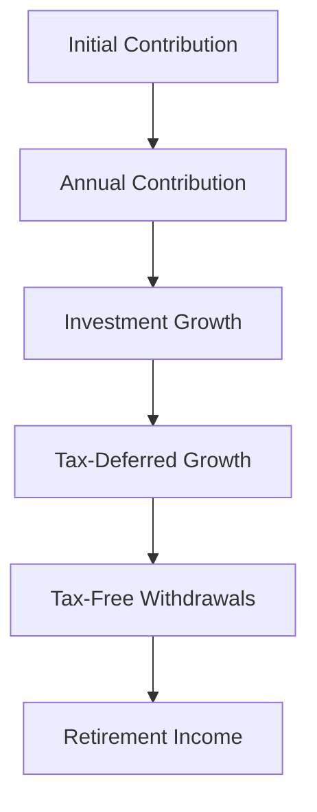

## 14.2 Retirement Accounts: 401(k), IRA, Roth IRA

Planning for retirement is a crucial aspect of financial management, and understanding the different types of retirement accounts available can significantly impact your financial future. In this section, we'll delve into the specifics of three popular retirement savings vehicles: the 401(k), Individual Retirement Accounts (IRA), and Roth IRA. We'll explore their features, tax implications, and strategic benefits to help you make informed decisions about your retirement planning.

### Understanding 401(k) Plans

#### What is a 401(k) Plan?

A 401(k) plan is a tax-advantaged, defined-contribution retirement account offered by many employers in the United States. It allows employees to contribute a portion of their salary to individual accounts, which are invested in a selection of options provided by the employer.

#### Key Features of 401(k) Plans

- **Contribution Limits**: As of 2023, employees can contribute up to $22,500 annually, with an additional $7,500 catch-up contribution for those aged 50 and over. These limits are subject to change based on IRS guidelines.
- **Tax Treatment**: Contributions are made pre-tax, reducing taxable income for the year. Taxes are deferred until withdrawals are made during retirement, at which point they are taxed as ordinary income.
- **Employer Matching**: Many employers offer a matching contribution, which is essentially free money added to your retirement savings. For example, an employer might match 50% of employee contributions up to 6% of salary.
- **Investment Options**: Typically, 401(k) plans offer a range of investment options, including mutual funds, stocks, and bonds, allowing participants to tailor their portfolios according to their risk tolerance and retirement goals.

#### Benefits of Employer Matching

Employer matching is one of the most significant advantages of a 401(k) plan. It provides an immediate return on your investment and can substantially increase your retirement savings over time. For instance, if you earn $60,000 annually and contribute 6% of your salary ($3,600), with an employer matching 50%, you receive an additional $1,800 in your account each year.

#### Vesting Schedules

Employer contributions may be subject to a vesting schedule, which determines when you gain full ownership of the matched funds. This can range from immediate vesting to a graded schedule over several years.

### Individual Retirement Accounts (IRA)

#### What is an IRA?

An Individual Retirement Account (IRA) is a tax-advantaged account that individuals can open independently of their employer. It provides a flexible option for retirement savings with tax benefits.

#### Key Features of Traditional IRAs

- **Contribution Limits**: For 2023, individuals can contribute up to $6,500 annually, with a $1,000 catch-up contribution for those aged 50 and over.
- **Tax Treatment**: Contributions may be tax-deductible, depending on income and participation in other retirement plans. Withdrawals during retirement are taxed as ordinary income.
- **Investment Options**: IRAs offer a wide range of investment choices, including stocks, bonds, mutual funds, and ETFs, allowing for diversified portfolio management.

#### Roth IRAs: A Tax-Advantaged Alternative

A Roth IRA is similar to a traditional IRA but with distinct tax treatment.

- **Contribution Limits**: The same as traditional IRAs, with annual limits of $6,500 and a $1,000 catch-up for those over 50.
- **Tax Treatment**: Contributions are made with after-tax dollars, meaning no immediate tax deduction. However, qualified withdrawals in retirement are tax-free, including earnings.
- **Income Limits**: Eligibility to contribute to a Roth IRA is subject to income limits, which can change annually. For 2023, the phase-out range begins at $138,000 for single filers and $218,000 for married couples filing jointly.

### Comparing Traditional and Roth Options

#### Tax Considerations

The primary difference between traditional and Roth accounts lies in their tax treatment. Traditional accounts offer tax deferral, reducing taxable income in the contribution year, while Roth accounts provide tax-free withdrawals in retirement. The choice between the two often depends on your current tax rate versus your expected tax rate in retirement.

- **Traditional IRA/401(k)**: Beneficial if you expect to be in a lower tax bracket during retirement.
- **Roth IRA**: Advantageous if you anticipate being in a higher tax bracket in retirement, as it allows tax-free growth and withdrawals.

#### Flexibility and Withdrawal Rules

- **Traditional Accounts**: Required Minimum Distributions (RMDs) must begin at age 72, ensuring funds are eventually taxed.
- **Roth Accounts**: No RMDs during the account holder's lifetime, providing greater flexibility in managing withdrawals.

### Strategic Retirement Planning

#### Balancing Contributions

A balanced approach to retirement savings might involve contributing to both traditional and Roth accounts, diversifying tax treatment, and providing flexibility in retirement income strategies.

#### Case Study: Maximizing Tax Efficiency

Consider a scenario where an individual, Alex, earns $100,000 annually. Alex contributes $19,500 to a traditional 401(k), reducing taxable income to $80,500. Simultaneously, Alex contributes $6,000 to a Roth IRA, ensuring a portion of retirement savings grows tax-free. This strategy balances immediate tax savings with future tax-free withdrawals.

#### Visualizing Retirement Account Growth

Let's visualize the potential growth of these retirement accounts using a simple compound interest model:

In this diagram, we see how initial contributions, combined with annual contributions and investment growth, lead to significant retirement income through tax-deferred and tax-free strategies.

### Common Pitfalls and Best Practices

#### Avoiding Early Withdrawals

Early withdrawals from retirement accounts can lead to penalties and taxes, eroding your savings. It's crucial to maintain discipline and avoid tapping into these funds prematurely.

#### Regularly Reviewing Your Portfolio

Regularly reviewing and adjusting your retirement portfolio ensures alignment with your risk tolerance, investment goals, and changing market conditions.

#### Staying Informed on Regulatory Changes

Retirement account rules and contribution limits can change. Staying informed on IRS updates and regulatory changes helps optimize your retirement strategy.

### Conclusion

Understanding the nuances of 401(k), IRA, and Roth IRA accounts is essential for effective retirement planning. By leveraging the tax advantages and strategic benefits of each account type, you can build a robust retirement portfolio tailored to your financial goals. As you navigate your retirement planning journey, consider consulting with a financial advisor to optimize your strategy and ensure compliance with regulatory requirements.

## Quiz Time!



### What is the primary tax advantage of a traditional 401(k) plan?

- [x] Contributions are made pre-tax, reducing taxable income.
- [ ] Withdrawals are tax-free.
- [ ] Contributions are made after-tax.
- [ ] There are no tax advantages.

> **Explanation:** Traditional 401(k) contributions are made pre-tax, which reduces taxable income for the year.

### How does employer matching benefit employees in a 401(k) plan?

- [x] It provides additional funds to the employee's retirement savings.
- [ ] It increases the employee's taxable income.
- [ ] It decreases the employee's contribution limits.
- [ ] It offers tax-free withdrawals.

> **Explanation:** Employer matching adds extra funds to the employee's retirement savings, effectively increasing their investment without additional personal contributions.

### What is the contribution limit for a traditional IRA in 2023?

- [x] $6,500
- [ ] $22,500
- [ ] $7,500
- [ ] $19,500

> **Explanation:** The contribution limit for a traditional IRA in 2023 is $6,500, with an additional $1,000 catch-up contribution for those aged 50 and over.

### Which account type allows for tax-free withdrawals in retirement?

- [x] Roth IRA
- [ ] Traditional IRA
- [ ] 401(k)
- [ ] SEP IRA

> **Explanation:** Roth IRA contributions are made with after-tax dollars, allowing for tax-free withdrawals in retirement.

### What is a key difference between traditional and Roth IRAs?

- [x] Tax treatment of contributions and withdrawals.
- [ ] Contribution limits.
- [ ] Investment options.
- [ ] Account setup process.

> **Explanation:** The key difference lies in the tax treatment: traditional IRAs offer tax-deferred growth, while Roth IRAs provide tax-free withdrawals.

### At what age must RMDs begin for traditional retirement accounts?

- [x] 72
- [ ] 65
- [ ] 59.5
- [ ] 70.5

> **Explanation:** Required Minimum Distributions (RMDs) must begin at age 72 for traditional retirement accounts.

### What is a potential benefit of contributing to both traditional and Roth accounts?

- [x] Diversification of tax treatment.
- [ ] Increased contribution limits.
- [ ] Immediate tax-free withdrawals.
- [ ] No RMDs required.

> **Explanation:** Contributing to both account types diversifies tax treatment, offering flexibility in managing retirement income.

### What is a common pitfall to avoid with retirement accounts?

- [x] Early withdrawals leading to penalties and taxes.
- [ ] Contributing the maximum allowed.
- [ ] Diversifying investments.
- [ ] Consulting with a financial advisor.

> **Explanation:** Early withdrawals can lead to penalties and taxes, reducing the overall value of retirement savings.

### How can employer matching be visualized in a retirement account?

- [x] As an immediate return on investment.
- [ ] As a tax deduction.
- [ ] As a penalty for early withdrawal.
- [ ] As a reduction in contribution limits.

> **Explanation:** Employer matching can be seen as an immediate return on investment, enhancing the employee's retirement savings.

### True or False: Roth IRAs have RMDs during the account holder's lifetime.

- [ ] True
- [x] False

> **Explanation:** Roth IRAs do not have Required Minimum Distributions during the account holder's lifetime, providing more flexibility in managing withdrawals.


