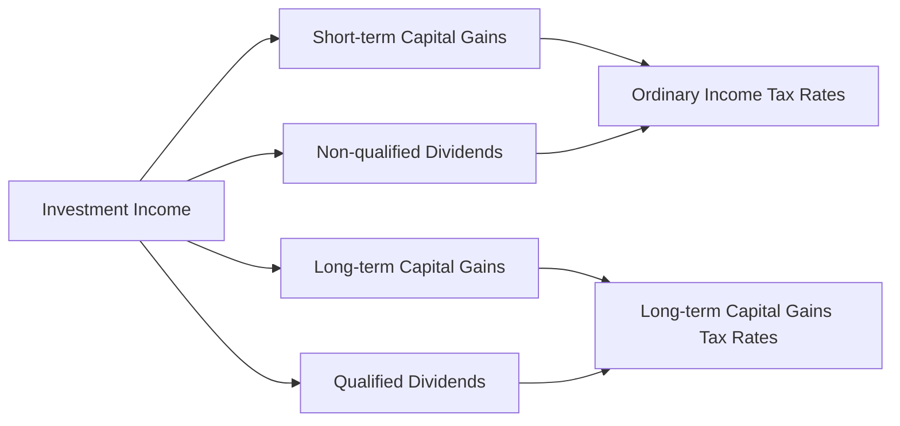

## 14.4 Understanding Capital Gains and Dividends Taxation

Investing in securities such as stocks and bonds can be a rewarding endeavor, providing the potential for both income and capital appreciation. However, understanding the tax implications of your investment returns is crucial to maximizing your portfolio's efficiency. In this section, we'll delve into the taxation of capital gains and dividends, exploring the nuances of tax rates, classifications, and strategies to manage and minimize taxes on your investment income.

### Capital Gains Taxation

Capital gains occur when you sell an asset for more than its purchase price. The tax you pay on these gains depends on how long you've held the asset before selling it. Let's break down the differences between short-term and long-term capital gains.

#### Short-term vs. Long-term Capital Gains

- **Short-term Capital Gains:** These are gains from assets held for one year or less. Short-term capital gains are taxed at ordinary income tax rates, which can be significantly higher than long-term rates. This means if you sell a stock after holding it for just a few months, the profit will be taxed as if it were regular income.

- **Long-term Capital Gains:** These apply to assets held for more than one year. Long-term capital gains benefit from reduced tax rates, which are generally lower than ordinary income tax rates. As of 2023, the long-term capital gains tax rates are 0%, 15%, or 20%, depending on your taxable income and filing status.

#### Example: Calculating Capital Gains Tax

Suppose you bought 100 shares of a company at $50 per share and sold them two years later at $70 per share. Your capital gain would be:


\text{Capital Gain} = (70 - 50) \times 100 = \$2,000


If your taxable income places you in the 15% long-term capital gains tax bracket, your tax liability would be:


\text{Tax Liability} = 2000 \times 0.15 = \$300


### Dividends Taxation

Dividends are distributions of a company's earnings to shareholders and can be a significant source of income for investors. However, not all dividends are taxed equally. Understanding the difference between qualified and non-qualified dividends is essential for tax planning.

#### Qualified vs. Non-qualified Dividends

- **Qualified Dividends:** These are dividends paid by U.S. corporations or qualified foreign corporations that meet specific IRS criteria. Qualified dividends are taxed at the lower long-term capital gains tax rates (0%, 15%, or 20%).

- **Non-qualified Dividends:** Also known as ordinary dividends, these are taxed at the investor's ordinary income tax rates. These include dividends from certain foreign corporations and dividends paid by real estate investment trusts (REITs).

#### Example: Taxation of Dividends

Imagine you received $1,000 in qualified dividends and $500 in non-qualified dividends. If your long-term capital gains tax rate is 15% and your ordinary income tax rate is 25%, your tax liability would be:


\text{Qualified Dividends Tax} = 1000 \times 0.15 = \$150


\text{Non-qualified Dividends Tax} = 500 \times 0.25 = \$125


### Strategies to Manage and Minimize Taxes

Effectively managing your investment portfolio requires strategic tax planning. Here are some strategies to help minimize taxes on your investment income:

1. **Hold Investments Longer:** By holding investments for more than a year, you can benefit from the lower long-term capital gains tax rates.

2. **Utilize Tax-Advantaged Accounts:** Consider investing in retirement accounts like IRAs or 401(k)s, where investments grow tax-deferred or tax-free.

3. **Harvest Tax Losses:** Offset capital gains with capital losses by selling underperforming investments. This strategy, known as tax-loss harvesting, can reduce your taxable income.

4. **Reinvest Dividends:** Use a dividend reinvestment plan (DRIP) to automatically reinvest dividends into additional shares, potentially deferring taxes.

5. **Consider Asset Location:** Place income-generating assets in tax-advantaged accounts and growth-oriented assets in taxable accounts to optimize tax efficiency.

6. **Stay Informed on Tax Law Changes:** Tax laws can change, impacting rates and rules. Staying informed allows you to adjust your strategy accordingly.

### Glossary

- **Qualified Dividend:** A dividend taxed at the lower long-term capital gains tax rate.

### Visualizing Tax Implications

To better understand the impact of taxation on your investment returns, let's visualize the differences in tax rates between short-term and long-term capital gains, as well as qualified and non-qualified dividends.

### Best Practices and Common Pitfalls

- **Best Practices:**
  - Regularly review your portfolio to identify opportunities for tax-loss harvesting.
  - Keep detailed records of purchase and sale dates to accurately determine holding periods.

- **Common Pitfalls:**
  - Neglecting to consider tax implications when rebalancing your portfolio.
  - Failing to account for dividend reinvestment in cost basis calculations.

### Conclusion

Understanding the nuances of capital gains and dividends taxation is vital for any investor seeking to optimize their portfolio's after-tax returns. By differentiating between short-term and long-term gains, recognizing the tax treatment of qualified and non-qualified dividends, and employing strategic tax management techniques, you can enhance your investment strategy and retain more of your hard-earned returns.

### Further Reading

For those interested in deepening their understanding of investment taxation, consider exploring the following resources:

- IRS Publication 550: Investment Income and Expenses
- "The Bogleheads' Guide to Retirement Planning" by Taylor Larimore
- "Tax-Free Wealth" by Tom Wheelwright

## Quiz Time!



### Which of the following is taxed at ordinary income tax rates?

- [x] Short-term capital gains
- [ ] Long-term capital gains
- [ ] Qualified dividends
- [ ] Non-qualified dividends

> **Explanation:** Short-term capital gains are taxed at ordinary income tax rates because they apply to assets held for one year or less.

### What is the maximum long-term capital gains tax rate as of 2023?

- [ ] 10%
- [ ] 25%
- [x] 20%
- [ ] 30%

> **Explanation:** The maximum long-term capital gains tax rate as of 2023 is 20%, applicable to high-income earners.

### How are qualified dividends taxed?

- [ ] At ordinary income tax rates
- [x] At long-term capital gains tax rates
- [ ] At a flat rate of 10%
- [ ] Not taxed

> **Explanation:** Qualified dividends are taxed at the lower long-term capital gains tax rates.

### Which strategy involves selling underperforming investments to offset gains?

- [ ] Dividend reinvestment
- [ ] Asset location
- [x] Tax-loss harvesting
- [ ] Tax deferral

> **Explanation:** Tax-loss harvesting involves selling underperforming investments to offset capital gains and reduce taxable income.

### What type of account allows investments to grow tax-deferred or tax-free?

- [x] Retirement accounts like IRAs
- [ ] Taxable brokerage accounts
- [ ] Savings accounts
- [ ] Checking accounts

> **Explanation:** Retirement accounts like IRAs allow investments to grow tax-deferred or tax-free, depending on the account type.

### Which of the following dividends is taxed at ordinary income tax rates?

- [ ] Qualified dividends
- [x] Non-qualified dividends
- [ ] Reinvested dividends
- [ ] Tax-exempt dividends

> **Explanation:** Non-qualified dividends are taxed at ordinary income tax rates.

### What is a key benefit of holding investments for more than a year?

- [ ] Higher tax rates
- [ ] Immediate liquidity
- [x] Lower long-term capital gains tax rates
- [ ] No tax liability

> **Explanation:** Holding investments for more than a year qualifies them for lower long-term capital gains tax rates.

### Which of the following is a common pitfall in investment tax planning?

- [ ] Regular portfolio reviews
- [x] Ignoring tax implications when rebalancing
- [ ] Utilizing tax-advantaged accounts
- [ ] Keeping detailed records

> **Explanation:** Ignoring tax implications when rebalancing can lead to unexpected tax liabilities, making it a common pitfall.

### What is the primary goal of asset location strategy?

- [ ] Maximize short-term gains
- [ ] Increase dividend income
- [x] Optimize tax efficiency
- [ ] Reduce investment risk

> **Explanation:** Asset location strategy aims to optimize tax efficiency by placing income-generating assets in tax-advantaged accounts.

### True or False: All dividends from U.S. corporations are qualified dividends.

- [ ] True
- [x] False

> **Explanation:** Not all dividends from U.S. corporations are qualified; they must meet specific IRS criteria to be considered qualified.


