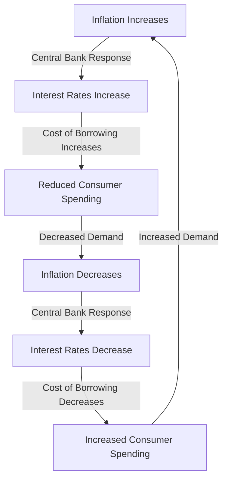

## 15.2 Inflation, Interest Rates, and Their Impact

Understanding the interplay between inflation, interest rates, and investment returns is crucial for any investor looking to navigate the complexities of financial markets. These economic indicators not only influence the overall market environment but also have direct implications on the performance of individual securities and investment portfolios. In this section, we will delve into how inflation and interest rates interact, the role of central banks and monetary policy, and strategies to mitigate inflation risk.

### The Relationship Between Inflation, Interest Rates, and Investment Returns

#### Inflation: An Overview

Inflation refers to the rate at which the general level of prices for goods and services rises, eroding purchasing power. It is measured by indices such as the Consumer Price Index (CPI) and the Producer Price Index (PPI). Moderate inflation is a sign of a growing economy, but when it becomes too high, it can lead to economic instability.

#### Interest Rates: A Primer

Interest rates are the cost of borrowing money, typically expressed as a percentage of the principal. They are determined by the supply and demand for credit, and are influenced by central bank policies. Interest rates affect consumer spending, business investment, and the overall economic growth.

#### How Inflation and Interest Rates Interact

The relationship between inflation and interest rates is complex and dynamic. Generally, central banks, such as the Federal Reserve in the United States, adjust interest rates to control inflation. When inflation is high, central banks may raise interest rates to cool down the economy. Conversely, when inflation is low, they might lower interest rates to stimulate economic activity.

**Diagram: Relationship Between Inflation and Interest Rates**

This cyclical relationship illustrates how central banks use interest rates as a tool to manage inflation and economic growth.

#### Impact on Investment Returns

Inflation and interest rates directly affect investment returns. Higher inflation erodes the real value of investment returns, while higher interest rates can increase the cost of borrowing for companies, potentially reducing their profitability and stock prices.

**Example:**

Consider a bond with a fixed interest rate of 5%. If inflation rises to 3%, the real return on the bond is reduced to 2%. Conversely, if inflation is only 1%, the real return is 4%.

### The Role of Central Banks and Monetary Policy

Central banks play a pivotal role in managing inflation and interest rates through monetary policy, which involves controlling the money supply and setting interest rates to achieve economic objectives such as stable prices and full employment.

#### Tools of Monetary Policy

1. **Open Market Operations:** Buying and selling government securities to influence the money supply.
2. **Discount Rate:** The interest rate charged to commercial banks for borrowing funds from the central bank.
3. **Reserve Requirements:** The amount of funds that banks must hold in reserve, affecting their ability to lend.

#### Central Bank Strategies

Central banks use these tools to influence economic activity. For example, during periods of high inflation, a central bank may sell government securities, reducing the money supply and increasing interest rates to curb spending. Conversely, in a recession, the central bank might lower the discount rate to encourage borrowing and investment.

**Case Study: The Federal Reserve's Response to the 2008 Financial Crisis**

In response to the 2008 financial crisis, the Federal Reserve implemented a series of unconventional monetary policies, including lowering the federal funds rate to near zero and engaging in quantitative easing (QE) to inject liquidity into the economy. These measures were aimed at stabilizing financial markets and promoting economic recovery.

### Strategies for Mitigating Inflation Risk

Investors can employ various strategies to protect their portfolios from the adverse effects of inflation.

#### Diversification

Diversifying across asset classes, such as stocks, bonds, real estate, and commodities, can help mitigate inflation risk. Different assets respond differently to inflationary pressures, providing a buffer against losses in any single asset class.

#### Inflation-Protected Securities

Investing in inflation-protected securities, such as Treasury Inflation-Protected Securities (TIPS) in the U.S., can provide a hedge against inflation. TIPS are government bonds that adjust their principal value based on changes in the CPI, ensuring that the investor's purchasing power is maintained.

#### Real Assets

Real assets, such as real estate and commodities, often perform well during inflationary periods. Real estate can generate rental income that rises with inflation, while commodities like gold and oil tend to increase in value as inflation rises.

#### Equities

Equities, particularly those of companies with strong pricing power, can offer protection against inflation. Companies that can pass on higher costs to consumers without affecting demand can maintain their profit margins in an inflationary environment.

### Conclusion

Inflation and interest rates are critical economic indicators that significantly impact investment returns. Understanding their relationship and the role of central banks in managing these factors is essential for making informed investment decisions. By employing strategies such as diversification, investing in inflation-protected securities, and focusing on real assets and equities, investors can mitigate inflation risk and protect their portfolios.

### Glossary

- **Monetary Policy:** The process by which the monetary authority of a country controls the supply of money, often targeting an inflation rate or interest rate to ensure price stability and general trust in the currency.

### References and Further Reading

- "The Federal Reserve System: Purposes & Functions" by the Federal Reserve Board
- "Inflation and Investment: A Guide for the Individual Investor" by John Smith
- "The Intelligent Investor" by Benjamin Graham

## Quiz Time!



### What is the primary goal of central banks when adjusting interest rates?

- [x] To control inflation and stabilize the economy
- [ ] To increase government revenue
- [ ] To reduce the national debt
- [ ] To promote international trade

> **Explanation:** Central banks adjust interest rates primarily to control inflation and stabilize the economy by influencing borrowing and spending.

### How does high inflation affect investment returns on fixed-income securities?

- [x] It erodes the real value of returns
- [ ] It increases nominal returns
- [ ] It has no effect on returns
- [ ] It guarantees higher returns

> **Explanation:** High inflation erodes the real value of returns on fixed-income securities, as the purchasing power of the interest payments decreases.

### What is one strategy to mitigate inflation risk in an investment portfolio?

- [x] Diversification across asset classes
- [ ] Concentrating investments in one sector
- [ ] Holding only cash
- [ ] Investing solely in foreign currencies

> **Explanation:** Diversification across asset classes helps mitigate inflation risk by spreading exposure across assets that respond differently to inflation.

### What are Treasury Inflation-Protected Securities (TIPS)?

- [x] Government bonds that adjust principal based on inflation
- [ ] Corporate bonds with fixed interest rates
- [ ] Stocks that pay dividends
- [ ] Real estate investment trusts

> **Explanation:** TIPS are government bonds that adjust their principal based on changes in the Consumer Price Index, providing a hedge against inflation.

### Which asset class often performs well during inflationary periods?

- [x] Real assets like real estate and commodities
- [ ] Cash
- [ ] Fixed-income securities
- [ ] Technology stocks

> **Explanation:** Real assets like real estate and commodities often perform well during inflationary periods as their values tend to rise with inflation.

### What is the discount rate in monetary policy?

- [x] The interest rate charged to banks for borrowing from the central bank
- [ ] The rate at which banks lend to each other
- [ ] The rate at which consumers borrow from banks
- [ ] The rate at which the government borrows from international lenders

> **Explanation:** The discount rate is the interest rate charged to commercial banks for borrowing funds from the central bank.

### How do central banks use open market operations?

- [x] By buying and selling government securities to influence the money supply
- [ ] By setting tax rates
- [ ] By issuing new currency
- [ ] By controlling foreign exchange rates

> **Explanation:** Central banks use open market operations by buying and selling government securities to influence the money supply and interest rates.

### What is the effect of lowering interest rates on the economy?

- [x] It stimulates borrowing and investment
- [ ] It decreases consumer spending
- [ ] It increases inflation immediately
- [ ] It reduces the money supply

> **Explanation:** Lowering interest rates stimulates borrowing and investment by making it cheaper to borrow money, encouraging economic activity.

### How can equities protect against inflation?

- [x] Companies with pricing power can pass on higher costs to consumers
- [ ] Equities are unaffected by inflation
- [ ] Stock prices are fixed and do not change with inflation
- [ ] Dividends are always higher than inflation

> **Explanation:** Equities, particularly those of companies with strong pricing power, can protect against inflation as these companies can pass on higher costs to consumers.

### True or False: Central banks can influence inflation through fiscal policy.

- [ ] True
- [x] False

> **Explanation:** Central banks influence inflation through monetary policy, not fiscal policy. Fiscal policy is managed by the government and involves taxation and spending decisions.


