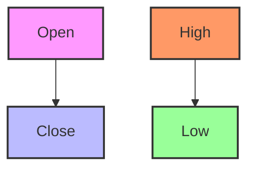

## 15.4 Introduction to Technical Analysis

In the world of investing, understanding the movements and patterns of the market is crucial for making informed decisions. Technical analysis is a method used by traders and investors to evaluate securities based on statistics generated by market activity, such as past prices and volume. Unlike fundamental analysis, which focuses on a company's financial health and economic factors, technical analysis is primarily concerned with price movements and patterns. Let's delve into the intricacies of technical analysis and discover how it can be leveraged to enhance your investment strategies.

### What is Technical Analysis?

Technical analysis is a discipline that involves studying historical market data, primarily price and volume, to forecast future price movements. The underlying assumption is that all known information is already reflected in the price of a security, and by analyzing past price movements, one can predict future trends.

#### Key Principles of Technical Analysis

1. **Market Action Discounts Everything**: This principle suggests that all relevant information, including economic factors and market sentiment, is already priced into the securities.

2. **Prices Move in Trends**: Technical analysts believe that prices move in trends and that once a trend is established, it is likely to continue until a reversal occurs.

3. **History Tends to Repeat Itself**: Patterns and trends observed in the past are likely to reappear, as market participants often react in similar ways to similar stimuli over time.

### The Role of Charts in Technical Analysis

Charts are the cornerstone of technical analysis. They provide a visual representation of price movements over time and are used to identify trends and patterns. There are several types of charts used in technical analysis:

- **Line Charts**: The simplest form of chart, which connects closing prices over a specified period with a continuous line.

- **Bar Charts**: Provide more information than line charts by displaying the open, high, low, and close prices for each period.

- **Candlestick Charts**: Similar to bar charts but with a more visually appealing format. They show the open, high, low, and close prices, and the body of the candlestick indicates the price range between the open and close.

#### Example of a Candlestick Chart

Below is a simple representation of a candlestick chart:

### Identifying Trends and Patterns

Technical analysts use charts to identify trends and patterns that can indicate future price movements. Some common patterns include:

- **Head and Shoulders**: A reversal pattern that can signal a change in trend direction.

- **Double Tops and Bottoms**: Patterns that indicate potential reversals.

- **Triangles**: Continuation patterns that suggest the price will continue in its current direction after a period of consolidation.

### Common Technical Indicators

Technical indicators are mathematical calculations based on price, volume, or open interest. They are used to predict future price movements. Here are some of the most popular indicators:

#### Moving Averages (MA)

Moving averages are used to smooth out price data to identify trends over a specific period. They are calculated by averaging a security's price over a set number of periods. There are two main types of moving averages:

- **Simple Moving Average (SMA)**: The average price over a specified number of periods.

- **Exponential Moving Average (EMA)**: Gives more weight to recent prices, making it more responsive to new information.

#### Relative Strength Index (RSI)

The RSI is a momentum oscillator that measures the speed and change of price movements. It ranges from 0 to 100 and is typically used to identify overbought or oversold conditions in a market. An RSI above 70 suggests that a security may be overbought, while an RSI below 30 indicates it may be oversold.

### Practical Example: Using Moving Averages and RSI

Let's consider a practical example of how moving averages and RSI can be used together to make investment decisions.

Imagine you are analyzing the stock of Company XYZ. You plot the 50-day SMA and the 200-day SMA on a chart and notice that the 50-day SMA crosses above the 200-day SMA. This is known as a "golden cross" and is often seen as a bullish signal, suggesting that the stock may be entering an upward trend.

Simultaneously, you check the RSI and find that it is at 65, indicating that the stock is not yet overbought. Based on this analysis, you decide to buy the stock, anticipating further upward movement.

### Best Practices in Technical Analysis

1. **Combine Multiple Indicators**: Relying on a single indicator can be risky. Use a combination of indicators to confirm signals.

2. **Consider the Time Frame**: Different time frames can provide different perspectives. Analyze multiple time frames to get a comprehensive view.

3. **Stay Informed**: While technical analysis focuses on price movements, staying informed about market news and events is crucial.

4. **Practice Risk Management**: Always use stop-loss orders and position sizing to manage risk effectively.

### Common Pitfalls and Challenges

1. **Over-Reliance on Indicators**: Indicators can provide valuable insights, but they are not foolproof. Avoid over-relying on them without considering other factors.

2. **Ignoring Market Context**: Technical analysis should be used in conjunction with an understanding of the broader market context.

3. **Emotional Trading**: Allowing emotions to dictate trading decisions can lead to poor outcomes. Stick to your analysis and trading plan.

### Conclusion

Technical analysis is a powerful tool that can help investors and traders make informed decisions by analyzing historical price movements and patterns. By understanding charts, trends, and key indicators like moving averages and RSI, you can gain valuable insights into market behavior and enhance your investment strategies. Remember to combine technical analysis with other forms of analysis and risk management practices to maximize your success in the financial markets.

## Quiz Time!



### What is the primary focus of technical analysis?

- [x] Evaluating securities based on market activity statistics
- [ ] Analyzing a company's financial health
- [ ] Assessing economic factors
- [ ] Understanding investor sentiment

> **Explanation:** Technical analysis focuses on evaluating securities based on market activity statistics such as price and volume.

### Which chart type provides the most detailed information about price movements?

- [ ] Line Chart
- [ ] Bar Chart
- [x] Candlestick Chart
- [ ] Point and Figure Chart

> **Explanation:** Candlestick charts provide detailed information, including open, high, low, and close prices, in a visually appealing format.

### What does a "golden cross" indicate in technical analysis?

- [x] A bullish signal
- [ ] A bearish signal
- [ ] A neutral signal
- [ ] An overbought condition

> **Explanation:** A "golden cross" occurs when a short-term moving average crosses above a long-term moving average, indicating a potential upward trend.

### What is the range of the Relative Strength Index (RSI)?

- [ ] 0 to 50
- [ ] 0 to 1000
- [x] 0 to 100
- [ ] 0 to 10

> **Explanation:** The RSI ranges from 0 to 100 and is used to identify overbought or oversold conditions.

### Which of the following is a common reversal pattern?

- [x] Head and Shoulders
- [ ] Triangle
- [ ] Flag
- [ ] Cup and Handle

> **Explanation:** The head and shoulders pattern is a common reversal pattern that can indicate a change in trend direction.

### What is a potential risk of over-relying on technical indicators?

- [x] Ignoring fundamental factors
- [ ] Making informed decisions
- [ ] Enhancing risk management
- [ ] Improving market context understanding

> **Explanation:** Over-relying on technical indicators can lead to ignoring fundamental factors, which are also important in decision-making.

### Why is it important to consider multiple time frames in technical analysis?

- [x] To get a comprehensive view
- [ ] To simplify analysis
- [ ] To reduce data complexity
- [ ] To focus on short-term trends

> **Explanation:** Analyzing multiple time frames provides a comprehensive view and helps identify trends across different periods.

### What does an RSI reading below 30 typically indicate?

- [x] An oversold condition
- [ ] An overbought condition
- [ ] A neutral market
- [ ] A bullish signal

> **Explanation:** An RSI reading below 30 typically indicates that a security may be oversold.

### What is the primary benefit of using moving averages?

- [x] Smoothing out price data
- [ ] Increasing market volatility
- [ ] Enhancing emotional trading
- [ ] Providing immediate buy signals

> **Explanation:** Moving averages help smooth out price data to identify trends over a specific period.

### True or False: Technical analysis can be used in isolation without considering market news.

- [ ] True
- [x] False

> **Explanation:** While technical analysis focuses on price movements, it should be used in conjunction with an understanding of market news and events.


