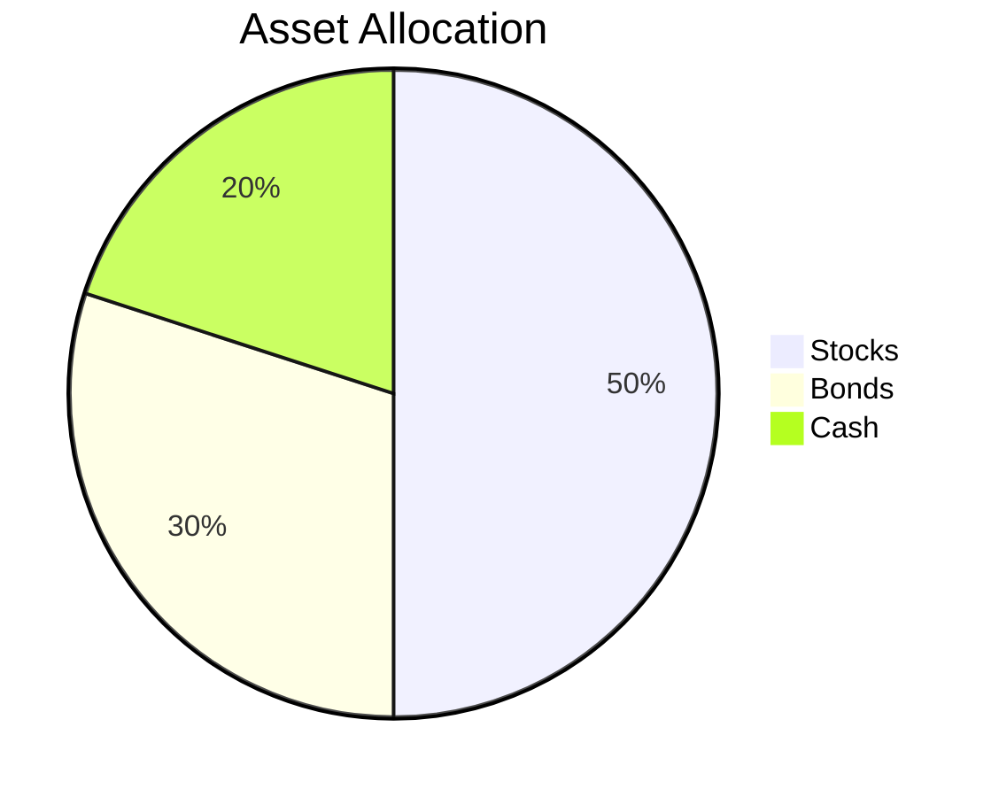

## 16.4 Navigating Market Volatility

In the world of investing, market volatility is an inevitable reality. Whether you're a seasoned investor or just starting, understanding how to navigate through periods of market turbulence is crucial to achieving long-term investment success. In this section, we will explore strategies for managing your investments during volatile times, the importance of maintaining a long-term perspective, and how staying disciplined can help you weather the storm.

### Understanding Market Volatility

**Volatility** is a statistical measure of the dispersion of returns for a given security or market index. It is often associated with the degree of variation in the price of a financial instrument over time. High volatility means that the price of the security can change dramatically over a short period, in either direction. Low volatility means that the price does not fluctuate dramatically and tends to be more stable.

#### Causes of Market Volatility

Market volatility can be caused by a variety of factors, including:

- **Economic Indicators:** Changes in interest rates, inflation, and employment figures can impact market stability.
- **Geopolitical Events:** Political instability, wars, and international conflicts can lead to uncertainty in the markets.
- **Corporate Performance:** Earnings reports and corporate announcements can lead to fluctuations in stock prices.
- **Market Sentiment:** Investor emotions and reactions to news events can drive market movements.

### Strategies for Managing Investments During Volatile Markets

Navigating market volatility requires a strategic approach. Here are some effective strategies to consider:

#### 1. Diversification

Diversification is the practice of spreading your investments across various asset classes to reduce risk. By holding a mix of stocks, bonds, and other securities, you can mitigate the impact of a downturn in any single asset class.

- **Example:** If you have a portfolio heavily weighted in technology stocks, consider adding bonds or stocks from other sectors such as healthcare or consumer goods to balance your risk.

#### 2. Asset Allocation

Asset allocation involves dividing your investment portfolio among different asset categories, such as stocks, bonds, and cash. The goal is to balance risk and reward based on your investment goals and risk tolerance.

- **Mermaid Diagram: Asset Allocation Example**

- **Example:** A conservative investor might allocate 50% of their portfolio to bonds, 30% to stocks, and 20% to cash.

#### 3. Dollar-Cost Averaging

Dollar-cost averaging is an investment strategy where you invest a fixed amount of money at regular intervals, regardless of the market conditions. This approach can help reduce the impact of volatility by buying more shares when prices are low and fewer when prices are high.

- **Example:** Investing $500 monthly in an index fund, regardless of market conditions, can help smooth out the effects of market volatility over time.

#### 4. Maintaining a Long-Term Perspective

One of the most effective ways to navigate market volatility is to maintain a long-term perspective. Markets tend to recover over time, and staying focused on your long-term goals can help you avoid making impulsive decisions during periods of turbulence.

- **Case Study:** During the 2008 financial crisis, many investors panicked and sold their investments at a loss. Those who stayed invested and maintained a long-term perspective saw their portfolios recover and grow in the subsequent years.

#### 5. Rebalancing Your Portfolio

Regularly rebalancing your portfolio ensures that your asset allocation aligns with your investment goals and risk tolerance. This involves buying or selling assets to maintain your desired allocation.

- **Example:** If your target allocation is 60% stocks and 40% bonds, and market volatility causes your portfolio to shift to 70% stocks and 30% bonds, you would sell some stocks and buy bonds to return to your target allocation.

#### 6. Staying Informed and Educated

Keeping informed about market trends and economic indicators can help you make more informed investment decisions. Utilize financial news resources, market analysis, and investment education tools to stay updated.

- **Resources:** Websites like Bloomberg, CNBC, and The Wall Street Journal provide valuable insights into market trends and economic news.

### The Importance of Discipline in Volatile Markets

Staying disciplined during volatile markets is crucial to achieving long-term investment success. Here are some tips for maintaining discipline:

- **Set Clear Goals:** Define your investment objectives and stick to your plan, regardless of market fluctuations.
- **Avoid Emotional Reactions:** Emotional decision-making can lead to poor investment choices. Stay calm and focused on your long-term goals.
- **Review and Adjust:** Regularly review your investment strategy and make adjustments as needed to stay aligned with your goals.

### Real-World Scenario: The COVID-19 Pandemic

The COVID-19 pandemic in 2020 is a prime example of extreme market volatility. The global markets experienced significant downturns, followed by rapid recoveries. Investors who remained disciplined and maintained a long-term perspective were able to navigate the uncertainty and benefit from the market rebound.

#### Lessons Learned:

- **Diversification and asset allocation were key to managing risk.**
- **Investors who practiced dollar-cost averaging were able to take advantage of lower prices.**
- **Staying informed and avoiding panic selling helped many investors maintain their investment strategies.**

### Conclusion

Navigating market volatility requires a combination of strategic planning, discipline, and a long-term perspective. By implementing the strategies discussed in this section, you can better manage your investments during turbulent times and work towards achieving your financial goals. Remember, volatility is a natural part of investing, and staying informed and disciplined can help you weather the storm.

## Quiz Time!



### What is market volatility?

- [x] A statistical measure of the dispersion of returns for a given security or market index.
- [ ] The average return of a security over time.
- [ ] The total market capitalization of a company.
- [ ] The interest rate set by the Federal Reserve.

> **Explanation:** Market volatility refers to the degree of variation in the price of a financial instrument over time, indicating the dispersion of returns.

### Which strategy involves investing a fixed amount of money at regular intervals?

- [x] Dollar-cost averaging
- [ ] Diversification
- [ ] Rebalancing
- [ ] Asset allocation

> **Explanation:** Dollar-cost averaging is an investment strategy where you invest a fixed amount of money at regular intervals, regardless of market conditions.

### What is the primary purpose of diversification?

- [x] To reduce risk by spreading investments across various asset classes.
- [ ] To maximize returns in a single asset class.
- [ ] To focus on high-risk, high-reward investments.
- [ ] To invest only in bonds.

> **Explanation:** Diversification involves spreading investments across various asset classes to reduce risk.

### What does rebalancing a portfolio involve?

- [x] Buying or selling assets to maintain your desired asset allocation.
- [ ] Investing only in stocks.
- [ ] Keeping the same asset allocation regardless of market conditions.
- [ ] Selling all investments during a market downturn.

> **Explanation:** Rebalancing involves adjusting your portfolio by buying or selling assets to maintain your target asset allocation.

### Why is maintaining a long-term perspective important in volatile markets?

- [x] Markets tend to recover over time, and a long-term perspective helps avoid impulsive decisions.
- [ ] It guarantees immediate profits.
- [ ] It eliminates all investment risks.
- [ ] It allows for day trading opportunities.

> **Explanation:** Maintaining a long-term perspective helps investors avoid impulsive decisions during market volatility, as markets tend to recover over time.

### Which of the following is NOT a cause of market volatility?

- [x] A fixed interest rate
- [ ] Economic indicators
- [ ] Geopolitical events
- [ ] Corporate performance

> **Explanation:** A fixed interest rate does not cause market volatility; rather, changes in interest rates can impact market stability.

### What is the benefit of staying informed and educated about market trends?

- [x] It helps make more informed investment decisions.
- [ ] It guarantees higher returns.
- [ ] It eliminates investment risks.
- [ ] It allows for speculative trading.

> **Explanation:** Staying informed about market trends and economic indicators helps investors make more informed decisions.

### What should investors avoid during periods of market volatility?

- [x] Emotional reactions
- [ ] Long-term planning
- [ ] Diversification
- [ ] Asset allocation

> **Explanation:** Emotional reactions can lead to poor investment choices, so it's important to stay calm and focused on long-term goals.

### What was a key lesson learned from the COVID-19 pandemic regarding investments?

- [x] Diversification and asset allocation are key to managing risk.
- [ ] Panic selling is an effective strategy.
- [ ] Short-term trading guarantees profits.
- [ ] Investing only in technology stocks is safe.

> **Explanation:** The COVID-19 pandemic highlighted the importance of diversification and asset allocation in managing investment risk.

### True or False: Volatility is an unnatural part of investing.

- [ ] True
- [x] False

> **Explanation:** Volatility is a natural part of investing, and understanding how to navigate it is crucial for long-term success.


