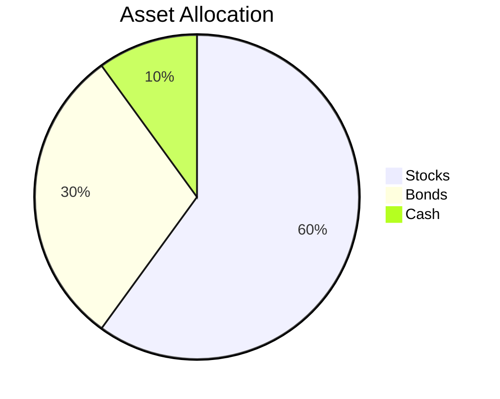

## 16. Case Studies and Practical Examples

In this section, we will delve into real-world scenarios that illustrate the application of concepts covered in this guide. By examining these case studies and engaging in practical exercises, you will enhance your understanding and confidence in securities investing. Let's explore how theoretical knowledge translates into actionable insights in the world of finance.

### 16.1 Building a Sample Investment Portfolio

To begin, let's consider the process of constructing a diversified investment portfolio. Diversification is a key principle in investing, aimed at reducing risk by spreading investments across various asset classes. We'll walk through the steps of creating a balanced portfolio.

#### Step 1: Assessing Risk Tolerance

Understanding your risk tolerance is crucial. It determines the proportion of stocks, bonds, and other assets in your portfolio. For instance, a conservative investor might favor bonds, while an aggressive investor might lean towards stocks.

#### Step 2: Asset Allocation

Asset allocation involves deciding the percentage of your portfolio to invest in each asset class. A common strategy is the "60/40 rule," where 60% is allocated to stocks and 40% to bonds. However, this can be adjusted based on individual risk tolerance and investment goals.

#### Step 3: Selecting Securities

Choose specific securities within each asset class. For stocks, consider a mix of large-cap, mid-cap, and small-cap companies. For bonds, include government, corporate, and municipal bonds. Mutual funds and ETFs can also provide diversification.

#### Step 4: Monitoring and Rebalancing

Regularly review your portfolio to ensure it aligns with your goals. Rebalancing involves adjusting the proportions of assets to maintain your desired allocation. This might mean selling some stocks and buying more bonds if the stock market has performed well.

### 16.2 Analyzing Real-World Stock and Bond Examples

Let's analyze real-world examples of stocks and bonds to see how they perform under different market conditions.

#### Stock Case Study: Apple Inc. (AAPL)

Apple Inc. is a well-known technology company with a history of innovation. By examining its stock performance, we can learn about the factors that influence stock prices.

- **Historical Performance:** Analyze Apple's stock price over the past decade. Note periods of rapid growth and any significant declines.
- **Market Influences:** Consider how product launches, competition, and economic conditions have impacted Apple's stock.
- **Financial Statements:** Review Apple's income statement and balance sheet to understand its financial health.

#### Bond Case Study: U.S. Treasury Bonds

U.S. Treasury Bonds are considered one of the safest investments. They provide insight into the bond market and interest rate dynamics.

- **Interest Rates:** Understand how changes in interest rates affect bond prices. When rates rise, bond prices typically fall, and vice versa.
- **Yield Curve:** Examine the yield curve to see how different maturities offer varying yields.
- **Credit Risk:** While U.S. Treasuries have low credit risk, corporate bonds may offer higher yields but come with increased risk.

### 16.3 Mutual Fund and ETF Selection Process

Mutual funds and ETFs are popular investment vehicles that offer diversification and professional management. Let's explore how to select these funds.

#### Step 1: Define Investment Objectives

Determine your investment goals, such as growth, income, or capital preservation. This will guide your choice of funds.

#### Step 2: Evaluate Fund Performance

Review the historical performance of mutual funds and ETFs. Consider their track record over different time frames and market conditions.

#### Step 3: Analyze Fees and Expenses

Understand the fee structure, including expense ratios and any sales loads. Lower fees can significantly impact long-term returns.

#### Step 4: Assess Fund Management

Research the fund manager's experience and investment strategy. Consistent management can lead to more predictable outcomes.

### 16.4 Navigating Market Volatility

Market volatility can be challenging for investors. Let's discuss strategies to navigate turbulent markets.

#### Strategy 1: Dollar-Cost Averaging

Invest a fixed amount regularly, regardless of market conditions. This strategy reduces the impact of volatility and lowers the average cost per share over time.

#### Strategy 2: Diversification

As previously mentioned, diversification spreads risk across different asset classes, reducing the impact of a downturn in any single investment.

#### Strategy 3: Long-Term Perspective

Focus on long-term goals rather than short-term market fluctuations. Historically, markets have recovered from downturns and continued to grow.

#### Strategy 4: Use of Stop-Loss Orders

Implement stop-loss orders to automatically sell a security when it reaches a certain price. This can help limit losses during volatile periods.

### Practical Exercises

To solidify your understanding, let's engage in some practical exercises.

#### Exercise 1: Portfolio Analysis

Create a hypothetical investment portfolio with a mix of stocks, bonds, and mutual funds. Analyze its performance over the past year and make recommendations for rebalancing.

#### Exercise 2: Stock Valuation

Choose a publicly traded company and perform a basic stock valuation using the price-to-earnings (P/E) ratio and other financial metrics. Compare your valuation to the current market price.

#### Exercise 3: Bond Yield Calculation

Calculate the yield to maturity (YTM) for a corporate bond. Consider how changes in interest rates would affect the bond's price and yield.

#### Exercise 4: Mutual Fund Comparison

Select two mutual funds with similar objectives and compare their performance, fees, and management style. Determine which fund aligns better with your investment goals.

### Visual Aids

To enhance understanding, let's incorporate some visual aids.

#### Diagram: Asset Allocation

This diagram illustrates a sample asset allocation strategy, highlighting the proportion of stocks, bonds, and cash in a portfolio.

#### Chart: Apple Inc. Stock Performance

This chart shows key periods in Apple's stock performance, including growth, decline, and recovery phases.

### Summary

In this chapter, we've explored real-world case studies and practical examples to deepen your understanding of securities investing. By building a sample portfolio, analyzing stocks and bonds, and navigating market volatility, you've gained valuable insights into the practical application of investment concepts. Remember to continually assess your investment strategy and adapt to changing market conditions.

## Quiz Time!



### What is the primary goal of diversification in an investment portfolio?

- [x] To reduce risk by spreading investments across various asset classes
- [ ] To maximize returns by investing in a single asset class
- [ ] To focus solely on short-term gains
- [ ] To invest only in high-risk securities

> **Explanation:** Diversification aims to reduce risk by spreading investments across various asset classes, minimizing the impact of any single investment's poor performance.

### Which of the following best describes the "60/40 rule"?

- [x] A portfolio allocation strategy with 60% stocks and 40% bonds
- [ ] A strategy to invest 60% in bonds and 40% in stocks
- [ ] A method to invest 60% in cash and 40% in real estate
- [ ] A rule to invest 60% in domestic markets and 40% in international markets

> **Explanation:** The "60/40 rule" refers to a portfolio allocation strategy where 60% is invested in stocks and 40% in bonds, balancing risk and return.

### What is a key benefit of dollar-cost averaging?

- [x] It reduces the impact of market volatility on investments
- [ ] It guarantees higher returns than lump-sum investing
- [ ] It eliminates the need for diversification
- [ ] It focuses on short-term trading strategies

> **Explanation:** Dollar-cost averaging reduces the impact of market volatility by investing a fixed amount regularly, lowering the average cost per share over time.

### How do changes in interest rates typically affect bond prices?

- [x] When interest rates rise, bond prices fall
- [ ] When interest rates rise, bond prices rise
- [ ] Interest rates have no effect on bond prices
- [ ] Bond prices are only affected by stock market performance

> **Explanation:** When interest rates rise, bond prices typically fall because new bonds are issued with higher yields, making existing bonds less attractive.

### What is the role of a stop-loss order in investing?

- [x] To automatically sell a security when it reaches a certain price
- [ ] To buy more shares when the price drops
- [ ] To guarantee a minimum return on investment
- [ ] To diversify an investment portfolio

> **Explanation:** A stop-loss order is used to automatically sell a security when it reaches a certain price, helping to limit potential losses.

### What should investors focus on during periods of market volatility?

- [x] Long-term goals rather than short-term market fluctuations
- [ ] Selling all investments to avoid losses
- [ ] Investing exclusively in high-risk assets
- [ ] Timing the market for short-term gains

> **Explanation:** During market volatility, investors should focus on long-term goals, as markets have historically recovered from downturns.

### Which factor is crucial when selecting mutual funds or ETFs?

- [x] Evaluating historical performance and fees
- [ ] Choosing funds based solely on past returns
- [ ] Ignoring management experience
- [ ] Selecting funds with the highest expense ratios

> **Explanation:** Evaluating historical performance and fees is crucial when selecting mutual funds or ETFs, as these factors impact long-term returns.

### What does the yield curve represent in bond investing?

- [x] The relationship between bond yields and maturities
- [ ] The stock market's performance over time
- [ ] The correlation between stocks and bonds
- [ ] The average yield of all bonds in the market

> **Explanation:** The yield curve represents the relationship between bond yields and maturities, indicating how yields vary with different bond terms.

### How can investors assess their risk tolerance?

- [x] By evaluating their comfort with potential losses and investment goals
- [ ] By focusing solely on maximizing returns
- [ ] By investing only in high-risk securities
- [ ] By ignoring market conditions

> **Explanation:** Investors assess their risk tolerance by evaluating their comfort with potential losses and aligning their investment strategy with their financial goals.

### True or False: Asset allocation should remain constant over time.

- [ ] True
- [x] False

> **Explanation:** Asset allocation should be adjusted over time to reflect changes in an investor's risk tolerance, financial goals, and market conditions.


