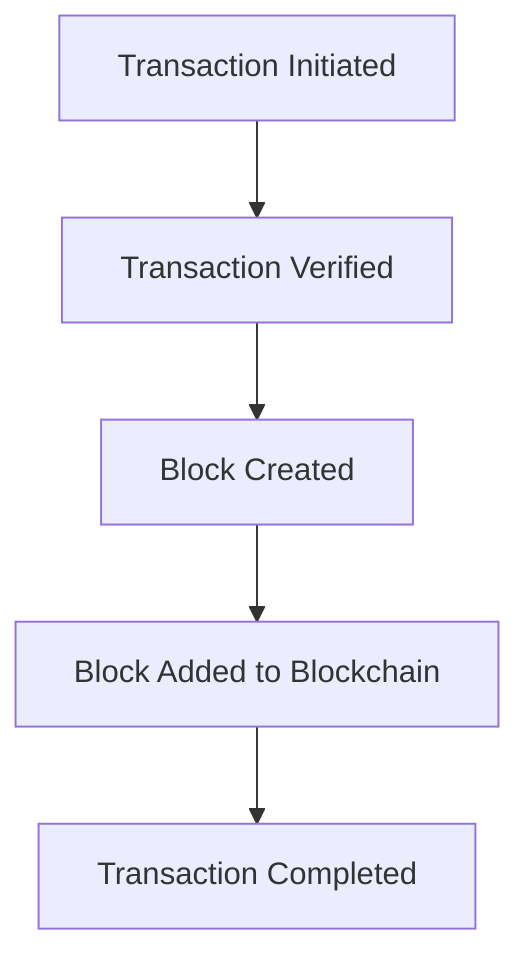

## 17.4 Cryptocurrency and Digital Assets

As we delve into the ever-evolving landscape of securities investing, one cannot ignore the burgeoning presence of cryptocurrencies and digital assets. These innovative financial instruments have captured the imagination of investors worldwide, promising both unprecedented opportunities and unique challenges. In this section, we will explore the fundamentals of cryptocurrencies, the blockchain technology that underpins them, and the potential benefits and risks associated with investing in digital assets. We will also touch on the regulatory landscape, providing insights into how authorities like the SEC and FINRA are responding to this new financial frontier.

### Understanding Cryptocurrencies: The Basics

Cryptocurrencies are digital or virtual currencies that use cryptography for security, making them difficult to counterfeit. Unlike traditional currencies issued by governments (fiat currencies), cryptocurrencies operate on decentralized networks based on blockchain technology. The most well-known cryptocurrency is Bitcoin, but there are thousands of others, each with unique features and use cases.

#### What is Bitcoin?

Bitcoin, introduced in 2009 by an anonymous person or group known as Satoshi Nakamoto, was the first cryptocurrency and remains the most prominent. It was created as a decentralized digital currency that allows for peer-to-peer transactions without the need for intermediaries like banks. Bitcoin transactions are recorded on a public ledger called the blockchain, which ensures transparency and security.

#### The Role of Blockchain Technology

At the heart of cryptocurrencies is blockchain technology. A blockchain is a decentralized ledger of all transactions across a peer-to-peer network. This technology ensures that once a transaction is recorded, it cannot be altered retroactively, providing a high level of security and trust. Each block in the chain contains a number of transactions, and every time a new transaction occurs on the blockchain, a record of that transaction is added to every participant's ledger.

**Mermaid Diagram: Blockchain Structure**

### The Potential Benefits of Investing in Digital Assets

Investing in cryptocurrencies and digital assets offers several potential benefits:

1. **High Returns:** Cryptocurrencies have shown the potential for significant price appreciation. For instance, Bitcoin's value has increased exponentially since its inception.

2. **Diversification:** Digital assets can provide diversification benefits in a traditional investment portfolio, as their price movements are often uncorrelated with stocks and bonds.

3. **Innovation and Growth:** Investing in cryptocurrencies allows investors to participate in the growth of blockchain technology and its applications, which are expected to revolutionize various industries.

4. **Accessibility:** Cryptocurrencies can be accessed and traded 24/7, providing flexibility and convenience for investors.

### The Risks of Investing in Digital Assets

Despite the potential benefits, investing in cryptocurrencies comes with significant risks:

1. **Volatility:** Cryptocurrencies are known for their extreme price volatility, which can lead to substantial gains or losses in a short period.

2. **Regulatory Uncertainty:** The regulatory environment for cryptocurrencies is still evolving, and changes in regulations can impact the market significantly.

3. **Security Risks:** While blockchain technology is secure, cryptocurrency exchanges and wallets can be vulnerable to hacking and fraud.

4. **Market Manipulation:** The cryptocurrency market is less regulated than traditional financial markets, making it susceptible to manipulation.

### Regulatory Landscape: SEC and FINRA Guidelines

In the United States, regulatory bodies like the Securities and Exchange Commission (SEC) and the Financial Industry Regulatory Authority (FINRA) play a critical role in overseeing the cryptocurrency market. The SEC has issued guidelines on the classification of cryptocurrencies, determining whether they qualify as securities. This classification affects how cryptocurrencies are regulated and traded.

#### SEC's Stance on Cryptocurrencies

The SEC has clarified that some cryptocurrencies may be classified as securities, depending on their characteristics and how they are marketed. This classification is based on the Howey Test, which assesses whether an asset is an investment contract. If a cryptocurrency is deemed a security, it must comply with the SEC's registration and disclosure requirements.

#### FINRA's Role

FINRA, as a self-regulatory organization, provides oversight for broker-dealers and has issued guidance on the sale and marketing of cryptocurrencies. It emphasizes the importance of transparency and investor protection in the cryptocurrency market.

### Practical Examples and Case Studies

To better understand the dynamics of cryptocurrency investing, let's examine a few real-world scenarios:

#### Case Study: Bitcoin's Price Surge

In 2017, Bitcoin experienced a dramatic price surge, reaching nearly $20,000 per Bitcoin. This increase was driven by heightened investor interest, media coverage, and the introduction of Bitcoin futures. However, the price subsequently fell, illustrating the volatility inherent in cryptocurrency markets.

#### Example: Ethereum and Smart Contracts

Ethereum, another prominent cryptocurrency, introduced the concept of smart contracts, which are self-executing contracts with the terms of the agreement directly written into code. This innovation has led to the development of decentralized applications (DApps) and has expanded the use cases for blockchain technology beyond digital currencies.

### Best Practices for Investing in Cryptocurrencies

To navigate the complexities of cryptocurrency investing, consider the following best practices:

1. **Conduct Thorough Research:** Understand the technology, use cases, and market dynamics of the cryptocurrencies you are interested in.

2. **Diversify Your Portfolio:** Avoid concentrating your investments in a single cryptocurrency to mitigate risk.

3. **Stay Informed:** Keep abreast of regulatory developments and market trends that may impact your investments.

4. **Use Secure Platforms:** Choose reputable exchanges and wallets with strong security measures to protect your assets.

5. **Be Prepared for Volatility:** Set realistic expectations and be prepared for price fluctuations.

### Conclusion: Embracing the Future of Digital Assets

Cryptocurrencies and digital assets represent a significant shift in the financial landscape, offering both opportunities and challenges for investors. By understanding the fundamentals, potential benefits, and risks, investors can make informed decisions and strategically incorporate digital assets into their portfolios. As the regulatory environment continues to evolve, staying informed and adaptable will be key to success in this dynamic market.

## Quiz Time!



### What is the underlying technology of cryptocurrencies like Bitcoin?

- [x] Blockchain
- [ ] Cloud Computing
- [ ] Artificial Intelligence
- [ ] Quantum Computing

> **Explanation:** Cryptocurrencies operate on decentralized networks based on blockchain technology, which ensures transparency and security.

### Which of the following is a potential benefit of investing in digital assets?

- [x] Diversification
- [ ] Guaranteed Returns
- [ ] No Risk
- [ ] Fixed Income

> **Explanation:** Digital assets can provide diversification benefits in a traditional investment portfolio, as their price movements are often uncorrelated with stocks and bonds.

### What is a significant risk associated with investing in cryptocurrencies?

- [x] Volatility
- [ ] Inflation
- [ ] Low Liquidity
- [ ] High Transaction Costs

> **Explanation:** Cryptocurrencies are known for their extreme price volatility, which can lead to substantial gains or losses in a short period.

### How does the SEC determine if a cryptocurrency is a security?

- [x] Using the Howey Test
- [ ] Based on Market Capitalization
- [ ] By Popularity
- [ ] Through Public Opinion

> **Explanation:** The SEC uses the Howey Test to assess whether an asset is an investment contract, which determines if it qualifies as a security.

### Which cryptocurrency introduced the concept of smart contracts?

- [x] Ethereum
- [ ] Bitcoin
- [ ] Ripple
- [ ] Litecoin

> **Explanation:** Ethereum introduced the concept of smart contracts, which are self-executing contracts with the terms of the agreement directly written into code.

### What role does FINRA play in the cryptocurrency market?

- [x] Provides oversight for broker-dealers
- [ ] Sets cryptocurrency prices
- [ ] Issues mining licenses
- [ ] Develops blockchain technology

> **Explanation:** FINRA, as a self-regulatory organization, provides oversight for broker-dealers and emphasizes transparency and investor protection in the cryptocurrency market.

### Which of the following is a best practice for investing in cryptocurrencies?

- [x] Conduct Thorough Research
- [ ] Invest All Savings
- [x] Diversify Your Portfolio
- [ ] Ignore Market Trends

> **Explanation:** Conducting thorough research and diversifying your portfolio are best practices for navigating the complexities of cryptocurrency investing.

### What is a smart contract?

- [x] A self-executing contract with terms written into code
- [ ] A traditional legal document
- [ ] A cryptocurrency exchange platform
- [ ] A type of digital currency

> **Explanation:** A smart contract is a self-executing contract with the terms of the agreement directly written into code, allowing for automated and trustless transactions.

### Which regulatory body oversees the classification of cryptocurrencies as securities?

- [x] SEC
- [ ] FINRA
- [ ] FDIC
- [ ] IRS

> **Explanation:** The SEC oversees the classification of cryptocurrencies as securities, determining whether they must comply with registration and disclosure requirements.

### True or False: Cryptocurrencies are immune to hacking and fraud.

- [ ] True
- [x] False

> **Explanation:** While blockchain technology is secure, cryptocurrency exchanges and wallets can be vulnerable to hacking and fraud.


