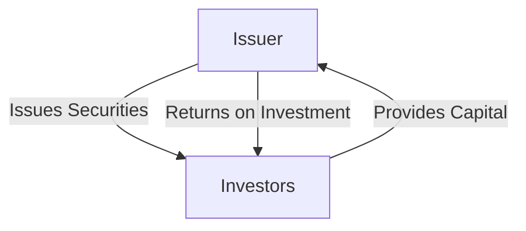

## 2.1 Definition of Securities

In the world of finance, the term **securities** is fundamental, yet it encompasses a wide range of financial instruments that are crucial for both issuers and investors. Understanding what securities are, how they function, and their role in the economy is essential for anyone interested in investing or working in financial markets. In this section, we will delve into the legal definitions, the contractual nature of securities, and their importance in the financial ecosystem.

### Legal Definition of Securities

Under U.S. regulatory frameworks, particularly the Securities Act of 1933, securities are broadly defined to include a variety of financial instruments. According to the Act, a security is any note, stock, treasury stock, bond, debenture, certificate of interest or participation in any profit-sharing agreement, collateral-trust certificate, preorganization certificate or subscription, transferable share, investment contract, voting-trust certificate, or any other instrument commonly known as a "security."

#### Key Elements of the Definition

- **Notes and Bonds:** These represent debt securities, where the issuer owes the holder a debt and is obliged to pay interest and/or repay the principal at a later date.
- **Stocks:** These are equity securities, representing ownership in a corporation and a claim on part of the corporation's assets and earnings.
- **Investment Contracts:** This is a flexible category that includes any contract, transaction, or scheme in which a person invests money in a common enterprise and is led to expect profits solely from the efforts of the promoter or a third party.

The legal definition is intentionally broad to encompass the myriad ways in which financial instruments can be structured and to prevent circumvention of securities laws.

### Securities as Contracts

At their core, securities function as contracts between issuers and investors. These contracts outline the rights and obligations of both parties. Let's break this down further:

#### Issuers

An **issuer** is an entity, such as a corporation, government, or municipality, that develops, registers, and sells securities to finance its operations. Issuers use securities to raise capital for various purposes, such as expanding operations, funding new projects, or refinancing existing debts.

- **Equity Securities:** When a corporation issues stocks, it is essentially selling a portion of its ownership to investors. This provides the company with capital while giving investors a stake in the company.
- **Debt Securities:** When a government or corporation issues bonds, it is borrowing money from investors with the promise to repay the principal along with interest. This is a way to raise funds without diluting ownership.

#### Investors

An **investor** is an individual or organization that allocates capital with the expectation of a future financial return. Investors purchase securities to earn returns through dividends, interest, or capital appreciation.

- **Risk and Return:** Investors assess the risk and return profile of securities before investing. Stocks generally offer higher potential returns but come with higher risk, whereas bonds typically provide more stable returns with lower risk.
- **Portfolio Diversification:** By investing in a variety of securities, investors can diversify their portfolios, reducing risk and increasing the potential for returns.

### Importance of Securities

Securities play a pivotal role in the economy by facilitating the flow of capital from investors to issuers. This process is essential for economic growth and development.

#### Raising Capital

For issuers, securities are a primary means of raising capital. By issuing stocks or bonds, companies and governments can secure the funds needed to invest in new projects, expand operations, or manage existing debt. This capital formation is critical for innovation, infrastructure development, and overall economic progress.

#### Investment Opportunities

For investors, securities provide a mechanism to allocate capital in a way that can generate returns. Through securities, investors can participate in the growth of companies, earn interest from bonds, and benefit from the appreciation of asset values.

#### Market Efficiency

Securities markets enhance economic efficiency by providing a platform for price discovery, liquidity, and risk management. They allow for the efficient allocation of resources, enabling capital to flow to its most productive uses.

### Practical Examples and Case Studies

To illustrate the role and function of securities, let's consider a few practical examples:

#### Example 1: Corporate Bond Issuance

A corporation, XYZ Corp, needs to raise $100 million to expand its manufacturing facility. Instead of issuing new shares and diluting ownership, XYZ Corp decides to issue corporate bonds. Investors purchase these bonds, providing the company with the necessary capital. In return, XYZ Corp agrees to pay bondholders interest annually and repay the principal amount at maturity.

#### Example 2: Initial Public Offering (IPO)

Tech startup InnovateTech decides to go public to raise capital for further research and development. By issuing shares through an Initial Public Offering (IPO), InnovateTech raises $200 million. Investors who buy these shares become part-owners of the company, sharing in its potential profits and growth.

### Diagrams and Visuals

To better understand the flow of capital and the relationship between issuers and investors, let's look at a simple diagram:

This diagram illustrates the basic flow of capital between issuers and investors, highlighting the mutual benefits each party receives from the transaction.

### Best Practices and Common Pitfalls

When dealing with securities, both issuers and investors should be aware of best practices and potential pitfalls:

- **Issuers:** Ensure compliance with regulatory requirements, provide transparent and accurate information to investors, and manage financial obligations responsibly.
- **Investors:** Conduct thorough due diligence, diversify investments to manage risk, and stay informed about market conditions and economic indicators.

### Conclusion

Securities are a cornerstone of modern financial markets, serving as both a tool for issuers to raise capital and a vehicle for investors to achieve financial returns. By understanding the legal definitions, contractual nature, and economic significance of securities, we can better appreciate their role in the financial ecosystem.

As we continue to explore the world of securities, let's keep in mind the dynamic interplay between issuers and investors and the broader impact of these instruments on the economy.

## Quiz Time!



### What is a security according to the Securities Act of 1933?

- [x] Any note, stock, bond, or investment contract
- [ ] Only stocks and bonds
- [ ] Only investment contracts
- [ ] Only government-issued financial instruments

> **Explanation:** The Securities Act of 1933 defines a security broadly to include notes, stocks, bonds, investment contracts, and other instruments.

### Who is an issuer in the context of securities?

- [x] An entity that develops, registers, and sells securities
- [ ] An individual who invests in securities
- [ ] A regulatory body overseeing securities markets
- [ ] A financial advisor managing investments

> **Explanation:** An issuer is an entity, such as a corporation or government, that develops, registers, and sells securities to raise capital.

### What is the primary purpose of issuing securities?

- [x] To raise capital for operations or projects
- [ ] To increase the company's stock price
- [ ] To comply with regulatory requirements
- [ ] To provide dividends to shareholders

> **Explanation:** The primary purpose of issuing securities is to raise capital for operations, projects, or refinancing existing debts.

### How do investors benefit from purchasing securities?

- [x] By earning returns through dividends, interest, or capital appreciation
- [ ] By receiving guaranteed returns with no risk
- [ ] By gaining control over the issuing company
- [ ] By avoiding taxes on their investments

> **Explanation:** Investors benefit from securities by earning returns through dividends, interest, or capital appreciation, although these returns are not guaranteed.

### What is a common pitfall for investors in securities?

- [x] Failing to diversify their investment portfolio
- [ ] Investing in too many different securities
- [ ] Only investing in government bonds
- [ ] Ignoring stock market trends

> **Explanation:** A common pitfall for investors is failing to diversify their portfolio, which increases risk exposure.

### What is the role of securities markets in the economy?

- [x] Enhancing economic efficiency through price discovery and liquidity
- [ ] Only providing a platform for stock trading
- [ ] Regulating the financial industry
- [ ] Ensuring all companies can raise capital

> **Explanation:** Securities markets enhance economic efficiency by providing platforms for price discovery, liquidity, and risk management.

### What is an investment contract?

- [x] A contract where a person invests money in a common enterprise expecting profits from others' efforts
- [ ] A contract guaranteeing fixed returns on an investment
- [ ] A contract between two companies for joint ventures
- [ ] A personal agreement between an investor and a financial advisor

> **Explanation:** An investment contract involves investing money in a common enterprise with the expectation of profits primarily from the efforts of others.

### How can issuers ensure compliance with securities regulations?

- [x] By providing transparent and accurate information to investors
- [ ] By issuing as many securities as possible
- [ ] By avoiding any form of public disclosure
- [ ] By only issuing securities to institutional investors

> **Explanation:** Issuers can ensure compliance by providing transparent and accurate information to investors and adhering to regulatory requirements.

### What is a benefit of diversifying an investment portfolio?

- [x] Reducing risk and increasing potential returns
- [ ] Guaranteeing high returns with no risk
- [ ] Simplifying investment decisions
- [ ] Avoiding the need for financial advice

> **Explanation:** Diversifying a portfolio helps reduce risk and can increase potential returns by spreading investments across various securities.

### True or False: Securities only include stocks and bonds.

- [ ] True
- [x] False

> **Explanation:** False. Securities include a wide range of financial instruments, such as notes, stocks, bonds, investment contracts, and more.


