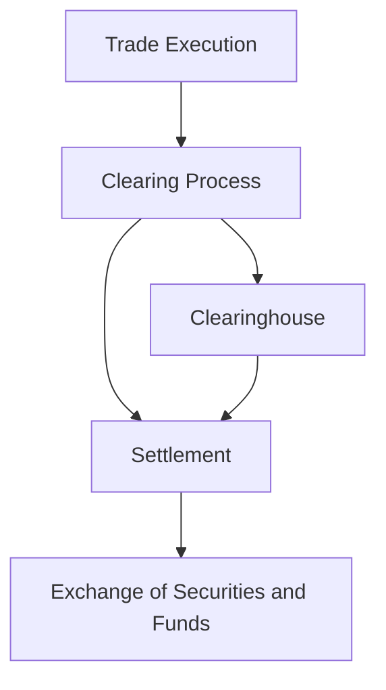

## 2.3 How Securities Are Issued and Traded

In the world of finance, securities play a pivotal role by providing a mechanism for companies to raise capital and for investors to participate in the financial markets. Understanding the processes of issuing and trading securities is crucial for anyone involved in investing. In this section, we will delve into the comprehensive steps involved in issuing securities, explore the trading mechanisms in the secondary market, and discuss the settlement process and the role of clearinghouses.

### Issuing Securities: A Step-by-Step Guide

The issuance of securities is a complex process that involves several key steps, regulatory approvals, and disclosures. Let's explore these steps in detail:

#### 1. **Preparation and Planning**

Before a company can issue securities, it must first determine its capital needs and the type of securities it wishes to issue, such as stocks or bonds. This involves strategic planning and financial analysis to ensure that the issuance aligns with the company's long-term goals.

#### 2. **Engaging Underwriters**

Underwriters, typically investment banks, play a crucial role in the issuance process. They assess the company's financial health, help determine the appropriate pricing of the securities, and commit to purchasing the securities to resell them to the public. This is known as a firm commitment underwriting.

#### 3. **Regulatory Approvals and Disclosures**

To protect investors, regulatory bodies such as the Securities and Exchange Commission (SEC) in the U.S. require companies to file detailed disclosures about their financial condition and business operations. This includes the preparation of a prospectus, which provides potential investors with essential information about the securities being offered.

#### 4. **Pricing and Marketing**

Once regulatory approvals are obtained, the next step is to determine the final price of the securities. This involves gauging investor interest through a process called book-building. Marketing efforts, often referred to as a roadshow, are conducted to generate interest and attract potential investors.

#### 5. **Issuance and Distribution**

After pricing, the securities are issued and distributed to investors. In the case of stocks, this is often done through an Initial Public Offering (IPO) or a Secondary Offering if the company is already public. For bonds, the issuance may occur through a public offering or a private placement.

### Trading Securities: Navigating the Secondary Market

Once securities are issued, they can be bought and sold in the secondary market. This market provides liquidity and price discovery for investors. Let's examine the trading mechanisms involved:

#### 1. **Exchanges and Over-the-Counter (OTC) Platforms**

Securities are traded on organized exchanges such as the New York Stock Exchange (NYSE) or Nasdaq, where buyers and sellers meet to execute trades. Alternatively, securities can be traded over-the-counter (OTC), where transactions occur directly between parties, often facilitated by brokers.

#### 2. **Trading Mechanisms**

Trading on exchanges involves an auction process, where buy and sell orders are matched based on price and time priority. In contrast, OTC trading is typically negotiated, with prices determined through direct negotiation between parties.

#### 3. **Role of Market Makers**

Market makers are entities that provide liquidity by continuously quoting buy and sell prices for securities. They play a vital role in ensuring smooth trading and reducing price volatility.

### Settlement Process and Clearinghouses

After a trade is executed, the settlement process ensures that the buyer receives the securities and the seller receives payment. This involves several key steps:

#### 1. **Clearing and Settlement**

Clearing is the process of reconciling purchase and sale orders and determining the obligations of the parties involved. Settlement is the actual exchange of securities and funds. This process is typically completed within two business days, known as T+2.

#### 2. **Role of Clearinghouses**

Clearinghouses act as intermediaries between buyers and sellers, reducing counterparty risk by guaranteeing the completion of trades. They ensure that trades are settled efficiently and accurately.

### Practical Example: Issuing and Trading a Corporate Bond

Consider a corporation, XYZ Corp, that decides to issue a corporate bond to raise $500 million for expansion. Here's how the process unfolds:

1. **Preparation:** XYZ Corp evaluates its capital needs and decides on a bond issuance.
2. **Underwriting:** An investment bank is engaged to underwrite the bond, assessing XYZ Corp's creditworthiness and determining the bond's coupon rate and maturity.
3. **Regulatory Approval:** XYZ Corp files the necessary disclosures with the SEC, including a prospectus detailing the bond's features and risks.
4. **Pricing and Marketing:** The investment bank conducts a roadshow to gauge investor interest and determine the bond's final price.
5. **Issuance:** The bond is issued and sold to institutional and retail investors through a public offering.
6. **Trading:** Once issued, the bond can be traded in the secondary market, either on an exchange or OTC, providing liquidity for investors.

### Best Practices and Common Pitfalls

**Best Practices:**
- **Thorough Due Diligence:** Conduct comprehensive financial analysis and market research before issuing or trading securities.
- **Regulatory Compliance:** Ensure all regulatory requirements are met to avoid legal issues and protect investor interests.
- **Effective Communication:** Maintain clear and transparent communication with investors to build trust and confidence.

**Common Pitfalls:**
- **Inadequate Disclosure:** Failing to provide complete and accurate information can lead to regulatory penalties and loss of investor trust.
- **Market Volatility:** Be prepared for market fluctuations that can impact the pricing and trading of securities.
- **Liquidity Risks:** Consider the liquidity of securities, especially in OTC markets, to avoid challenges in buying or selling.

### Conclusion

Understanding how securities are issued and traded is fundamental to navigating the financial markets. By following the structured processes of issuance and trading, and leveraging the roles of underwriters, exchanges, and clearinghouses, investors and companies can effectively participate in the dynamic world of securities. As you deepen your knowledge, remember to apply these insights to your investment strategies and financial planning.

## Quiz Time!



### What is the first step in issuing securities?

- [x] Preparation and Planning
- [ ] Engaging Underwriters
- [ ] Regulatory Approvals
- [ ] Pricing and Marketing

> **Explanation:** The first step involves determining capital needs and the type of securities to issue.

### What role do underwriters play in the issuance process?

- [x] Assess financial health and determine pricing
- [ ] Facilitate settlement of trades
- [ ] Act as intermediaries in trading
- [ ] Provide liquidity in the market

> **Explanation:** Underwriters help assess the company's financial health and determine the appropriate pricing for securities.

### What is the purpose of a prospectus?

- [x] To provide investors with essential information about the securities
- [ ] To facilitate the settlement process
- [ ] To act as an intermediary in trading
- [ ] To determine the final price of securities

> **Explanation:** A prospectus provides potential investors with detailed information about the securities being offered.

### How are securities traded in the secondary market?

- [x] On exchanges and over-the-counter platforms
- [ ] Through initial public offerings
- [ ] Via private placements
- [ ] Through regulatory bodies

> **Explanation:** Securities are traded on organized exchanges or over-the-counter platforms in the secondary market.

### What is the role of market makers?

- [x] Provide liquidity by quoting buy and sell prices
- [ ] Facilitate regulatory approvals
- [ ] Act as intermediaries in settlement
- [ ] Conduct roadshows for marketing

> **Explanation:** Market makers provide liquidity by continuously quoting buy and sell prices for securities.

### What does the settlement process involve?

- [x] The exchange of securities and funds
- [ ] The preparation of a prospectus
- [ ] The determination of pricing
- [ ] The marketing of securities

> **Explanation:** Settlement involves the actual exchange of securities and funds between parties.

### What is the role of clearinghouses?

- [x] Reduce counterparty risk by guaranteeing trade completion
- [ ] Determine the final price of securities
- [ ] Conduct roadshows for marketing
- [ ] Provide liquidity in the market

> **Explanation:** Clearinghouses act as intermediaries to reduce counterparty risk and ensure trades are settled efficiently.

### How long does the settlement process typically take?

- [x] Two business days (T+2)
- [ ] One business day (T+1)
- [ ] Three business days (T+3)
- [ ] Four business days (T+4)

> **Explanation:** The settlement process is typically completed within two business days, known as T+2.

### What is a common pitfall in the securities issuance process?

- [x] Inadequate Disclosure
- [ ] Effective Communication
- [ ] Thorough Due Diligence
- [ ] Regulatory Compliance

> **Explanation:** Inadequate disclosure can lead to regulatory penalties and loss of investor trust.

### True or False: Over-the-counter trading involves an auction process.

- [ ] True
- [x] False

> **Explanation:** Over-the-counter trading is typically negotiated, with prices determined through direct negotiation between parties.


