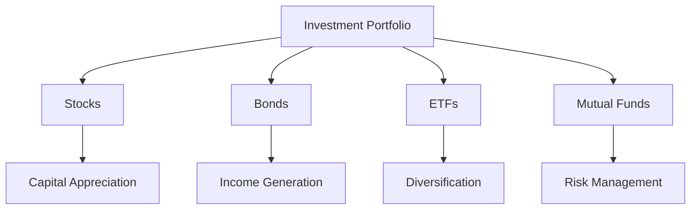

## 2.4 The Role of Securities in Investment Portfolios

Investing in securities is a cornerstone of building a robust investment portfolio. Securities, including stocks, bonds, mutual funds, and ETFs, provide investors with avenues for income generation, capital appreciation, and risk management. In this section, we will explore the multifaceted role of securities in investment portfolios, emphasizing the importance of diversification, aligning investments with personal objectives, and understanding the theoretical underpinnings of portfolio construction.

### Income Generation and Capital Appreciation

**Income Generation** and **Capital Appreciation** are two primary objectives of investing in securities. Let's delve into how each is achieved:

#### Income Generation

Income generation refers to earning regular income through interest or dividends from investments. Bonds, dividend-paying stocks, and certain types of mutual funds and ETFs are common securities that provide income. For instance, bonds pay interest at regular intervals, known as coupon payments, which can serve as a steady income stream for investors. Similarly, many companies distribute a portion of their profits to shareholders in the form of dividends.

- **Example:** Consider a retiree who invests in a portfolio of bonds and dividend-paying stocks. The interest from bonds and dividends from stocks provide a stable income to support their living expenses.

#### Capital Appreciation

Capital appreciation is the increase in the value of an asset or investment over time. Stocks are typically associated with capital appreciation, as they have the potential to increase significantly in value. Investors who focus on growth stocks aim to benefit from the appreciation in the stock's price, which can result in substantial gains over the long term.

- **Example:** An investor purchases shares in a technology company with strong growth prospects. Over several years, as the company expands and increases its earnings, the stock price rises, resulting in capital appreciation.

### Diversification and Risk Management

Diversification is a critical strategy in managing investment risk. By holding a variety of securities, investors can reduce the impact of any single asset's poor performance on the overall portfolio.

#### The Concept of Diversification

Diversification involves spreading investments across different asset classes, industries, and geographic regions to mitigate risk. By doing so, the negative performance of one security is often offset by the positive performance of others. This balance helps stabilize returns and reduce volatility.

- **Example:** A diversified portfolio might include domestic and international stocks, government and corporate bonds, and real estate investment trusts (REITs). This mix ensures that the portfolio is not overly dependent on any single market or economic condition.

#### Modern Portfolio Theory (MPT)

Modern Portfolio Theory, developed by Harry Markowitz, provides a framework for constructing portfolios that maximize expected return for a given level of risk. MPT emphasizes the importance of diversification and the correlation between assets. By selecting securities that do not move in tandem, investors can achieve a more efficient portfolio.

### Aligning Securities Selection with Investment Objectives

Investors must align their choice of securities with their investment objectives and risk tolerance. This alignment ensures that the portfolio meets the investor's financial goals and comfort with potential losses.

#### Understanding Investment Objectives

Investment objectives vary widely among individuals and can include goals such as saving for retirement, funding education, or purchasing a home. Each objective may require a different investment strategy and selection of securities.

- **Example:** A young investor saving for retirement may prioritize capital appreciation and invest heavily in growth stocks. In contrast, an individual nearing retirement might focus on income generation and capital preservation, favoring bonds and dividend-paying stocks.

#### Assessing Risk Tolerance

Risk tolerance is the degree of variability in investment returns that an investor is willing to withstand. It is influenced by factors such as age, financial situation, and investment experience. Understanding risk tolerance helps in constructing a portfolio that aligns with the investor's comfort level.

- **Example:** A risk-averse investor may prefer a conservative portfolio with a higher allocation to bonds and cash equivalents, while a risk-tolerant investor might opt for a more aggressive portfolio with a larger proportion of equities.

### Practical Examples and Case Studies

To illustrate the role of securities in investment portfolios, let's examine a few practical examples and case studies:

#### Case Study: A Balanced Portfolio

Consider an investor with a balanced portfolio comprising 60% stocks and 40% bonds. This allocation aims to achieve a balance between growth and income, with stocks providing capital appreciation and bonds offering income generation and stability.

- **Scenario:** During a period of economic growth, the stock portion of the portfolio appreciates significantly, enhancing the portfolio's overall value. Conversely, during a market downturn, the bonds provide a cushion, generating income and reducing volatility.

#### Example: Sector Diversification

An investor interested in sector diversification might allocate their equity investments across various sectors such as technology, healthcare, and consumer goods. This approach reduces the risk associated with sector-specific downturns.

- **Scenario:** If the technology sector experiences a decline due to regulatory changes, the investor's exposure to healthcare and consumer goods can help offset losses, maintaining portfolio stability.

### Best Practices and Common Pitfalls

**Best Practices:**

- **Regularly Review and Rebalance:** Periodically review the portfolio to ensure it aligns with investment objectives and risk tolerance. Rebalancing involves adjusting the portfolio to maintain the desired asset allocation.
- **Stay Informed:** Keep abreast of market trends, economic indicators, and changes in personal financial circumstances that may impact investment decisions.

**Common Pitfalls:**

- **Overconcentration:** Avoid overconcentration in a single security or asset class, as it increases risk.
- **Ignoring Fees and Expenses:** Be mindful of fees and expenses associated with securities, as they can erode returns over time.

### Conclusion

Securities play a vital role in investment portfolios by offering opportunities for income generation, capital appreciation, and risk management. By understanding the principles of diversification, aligning securities selection with personal objectives, and applying modern portfolio theory, investors can construct portfolios that meet their financial goals while managing risk effectively. As we continue our exploration of securities and investing, remember that a well-structured portfolio is a dynamic tool that evolves with your financial journey.

## Quiz Time!



### What is income generation in the context of securities?

- [x] Earning regular income through interest or dividends
- [ ] Increasing the value of an investment over time
- [ ] Reducing investment risk through diversification
- [ ] Selecting securities based on personal preferences

> **Explanation:** Income generation refers to earning regular income through interest or dividends from investments such as bonds and dividend-paying stocks.

### What is capital appreciation?

- [ ] Earning regular income through interest or dividends
- [x] An increase in the value of an asset over time
- [ ] Reducing investment risk through diversification
- [ ] Selecting securities based on personal preferences

> **Explanation:** Capital appreciation is the increase in the value of an asset or investment over time, typically associated with stocks.

### How does diversification help in risk management?

- [x] By spreading investments across different asset classes
- [ ] By concentrating investments in a single sector
- [ ] By focusing only on high-risk securities
- [ ] By ignoring market trends

> **Explanation:** Diversification involves spreading investments across different asset classes, industries, and regions to mitigate risk and stabilize returns.

### What is the primary focus of modern portfolio theory?

- [ ] Maximizing income generation
- [ ] Concentrating investments in high-growth stocks
- [x] Maximizing expected return for a given level of risk
- [ ] Ignoring asset correlations

> **Explanation:** Modern portfolio theory focuses on constructing portfolios that maximize expected return for a given level of risk, emphasizing diversification and asset correlation.

### Which of the following is an example of aligning securities selection with investment objectives?

- [x] A young investor prioritizing growth stocks for retirement savings
- [ ] An investor ignoring their risk tolerance
- [ ] A retiree investing heavily in high-risk stocks
- [ ] A conservative investor holding only cash

> **Explanation:** Aligning securities selection with investment objectives involves choosing securities that match the investor's financial goals and risk tolerance, such as a young investor focusing on growth stocks for long-term retirement savings.

### What is a common pitfall in investment portfolios?

- [ ] Regularly reviewing and rebalancing the portfolio
- [ ] Staying informed about market trends
- [x] Overconcentration in a single security or asset class
- [ ] Diversifying across different sectors

> **Explanation:** Overconcentration in a single security or asset class increases risk and is a common pitfall in investment portfolios.

### How can sector diversification benefit an investment portfolio?

- [x] By reducing the risk associated with sector-specific downturns
- [ ] By focusing only on high-growth sectors
- [ ] By concentrating investments in a single sector
- [ ] By ignoring economic indicators

> **Explanation:** Sector diversification involves allocating investments across various sectors to reduce the risk associated with sector-specific downturns.

### What is the purpose of rebalancing a portfolio?

- [x] To maintain the desired asset allocation
- [ ] To increase exposure to high-risk securities
- [ ] To ignore changes in personal financial circumstances
- [ ] To focus only on short-term gains

> **Explanation:** Rebalancing involves adjusting the portfolio to maintain the desired asset allocation, ensuring it aligns with investment objectives and risk tolerance.

### Why is it important to stay informed about market trends?

- [x] To make informed investment decisions
- [ ] To ignore changes in economic indicators
- [ ] To concentrate investments in a single asset class
- [ ] To avoid rebalancing the portfolio

> **Explanation:** Staying informed about market trends, economic indicators, and personal financial circumstances helps investors make informed investment decisions.

### True or False: Modern portfolio theory ignores the correlation between assets.

- [ ] True
- [x] False

> **Explanation:** Modern portfolio theory emphasizes the importance of asset correlation in constructing efficient portfolios, aiming to maximize expected return for a given level of risk.


