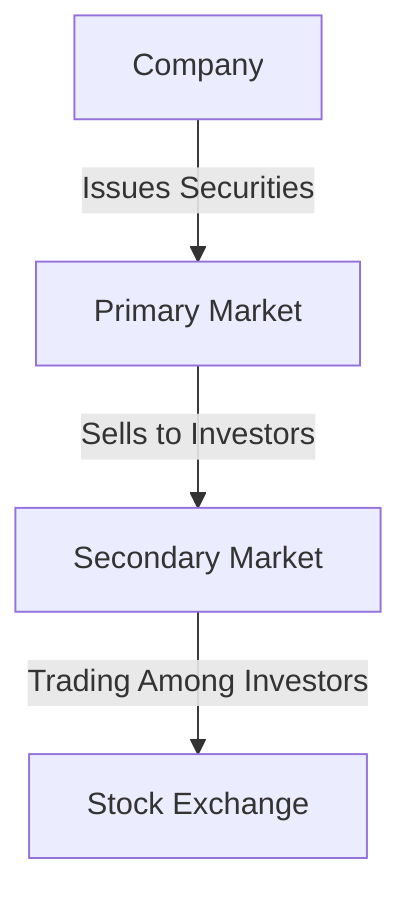

## 2. Understanding Securities

In the realm of finance, securities play a pivotal role in capital markets, serving as instruments that represent financial value. They are the building blocks of investment portfolios and are crucial for both individual investors and large institutions. In this section, we will delve into the world of securities, exploring their types, functions, and the regulatory environment that governs them.

### 2.1 Definition of Securities

**Securities** are tradable financial assets that hold some form of monetary value. They can be broadly categorized into equity, debt, and hybrid instruments. Securities are essential for raising capital, providing liquidity, and enabling investors to diversify their portfolios.

#### Key Characteristics of Securities

- **Tradability:** Securities can be bought and sold in financial markets, providing liquidity to investors.
- **Value Representation:** They represent a claim on the issuer's assets or earnings.
- **Regulation:** Securities are subject to regulatory oversight to ensure fair trading and investor protection.

### 2.2 Primary vs. Secondary Markets

Understanding the distinction between primary and secondary markets is crucial for grasping how securities are issued and traded.

#### Primary Market

The **primary market** is where securities are created. In this market, companies issue new stocks and bonds to investors for the first time. The primary market is essential for raising capital. For example, when a company goes public through an Initial Public Offering (IPO), it sells shares to the public in the primary market.

#### Secondary Market

The **secondary market** is where previously issued securities are traded among investors. This market provides liquidity and enables price discovery. Stock exchanges like the New York Stock Exchange (NYSE) and NASDAQ are examples of secondary markets.

### 2.3 How Securities Are Issued and Traded

The issuance and trading of securities involve several steps and participants, including issuers, investors, and intermediaries like brokers and dealers.

#### Issuance Process

1. **Preparation:** Companies prepare financial statements and prospectuses.
2. **Regulatory Approval:** They seek approval from regulatory bodies like the Securities and Exchange Commission (SEC).
3. **Underwriting:** Investment banks underwrite the securities, setting the price and buying them from the issuer to sell to the public.
4. **Distribution:** Securities are sold to institutional and retail investors.

#### Trading Process

1. **Order Placement:** Investors place buy or sell orders through brokers.
2. **Execution:** Orders are matched and executed on trading platforms.
3. **Settlement:** The transfer of securities and payment is completed.

### 2.4 The Role of Securities in Investment Portfolios

Securities are fundamental to building investment portfolios, allowing investors to achieve various financial goals through diversification and risk management.

#### Diversification

By holding a mix of securities, investors can spread risk across different asset classes, sectors, and geographic regions. For example, a portfolio might include U.S. stocks, international bonds, and real estate investment trusts (REITs).

#### Risk and Return

Securities offer different risk and return profiles. Stocks typically provide higher returns but with greater volatility, while bonds offer more stable returns with lower risk. Hybrid securities, like convertible bonds, offer a blend of features.

#### Income Generation

Certain securities, such as dividend-paying stocks and interest-bearing bonds, provide regular income streams, which can be crucial for retirees or income-focused investors.

### 2.5 Types of Securities

Securities can be categorized into three main types: equity, debt, and hybrid instruments. Each type serves different purposes and carries unique characteristics.

#### Equity Securities

**Equity securities** represent ownership interest in a company. The most common form of equity securities is stocks. When you purchase a stock, you become a part-owner of the company, entitled to a share of its profits and assets.

- **Common Stock:** Offers voting rights and potential dividends, but with no guarantee of returns.
- **Preferred Stock:** Provides fixed dividends and priority over common stockholders in asset liquidation, but typically lacks voting rights.

#### Debt Securities

**Debt securities** represent a loan made by an investor to a borrower, typically a corporation or government. In return, the borrower agrees to pay interest and repay the principal at maturity.

- **Bonds:** Fixed-income instruments with various types, including government, corporate, and municipal bonds.
- **Notes and Debentures:** Similar to bonds but with different terms and conditions.

#### Hybrid Instruments

**Hybrid instruments** combine features of both equity and debt securities.

- **Convertible Bonds:** Debt securities that can be converted into a predetermined number of shares.
- **Preferred Shares with Convertible Features:** Preferred stocks that can be converted into common stocks.

### 2.6 Legal and Regulatory Considerations

Securities are subject to a complex regulatory framework designed to protect investors and ensure market integrity. In the U.S., the primary regulatory bodies include the Securities and Exchange Commission (SEC) and the Financial Industry Regulatory Authority (FINRA).

#### Key Regulations

- **Securities Act of 1933:** Requires issuers to provide full disclosure of material information through registration and prospectuses.
- **Securities Exchange Act of 1934:** Governs trading securities, establishes the SEC, and mandates periodic reporting by public companies.
- **Sarbanes-Oxley Act:** Enhances corporate governance and financial disclosures.

#### Investor Protections

Regulations aim to protect investors from fraud and ensure transparency. For example, the SEC enforces rules against insider trading and requires companies to disclose material information that could impact stock prices.

#### Compliance

Issuers, brokers, and dealers must adhere to strict compliance standards. Failure to comply can result in penalties, fines, or suspension from trading activities.

### Practical Examples and Case Studies

#### Example 1: IPO of a Tech Company

Consider a tech company planning to go public. The company prepares its financial statements and files a registration statement with the SEC. After approval, the company works with an investment bank to underwrite the IPO. Shares are priced and sold to institutional investors in the primary market. Once trading begins, shares can be bought and sold in the secondary market.

#### Example 2: Diversified Investment Portfolio

An investor builds a diversified portfolio by purchasing a mix of securities: 60% stocks, 30% bonds, and 10% REITs. This allocation aims to balance growth potential with income generation and risk management.

### Diagrams and Visual Aids

Let's visualize the flow of securities from issuance to trading:

This diagram illustrates the journey of securities from issuance in the primary market to trading in the secondary market.

### Best Practices and Common Pitfalls

#### Best Practices

- **Diversify:** Spread investments across different types of securities to manage risk.
- **Research:** Conduct thorough research and due diligence before investing.
- **Stay Informed:** Keep abreast of market trends and regulatory changes.

#### Common Pitfalls

- **Overconcentration:** Avoid putting too much capital into a single security or asset class.
- **Ignoring Fees:** Be aware of transaction costs and management fees that can erode returns.
- **Emotional Investing:** Make decisions based on analysis rather than emotions.

### Conclusion

Understanding securities is fundamental to navigating the financial markets and making informed investment decisions. By grasping the different types of securities, their roles, and the regulatory landscape, investors can build robust portfolios that align with their financial goals.

---

## Quiz Time!



### What are securities?

- [x] Tradable financial assets such as stocks, bonds, and options
- [ ] Non-tradable financial assets like bank accounts
- [ ] Physical assets like real estate
- [ ] Commodities like gold and silver

> **Explanation:** Securities are tradable financial assets that include stocks, bonds, and options, representing financial value.

### Which market involves the initial sale of securities?

- [x] Primary Market
- [ ] Secondary Market
- [ ] Tertiary Market
- [ ] Over-the-Counter Market

> **Explanation:** The primary market is where securities are first issued and sold to investors.

### What is a common characteristic of equity securities?

- [x] They represent ownership interest in a company.
- [ ] They represent a loan to a company.
- [ ] They guarantee fixed returns.
- [ ] They are not tradable.

> **Explanation:** Equity securities represent ownership interest in a company, such as stocks.

### Which regulatory body oversees securities in the U.S.?

- [x] Securities and Exchange Commission (SEC)
- [ ] Federal Reserve
- [ ] Department of Treasury
- [ ] Internal Revenue Service (IRS)

> **Explanation:** The SEC is the primary regulatory body overseeing securities markets in the U.S.

### What is a hybrid security?

- [x] A financial instrument combining features of equity and debt
- [ ] A security that only pays dividends
- [x] A security that can be converted into another form
- [ ] A security that is not regulated

> **Explanation:** Hybrid securities combine features of both equity and debt, such as convertible bonds.

### What is the main purpose of diversification in a portfolio?

- [x] To spread risk across different asset classes
- [ ] To maximize returns from a single asset
- [ ] To focus on one type of security
- [ ] To avoid regulatory compliance

> **Explanation:** Diversification spreads risk across different asset classes, reducing the impact of any single investment's poor performance.

### What is the primary market function?

- [x] Issuing new securities to raise capital
- [ ] Trading existing securities
- [x] Providing liquidity to investors
- [ ] Speculating on future prices

> **Explanation:** The primary market is where new securities are issued to raise capital for companies.

### What is a convertible bond?

- [x] A debt security that can be converted into equity
- [ ] A bond that pays variable interest
- [ ] A bond that cannot be traded
- [ ] A bond that is only issued by governments

> **Explanation:** A convertible bond is a debt security that can be converted into a predetermined number of shares.

### What is the role of the secondary market?

- [x] To provide liquidity and enable price discovery
- [ ] To issue new securities
- [ ] To regulate securities trading
- [ ] To set interest rates

> **Explanation:** The secondary market provides liquidity and enables price discovery by allowing investors to trade existing securities.

### True or False: The SEC enforces rules against insider trading.

- [x] True
- [ ] False

> **Explanation:** The SEC enforces rules against insider trading to ensure fair and transparent markets.


