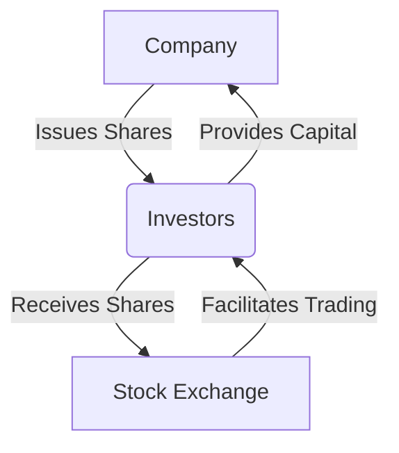

## 3.1 What Is a Stock?

In the vast landscape of financial markets, stocks hold a pivotal role as one of the primary vehicles for investment and capital raising. Understanding what a stock is, how it functions, and the benefits it offers to both companies and investors is fundamental for anyone looking to delve into the world of securities. In this section, we will explore the concept of stocks, their significance in the financial ecosystem, and the potential they hold for investors.

### Defining a Stock

A **stock** represents a share in the ownership of a company, constituting a claim on part of the company's assets and earnings. Stocks are also known as "equities" because they signify equity ownership in a corporation. When you purchase a stock, you are buying a piece of the company, making you a shareholder. This ownership stake gives you certain rights, such as voting on corporate matters and receiving dividends, depending on the type of stock you own.

### The Significance of Stocks in Raising Capital

For companies, issuing stocks is a crucial method of raising capital. When a company needs to fund expansion, invest in new projects, or pay off debt, it can issue new shares to the public through a process known as an Initial Public Offering (IPO). This process not only provides the company with the necessary funds but also allows it to tap into a broader pool of investors. Once the shares are issued, they can be bought and sold on stock exchanges, providing liquidity and a mechanism for price discovery.

#### **Mermaid Diagram: How Stocks Raise Capital**

### Understanding Shares and Ownership

The concept of **shares** is integral to understanding stocks. A share is a single unit of ownership in a company or financial asset. When a company issues shares, it divides its ownership into equal parts, which are then sold to investors. The total number of shares represents the company's total equity, and each share corresponds to a fraction of the company's ownership.

For example, if a company issues 1,000 shares and you purchase 100 shares, you own 10% of the company. This ownership entitles you to a proportionate share of the company's profits, which may be distributed as dividends, and a say in corporate governance through voting rights.

### Benefits to Investors

Investing in stocks offers several potential benefits:

1. **Dividends**: Many companies distribute a portion of their earnings to shareholders in the form of dividends. These payments provide a steady income stream and can be particularly attractive to income-focused investors.

2. **Capital Gains**: Stocks have the potential to appreciate in value over time. When you sell a stock for a higher price than you paid for it, the profit is known as a **capital gain**. Capital gains can significantly enhance the overall return on investment, especially in a growing market.

3. **Ownership and Voting Rights**: As a shareholder, you have a stake in the company's success and may have the right to vote on important corporate matters, such as electing board members or approving significant corporate actions.

4. **Liquidity**: Stocks are typically traded on exchanges, providing liquidity and flexibility. This means you can buy or sell your shares relatively easily, allowing you to adjust your investment portfolio as needed.

### Real-World Example: Apple Inc.

To illustrate these concepts, let's consider Apple Inc., one of the world's most valuable companies. When Apple went public in 1980, it issued shares to raise capital for its operations. Investors who purchased Apple stock became part-owners of the company. Over the years, Apple's stock price has appreciated significantly, providing substantial capital gains to its investors. Additionally, Apple pays dividends, offering a regular income stream to its shareholders.

### Key Considerations and Risks

While stocks offer significant potential for growth, they also come with risks:

- **Market Volatility**: Stock prices can be highly volatile, influenced by factors such as economic conditions, interest rates, and company performance. This volatility can lead to substantial fluctuations in the value of your investment.

- **Company-Specific Risks**: Investing in a single company exposes you to risks specific to that company, such as management decisions, competitive pressures, and industry changes.

- **No Guaranteed Returns**: Unlike bonds, which may offer fixed interest payments, stocks do not guarantee returns. Dividends can be reduced or eliminated, and stock prices can decline, resulting in losses.

### Best Practices for Stock Investing

To navigate the complexities of stock investing, consider the following best practices:

- **Diversification**: Spread your investments across different sectors and industries to mitigate risks. Diversification can help cushion your portfolio against market volatility and company-specific risks.

- **Research and Analysis**: Conduct thorough research on the companies you are considering investing in. Analyze financial statements, industry trends, and market conditions to make informed decisions.

- **Long-Term Perspective**: Stocks are generally better suited for long-term investment strategies. A long-term perspective allows you to ride out market fluctuations and benefit from potential compounding returns.

- **Stay Informed**: Keep up with market news, economic indicators, and company developments. Staying informed can help you make timely decisions and adjust your investment strategy as needed.

### Conclusion

Stocks are a fundamental component of the financial markets, offering both companies and investors opportunities for growth and wealth creation. By understanding what a stock is, how it functions, and the benefits and risks involved, you can make informed decisions and build a robust investment portfolio. As you continue your journey into the world of securities, remember to apply best practices, stay informed, and maintain a long-term perspective to maximize your investment potential.

---

## Quiz Time!



### What is a stock?

- [x] A share in the ownership of a company
- [ ] A type of bond issued by a corporation
- [ ] A financial derivative
- [ ] A government security

> **Explanation:** A stock represents a share in the ownership of a company, giving the shareholder a claim on part of the company's assets and earnings.

### What is the primary purpose of issuing stocks for a company?

- [x] To raise capital for expansion and investment
- [ ] To reduce company debt
- [ ] To increase the company's market share
- [ ] To diversify the company's product line

> **Explanation:** Companies issue stocks primarily to raise capital for expansion, investment in new projects, or paying off debt.

### What is a share?

- [x] A single unit of ownership in a company
- [ ] A type of bond
- [ ] A financial contract
- [ ] A government-issued security

> **Explanation:** A share is a single unit of ownership in a company, representing a fraction of the company's equity.

### What are dividends?

- [x] Payments made to shareholders from a company's earnings
- [ ] Interest payments on bonds
- [ ] Fees charged by brokers
- [ ] Government taxes on stocks

> **Explanation:** Dividends are payments made to shareholders from a company's earnings, providing a source of income for investors.

### What is a capital gain?

- [x] The profit realized when a security is sold for a higher price than it was purchased
- [ ] The interest earned on a bond
- [ ] The dividend received from a stock
- [ ] The fee charged by a mutual fund

> **Explanation:** A capital gain is the profit realized when a security is sold for a higher price than it was purchased.

### What rights do shareholders typically have?

- [x] Voting on corporate matters
- [ ] Setting company salaries
- [ ] Deciding product prices
- [ ] Managing daily operations

> **Explanation:** Shareholders typically have the right to vote on corporate matters, such as electing board members and approving significant corporate actions.

### What is one risk associated with investing in stocks?

- [x] Market volatility
- [ ] Guaranteed returns
- [ ] Fixed interest payments
- [ ] Government backing

> **Explanation:** Market volatility is a risk associated with investing in stocks, as stock prices can fluctuate significantly due to various factors.

### How can investors mitigate risks in their stock portfolio?

- [x] Diversification
- [ ] Investing in a single company
- [ ] Ignoring market trends
- [ ] Avoiding research

> **Explanation:** Diversification, or spreading investments across different sectors and industries, can help mitigate risks in a stock portfolio.

### What is a long-term perspective in stock investing?

- [x] Holding investments for an extended period to benefit from potential compounding returns
- [ ] Buying and selling stocks frequently to capitalize on short-term price movements
- [ ] Avoiding all market news and trends
- [ ] Focusing only on short-term gains

> **Explanation:** A long-term perspective involves holding investments for an extended period to benefit from potential compounding returns and ride out market fluctuations.

### True or False: Stocks guarantee returns to investors.

- [ ] True
- [x] False

> **Explanation:** Stocks do not guarantee returns. While they offer potential for dividends and capital gains, they also carry risks, and returns are not assured.


