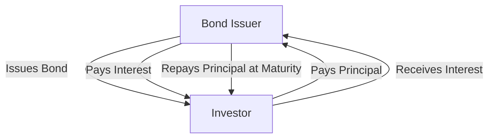

## 4.1 What Is a Bond?

In the realm of financial markets, bonds stand as one of the most fundamental instruments of debt financing. They are pivotal in both personal investment portfolios and the broader economic landscape. Understanding bonds is crucial for anyone looking to diversify their investments or comprehend how governments and corporations raise capital. In this section, we will delve into the intricacies of bonds, their structure, and their role in financial markets.

### The Basic Structure of a Bond

At its core, a bond is a fixed-income instrument that represents a loan made by an investor to a borrower. The bond is essentially a contract between the bond issuer and the bondholder. Here, we break down the key components of a bond:

- **Issuer:** The issuer is the entity that borrows funds through the issuance of bonds. This can be a government, municipality, corporation, or any other organization. The issuer is obligated to repay the principal amount and make periodic interest payments to the bondholder.

- **Face Value (Par Value):** This is the amount that the bondholder will receive upon maturity. It is the principal amount that the issuer agrees to repay.

- **Coupon Rate:** The coupon rate is the annual interest rate paid on the bond's face value. It determines the periodic interest payments made to bondholders. For example, a bond with a face value of $1,000 and a coupon rate of 5% will pay $50 annually.

- **Maturity Date:** This is the date on which the bond will mature, and the issuer will repay the face value to the bondholder. Bonds can have short-term, medium-term, or long-term maturities, ranging from a few months to several decades.

### Contractual Obligations of Issuers

When an entity issues a bond, it enters into a contractual obligation to make periodic interest payments, known as coupon payments, and repay the principal amount at maturity. These obligations are legally binding, and failure to meet them can result in default, which can have severe financial and reputational consequences for the issuer.

The periodic interest payments provide a predictable income stream for bondholders, making bonds an attractive investment for those seeking stable returns. The certainty of these payments is one of the defining characteristics of bonds, distinguishing them from equities, where dividends are not guaranteed.

### Why Entities Issue Bonds

Entities issue bonds as a means of raising capital. Here are some common reasons why different types of issuers might choose to issue bonds:

- **Governments:** Governments issue bonds to finance public projects, manage budget deficits, and refinance existing debt. Government bonds are considered low-risk investments, as they are backed by the full faith and credit of the issuing government.

- **Corporations:** Corporations issue bonds to fund expansion projects, manage cash flow, or refinance existing debt. Corporate bonds typically offer higher yields than government bonds, reflecting the higher risk associated with corporate issuers.

- **Municipalities:** Municipal bonds, or "munis," are issued by states, cities, and other local government entities to finance public infrastructure projects such as schools, highways, and hospitals. The interest earned on many municipal bonds is exempt from federal income tax, making them attractive to investors in higher tax brackets.

### Bonds vs. Equity Financing

Bonds and equity represent two primary ways for entities to raise capital, but they differ significantly in structure and implications for both issuers and investors.

- **Debt vs. Ownership:** Bonds are a form of debt financing, meaning the issuer borrows money from investors and agrees to repay it with interest. Equity financing involves issuing shares of stock, giving investors ownership stakes in the company.

- **Obligations:** Bond issuers have a legal obligation to make interest payments and repay the principal, whereas equity issuers do not have to pay dividends unless declared by the board of directors.

- **Risk and Return:** Bonds are generally considered lower risk than stocks, as they provide fixed interest payments and return of principal. However, they typically offer lower returns compared to equities, which can appreciate in value.

- **Priority in Bankruptcy:** In the event of bankruptcy, bondholders have a higher claim on assets than shareholders. This makes bonds a safer investment during financial distress.

### Practical Example: Understanding Bond Components

Let's consider a practical example to illustrate the components of a bond. Suppose a corporation, XYZ Inc., issues a bond with the following characteristics:

- **Issuer:** XYZ Inc.
- **Face Value:** $1,000
- **Coupon Rate:** 6%
- **Maturity Date:** 10 years from the issue date

In this example, XYZ Inc. is borrowing $1,000 from each investor who purchases the bond. The company agrees to pay 6% of the face value, or $60, annually as interest. At the end of 10 years, XYZ Inc. will repay the $1,000 principal to each bondholder.

### Visualizing Bond Structure

To further clarify the bond structure, let's visualize the flow of payments and obligations in a bond using a diagram:

In this diagram, we see the bond issuer (A) issuing the bond to the investor (B). The investor provides the principal amount, and in return, the issuer makes periodic interest payments and repays the principal at maturity.

### Best Practices and Common Pitfalls

When investing in bonds, it's essential to consider several best practices and be aware of common pitfalls:

- **Assess Credit Risk:** Evaluate the creditworthiness of the issuer. Higher yields often indicate higher risk. Credit ratings from agencies like Moody's and Standard & Poor's can provide valuable insights.

- **Understand Interest Rate Risk:** Bond prices are inversely related to interest rates. If rates rise, bond prices fall, and vice versa. Consider the impact of interest rate changes on your bond investments.

- **Diversify Your Portfolio:** Diversification can help mitigate risk. Consider holding a mix of government, corporate, and municipal bonds with varying maturities.

- **Beware of Inflation:** Inflation erodes the purchasing power of fixed interest payments. Consider inflation-protected securities like Treasury Inflation-Protected Securities (TIPS).

### Conclusion

Bonds are a cornerstone of the financial markets, offering a reliable source of income and a relatively safe investment option. Understanding the structure and function of bonds is crucial for any investor looking to build a diversified portfolio. By grasping the basic components of bonds and the obligations of issuers, investors can make informed decisions and effectively manage risk.

In the next sections, we will explore the different types of bonds, their features, and how they are issued and traded. This will provide a deeper understanding of how bonds fit into the broader financial landscape and their role in investment strategies.

## Quiz Time!



### What is the primary purpose of a bond issuer?

- [x] To raise capital by borrowing funds from investors
- [ ] To provide equity ownership to investors
- [ ] To offer a variable interest rate to investors
- [ ] To pay dividends to investors

> **Explanation:** The primary purpose of a bond issuer is to raise capital by borrowing funds from investors, which will be repaid with interest over time.

### What is the face value of a bond?

- [x] The principal amount that the issuer agrees to repay at maturity
- [ ] The annual interest payment made to bondholders
- [ ] The current market price of the bond
- [ ] The total interest paid over the life of the bond

> **Explanation:** The face value, or par value, of a bond is the principal amount that the issuer agrees to repay at maturity.

### How does a bond's coupon rate affect its interest payments?

- [x] It determines the annual interest payment based on the bond's face value
- [ ] It affects the bond's maturity date
- [ ] It influences the bond's market price
- [ ] It changes the bond's credit rating

> **Explanation:** The coupon rate determines the annual interest payment made to bondholders based on the bond's face value.

### What is the maturity date of a bond?

- [x] The date on which the bond's principal is repaid to the bondholder
- [ ] The date when the bond's interest payments begin
- [ ] The date when the bond is first issued
- [ ] The date when the bond's coupon rate changes

> **Explanation:** The maturity date is the date on which the bond's principal is repaid to the bondholder.

### Which of the following is a key difference between bonds and stocks?

- [x] Bonds represent debt, while stocks represent equity
- [ ] Bonds provide ownership in a company, while stocks do not
- [ ] Bonds offer variable returns, while stocks offer fixed returns
- [ ] Bonds have no maturity date, while stocks do

> **Explanation:** Bonds represent debt financing, meaning the issuer borrows money, while stocks represent equity financing, giving investors ownership in a company.

### What happens if a bond issuer defaults?

- [x] The issuer fails to make interest payments or repay the principal
- [ ] The bond's coupon rate increases
- [ ] The bondholder receives additional shares of stock
- [ ] The bond's maturity date is extended

> **Explanation:** If a bond issuer defaults, they fail to make the required interest payments or repay the principal amount.

### Why might a corporation choose to issue bonds instead of stocks?

- [x] To avoid diluting existing shareholders' equity
- [ ] To provide ownership stakes to new investors
- [ ] To increase the company's dividend payments
- [ ] To reduce the company's debt obligations

> **Explanation:** A corporation might issue bonds to raise capital without diluting existing shareholders' equity, as bonds do not confer ownership.

### What is interest rate risk in bond investing?

- [x] The risk that bond prices will fall if interest rates rise
- [ ] The risk of the issuer defaulting on payments
- [ ] The risk of inflation eroding purchasing power
- [ ] The risk of changes in the bond's credit rating

> **Explanation:** Interest rate risk is the risk that bond prices will fall if interest rates rise, as bond prices and interest rates are inversely related.

### How can investors mitigate risk when investing in bonds?

- [x] By diversifying their bond portfolio
- [ ] By investing only in short-term bonds
- [ ] By avoiding government bonds
- [ ] By focusing solely on high-yield bonds

> **Explanation:** Investors can mitigate risk by diversifying their bond portfolio, including different types of bonds with varying maturities.

### True or False: Bondholders have a higher claim on assets than shareholders in the event of bankruptcy.

- [x] True
- [ ] False

> **Explanation:** True. Bondholders have a higher claim on assets than shareholders in the event of bankruptcy, making bonds a safer investment during financial distress.


