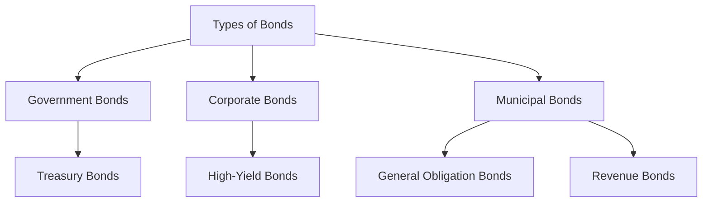

## 4.2 Types of Bonds: Government, Corporate, Municipal

In the world of investing, bonds are a cornerstone of fixed-income securities, providing a stable and predictable income stream. They represent a loan made by an investor to a borrower, typically corporate or governmental. Bonds are crucial for diversifying investment portfolios, offering a balance to the more volatile equity securities. In this section, we will delve into the three primary types of bonds: government, corporate, and municipal. Each type of bond has unique characteristics, benefits, and risks that investors need to understand to make informed decisions.

### Government Bonds

**Government Bonds** are debt securities issued by a national government to support government spending and obligations. They are considered one of the safest investments because they are backed by the full faith and credit of the issuing government. In the United States, these are known as U.S. Treasury securities, which include Treasury bills, notes, and bonds.

#### U.S. Treasury Bonds

U.S. Treasury bonds are long-term debt securities with maturities greater than 10 years. They are a critical tool for the U.S. government to finance its operations and manage the national economy. Treasury bonds are considered virtually risk-free as they are backed by the U.S. government's ability to tax its citizens and print currency.

**Key Features:**
- **Security:** Treasuries are regarded as one of the safest investments globally due to the U.S. government's creditworthiness.
- **Interest Payments:** They pay semi-annual interest, providing a steady income stream.
- **Market Liquidity:** Treasuries are highly liquid, meaning they can be easily bought and sold in the secondary market.

**Role in the Economy:**
Government bonds play a vital role in the economy by influencing interest rates, providing a benchmark for other interest rates, and serving as a tool for monetary policy. They are used to manage inflation and stimulate economic growth.

**Example:**
Consider an investor purchasing a 30-year U.S. Treasury bond with a 3% annual coupon rate. This bond will provide the investor with $30 in interest payments annually for every $1,000 invested, until maturity, when the principal is returned.

### Corporate Bonds

**Corporate Bonds** are issued by companies to raise capital for various purposes, such as expanding operations, funding research and development, or refinancing existing debt. These bonds typically offer higher yields than government bonds due to the increased risk of default.

#### Credit Quality and Yields

Corporate bonds come with varying credit qualities, which are assessed by credit rating agencies like Moody's, Standard & Poor's, and Fitch. These ratings range from high-quality investment-grade bonds to lower-quality high-yield or "junk" bonds.

**Key Features:**
- **Higher Yields:** To compensate for the higher risk, corporate bonds generally offer higher interest rates than government bonds.
- **Credit Risk:** The risk of default varies depending on the issuing company's financial health and market conditions.
- **Variety of Terms:** Corporate bonds can have diverse terms, including fixed or floating interest rates, and varying maturities.

**Example:**
A well-established company like Apple might issue a corporate bond with a 2.5% coupon rate, whereas a smaller, less financially stable company might issue a bond with a 5% coupon rate to attract investors willing to take on more risk.

**High-Yield Bonds (Junk Bonds):**
These are corporate bonds with lower credit ratings, offering higher yields to compensate for the increased risk of default. They are suitable for investors seeking higher returns and willing to accept greater risk.

### Municipal Bonds (Munis)

**Municipal Bonds**, or "munis," are issued by state and local governments or their agencies to finance public projects such as schools, highways, and water systems. They are attractive to investors due to their potential tax-exempt status, meaning the interest earned is often exempt from federal income taxes and, in some cases, state and local taxes as well.

#### Types of Municipal Bonds

1. **General Obligation Bonds (GO Bonds):** These are backed by the full faith and credit of the issuing municipality, with repayment guaranteed by the issuer's taxing power.
2. **Revenue Bonds:** These are supported by revenues from specific projects or sources, such as toll roads or utilities.

**Key Features:**
- **Tax Benefits:** Many municipal bonds offer tax-free interest income, making them appealing to investors in higher tax brackets.
- **Support for Public Projects:** Investing in munis often supports local infrastructure and community projects.
- **Credit Risk:** While generally considered safe, the risk varies based on the financial health of the issuing municipality.

**Example:**
A city might issue a revenue bond to fund a new toll bridge, with the bond's interest payments being made from the tolls collected from bridge users.

### Glossary

- **Treasury Bonds:** Long-term government debt securities with maturities greater than 10 years.
- **High-Yield Bonds (Junk Bonds):** Bonds with lower credit ratings and higher risk of default, offering higher yields.

### Practical Considerations

When choosing bonds for an investment portfolio, it's important to consider factors such as the investor's risk tolerance, the bond's credit rating, yield, and maturity. Diversifying across different types of bonds can help manage risk and optimize returns.

### Visual Representation

Below is a diagram illustrating the relationship between the types of bonds and their characteristics.

### Conclusion

Understanding the different types of bonds—government, corporate, and municipal—is essential for constructing a well-rounded investment portfolio. Each type offers unique benefits and risks, and selecting the right mix depends on an investor's financial goals, risk tolerance, and tax considerations. By incorporating bonds into a diversified portfolio, investors can achieve a balance of income, safety, and growth potential.

## Quiz Time!



### Which type of bond is considered virtually risk-free?

- [x] U.S. Treasury Bonds
- [ ] Corporate Bonds
- [ ] Municipal Bonds
- [ ] High-Yield Bonds

> **Explanation:** U.S. Treasury Bonds are considered virtually risk-free because they are backed by the full faith and credit of the U.S. government.

### What is a key feature of municipal bonds that makes them attractive to certain investors?

- [x] Tax-exempt interest income
- [ ] Higher yields than corporate bonds
- [ ] Backed by the federal government
- [ ] Issued by multinational corporations

> **Explanation:** Municipal bonds often offer tax-exempt interest income, which is attractive to investors in higher tax brackets.

### What type of bond typically offers higher yields due to increased risk?

- [ ] Treasury Bonds
- [x] High-Yield Bonds
- [ ] General Obligation Bonds
- [ ] Revenue Bonds

> **Explanation:** High-Yield Bonds, also known as junk bonds, offer higher yields to compensate for the higher risk of default.

### Which type of municipal bond is backed by the full faith and credit of the issuing municipality?

- [x] General Obligation Bonds
- [ ] Revenue Bonds
- [ ] Treasury Bonds
- [ ] Corporate Bonds

> **Explanation:** General Obligation Bonds are backed by the full faith and credit of the issuing municipality.

### What is a common use of funds raised through corporate bonds?

- [x] Expanding operations
- [ ] Funding local schools
- [ ] Building highways
- [ ] Supporting federal government spending

> **Explanation:** Companies often issue corporate bonds to raise capital for expanding operations, among other purposes.

### What is the primary risk associated with corporate bonds?

- [x] Credit risk
- [ ] Tax risk
- [ ] Liquidity risk
- [ ] Inflation risk

> **Explanation:** Credit risk is the primary concern with corporate bonds, as it involves the possibility of the issuing company defaulting on its payments.

### Which type of bond is often used to finance public infrastructure projects?

- [ ] Corporate Bonds
- [ ] High-Yield Bonds
- [x] Municipal Bonds
- [ ] Treasury Bonds

> **Explanation:** Municipal Bonds are often issued to finance public infrastructure projects like schools and highways.

### What determines the interest payments for revenue bonds?

- [ ] Federal tax rates
- [ ] Corporate profits
- [x] Revenues from specific projects
- [ ] The issuing municipality's credit rating

> **Explanation:** Revenue bonds are supported by revenues from specific projects or sources, such as toll roads or utilities.

### What is a feature of high-yield bonds that attracts investors?

- [x] Higher potential returns
- [ ] Government backing
- [ ] Tax-exempt status
- [ ] Guaranteed principal repayment

> **Explanation:** High-yield bonds offer higher potential returns to compensate for the increased risk of default.

### Municipal bonds are generally considered to be:

- [x] Safe investments
- [ ] High-risk investments
- [ ] Backed by the federal government
- [ ] Issued by private companies

> **Explanation:** Municipal bonds are generally considered safe investments, though their risk can vary based on the issuer's financial health.


