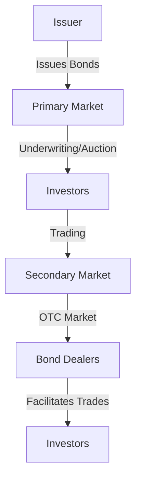

## 4.4 How Bonds Are Issued and Traded

In this section, we delve into the fascinating world of bonds, focusing on how they are issued and traded. Bonds, as debt securities, play a crucial role in the financial markets, providing a mechanism for governments and corporations to raise capital. Understanding the bond issuance process and the dynamics of bond trading is essential for any investor looking to diversify their portfolio with fixed-income securities. Let's explore the key components of this process, from issuance to trading, and how various market participants interact within this ecosystem.

### The Bond Issuance Process

The issuance of bonds is a structured process that varies depending on whether the issuer is a government or a corporation. Each type of issuer employs different methods to bring bonds to market, tailored to their specific needs and regulatory requirements.

#### Government Bond Issuance

Government bonds are typically issued through auctions, which are conducted by the country's treasury or a similar governmental body. In the United States, the Department of the Treasury is responsible for issuing Treasury securities, including bills, notes, and bonds. The auction process is designed to ensure transparency and fairness, allowing a wide range of investors to participate.

**Auction Process:**

1. **Announcement:** The Treasury announces the details of the auction, including the amount of bonds to be issued, the maturity date, and the auction date.

2. **Bidding:** Investors submit bids, which can be either competitive or non-competitive. Competitive bidders specify the yield they are willing to accept, while non-competitive bidders agree to accept the yield determined at auction.

3. **Allocation:** The Treasury allocates bonds starting with the lowest yield bids and moving up until the entire issue is sold. Non-competitive bids are filled at the average yield of the accepted competitive bids.

4. **Settlement:** Successful bidders receive the bonds, and payment is made on the settlement date.

This auction system ensures that government bonds are issued at market-determined yields, reflecting current interest rate conditions and investor demand.

#### Corporate Bond Issuance

Corporate bonds are issued through a process known as underwriting, which involves investment banks or financial institutions acting as intermediaries between the issuer and investors. The underwriting process is more complex than government auctions and involves several key steps:

1. **Preparation:** The issuing corporation works with an investment bank to prepare the bond offering. This includes determining the bond's terms, such as maturity, coupon rate, and amount.

2. **Underwriting Agreement:** The investment bank underwrites the bond issue, meaning it agrees to purchase the entire issue and resell it to investors. This agreement includes details on fees and the purchase price.

3. **Marketing:** The underwriter markets the bonds to potential investors, often through a roadshow where the issuing company presents its financial health and future prospects.

4. **Pricing:** The underwriter sets the initial offering price based on investor interest and market conditions.

5. **Distribution:** The bonds are sold to investors, either directly or through a syndicate of underwriters.

6. **Settlement:** Investors receive their bonds, and the issuer receives the proceeds from the sale.

The underwriting process allows corporations to access capital markets efficiently while providing investors with opportunities to invest in corporate debt.

### Trading Bonds in the Secondary Market

Once bonds are issued, they can be bought and sold in the secondary market. Unlike stocks, which are primarily traded on exchanges, bonds are typically traded over-the-counter (OTC), a decentralized market where transactions occur directly between parties.

#### Role of Bond Dealers

Bond dealers play a crucial role in the OTC market, acting as intermediaries between buyers and sellers. They provide liquidity by quoting bid and ask prices for various bonds, facilitating trades and ensuring that investors can buy or sell bonds as needed.

**Functions of Bond Dealers:**

- **Market Making:** Dealers maintain inventories of bonds and quote prices to buy (bid) and sell (ask) bonds, providing liquidity to the market.
- **Advisory Services:** Dealers offer advice to investors on bond selection, portfolio management, and market trends.
- **Risk Management:** Dealers manage the risks associated with holding bond inventories, including interest rate risk and credit risk.

#### Bond Price Quotation

Bond prices are quoted as a percentage of their face value, typically in increments of 1/32 of a point. For example, a bond quoted at 101-16 is priced at 101.5% of its face value. This pricing convention allows for precise valuation and trading of bonds in the secondary market.

#### Accrued Interest

When bonds are traded, the buyer must pay the seller the bond's price plus any accrued interest. Accrued interest is the interest that has accumulated since the last coupon payment up to, but not including, the settlement date. This ensures that the seller receives compensation for the interest earned during their holding period.

**Example:**

Consider a bond with a face value of $1,000 and a 5% annual coupon rate, paid semi-annually. If the bond is sold halfway through the coupon period, the buyer would pay the seller the bond's price plus $25 in accrued interest (half of the annual coupon payment).

### Diagram: Bond Issuance and Trading Process

To better understand the flow of bond issuance and trading, let's visualize the process with a diagram.

### Best Practices and Common Pitfalls

Investing in bonds can be a rewarding endeavor, but it's essential to be aware of best practices and common pitfalls:

**Best Practices:**

- **Diversification:** Spread investments across different types of bonds (government, corporate, municipal) to reduce risk.
- **Credit Analysis:** Assess the creditworthiness of bond issuers to minimize default risk.
- **Interest Rate Monitoring:** Keep an eye on interest rate trends, as they significantly impact bond prices.

**Common Pitfalls:**

- **Ignoring Credit Risk:** Failing to consider the issuer's credit risk can lead to losses if the issuer defaults.
- **Overlooking Liquidity:** Some bonds may be less liquid, making it difficult to sell them quickly without affecting the price.
- **Misjudging Interest Rate Risk:** Rising interest rates can lead to declining bond prices, affecting the value of your investment.

### Strategies for Successful Bond Investing

To navigate the bond market successfully, consider the following strategies:

- **Laddering:** Build a bond ladder with staggered maturities to manage interest rate risk and provide regular cash flow.
- **Barbell Strategy:** Combine short-term and long-term bonds to balance risk and return.
- **Total Return Approach:** Focus on both income and capital appreciation by actively managing a bond portfolio.

### Regulatory Considerations

In the U.S., bond markets are regulated by the Securities and Exchange Commission (SEC) and the Financial Industry Regulatory Authority (FINRA). These bodies ensure transparency, protect investors, and maintain fair market practices. Familiarizing yourself with relevant regulations can help you navigate the bond market confidently.

### Conclusion

Understanding how bonds are issued and traded is crucial for investors looking to diversify their portfolios with fixed-income securities. By grasping the intricacies of the issuance process, the role of bond dealers, and the dynamics of the OTC market, investors can make informed decisions and optimize their bond investments. As you explore the bond market, remember to consider best practices, be mindful of common pitfalls, and stay informed about regulatory developments.

---

## Quiz Time!



### What is the primary method for issuing government bonds in the United States?

- [x] Auction
- [ ] Underwriting
- [ ] Direct Sale
- [ ] Private Placement

> **Explanation:** Government bonds in the U.S. are primarily issued through auctions conducted by the Department of the Treasury.

### What role do bond dealers play in the secondary market?

- [x] Provide liquidity by quoting bid and ask prices
- [ ] Issue new bonds
- [ ] Set interest rates
- [ ] Regulate the market

> **Explanation:** Bond dealers provide liquidity by quoting bid and ask prices, facilitating trades in the secondary market.

### How are bond prices typically quoted?

- [x] As a percentage of their face value
- [ ] In dollars and cents
- [ ] As a fixed amount
- [ ] In terms of yield

> **Explanation:** Bond prices are quoted as a percentage of their face value, allowing for precise valuation.

### What is accrued interest in bond trading?

- [x] Interest accumulated since the last payment up to the settlement date
- [ ] Interest paid at the end of the bond's term
- [ ] Interest deducted from the bond's price
- [ ] Interest added to the bond's face value

> **Explanation:** Accrued interest is the interest that has accumulated since the last payment up to, but not including, the settlement date.

### Which strategy involves building a bond ladder with staggered maturities?

- [x] Laddering
- [ ] Barbell Strategy
- [ ] Total Return Approach
- [ ] Yield Curve Strategy

> **Explanation:** Laddering involves building a bond ladder with staggered maturities to manage interest rate risk and provide regular cash flow.

### What is one common pitfall in bond investing?

- [x] Ignoring credit risk
- [ ] Diversifying investments
- [ ] Monitoring interest rates
- [ ] Using a bond ladder

> **Explanation:** Ignoring credit risk is a common pitfall, as it can lead to losses if the issuer defaults.

### How are corporate bonds typically issued?

- [x] Through underwriting
- [ ] Through auctions
- [ ] Through direct sales
- [ ] Through private placements

> **Explanation:** Corporate bonds are typically issued through underwriting, where investment banks act as intermediaries.

### What does the barbell strategy in bond investing involve?

- [x] Combining short-term and long-term bonds
- [ ] Building a bond ladder
- [ ] Focusing on total return
- [ ] Investing only in government bonds

> **Explanation:** The barbell strategy involves combining short-term and long-term bonds to balance risk and return.

### What is the role of the SEC in the bond market?

- [x] Regulate and ensure transparency
- [ ] Set interest rates
- [ ] Issue new bonds
- [ ] Provide liquidity

> **Explanation:** The SEC regulates the bond market to ensure transparency and protect investors.

### True or False: Bond trading primarily occurs on exchanges.

- [ ] True
- [x] False

> **Explanation:** Bond trading primarily occurs over-the-counter (OTC), not on exchanges.



By understanding the bond issuance and trading processes, investors can make informed decisions and effectively incorporate bonds into their investment strategies. Remember to consider best practices, be mindful of common pitfalls, and stay informed about regulatory developments to navigate the bond market successfully.
