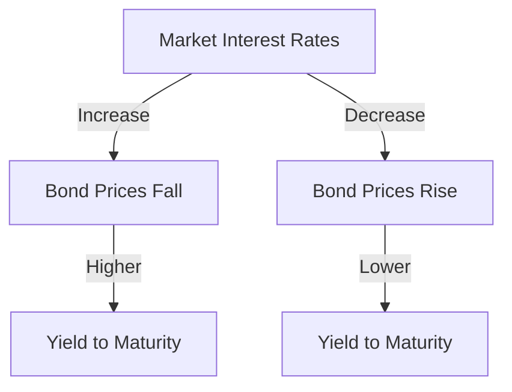

## 4.5 Understanding Yield and Price Relationships

Understanding the relationship between bond yields and prices is crucial for investors navigating the bond market. This section will guide you through the fundamental concepts, including the inverse relationship between bond prices and market interest rates, the calculation and significance of yield to maturity (YTM), and other yield measures like current yield and yield to call. By the end of this section, you will have a comprehensive understanding of how these elements interact and influence investment decisions.

### The Inverse Relationship Between Bond Prices and Market Interest Rates

One of the most critical concepts in bond investing is the inverse relationship between bond prices and market interest rates. When interest rates rise, bond prices fall, and vice versa. Let's explore why this happens.

#### Why Do Bond Prices and Interest Rates Move in Opposite Directions?

When interest rates in the market increase, newly issued bonds offer higher yields to attract investors. Consequently, existing bonds with lower coupon rates become less attractive, leading to a decrease in their market prices. Conversely, when interest rates fall, existing bonds with higher coupon rates become more attractive, causing their prices to rise.

#### Example: The Impact of Interest Rate Changes

Consider a bond with a face value of $1,000 and a fixed coupon rate of 5%. If the prevailing market interest rate rises to 6%, new bonds will be issued at this higher rate, making the existing 5% bond less appealing unless its price falls to a level where its effective yield matches the new market rate.

### Yield to Maturity (YTM): The Total Return of a Bond

Yield to maturity (YTM) is a comprehensive measure that reflects the total return an investor can expect if a bond is held until maturity. It considers the bond's current market price, coupon payments, and the time remaining until maturity.

#### Calculating Yield to Maturity

The formula for calculating YTM is complex, often requiring iterative methods or financial calculators. However, the concept is straightforward: YTM equates the present value of a bond's future cash flows to its current market price.

#### Example: Calculating YTM

Suppose you purchase a bond for $950 with a face value of $1,000, a 5% annual coupon rate, and 10 years to maturity. The YTM calculation would involve determining the discount rate that equates the present value of the bond's cash flows (annual coupon payments and the face value at maturity) to its current price.

### Current Yield: A Snapshot of Income

Current yield provides a quick snapshot of a bond's income relative to its current market price. It is calculated by dividing the bond's annual coupon payment by its current price.

#### Formula for Current Yield

 \text{Current Yield} = \frac{\text{Annual Coupon Payment}}{\text{Current Market Price}} 

#### Example: Calculating Current Yield

For a bond with a $1,000 face value, a 5% coupon rate, and a current market price of $950, the current yield would be:

 \text{Current Yield} = \frac{50}{950} \approx 5.26\% 

### Yield to Call (YTC): Considering Callable Bonds

Yield to call (YTC) is relevant for callable bonds, which can be redeemed by the issuer before maturity at a specified call price. YTC measures the yield assuming the bond is called at the earliest possible date.

#### Calculating Yield to Call

The YTC calculation is similar to YTM but considers the call date and call price instead of the maturity date and face value.

#### Example: Calculating YTC

Imagine a bond with a $1,000 face value, a 5% coupon rate, callable in 5 years at $1,050, and currently priced at $1,020. The YTC calculation would determine the yield if the bond is called in 5 years.

### Visualizing Yield and Price Relationships

To better understand these relationships, let's visualize how bond prices and yields interact using a diagram.

### Practical Implications for Investors

Understanding yield and price relationships helps investors make informed decisions. Here are some practical implications:

- **Interest Rate Risk:** Investors should be aware of interest rate risk, which affects bond prices and yields. Rising rates can lead to capital losses for existing bondholders.
- **Yield Comparison:** Comparing YTM, current yield, and YTC helps investors evaluate potential returns and risks associated with different bonds.
- **Investment Strategy:** Investors may choose bonds based on their yield expectations and interest rate forecasts, balancing income needs with risk tolerance.

### Best Practices and Common Pitfalls

- **Diversification:** Diversifying across different bonds and maturities can mitigate interest rate risk.
- **Monitoring Rates:** Keep an eye on interest rate trends and economic indicators that may signal rate changes.
- **Avoiding Overconcentration:** Avoid overconcentration in long-term bonds if you expect rising interest rates, as they are more sensitive to rate changes.

### Summary

In this section, we've explored the intricate relationships between bond yields and prices, including the inverse relationship with market interest rates, the calculation and significance of YTM, and other yield measures like current yield and YTC. Understanding these concepts is essential for making informed investment decisions in the bond market.

## Quiz Time!



### What happens to bond prices when market interest rates rise?

- [x] Bond prices fall
- [ ] Bond prices rise
- [ ] Bond prices remain unchanged
- [ ] Bond prices double

> **Explanation:** When market interest rates rise, existing bonds with lower coupon rates become less attractive, leading to a decrease in their market prices.

### How is yield to maturity (YTM) best described?

- [x] The total return of a bond if held to maturity
- [ ] The annual interest payment divided by the bond's face value
- [ ] The yield if the bond is called at the earliest possible date
- [ ] The difference between the bond's coupon rate and market interest rate

> **Explanation:** YTM reflects the total return an investor can expect if a bond is held until maturity, considering all future cash flows.

### What is current yield?

- [x] A bond's annual interest payment divided by its current market price
- [ ] The yield of a bond if held to maturity
- [ ] The yield of a bond if called at the earliest possible date
- [ ] The bond's coupon rate

> **Explanation:** Current yield provides a snapshot of a bond's income relative to its current market price.

### What does yield to call (YTC) measure?

- [x] The yield of a bond if called at the earliest possible date
- [ ] The total return of a bond if held to maturity
- [ ] The bond's annual interest payment divided by its current market price
- [ ] The bond's coupon rate

> **Explanation:** YTC measures the yield assuming the bond is called at the earliest possible date, considering the call price.

### Why do bond prices fall when interest rates rise?

- [x] New bonds offer higher yields, making existing bonds less attractive
- [ ] New bonds offer lower yields, making existing bonds more attractive
- [ ] Existing bonds' coupon rates increase
- [ ] Existing bonds' coupon rates decrease

> **Explanation:** When interest rates rise, new bonds are issued with higher yields, making existing bonds with lower yields less appealing, thus reducing their prices.

### Which yield measure considers the bond's call date and call price?

- [x] Yield to Call (YTC)
- [ ] Yield to Maturity (YTM)
- [ ] Current Yield
- [ ] Coupon Rate

> **Explanation:** YTC considers the bond's call date and call price, measuring the yield if the bond is called at the earliest possible date.

### What is the formula for current yield?

- [x] Annual Coupon Payment / Current Market Price
- [ ] Face Value / Current Market Price
- [ ] Current Market Price / Annual Coupon Payment
- [ ] Coupon Rate / Face Value

> **Explanation:** Current yield is calculated by dividing the annual coupon payment by the bond's current market price.

### What risk is associated with changes in interest rates?

- [x] Interest Rate Risk
- [ ] Credit Risk
- [ ] Inflation Risk
- [ ] Liquidity Risk

> **Explanation:** Interest rate risk affects bond prices and yields, as changes in rates can lead to capital gains or losses for bondholders.

### What should investors consider to mitigate interest rate risk?

- [x] Diversification across different bonds and maturities
- [ ] Concentrating investments in long-term bonds
- [ ] Ignoring interest rate trends
- [ ] Only investing in high-yield bonds

> **Explanation:** Diversifying across different bonds and maturities can help mitigate interest rate risk by spreading exposure.

### True or False: Yield to maturity (YTM) considers the bond's current market price, coupon payments, and time to maturity.

- [x] True
- [ ] False

> **Explanation:** YTM considers the bond's current market price, coupon payments, and time remaining until maturity to calculate the total return.


