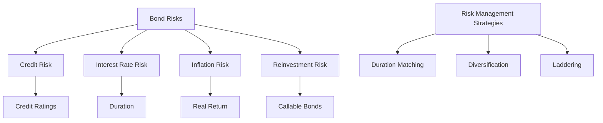

## 4.7 Risks and Returns of Bond Investing

Investing in bonds offers a unique opportunity for steady income and diversification within an investment portfolio. However, like any investment, bonds come with their own set of risks and returns. Understanding these elements is crucial for making informed investment decisions. In this section, we will delve into the various risks associated with bond investing, the potential returns, and strategies to manage these risks effectively.

### Understanding Bond Risks

Bonds, as debt securities, are subject to several types of risks. Let’s explore the primary risks that bond investors face:

#### Credit Risk

**Credit Risk** refers to the possibility that the bond issuer will default on its payment obligations, either by failing to make interest payments or by not repaying the principal at maturity. This risk is more pronounced in corporate bonds compared to government bonds, as corporations are more likely to face financial difficulties. Credit ratings provided by agencies such as Moody’s, Standard & Poor’s, and Fitch help investors assess the creditworthiness of bond issuers.

- **Example:** A corporate bond with a low credit rating (e.g., BB or lower) is considered a high-yield or "junk" bond, indicating a higher risk of default but potentially higher returns.

#### Interest Rate Risk

**Interest Rate Risk** is the risk that changes in interest rates will affect the value of a bond. When interest rates rise, bond prices typically fall, and vice versa. This inverse relationship is due to the fixed interest payments of bonds becoming less attractive when new bonds are issued at higher rates.

- **Example:** If you hold a bond with a 3% coupon rate and interest rates rise to 4%, the market value of your bond will decrease because investors can now buy new bonds with a higher yield.

#### Inflation Risk

**Inflation Risk** is the danger that the purchasing power of the bond’s future cash flows will be eroded by inflation. If inflation rates exceed the bond's yield, the real return on the bond becomes negative.

- **Example:** A bond yielding 2% in an environment where inflation is 3% effectively results in a loss of purchasing power, as the real return is -1%.

#### Reinvestment Risk

**Reinvestment Risk** arises when the proceeds from a bond, such as coupon payments or the principal at maturity, must be reinvested at a lower interest rate than the original bond. This risk is particularly relevant for callable bonds, where the issuer can repay the bond before maturity if interest rates decline.

- **Example:** If a bond is called and you must reinvest the principal at a lower rate, your future income stream will decrease.

### Potential Returns from Bond Investing

Despite the risks, bonds can offer attractive returns, especially for investors seeking steady income and lower volatility compared to stocks.

#### Steady Income

Bonds provide regular interest payments, known as coupon payments, which can be a reliable source of income. This makes bonds particularly appealing for retirees or those seeking predictable cash flows.

- **Example:** A bond with a 5% annual coupon rate will pay $50 per year on a $1,000 face value bond, offering a consistent income stream.

#### Lower Volatility

Bonds generally exhibit lower volatility compared to stocks, making them a stabilizing component in a diversified portfolio. This characteristic can help mitigate the overall risk of an investment portfolio.

- **Example:** During periods of stock market turbulence, bonds often experience less dramatic price swings, providing a cushion against market volatility.

### Strategies to Manage Bond Risks

Effective risk management is essential for successful bond investing. Here are some strategies to consider:

#### Duration Matching

**Duration** is a measure of a bond's sensitivity to interest rate changes. By matching the duration of your bond portfolio to your investment horizon, you can mitigate interest rate risk.

- **Example:** If you plan to use your investment in five years, selecting bonds with a duration of around five years can help protect against interest rate fluctuations.

#### Diversification Across Bond Types

Diversifying your bond investments across different issuers, sectors, and maturities can reduce overall risk. This approach spreads the risk of default and interest rate changes across a broader range of securities.

- **Example:** A diversified bond portfolio might include a mix of government bonds, corporate bonds, and municipal bonds with varying maturities.

#### Laddering

Bond laddering involves purchasing bonds with staggered maturities. As each bond matures, the proceeds can be reinvested in new bonds, potentially at higher interest rates, thus managing reinvestment risk.

- **Example:** A bond ladder might consist of bonds maturing in one, three, five, and seven years, providing regular opportunities to reinvest at prevailing rates.

### Practical Examples and Case Studies

To illustrate these concepts, let's consider a practical example:

**Case Study: Managing a Bond Portfolio**

Imagine an investor, Alex, who is building a bond portfolio with a $100,000 investment. Alex decides to allocate the portfolio as follows:

- **30% in U.S. Treasury Bonds:** These bonds offer low credit risk and serve as a stable foundation for the portfolio.
- **40% in Investment-Grade Corporate Bonds:** These bonds provide higher yields than Treasuries while maintaining moderate credit risk.
- **20% in High-Yield Bonds:** Although riskier, these bonds offer the potential for higher returns.
- **10% in Municipal Bonds:** These bonds offer tax advantages, especially for investors in higher tax brackets.

By diversifying across different bond types, Alex reduces the overall risk of the portfolio while positioning for potential returns.

### Visualizing Bond Risks and Strategies

To further enhance our understanding, let's visualize the relationship between bond risks and strategies to manage them:

### Best Practices and Common Pitfalls

**Best Practices:**

- Regularly review and adjust your bond portfolio to align with changes in interest rates and economic conditions.
- Consider the tax implications of bond investments, particularly municipal bonds, which may offer tax-free income.
- Stay informed about the credit ratings of bonds in your portfolio and be prepared to adjust holdings if the issuer's creditworthiness changes.

**Common Pitfalls:**

- Overconcentration in a single bond issuer or type can increase risk. Diversification is key.
- Ignoring the impact of inflation can lead to eroded purchasing power over time.
- Failing to match bond durations with investment horizons can expose you to unnecessary interest rate risk.

### Conclusion

Investing in bonds offers a balanced approach to achieving steady income and portfolio diversification. By understanding the risks and implementing effective strategies, investors can navigate the bond market with confidence. As with any investment, continuous learning and adaptation to changing market conditions are essential for success.

### References and Further Reading

- "The Bond Book" by Annette Thau
- "Fixed Income Analysis" by Frank J. Fabozzi
- U.S. Securities and Exchange Commission (SEC) website: [www.sec.gov](https://www.sec.gov)
- FINRA Bond Center: [www.finra.org](https://www.finra.org)

---

## Quiz Time!



### Which risk involves the possibility of a bond issuer defaulting on its payment obligations?

- [x] Credit Risk
- [ ] Interest Rate Risk
- [ ] Inflation Risk
- [ ] Reinvestment Risk

> **Explanation:** Credit risk refers to the chance that a bond issuer will fail to make interest payments or repay the principal.

### What happens to bond prices when interest rates rise?

- [x] Bond prices fall
- [ ] Bond prices rise
- [ ] Bond prices remain unchanged
- [ ] Bond prices become volatile

> **Explanation:** There is an inverse relationship between bond prices and interest rates; when rates rise, bond prices fall.

### Which strategy involves purchasing bonds with staggered maturities?

- [x] Laddering
- [ ] Duration Matching
- [ ] Diversification
- [ ] Hedging

> **Explanation:** Laddering is a strategy where bonds are purchased with different maturities to manage reinvestment risk.

### What is the primary benefit of diversifying a bond portfolio?

- [x] Reducing overall risk
- [ ] Increasing yield
- [ ] Maximizing returns
- [ ] Minimizing taxes

> **Explanation:** Diversification spreads risk across different securities, reducing the impact of any single bond's poor performance.

### What is the danger that inflation poses to bond investors?

- [x] Erosion of purchasing power
- [ ] Increase in bond prices
- [ ] Decrease in bond yields
- [ ] Volatility in interest rates

> **Explanation:** Inflation risk involves the erosion of the purchasing power of a bond's future cash flows.

### What measure indicates a bond's sensitivity to interest rate changes?

- [x] Duration
- [ ] Yield
- [ ] Coupon Rate
- [ ] Maturity

> **Explanation:** Duration measures how much a bond's price will change with interest rate fluctuations.

### Which type of bond is more likely to be called when interest rates decline?

- [x] Callable Bonds
- [ ] Zero-Coupon Bonds
- [ ] Municipal Bonds
- [ ] Treasury Bonds

> **Explanation:** Callable bonds can be repaid by the issuer before maturity, often when interest rates fall.

### How can investors protect against interest rate risk?

- [x] Duration Matching
- [ ] Increasing bond allocation
- [ ] Investing in high-yield bonds
- [ ] Holding cash reserves

> **Explanation:** Duration matching aligns bond durations with investment horizons to mitigate interest rate risk.

### What is a common pitfall in bond investing?

- [x] Overconcentration in a single bond issuer
- [ ] Diversifying across bond types
- [ ] Monitoring credit ratings
- [ ] Matching bond durations

> **Explanation:** Overconcentration increases risk by not spreading it across different securities.

### True or False: Bonds generally exhibit higher volatility compared to stocks.

- [ ] True
- [x] False

> **Explanation:** Bonds typically have lower volatility than stocks, making them a stabilizing component in a portfolio.


