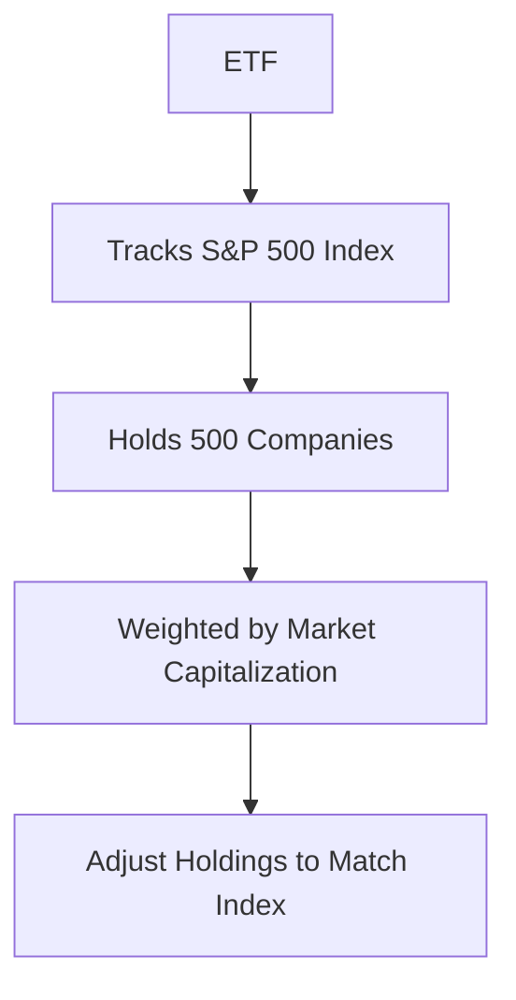

## 6.1 What Are ETFs?

Exchange-Traded Funds (ETFs) have become a cornerstone of modern investing, offering a versatile and efficient way to gain exposure to a wide range of asset classes. In this section, we will delve into what ETFs are, their purpose in the investment landscape, how they are managed, and how they compare to mutual funds. By the end of this guide, you'll have a comprehensive understanding of ETFs and how they can be utilized in building a robust investment portfolio.

### Defining ETFs and Their Purpose

An Exchange-Traded Fund (ETF) is a type of investment fund that is traded on stock exchanges, much like stocks. ETFs are designed to track the performance of a specific index, sector, commodity, or asset class. The primary purpose of ETFs is to provide investors with a diversified, low-cost, and easily accessible investment vehicle that can be traded throughout the day, offering liquidity and flexibility.

**Key Characteristics of ETFs:**

- **Diversification:** ETFs typically hold a basket of securities, allowing investors to gain exposure to a broad range of assets within a single investment.
- **Liquidity:** ETFs are traded on stock exchanges, providing investors with the ability to buy and sell shares throughout the trading day at market prices.
- **Cost-Effectiveness:** ETFs generally have lower expense ratios compared to mutual funds, making them an attractive option for cost-conscious investors.
- **Transparency:** Most ETFs disclose their holdings daily, allowing investors to see exactly what assets they own.

### Comparing ETFs and Mutual Funds

While ETFs and mutual funds share similarities in that they both pool money from multiple investors to buy a diversified portfolio of assets, there are key differences between the two:

**Similarities:**

- **Diversification:** Both ETFs and mutual funds offer diversified exposure to a range of assets, reducing individual security risk.
- **Professional Management:** Both are managed by professional fund managers who make decisions about the fund's investments based on its objectives.

**Differences:**

- **Trading:** ETFs can be bought and sold throughout the trading day on stock exchanges, whereas mutual funds are typically bought and sold at the end of the trading day at the net asset value (NAV).
- **Fees:** ETFs generally have lower expense ratios and no sales loads, whereas mutual funds may have higher fees and sales charges.
- **Minimum Investment:** Mutual funds often require a minimum investment amount, while ETFs can be purchased in single shares, making them more accessible to smaller investors.
- **Tax Efficiency:** ETFs are generally more tax-efficient due to their unique structure, which allows for in-kind redemptions that minimize capital gains distributions.

### How ETFs Are Managed

ETFs are managed by professional fund managers who aim to replicate the performance of a specific index or asset class. This is typically achieved through a passive management strategy, where the fund manager seeks to match the holdings of the index as closely as possible. However, there are also actively managed ETFs where the fund manager actively selects securities to outperform the index.

**Tracking Underlying Indexes or Assets:**

- **Index Funds:** Most ETFs are index funds, meaning they are designed to track a specific index, such as the S&P 500 or the NASDAQ-100. The goal is to mirror the performance of the index by holding the same securities in the same proportions.
- **Sector and Thematic ETFs:** These ETFs focus on specific sectors (e.g., technology, healthcare) or investment themes (e.g., clean energy, cybersecurity) and track indexes that represent these areas.
- **Commodity and Currency ETFs:** Some ETFs track the performance of commodities (e.g., gold, oil) or currencies, providing investors with exposure to these asset classes without the need to directly purchase the underlying assets.

### Practical Example: Understanding ETF Structure

Let's consider an ETF that tracks the S&P 500 index. This ETF would hold shares of all 500 companies in the index, weighted according to their market capitalization. As the market value of these companies changes, the ETF's holdings are adjusted to maintain alignment with the index. This passive management approach ensures that the ETF closely tracks the performance of the S&P 500.

**Mermaid Diagram: ETF Structure**

### Benefits of Investing in ETFs

ETFs offer several benefits that make them an attractive option for investors:

- **Flexibility:** The ability to trade ETFs throughout the day allows investors to react quickly to market changes.
- **Accessibility:** With the option to purchase single shares, ETFs are accessible to investors with varying levels of capital.
- **Diversification:** By holding a basket of securities, ETFs provide instant diversification, reducing the risk associated with individual investments.
- **Cost Savings:** Lower expense ratios and no sales loads contribute to cost savings over time.

### Challenges and Considerations

While ETFs offer many advantages, there are also challenges and considerations to keep in mind:

- **Market Volatility:** Since ETFs are traded on exchanges, their prices can fluctuate throughout the day, potentially leading to volatility.
- **Tracking Error:** The performance of an ETF may not perfectly match its underlying index due to factors such as fees and market conditions.
- **Liquidity Risks:** While most ETFs are highly liquid, some niche or specialized ETFs may have lower trading volumes, leading to wider bid-ask spreads.

### Best Practices for Investing in ETFs

To effectively incorporate ETFs into your investment strategy, consider the following best practices:

- **Research and Selection:** Carefully research and select ETFs that align with your investment goals and risk tolerance.
- **Diversify Across Asset Classes:** Use ETFs to diversify your portfolio across different asset classes, sectors, and geographies.
- **Monitor Performance:** Regularly review the performance of your ETFs to ensure they continue to meet your investment objectives.
- **Consider Tax Implications:** Be mindful of the tax implications of ETF investments, particularly if you are investing in taxable accounts.

### Conclusion

Exchange-Traded Funds (ETFs) are a powerful tool for investors seeking diversification, flexibility, and cost-effectiveness in their investment portfolios. By understanding the structure, benefits, and challenges of ETFs, investors can make informed decisions and leverage these versatile instruments to achieve their financial goals. As you continue your investment journey, consider how ETFs can complement your overall strategy and enhance your portfolio's performance.

## Quiz Time!



### What is the primary purpose of an ETF?

- [x] To provide diversified, low-cost investment exposure
- [ ] To offer high-risk, high-reward opportunities
- [ ] To guarantee fixed returns
- [ ] To eliminate all investment risk

> **Explanation:** ETFs are designed to offer diversified, low-cost investment exposure to various asset classes.

### How do ETFs differ from mutual funds in terms of trading?

- [x] ETFs trade throughout the day on exchanges
- [ ] ETFs are traded only at the end of the day
- [ ] ETFs require a minimum investment
- [ ] ETFs have higher fees than mutual funds

> **Explanation:** ETFs can be bought and sold throughout the trading day on stock exchanges, unlike mutual funds, which are traded at the end of the day.

### What is a common characteristic of ETFs?

- [x] They offer transparency in holdings
- [ ] They guarantee returns
- [ ] They are actively managed
- [ ] They have high expense ratios

> **Explanation:** ETFs typically provide transparency by disclosing their holdings daily.

### What does an ETF that tracks the S&P 500 hold?

- [x] Shares of all 500 companies in the index
- [ ] Only the top 100 companies by market cap
- [ ] A selection of companies chosen by the manager
- [ ] Bonds and commodities

> **Explanation:** An ETF tracking the S&P 500 holds shares of all 500 companies in the index, weighted by market capitalization.

### What is a potential challenge of investing in ETFs?

- [x] Market volatility
- [ ] Guaranteed losses
- [ ] Lack of diversification
- [ ] High management fees

> **Explanation:** Since ETFs are traded on exchanges, their prices can fluctuate throughout the day, leading to potential market volatility.

### Which of the following is a benefit of ETFs?

- [x] Cost-effectiveness
- [ ] Guaranteed returns
- [ ] High liquidity risk
- [ ] Limited diversification

> **Explanation:** ETFs generally have lower expense ratios and no sales loads, making them cost-effective investment options.

### What is a tracking error in the context of ETFs?

- [x] The performance difference between an ETF and its underlying index
- [ ] A mistake in the ETF's holdings
- [ ] A discrepancy in the ETF's trading price
- [ ] An error in the ETF's management fees

> **Explanation:** Tracking error refers to the difference in performance between an ETF and the index it aims to replicate.

### How can investors use ETFs to diversify their portfolios?

- [x] By investing in ETFs across different asset classes
- [ ] By concentrating on a single sector ETF
- [ ] By investing only in commodity ETFs
- [ ] By holding only one ETF

> **Explanation:** Investors can use ETFs to diversify their portfolios by investing in a variety of asset classes, sectors, and geographies.

### What is an index fund?

- [x] A fund designed to track a specified basket of underlying investments
- [ ] A fund that guarantees fixed returns
- [ ] A fund that invests only in bonds
- [ ] A fund that is actively managed

> **Explanation:** An index fund is designed to follow certain preset rules to track a specified basket of underlying investments.

### True or False: ETFs are more tax-efficient than mutual funds due to their structure.

- [x] True
- [ ] False

> **Explanation:** ETFs are generally more tax-efficient because their structure allows for in-kind redemptions, minimizing capital gains distributions.



