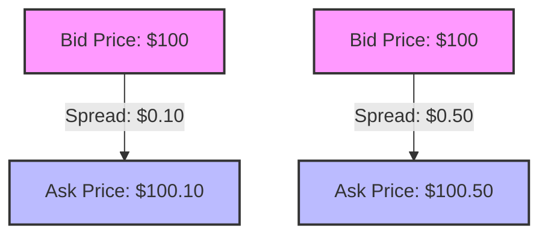

## 6.5 Trading ETFs: Liquidity and Bid-Ask Spread

Exchange-Traded Funds (ETFs) have become a popular investment vehicle due to their flexibility, diversity, and cost-effectiveness. Understanding how ETFs are traded, the factors affecting their liquidity, and the implications of the bid-ask spread is crucial for optimizing your investment strategy. In this section, we will delve into these aspects, providing you with a comprehensive understanding of ETF trading dynamics.

### Trading ETFs: The Basics

ETFs are traded on exchanges throughout the trading day, much like stocks. This intraday trading capability allows investors to buy and sell ETF shares at market prices that fluctuate based on supply and demand. Unlike mutual funds, which are priced at the end of the trading day, ETFs provide real-time pricing, offering investors the flexibility to react to market conditions swiftly.

**Key Points:**
- **Intraday Trading:** ETFs can be traded any time the market is open, providing liquidity and flexibility.
- **Real-Time Pricing:** Prices change throughout the day, reflecting the market's perception of the ETF's underlying assets.

### Factors Affecting ETF Liquidity

Liquidity in the context of ETFs refers to how easily an ETF can be bought or sold in the market without affecting its price. Several factors influence ETF liquidity:

1. **Trading Volume:** Higher trading volumes generally indicate better liquidity. ETFs with higher average daily trading volumes tend to have tighter bid-ask spreads and are easier to trade.

2. **Underlying Asset Liquidity:** The liquidity of an ETF is also influenced by the liquidity of its underlying assets. For example, an ETF that tracks large-cap stocks is likely to be more liquid than one that tracks a niche market or illiquid assets.

3. **Market Maker Activity:** Market makers play a crucial role in ensuring liquidity by providing buy and sell quotes. They help maintain orderly markets by narrowing the bid-ask spread.

4. **ETF Structure and Design:** Some ETFs are inherently more liquid due to their structure, such as those that track broad market indices compared to those focused on specific sectors or themes.

#### Practical Example: Comparing Liquidity

Consider two ETFs: 
- **ETF A**, which tracks the S&P 500, a highly liquid index.
- **ETF B**, which tracks a small-cap technology index with less liquidity.

**ETF A** is likely to have a higher trading volume and a narrower bid-ask spread, making it more cost-effective for frequent trading. **ETF B**, on the other hand, may have wider spreads and less frequent trades, impacting the cost and ease of trading.

### Understanding the Bid-Ask Spread

The bid-ask spread is the difference between the highest price a buyer is willing to pay for an ETF (bid price) and the lowest price a seller is willing to accept (ask price). This spread represents a cost to investors, as buying at the ask price and selling at the bid price results in an immediate loss equal to the spread.

**Glossary:**
- **Bid Price:** The highest price a buyer is willing to pay for a security.
- **Ask Price:** The lowest price a seller is willing to accept for a security.
- **Bid-Ask Spread:** The difference between the bid and ask price.

#### Impact on Trading Costs

The bid-ask spread can significantly impact trading costs, especially for investors who trade frequently or in large volumes. A wider spread increases the cost of entering and exiting positions, while a narrower spread reduces these costs.

**Example:**
- **Narrow Spread:** Bid price is $100, ask price is $100.10, spread is $0.10.
- **Wide Spread:** Bid price is $100, ask price is $100.50, spread is $0.50.

In the first scenario, the cost of trading is minimal, while in the second, the cost is substantially higher, affecting potential returns.

### Strategies to Minimize Trading Costs

To minimize the impact of the bid-ask spread on trading costs, consider the following strategies:

1. **Trade During Market Hours:** Liquidity tends to be higher during regular market hours, leading to tighter spreads. Avoid trading during the first and last minutes of the trading day when spreads can widen.

2. **Use Limit Orders:** Limit orders allow you to set the maximum price you are willing to pay or the minimum price you are willing to accept, helping you avoid unfavorable spreads.

3. **Monitor Trading Volume:** Higher trading volumes often correlate with tighter spreads. Consider trading ETFs with higher average daily volumes.

4. **Evaluate Market Conditions:** During periods of high volatility, spreads can widen. Be mindful of market conditions and adjust your trading strategy accordingly.

5. **Leverage Market Makers:** Some brokers offer direct access to market makers who can provide better pricing, especially for large trades.

### Visualizing the Bid-Ask Spread

To better understand the concept of the bid-ask spread, let's visualize it using a simple diagram:

In this diagram, the spread is visually represented as the gap between the bid and ask prices. The narrower the gap, the more cost-effective the trade.

### Best Practices and Common Pitfalls

**Best Practices:**
- **Stay Informed:** Keep abreast of market conditions and ETF-specific news that may impact liquidity and spreads.
- **Diversify ETF Holdings:** Diversifying across different ETFs can help mitigate risks associated with liquidity and spread variations.

**Common Pitfalls:**
- **Ignoring Spreads:** Failing to consider the bid-ask spread can lead to unexpected costs, especially for frequent traders.
- **Trading Illiquid ETFs:** Investing in ETFs with low liquidity can result in wider spreads and higher trading costs.

### Conclusion

Trading ETFs involves understanding the nuances of liquidity and the bid-ask spread. By being aware of these factors and employing strategies to minimize trading costs, you can enhance your investment returns. As you continue to explore the world of ETFs, remember to consider both the liquidity of the ETF itself and its underlying assets, and always be mindful of the bid-ask spread when executing trades.

To deepen your understanding of ETF trading, consider exploring additional resources such as the SEC's guidelines on ETFs and investment strategies. Engaging with financial news and analysis can also provide valuable insights into market trends and liquidity conditions.

---

## Quiz Time!



### What is one of the main advantages of trading ETFs compared to mutual funds?

- [x] ETFs provide real-time pricing throughout the trading day.
- [ ] ETFs are only priced at the end of the trading day.
- [ ] ETFs have higher management fees than mutual funds.
- [ ] ETFs cannot be traded on exchanges.

> **Explanation:** ETFs are traded throughout the day on exchanges, allowing for real-time pricing, unlike mutual funds which are priced at the end of the trading day.

### Which factor does NOT directly affect the liquidity of an ETF?

- [ ] Trading volume
- [ ] Underlying asset liquidity
- [ ] Market maker activity
- [x] The color of the ETF's logo

> **Explanation:** The color of the ETF's logo does not impact its liquidity. Liquidity is influenced by trading volume, underlying asset liquidity, and market maker activity.

### What is the bid-ask spread?

- [x] The difference between the highest price a buyer is willing to pay and the lowest price a seller is willing to accept.
- [ ] The total number of shares available for trading.
- [ ] The average daily trading volume of an ETF.
- [ ] The annual management fee of an ETF.

> **Explanation:** The bid-ask spread is the difference between the bid price and the ask price, representing a cost to investors.

### How can investors minimize the impact of the bid-ask spread?

- [x] Use limit orders
- [ ] Trade illiquid ETFs
- [ ] Trade during the first minute of the trading day
- [ ] Ignore market conditions

> **Explanation:** Using limit orders allows investors to control the price at which they buy or sell, minimizing the impact of the bid-ask spread.

### What role do market makers play in ETF trading?

- [x] They provide buy and sell quotes to ensure liquidity.
- [ ] They set the management fees for ETFs.
- [ ] They determine the underlying assets of an ETF.
- [ ] They regulate the trading hours of the stock exchange.

> **Explanation:** Market makers provide buy and sell quotes, helping to maintain liquidity and narrow the bid-ask spread.

### Why is it important to consider the liquidity of an ETF's underlying assets?

- [x] It affects the ETF's overall liquidity.
- [ ] It determines the ETF's management fees.
- [ ] It impacts the color of the ETF's logo.
- [ ] It sets the trading hours for the ETF.

> **Explanation:** The liquidity of an ETF's underlying assets affects the ease with which the ETF can be traded, impacting its overall liquidity.

### Which strategy can help reduce trading costs associated with the bid-ask spread?

- [x] Trade during regular market hours
- [ ] Trade during periods of high volatility
- [ ] Use market orders exclusively
- [ ] Avoid monitoring trading volume

> **Explanation:** Trading during regular market hours typically results in tighter spreads, reducing trading costs.

### What is a potential risk of trading illiquid ETFs?

- [x] Wider bid-ask spreads
- [ ] Lower management fees
- [ ] Higher trading volumes
- [ ] More frequent dividend payments

> **Explanation:** Illiquid ETFs often have wider bid-ask spreads, increasing trading costs.

### How does the bid-ask spread impact frequent traders?

- [x] It increases their trading costs.
- [ ] It decreases their trading costs.
- [ ] It has no impact on trading costs.
- [ ] It guarantees a profit on trades.

> **Explanation:** A wider bid-ask spread increases trading costs, which can significantly impact frequent traders.

### True or False: The bid-ask spread is only relevant for large trades.

- [ ] True
- [x] False

> **Explanation:** The bid-ask spread is relevant for all trades, regardless of size, as it represents a cost that affects the profitability of each transaction.


