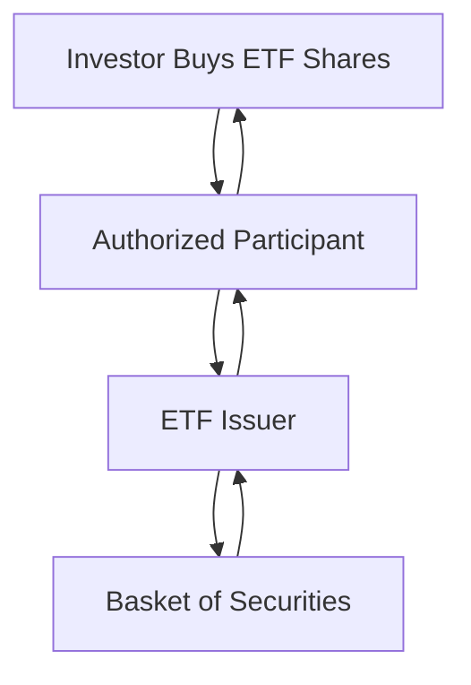

## 6.6 Advantages and Disadvantages of ETFs

Exchange-Traded Funds (ETFs) have become a cornerstone of modern investment strategies, offering a unique blend of flexibility, cost-efficiency, and transparency. However, like any financial instrument, they come with their own set of advantages and disadvantages. In this section, we will explore these aspects in detail, helping you make informed decisions when considering ETFs for your investment portfolio.

### Advantages of ETFs

#### 1. Flexibility in Trading

ETFs are traded on stock exchanges, much like individual stocks. This provides investors with the flexibility to buy and sell shares throughout the trading day at market prices. This intraday trading capability allows for timely responses to market movements, offering opportunities for tactical asset allocation and short-term trading strategies.

**Example:** Suppose you are an investor who wants to quickly capitalize on a sudden market downturn. With ETFs, you can sell your holdings immediately during market hours, unlike mutual funds, which only allow transactions at the end of the trading day.

#### 2. Lower Expense Ratios

ETFs typically have lower expense ratios compared to mutual funds. This is primarily due to their passive management style, where many ETFs aim to replicate the performance of an index rather than actively manage a portfolio. Lower expenses can significantly enhance long-term investment returns by reducing the drag on performance.

**Case Study:** Consider two funds tracking the S&P 500: an ETF with an expense ratio of 0.05% and a mutual fund with an expense ratio of 0.75%. Over a 20-year period, assuming a consistent 7% annual return before expenses, the ETF would result in a higher net return due to its lower costs.

#### 3. Tax Efficiency

ETFs are known for their tax efficiency, largely due to the in-kind creation and redemption process. This mechanism allows ETFs to minimize capital gains distributions, as shares are exchanged for underlying securities rather than sold for cash. This can result in lower tax liabilities for investors.

**Diagram: ETF Creation/Redemption Process**

#### 4. Transparency of Holdings

ETFs provide transparency by regularly disclosing their holdings, often on a daily basis. This allows investors to know exactly what assets they own, aiding in informed decision-making and risk assessment.

**Practical Insight:** For investors focused on ethical investing or specific sector exposure, the transparency of ETF holdings ensures alignment with personal values or investment goals.

### Disadvantages of ETFs

#### 1. Trading Commissions and Spreads

While ETFs offer trading flexibility, each transaction may incur a commission fee. Additionally, the bid-ask spread—the difference between the buying and selling price—can vary, impacting the overall cost of trading.

**Example:** If an investor frequently trades ETFs, the cumulative effect of commissions and spreads can erode returns, especially in a volatile market where spreads might widen.

#### 2. Potential for Price Discrepancies from NAV

ETFs can trade at prices that deviate from their Net Asset Value (NAV), particularly in illiquid markets or during periods of high volatility. This can lead to buying at a premium or selling at a discount, affecting the realized returns.

**Glossary Term:** **Tracking Error** - The difference between the performance of an ETF and its underlying index. A significant tracking error may indicate inefficiencies in the ETF's management or market conditions affecting pricing.

#### 3. Complexity in Leveraged and Inverse ETFs

Leveraged and inverse ETFs are designed to achieve multiples of the performance of an index or to move inversely to the index, respectively. These products are complex and may not perform as expected over long periods due to daily rebalancing and compounding effects.

**Warning:** Leveraged ETFs are generally more suitable for short-term trading rather than long-term investments. Investors should thoroughly understand the mechanics and risks involved.

### Best Practices and Considerations

- **Evaluate Costs:** Consider both the expense ratio and trading costs when selecting an ETF. For long-term holdings, lower expense ratios can significantly enhance returns.
- **Understand the Underlying Index:** Ensure you understand the index an ETF tracks, including its sector, geographic focus, and market capitalization.
- **Monitor Tracking Error:** Regularly check the ETF's performance against its benchmark to assess tracking accuracy.
- **Consider Liquidity:** Choose ETFs with high trading volumes to minimize the impact of bid-ask spreads.

### Educational Resources

For further reading and official guidelines, visit the [Securities and Exchange Commission (SEC) website](https://www.sec.gov) where you can find investor publications on ETFs, including detailed explanations of their structures and regulatory considerations.

### Conclusion

ETFs offer a versatile and cost-effective way to diversify an investment portfolio. By understanding their advantages and disadvantages, investors can better align their choices with their financial goals and risk tolerance. As with any investment, due diligence and ongoing monitoring are essential to maximize the benefits of ETFs while mitigating potential risks.

---

## Quiz Time!



### Which of the following is an advantage of ETFs?

- [x] Flexibility in trading
- [ ] High expense ratios
- [ ] Limited transparency
- [ ] Frequent capital gains distributions

> **Explanation:** ETFs offer flexibility in trading as they can be bought and sold throughout the trading day on stock exchanges.

### What is a common disadvantage of ETFs?

- [ ] Lower expense ratios
- [x] Trading commissions and spreads
- [ ] Tax efficiency
- [ ] Transparency of holdings

> **Explanation:** Trading commissions and spreads can add to the cost of investing in ETFs, especially for frequent traders.

### How do ETFs achieve tax efficiency?

- [x] Through in-kind creation and redemption
- [ ] By actively managing the portfolio
- [ ] By holding cash reserves
- [ ] By trading after market hours

> **Explanation:** ETFs achieve tax efficiency through the in-kind creation and redemption process, which minimizes capital gains distributions.

### What is tracking error?

- [x] The difference between the performance of an ETF and its underlying index
- [ ] The cost of trading ETFs
- [ ] The tax liability of an ETF
- [ ] The transparency of an ETF's holdings

> **Explanation:** Tracking error refers to the deviation in performance between an ETF and the index it aims to replicate.

### Which type of ETF is more suitable for short-term trading?

- [x] Leveraged ETFs
- [ ] Index ETFs
- [ ] Bond ETFs
- [ ] Sector ETFs

> **Explanation:** Leveraged ETFs are designed for short-term trading due to their daily rebalancing and compounding effects.

### What is a potential risk when trading ETFs during volatile markets?

- [x] Price discrepancies from NAV
- [ ] Increased transparency
- [ ] Lower expense ratios
- [ ] Enhanced tax efficiency

> **Explanation:** In volatile markets, ETFs can trade at prices that deviate from their NAV, leading to potential buying at a premium or selling at a discount.

### How often do ETFs typically disclose their holdings?

- [x] Daily
- [ ] Weekly
- [ ] Monthly
- [ ] Annually

> **Explanation:** ETFs usually disclose their holdings on a daily basis, providing transparency to investors.

### What should investors consider when selecting an ETF?

- [x] Expense ratio and trading costs
- [ ] Only the ETF's name
- [ ] The color of the ETF's logo
- [ ] The number of shares available

> **Explanation:** Investors should evaluate both the expense ratio and trading costs to ensure a cost-effective investment.

### What is the primary reason for the lower expense ratios of ETFs?

- [x] Passive management style
- [ ] Frequent trading
- [ ] High marketing costs
- [ ] Active stock selection

> **Explanation:** ETFs often have lower expense ratios due to their passive management style, which aims to replicate an index.

### True or False: ETFs can only be traded at the end of the trading day.

- [ ] True
- [x] False

> **Explanation:** ETFs can be traded throughout the trading day on stock exchanges, unlike mutual funds which are only traded at the end of the day.


