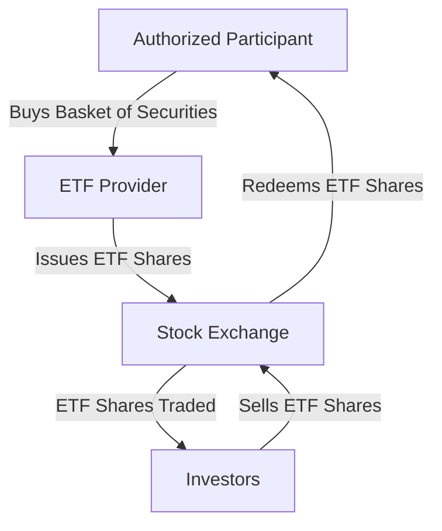

## 6. Exchange-Traded Funds (ETFs)

Exchange-Traded Funds (ETFs) have revolutionized the way individuals and institutions invest in financial markets. By combining the diversified investment approach of mutual funds with the trading flexibility of stocks, ETFs offer a unique and accessible way to build a varied investment portfolio. In this section, we will delve into the intricacies of ETFs, exploring their structure, benefits, and the strategies investors can employ to maximize their potential.

### 6.1 What Are ETFs?

**Exchange-Traded Funds (ETFs)** are investment funds that are traded on stock exchanges much like individual stocks. They hold a collection of assets, such as stocks, bonds, commodities, or a mix of these, and are designed to track the performance of a specific index or sector. This unique structure allows investors to gain exposure to a wide range of assets with a single transaction.

#### Key Features of ETFs:
- **Diversification:** ETFs typically hold a basket of different securities, providing built-in diversification.
- **Liquidity:** ETFs can be bought and sold throughout the trading day at market prices, offering greater liquidity compared to mutual funds.
- **Cost Efficiency:** Generally, ETFs have lower expense ratios than mutual funds, making them a cost-effective investment option.
- **Transparency:** Most ETFs disclose their holdings daily, allowing investors to know exactly what they own.

### 6.2 Types of ETFs

ETFs come in various forms, each designed to meet different investment goals and strategies. Here are some common types:

- **Index ETFs:** These are designed to replicate the performance of a specific index, such as the S&P 500 or the NASDAQ-100.
- **Sector and Industry ETFs:** Focus on specific sectors like technology, healthcare, or energy, allowing investors to target specific areas of the economy.
- **Commodity ETFs:** Provide exposure to commodities like gold, oil, or agricultural products.
- **Bond ETFs:** Invest in fixed-income securities, offering exposure to government, corporate, or municipal bonds.
- **International ETFs:** Allow investors to access foreign markets and diversify their portfolios globally.
- **Inverse and Leveraged ETFs:** Designed for advanced strategies, these ETFs aim to deliver multiples of the performance of an index or inverse performance.

### 6.3 ETF Creation and Redemption Process

Understanding the creation and redemption process of ETFs is crucial to grasping how they function:

- **Creation:** Authorized Participants (APs), typically large financial institutions, create ETF shares by purchasing a basket of underlying securities that the ETF aims to track. These securities are then exchanged for ETF shares, which can be sold on the open market.
- **Redemption:** Conversely, APs can redeem ETF shares by exchanging them for the underlying securities. This process helps maintain the ETF's market price close to its net asset value (NAV).

### 6.4 Comparing ETFs and Mutual Funds

While ETFs and mutual funds share similarities, they differ in several key aspects:

- **Trading Flexibility:** ETFs trade like stocks on exchanges, allowing for intraday trading, while mutual funds are priced and traded at the end of the trading day.
- **Cost Structure:** ETFs generally have lower expense ratios and no sales loads, whereas mutual funds may have higher fees and loads.
- **Tax Efficiency:** ETFs are often more tax-efficient due to their in-kind creation and redemption process, which minimizes capital gains distributions.
- **Transparency:** ETFs provide daily disclosure of holdings, while mutual funds typically disclose holdings quarterly.

### 6.5 Trading ETFs: Liquidity and Bid-Ask Spread

When trading ETFs, two important concepts come into play:

- **Liquidity:** Refers to the ease with which an ETF can be bought or sold without affecting its price. ETFs with higher trading volumes tend to be more liquid.
- **Bid-Ask Spread:** The difference between the highest price a buyer is willing to pay (bid) and the lowest price a seller is willing to accept (ask). A narrower spread indicates better liquidity and lower trading costs.

### 6.6 Advantages and Disadvantages of ETFs

**Advantages:**
- **Diversification:** Access to a broad range of assets with a single investment.
- **Flexibility:** Ability to trade throughout the day and employ various investment strategies.
- **Cost Efficiency:** Lower expense ratios and tax advantages.
- **Transparency:** Clear insight into holdings and performance.

**Disadvantages:**
- **Trading Costs:** While ETFs have lower management fees, trading them involves brokerage commissions.
- **Complexity:** Some ETFs, especially leveraged and inverse ETFs, can be complex and carry higher risks.
- **Market Risk:** Like all investments, ETFs are subject to market fluctuations and risks.

### Practical Example: Building a Diversified Portfolio with ETFs

Imagine an investor, Alex, who wants to build a diversified portfolio with a moderate risk profile. Alex decides to invest in the following ETFs:

- **SPDR S&P 500 ETF Trust (SPY):** Provides exposure to large-cap U.S. stocks.
- **iShares MSCI Emerging Markets ETF (EEM):** Offers access to emerging market equities.
- **Vanguard Total Bond Market ETF (BND):** Invests in a broad spectrum of U.S. bonds.
- **Invesco QQQ Trust (QQQ):** Focuses on technology and innovation-driven companies.

By allocating funds across these ETFs, Alex achieves diversification across different asset classes and geographic regions, balancing risk and potential returns.

### Best Practices for Investing in ETFs

- **Research and Due Diligence:** Understand the ETF's underlying index, holdings, and strategy.
- **Consider Costs:** Evaluate expense ratios, trading commissions, and bid-ask spreads.
- **Diversify:** Use ETFs to achieve diversification across asset classes and regions.
- **Stay Informed:** Keep up with market trends and economic indicators that may affect your investments.

### Common Pitfalls and Challenges

- **Overconcentration:** Avoid investing too heavily in a single sector or region.
- **Ignoring Costs:** Be mindful of trading fees and expense ratios that can erode returns.
- **Complex Products:** Exercise caution with leveraged and inverse ETFs, which may not be suitable for all investors.

### Conclusion

ETFs offer a versatile and efficient way to invest in a wide range of assets, providing both diversification and flexibility. By understanding their structure, benefits, and potential pitfalls, investors can effectively incorporate ETFs into their portfolios to achieve their financial goals.

## Quiz Time!



### What is an ETF?

- [x] An investment fund traded on stock exchanges, holding a collection of assets.
- [ ] A type of bond issued by the government.
- [ ] A savings account with a fixed interest rate.
- [ ] A type of insurance policy.

> **Explanation:** An ETF, or Exchange-Traded Fund, is an investment fund traded on stock exchanges, similar to stocks, and holds a collection of assets like stocks, bonds, or commodities.

### Which of the following is NOT a type of ETF?

- [ ] Index ETF
- [ ] Commodity ETF
- [x] Savings ETF
- [ ] Sector ETF

> **Explanation:** There is no such thing as a "Savings ETF." ETFs are typically categorized as index, commodity, sector, or other types, but not savings.

### What is the primary benefit of ETF liquidity?

- [ ] Higher returns
- [x] Ease of buying and selling
- [ ] Guaranteed profits
- [ ] Reduced risk

> **Explanation:** Liquidity refers to the ease with which an asset can be bought or sold in the market without affecting its price, making ETFs easy to trade.

### How are ETFs generally more tax-efficient than mutual funds?

- [ ] They pay no taxes.
- [ ] They have higher expense ratios.
- [x] They minimize capital gains distributions.
- [ ] They are not subject to market risk.

> **Explanation:** ETFs are often more tax-efficient due to their in-kind creation and redemption process, which minimizes capital gains distributions.

### What is the bid-ask spread?

- [x] The difference between the highest price a buyer is willing to pay and the lowest price a seller will accept.
- [ ] The total value of an ETF's assets.
- [ ] The annual fee charged by an ETF.
- [ ] The price at which an ETF is redeemed.

> **Explanation:** The bid-ask spread is the difference between the highest price a buyer is willing to pay for an asset and the lowest price a seller is willing to accept.

### Which type of ETF would you choose to gain exposure to international markets?

- [ ] Bond ETF
- [ ] Commodity ETF
- [x] International ETF
- [ ] Sector ETF

> **Explanation:** International ETFs are designed to provide exposure to foreign markets, allowing investors to diversify globally.

### What is a key advantage of ETFs over mutual funds?

- [ ] Higher returns
- [x] Intraday trading
- [ ] Guaranteed dividends
- [ ] No market risk

> **Explanation:** A key advantage of ETFs is the ability to trade them throughout the trading day, unlike mutual funds, which are priced at the end of the day.

### What is a potential disadvantage of leveraged ETFs?

- [ ] They are always profitable.
- [ ] They have no fees.
- [x] They can be complex and carry higher risks.
- [ ] They are tax-free.

> **Explanation:** Leveraged ETFs can be complex and carry higher risks due to their strategy of amplifying the performance of an index.

### How does the creation and redemption process help maintain an ETF's market price?

- [x] It keeps the price close to the net asset value (NAV).
- [ ] It guarantees profits for investors.
- [ ] It eliminates trading fees.
- [ ] It increases market volatility.

> **Explanation:** The creation and redemption process helps maintain an ETF's market price close to its net asset value (NAV) by allowing authorized participants to create or redeem shares as needed.

### True or False: ETFs can only be traded at the end of the trading day.

- [ ] True
- [x] False

> **Explanation:** False. ETFs can be traded throughout the trading day on stock exchanges, similar to stocks.



By understanding the intricacies of ETFs, investors can leverage their unique advantages to build a diversified and flexible investment portfolio. Whether you're a beginner or an experienced investor, ETFs offer a valuable tool for achieving your financial objectives.
