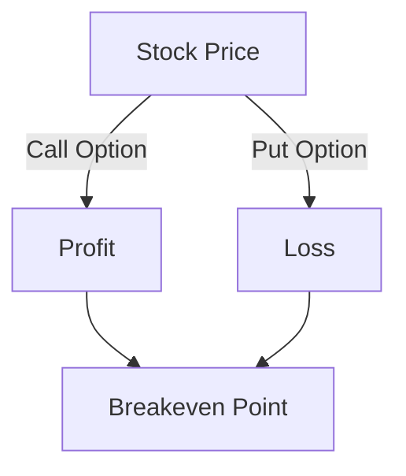
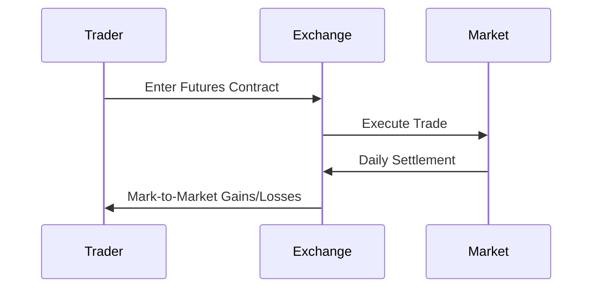

## 7.1 Introduction to Derivatives: Options and Futures

In the vast landscape of financial markets, derivatives play a pivotal role. These complex financial instruments derive their value from underlying assets, such as stocks, bonds, commodities, or market indices. Derivatives are essential tools for investors and traders, offering opportunities for hedging risks, speculating on price movements, and enhancing portfolio performance. In this section, we will delve into the world of derivatives, focusing on two of the most common types: options and futures. We will explore their characteristics, uses, and the strategies involved in trading them.

### Understanding Derivatives

Derivatives are financial contracts whose value is dependent on the performance of an underlying asset. They are used in various ways, including risk management, speculation, and arbitrage. The primary purpose of derivatives is to transfer risk from one party to another, allowing market participants to hedge against adverse price movements or to speculate on future price changes.

#### Key Characteristics of Derivatives

- **Leverage**: Derivatives often require a small initial investment relative to the value of the underlying asset, providing the potential for significant returns.
- **Standardization**: Many derivatives, such as futures, are standardized contracts traded on exchanges, ensuring liquidity and transparency.
- **Flexibility**: Derivatives can be tailored to meet specific needs, allowing for a wide range of strategies and applications.

### Options: A Closer Look

Options are a type of derivative that provide the holder with the right, but not the obligation, to buy or sell an asset at a predetermined price within a specified period. They are versatile instruments used for hedging, income generation, and speculative purposes.

#### Types of Options

1. **Call Options**: A call option gives the holder the right to buy an asset at a specified price, known as the strike price, before the option expires. Investors use call options to speculate on the rise of an asset's price or to hedge against potential price increases.

2. **Put Options**: A put option provides the holder with the right to sell an asset at the strike price before the expiration date. Put options are typically used to speculate on a decline in the asset's price or to hedge against potential losses.

#### How Options Work

Options contracts are characterized by several key components:

- **Strike Price**: The predetermined price at which the holder can buy (call) or sell (put) the underlying asset.
- **Expiration Date**: The date by which the option must be exercised or it becomes worthless.
- **Premium**: The price paid by the buyer to the seller (writer) of the option for the rights conferred by the contract.

##### Example of an Option Trade

Consider an investor who believes that the stock of Company XYZ, currently trading at $50, will rise in the next three months. The investor purchases a call option with a strike price of $55, expiring in three months, for a premium of $2 per share. If the stock price rises above $55, the investor can exercise the option to buy the stock at the lower strike price, potentially profiting from the difference minus the premium paid.

### Futures: A Deeper Dive

Futures contracts are standardized agreements to buy or sell an asset at a predetermined price on a specified future date. Unlike options, futures contracts obligate both parties to fulfill the terms of the contract.

#### Characteristics of Futures Contracts

- **Standardization**: Futures contracts are standardized in terms of quantity, quality, and delivery time, facilitating trading on exchanges.
- **Margin Requirements**: Traders are required to deposit an initial margin, a fraction of the contract's value, to open a position. This margin acts as a performance bond.
- **Mark-to-Market**: Futures positions are marked to market daily, meaning gains and losses are calculated and settled at the end of each trading day.

##### Example of a Futures Trade

Suppose a wheat farmer wants to lock in a price for their upcoming harvest to protect against price fluctuations. The farmer enters into a futures contract to sell 5,000 bushels of wheat at $6 per bushel in three months. If the market price at the time of delivery is lower than $6, the farmer benefits by selling at the higher contracted price, thereby hedging against price risk.

### Derivatives for Hedging and Speculation

Derivatives are powerful tools for both hedging and speculation. Understanding their applications is crucial for effective risk management and investment strategies.

#### Hedging with Derivatives

Hedging involves using derivatives to offset potential losses in an investment portfolio. By taking an opposite position in a derivative contract, investors can mitigate the impact of adverse price movements.

- **Example**: An airline company concerned about rising fuel prices might use futures contracts to lock in current prices, protecting against future increases.

#### Speculation with Derivatives

Speculation involves using derivatives to profit from anticipated price movements without owning the underlying asset. Speculators accept higher risk in pursuit of potentially significant returns.

- **Example**: A trader believes that the price of gold will rise in the next month. They purchase call options on gold futures, aiming to profit from the expected price increase.

### Glossary of Key Terms

- **Call Option**: A financial contract that gives the holder the right to buy an asset at a specified price.
- **Put Option**: A financial contract that gives the holder the right to sell an asset at a specified price.
- **Strike Price**: The price at which the holder of an option can buy or sell the underlying asset.
- **Expiration Date**: The date on which an option contract expires.
- **Premium**: The cost of purchasing an option contract.
- **Margin**: A deposit required to open and maintain a futures position.
- **Mark-to-Market**: The daily settlement of gains and losses in futures trading.

### Practical Applications and Real-World Scenarios

To further illustrate the concepts discussed, let's explore some practical applications and real-world scenarios involving options and futures.

#### Case Study: Hedging with Options

A technology company, TechCo, is planning to launch a new product in six months. The company is concerned about potential increases in the price of a key component, silicon. To hedge against this risk, TechCo purchases call options on silicon futures. By doing so, TechCo secures the right to buy silicon at a predetermined price, protecting against cost increases that could impact profitability.

#### Case Study: Speculating with Futures

An investor, Alex, believes that the price of crude oil will rise due to geopolitical tensions. Alex decides to take a long position in crude oil futures, betting on a price increase. If the market moves in Alex's favor, the futures position will yield a profit. However, if the price falls, Alex faces potential losses, highlighting the speculative nature of futures trading.

### Diagrams and Visual Aids

To enhance understanding, let's incorporate some diagrams to visualize the concepts of options and futures.

#### Options Payoff Diagram

#### Futures Contract Flow

### Best Practices and Common Pitfalls

When trading derivatives, it's essential to follow best practices and be aware of common pitfalls.

#### Best Practices

- **Understand the Product**: Thoroughly understand the characteristics and risks of the derivative product before trading.
- **Risk Management**: Implement robust risk management strategies to protect against significant losses.
- **Stay Informed**: Keep abreast of market developments and factors that could impact the underlying asset.

#### Common Pitfalls

- **Over-Leverage**: Avoid excessive leverage, which can amplify losses and lead to margin calls.
- **Lack of Diversification**: Diversify positions to mitigate risk and avoid overexposure to a single asset.
- **Ignoring Expiration Dates**: Pay attention to expiration dates to avoid unwanted exercise or assignment.

### Conclusion

Derivatives, particularly options and futures, are integral components of modern financial markets. They offer a range of opportunities for hedging, speculation, and risk management. By understanding the mechanics and applications of these instruments, investors can enhance their portfolio strategies and navigate the complexities of the financial landscape. As with any investment, it's crucial to approach derivatives with a solid understanding of the risks and rewards involved.

### Further Reading and Resources

For those interested in exploring derivatives further, consider the following resources:

- **"Options, Futures, and Other Derivatives" by John C. Hull**: A comprehensive guide to the world of derivatives.
- **CME Group**: Offers educational resources and market data on futures and options.
- **The Options Industry Council (OIC)**: Provides educational materials and tools for options trading.

## Quiz Time!



### What is a derivative?

- [x] A financial contract whose value is based on an underlying asset
- [ ] A type of stock that pays dividends
- [ ] A government bond with a fixed interest rate
- [ ] A mutual fund that invests in real estate

> **Explanation:** Derivatives derive their value from the performance of an underlying asset, such as stocks, bonds, or commodities.

### Which of the following is true about call options?

- [x] They give the holder the right to buy an asset at a specified price
- [ ] They obligate the holder to sell an asset at a specified price
- [ ] They are always exercised at expiration
- [ ] They are only used for hedging

> **Explanation:** Call options provide the right, but not the obligation, to buy an asset at a predetermined price.

### What is the primary purpose of futures contracts?

- [x] To obligate the parties to buy or sell an asset at a future date and price
- [ ] To provide a guaranteed return on investment
- [ ] To pay dividends to investors
- [ ] To offer tax advantages

> **Explanation:** Futures contracts obligate both parties to execute the trade at the agreed-upon terms, regardless of market conditions.

### How are options premiums determined?

- [x] By market supply and demand, as well as the underlying asset's volatility
- [ ] By the issuing company based on their financial performance
- [ ] By government regulations
- [ ] By the expiration date alone

> **Explanation:** Options premiums are influenced by market factors, including supply and demand and the volatility of the underlying asset.

### What is a common use of derivatives in financial markets?

- [x] Hedging against price movements
- [ ] Guaranteeing profits
- [ ] Avoiding taxes
- [ ] Eliminating all investment risks

> **Explanation:** Derivatives are commonly used to hedge against adverse price movements, reducing risk exposure.

### Which of the following best describes a put option?

- [x] A financial contract that gives the holder the right to sell an asset at a specified price
- [ ] A contract that obligates the holder to buy an asset
- [ ] A type of insurance policy for stocks
- [ ] A government-issued security

> **Explanation:** A put option provides the right to sell an asset at a predetermined price before expiration.

### What is the role of margin in futures trading?

- [x] It acts as a performance bond to cover potential losses
- [ ] It guarantees a profit to the trader
- [ ] It is a fee paid to the broker for executing trades
- [ ] It is a tax applied to futures contracts

> **Explanation:** Margin is a security deposit required to open and maintain a futures position, ensuring the trader can cover potential losses.

### What does "mark-to-market" mean in futures trading?

- [x] The daily settlement of gains and losses based on market value
- [ ] The process of determining the intrinsic value of an option
- [ ] The calculation of dividends for stockholders
- [ ] The adjustment of interest rates on bonds

> **Explanation:** Mark-to-market involves adjusting the value of a futures position daily to reflect current market prices, settling gains and losses.

### What is a potential risk of over-leveraging in derivatives trading?

- [x] Amplified losses and margin calls
- [ ] Guaranteed profits
- [ ] Reduced trading costs
- [ ] Increased diversification

> **Explanation:** Over-leveraging can lead to significant losses, as small market movements can result in large financial impacts, potentially triggering margin calls.

### True or False: Futures contracts are always settled by physical delivery of the underlying asset.

- [ ] True
- [x] False

> **Explanation:** Many futures contracts are settled in cash rather than physical delivery, based on the price difference at expiration.


