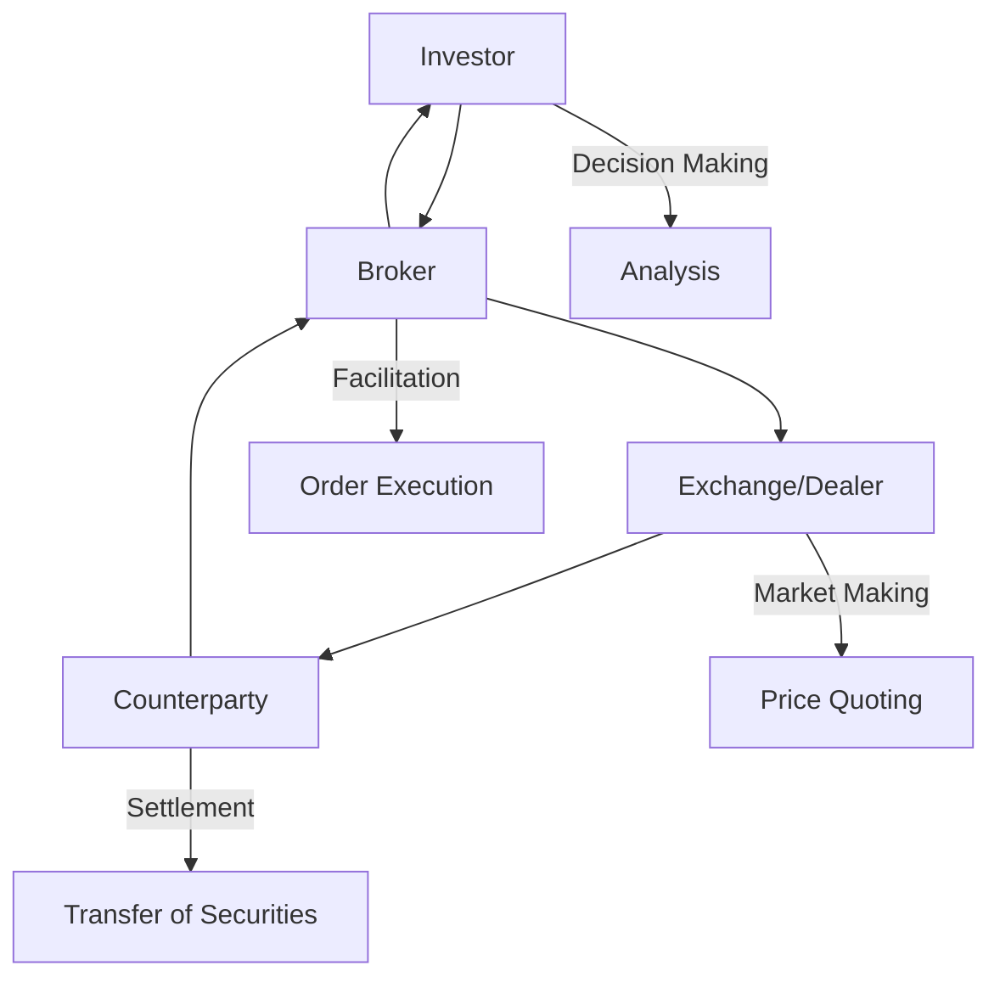

## 8.1 Market Participants: Investors, Brokers, Dealers

In the intricate web of financial markets, various participants play pivotal roles in ensuring the smooth operation and efficiency of these markets. Among the most crucial participants are investors, brokers, and dealers. Each group has distinct functions, responsibilities, and impacts on the financial ecosystem. Understanding their roles is essential for anyone looking to navigate the world of securities and investments.

### Investors: The Driving Force of Financial Markets

Investors are the backbone of financial markets. They can be individuals or institutions, and their primary goal is to buy and sell securities to achieve specific financial objectives. These objectives might include wealth accumulation, income generation, capital preservation, or a combination of these goals.

#### Types of Investors

- **Individual Investors:** These are private individuals who invest their personal funds in securities. They might be saving for retirement, a child's education, or simply looking to grow their wealth. Individual investors often rely on financial advisors or brokers to guide their investment decisions.

- **Institutional Investors:** These are organizations that invest on behalf of others. Examples include pension funds, mutual funds, insurance companies, and hedge funds. Institutional investors typically have significant resources and expertise, allowing them to influence market trends and liquidity.

#### How Investors Contribute to Market Liquidity and Efficiency

Investors are crucial for market liquidity, which refers to the ease with which assets can be bought or sold without affecting their price. A market with high liquidity is characterized by high trading volumes and narrow bid-ask spreads. Investors contribute to liquidity by continuously buying and selling securities, ensuring that there is always a counterparty for a transaction.

Moreover, investors drive market efficiency. According to the Efficient Market Hypothesis (EMH), securities prices reflect all available information. As investors analyze and act on new information, they help adjust prices to reflect that information, thereby contributing to market efficiency.

### Brokers: The Facilitators of Transactions

Brokers serve as intermediaries between buyers and sellers in the financial markets. They execute trades on behalf of their clients, providing access to various securities and investment products.

#### Role and Function of Brokers

- **Execution of Trades:** Brokers facilitate the buying and selling of securities. They ensure that transactions are executed promptly and at the best possible prices.

- **Advisory Services:** Many brokers offer advisory services, helping clients make informed investment decisions. They may provide research reports, market analysis, and personalized investment strategies.

- **Access to Markets:** Brokers provide investors with access to different markets, including stock exchanges, bond markets, and derivatives markets. They enable investors to diversify their portfolios across various asset classes.

#### Types of Brokers

- **Full-Service Brokers:** These brokers offer a wide range of services, including investment advice, portfolio management, and financial planning. They typically charge higher fees for their comprehensive services.

- **Discount Brokers:** These brokers provide fewer services but charge lower fees. They primarily focus on executing trades and may offer limited research and advice.

#### Contribution to Market Liquidity and Efficiency

Brokers enhance market liquidity by facilitating transactions between buyers and sellers. They ensure that there is always a counterparty for a trade, reducing the time and cost involved in executing transactions. Additionally, by providing research and analysis, brokers help disseminate information, contributing to market efficiency.

### Dealers: The Market Makers

Dealers are entities that buy and sell securities for their own accounts. Unlike brokers, who act as intermediaries, dealers take positions in securities and profit from the spread between buying and selling prices.

#### Role and Function of Dealers

- **Market Making:** Dealers provide liquidity by quoting both buy and sell prices for securities. They stand ready to buy or sell securities at these prices, ensuring that there is always a market for the securities.

- **Inventory Management:** Dealers maintain inventories of securities, which allows them to meet the immediate demands of buyers and sellers. They manage these inventories to balance risk and profitability.

- **Price Discovery:** By continuously quoting prices, dealers play a crucial role in the price discovery process. They help determine the fair market value of securities based on supply and demand dynamics.

#### Contribution to Market Liquidity and Efficiency

Dealers are essential for market liquidity as they ensure that there is always a buyer or seller for a security. Their willingness to take positions in securities reduces the time and cost of executing trades. Furthermore, by providing continuous price quotes, dealers contribute to the efficient functioning of markets.

### Interactions Between Investors, Brokers, and Dealers

The interactions between investors, brokers, and dealers are fundamental to the operation of financial markets. Let's explore how these participants collaborate to create a dynamic and efficient marketplace.

#### The Trading Process

1. **Investor Decision-Making:** Investors decide to buy or sell securities based on their financial goals and market analysis. They may use brokers to access the markets and execute their trades.

2. **Broker Facilitation:** Brokers facilitate the transaction by finding a counterparty or routing the order to a dealer or exchange. They ensure that the trade is executed at the best possible price.

3. **Dealer Market Making:** Dealers provide liquidity by quoting buy and sell prices for securities. They stand ready to take the opposite side of a trade, ensuring that the transaction can be completed quickly and efficiently.

4. **Execution and Settlement:** Once the trade is executed, the securities are transferred from the seller to the buyer, and the payment is made. Brokers and dealers ensure that the settlement process is smooth and timely.

#### Diagram: Flow of a Securities Transaction

To better understand the interaction between these participants, let's visualize the flow of a securities transaction:

### Challenges and Best Practices

While investors, brokers, and dealers play essential roles in financial markets, they also face challenges that can impact market efficiency and liquidity.

#### Common Challenges

- **Market Volatility:** Sudden changes in market conditions can lead to increased volatility, affecting liquidity and pricing.

- **Regulatory Compliance:** Participants must adhere to various regulations, which can be complex and costly.

- **Technological Advancements:** Rapid technological changes require participants to continuously update their systems and processes.

#### Best Practices

- **Diversification:** Investors should diversify their portfolios to manage risk and enhance returns.

- **Transparency:** Brokers and dealers should maintain transparency in their operations to build trust with clients and regulators.

- **Continuous Learning:** All participants should stay informed about market trends, regulations, and technological advancements to remain competitive.

### Glossary

- **Broker:** A person or firm that arranges transactions between buyers and sellers.

- **Dealer:** An entity that buys and sells securities for its own account, often acting as a market maker.

- **Liquidity:** The ease with which an asset can be bought or sold in the market without affecting its price.

- **Market Efficiency:** The extent to which asset prices reflect all available information.

### Conclusion

Investors, brokers, and dealers are integral to the functioning of financial markets. They each play distinct roles that contribute to market liquidity and efficiency. By understanding these roles, market participants can make informed decisions and navigate the complexities of the financial markets more effectively.

## Quiz Time!



### Who are considered the backbone of financial markets?

- [x] Investors
- [ ] Brokers
- [ ] Dealers
- [ ] Regulators

> **Explanation:** Investors are the primary participants who buy and sell securities to achieve financial goals, making them the backbone of financial markets.

### What is the primary role of brokers in financial markets?

- [ ] Buying securities for their own accounts
- [x] Facilitating transactions between buyers and sellers
- [ ] Regulating market activities
- [ ] Providing liquidity by quoting prices

> **Explanation:** Brokers act as intermediaries, facilitating transactions between buyers and sellers in financial markets.

### Which type of investor typically has significant resources and expertise?

- [ ] Individual investors
- [x] Institutional investors
- [ ] Retail investors
- [ ] Speculative investors

> **Explanation:** Institutional investors, such as pension funds and mutual funds, have significant resources and expertise, allowing them to influence market trends.

### What is a key function of dealers in financial markets?

- [ ] Providing investment advice
- [x] Market making by quoting buy and sell prices
- [ ] Executing trades for clients
- [ ] Regulating market activities

> **Explanation:** Dealers provide liquidity by quoting buy and sell prices for securities, acting as market makers.

### How do investors contribute to market efficiency?

- [x] By analyzing and acting on new information
- [ ] By maintaining inventories of securities
- [ ] By executing trades on behalf of clients
- [ ] By providing advisory services

> **Explanation:** Investors contribute to market efficiency by analyzing and acting on new information, helping adjust prices to reflect that information.

### What is the primary difference between full-service brokers and discount brokers?

- [x] Full-service brokers offer a wide range of services, while discount brokers focus on executing trades
- [ ] Full-service brokers charge lower fees than discount brokers
- [ ] Full-service brokers only serve institutional clients
- [ ] Discount brokers provide more comprehensive research reports

> **Explanation:** Full-service brokers offer a wide range of services, including investment advice, while discount brokers primarily focus on executing trades at lower fees.

### What is a common challenge faced by market participants?

- [ ] High liquidity
- [x] Market volatility
- [ ] Low regulatory compliance costs
- [ ] Stable technological advancements

> **Explanation:** Market volatility is a common challenge that can affect liquidity and pricing in financial markets.

### How do brokers enhance market liquidity?

- [ ] By taking positions in securities
- [ ] By regulating market activities
- [x] By facilitating transactions between buyers and sellers
- [ ] By quoting prices for securities

> **Explanation:** Brokers enhance market liquidity by facilitating transactions between buyers and sellers, ensuring that there is always a counterparty for a trade.

### What is the role of dealers in the price discovery process?

- [ ] Providing investment advice
- [ ] Executing trades for clients
- [x] Quoting continuous buy and sell prices
- [ ] Regulating market activities

> **Explanation:** Dealers contribute to the price discovery process by quoting continuous buy and sell prices, helping determine the fair market value of securities.

### True or False: Institutional investors typically have less influence on market trends compared to individual investors.

- [ ] True
- [x] False

> **Explanation:** Institutional investors typically have more influence on market trends due to their significant resources and expertise.


