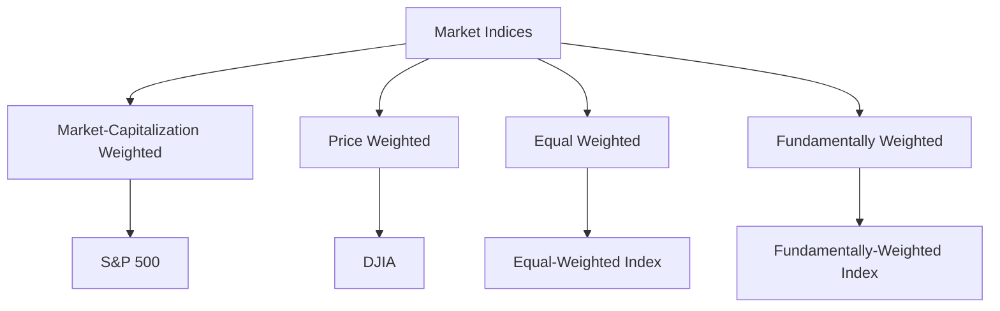

## 8.4 Market Indices and Benchmarks

Market indices and benchmarks are crucial components of the financial landscape, providing investors with essential tools for assessing market performance and making informed investment decisions. In this section, we'll delve into the intricacies of market indices, their construction methodologies, and their role as benchmarks in the investment world.

### Understanding Market Indices

Market indices serve as statistical measures that track the performance of a specific group of securities. These indices are designed to represent the overall market or a particular segment of the market. By analyzing indices, investors can gauge market trends, compare investment performance, and make strategic decisions.

#### Key Market Indices

1. **S&P 500 (Standard & Poor's 500):** This index comprises 500 of the largest publicly traded companies in the United States and is often used as a barometer for the overall U.S. stock market. It is a market-capitalization-weighted index, meaning companies with larger market values have a greater influence on the index's performance.

2. **Dow Jones Industrial Average (DJIA):** The DJIA is one of the oldest and most widely recognized indices, consisting of 30 significant U.S. companies. Unlike the S&P 500, the DJIA is price-weighted, meaning the stocks with higher prices have more influence on the index's movements.

3. **NASDAQ Composite:** This index includes over 3,000 stocks listed on the NASDAQ stock exchange, with a strong emphasis on technology companies. It is also a market-capitalization-weighted index.

4. **Russell 2000:** This index measures the performance of the 2,000 smallest companies in the Russell 3000 Index, providing insights into the performance of small-cap stocks.

5. **FTSE 100:** Based in the United Kingdom, this index includes the 100 largest companies listed on the London Stock Exchange.

### The Role of Indices as Benchmarks

Market indices are not only tools for tracking market performance but also serve as benchmarks for evaluating the performance of investment portfolios. By comparing a portfolio's performance against a relevant index, investors can determine whether their investments are outperforming or underperforming the market.

#### Why Use Benchmarks?

- **Performance Evaluation:** Benchmarks provide a standard against which the performance of an investment portfolio can be measured. This helps investors assess the effectiveness of their investment strategies.

- **Risk Assessment:** By comparing a portfolio to a benchmark, investors can evaluate the risk-adjusted returns and make informed decisions about potential adjustments.

- **Strategic Planning:** Benchmarks help investors set realistic performance goals and develop strategies to achieve them.

### Construction and Weighting Methodologies

The construction and weighting of indices are critical factors that determine their behavior and representation of the market.

#### Construction Methodologies

1. **Market-Capitalization Weighted:** In this approach, each stock's weight in the index is proportional to its market capitalization. Larger companies have a more significant impact on the index's performance. The S&P 500 and NASDAQ Composite are examples of market-capitalization-weighted indices.

2. **Price Weighted:** In a price-weighted index, stocks with higher prices have a greater influence on the index's movements. The DJIA is a classic example of a price-weighted index.

3. **Equal Weighted:** Each stock in an equal-weighted index has the same weight, regardless of its market capitalization or price. This approach gives smaller companies a more significant influence on the index's performance.

4. **Fundamentally Weighted:** This methodology uses fundamental metrics such as earnings, dividends, or book value to determine the weight of each stock in the index.

#### Index Fund: A Glossary Term

An **index fund** is a type of mutual fund or exchange-traded fund (ETF) designed to replicate the performance of a specific index. Index funds follow a passive investment strategy, aiming to match the returns of the underlying index by holding the same securities in the same proportions.

### Practical Examples and Case Studies

To illustrate the application of market indices and benchmarks, let's consider a few practical scenarios:

#### Example 1: Evaluating Portfolio Performance

Imagine an investor with a diversified portfolio of U.S. stocks. To evaluate their portfolio's performance, they compare it to the S&P 500 index. If their portfolio returns 10% while the S&P 500 gains 8%, the investor has outperformed the benchmark, indicating effective investment choices.

#### Example 2: Strategic Asset Allocation

An investor aiming for long-term growth might allocate a portion of their portfolio to an index fund tracking the NASDAQ Composite. By doing so, they gain exposure to technology and growth-oriented companies, aligning with their investment objectives.

#### Example 3: Risk Management

A conservative investor may use the Russell 2000 index as a benchmark to assess the performance of their small-cap stock investments. By analyzing the index's movements, they can make informed decisions about rebalancing their portfolio to manage risk.

### Diagrams and Visual Aids

To enhance understanding, let's visualize the construction and weighting methodologies of indices:

This diagram illustrates the different methodologies used in constructing market indices and provides examples of each type.

### Best Practices and Common Pitfalls

- **Diversification:** While indices provide valuable benchmarks, relying solely on them can lead to overexposure to specific sectors. Diversifying across multiple indices can mitigate this risk.

- **Understanding Methodologies:** Investors should understand the weighting methodologies of indices to interpret their performance accurately.

- **Monitoring Changes:** Indices are periodically rebalanced to reflect changes in the market. Investors should stay informed about these adjustments to ensure their investments align with their goals.

### Conclusion

Market indices and benchmarks are indispensable tools for investors, offering insights into market trends and providing standards for performance evaluation. By understanding their construction, methodologies, and applications, investors can make informed decisions and develop effective investment strategies.

### References and Further Reading

- "A Random Walk Down Wall Street" by Burton G. Malkiel
- "The Little Book of Common Sense Investing" by John C. Bogle
- U.S. Securities and Exchange Commission (SEC) website for regulatory insights

By mastering the concepts of market indices and benchmarks, investors can enhance their financial acumen and navigate the complexities of the investment landscape with confidence.

## Quiz Time!



### What is a market index?

- [x] A statistical measure of market performance
- [ ] A type of mutual fund
- [ ] A government bond
- [ ] A financial statement

> **Explanation:** A market index is a statistical measure that tracks the performance of a specific group of securities, representing the overall market or a particular segment.

### Which index is market-capitalization weighted?

- [x] S&P 500
- [ ] Dow Jones Industrial Average
- [ ] FTSE 100
- [ ] Russell 2000

> **Explanation:** The S&P 500 is a market-capitalization-weighted index, meaning companies with larger market values have a greater influence on the index's performance.

### What does a price-weighted index emphasize?

- [x] Stocks with higher prices
- [ ] Stocks with higher market capitalizations
- [ ] Stocks with higher earnings
- [ ] Stocks with higher dividends

> **Explanation:** In a price-weighted index, stocks with higher prices have a greater influence on the index's movements.

### What is an index fund?

- [x] A mutual fund or ETF designed to track a specific index
- [ ] A type of bond
- [ ] A government regulation
- [ ] A financial statement

> **Explanation:** An index fund is a mutual fund or ETF designed to replicate the performance of a specific index by holding the same securities in the same proportions.

### Which index includes technology companies?

- [x] NASDAQ Composite
- [ ] Dow Jones Industrial Average
- [ ] FTSE 100
- [ ] Russell 2000

> **Explanation:** The NASDAQ Composite includes over 3,000 stocks listed on the NASDAQ stock exchange, with a strong emphasis on technology companies.

### What is the purpose of a benchmark?

- [x] To evaluate investment performance
- [ ] To regulate financial markets
- [ ] To issue government bonds
- [ ] To create financial statements

> **Explanation:** Benchmarks provide a standard against which the performance of an investment portfolio can be measured, helping investors assess the effectiveness of their strategies.

### How is the DJIA weighted?

- [x] Price weighted
- [ ] Market-capitalization weighted
- [ ] Equal weighted
- [ ] Fundamentally weighted

> **Explanation:** The Dow Jones Industrial Average (DJIA) is a price-weighted index, meaning stocks with higher prices have more influence on the index's movements.

### What is a key benefit of using benchmarks?

- [x] Performance evaluation
- [ ] Tax reduction
- [ ] Increased dividends
- [ ] Regulatory compliance

> **Explanation:** Benchmarks provide a standard for evaluating investment performance, helping investors assess whether their portfolios are outperforming or underperforming the market.

### What type of index is the Russell 2000?

- [x] An index of small-cap stocks
- [ ] An index of large-cap stocks
- [ ] An index of technology stocks
- [ ] An index of international stocks

> **Explanation:** The Russell 2000 measures the performance of the 2,000 smallest companies in the Russell 3000 Index, providing insights into the performance of small-cap stocks.

### True or False: An equal-weighted index gives more influence to larger companies.

- [ ] True
- [x] False

> **Explanation:** In an equal-weighted index, each stock has the same weight, regardless of its market capitalization or price, giving smaller companies a more significant influence on the index's performance.


