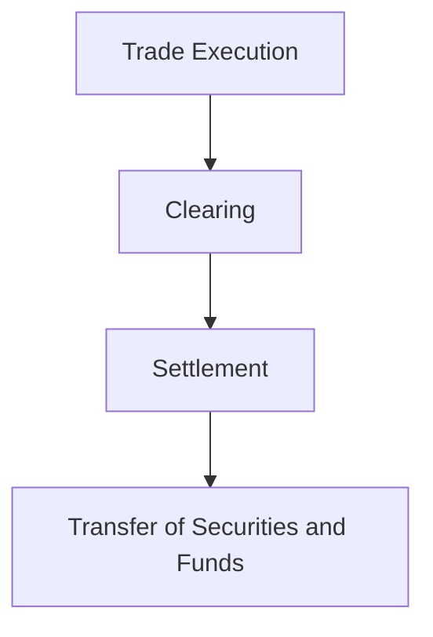

## 8. How Financial Markets Operate

Understanding how financial markets operate is crucial for anyone looking to invest or trade in securities. Financial markets are complex systems that facilitate the buying and selling of financial instruments, such as stocks, bonds, and derivatives. This chapter will provide an in-depth exploration of the mechanisms and processes that ensure these markets function efficiently, the roles of various participants, and how transactions are executed and settled.

### 8.1 Market Participants: Investors, Brokers, Dealers

Financial markets are composed of various participants, each playing a unique role in the functioning of these markets. Let's delve into the key players:

#### Investors

Investors are individuals or institutions that allocate capital with the expectation of receiving financial returns. They can be categorized into retail investors, who are individual investors, and institutional investors, such as mutual funds, pension funds, and insurance companies. Institutional investors typically have more resources and access to sophisticated investment strategies.

#### Brokers

Brokers act as intermediaries between buyers and sellers. They facilitate transactions by executing buy and sell orders on behalf of their clients. Brokers earn a commission or fee for their services. They are crucial in providing access to the markets and offering investment advice. In the U.S., brokers are regulated by the Financial Industry Regulatory Authority (FINRA).

#### Dealers

Dealers are market participants who buy and sell securities for their own accounts. Unlike brokers, dealers take on the risk of holding securities in their inventory. They provide liquidity to the markets by being ready to buy or sell securities at quoted prices. Dealers make a profit through the bid-ask spread—the difference between the price at which they buy and sell securities.

### 8.2 Order Types: Market, Limit, Stop Orders

To execute trades, investors use different types of orders, each serving a specific purpose:

#### Market Orders

A market order is an instruction to buy or sell a security immediately at the best available current price. Market orders prioritize speed of execution over price certainty, making them suitable for highly liquid markets.

#### Limit Orders

A limit order specifies the maximum price an investor is willing to pay when buying or the minimum price they are willing to accept when selling. Limit orders provide price certainty but do not guarantee execution if the market price does not reach the specified limit.

#### Stop Orders

A stop order becomes a market order once a specified price, known as the stop price, is reached. Stop orders are often used to limit losses or protect profits. For example, a stop-loss order can be set to sell a stock if its price falls to a certain level.

### 8.3 Trading Mechanisms: Auction vs. Dealer Markets

Financial markets operate through different trading mechanisms, primarily auction markets and dealer markets:

#### Auction Markets

In auction markets, buyers and sellers submit bids and offers, respectively, and transactions occur when a bid matches an offer. The New York Stock Exchange (NYSE) is a prime example of an auction market. Here, a designated market maker facilitates trading by matching buy and sell orders.

#### Dealer Markets

Dealer markets, such as the NASDAQ, operate through a network of dealers who quote prices at which they are willing to buy or sell securities. Dealers provide liquidity by maintaining inventories of securities and profiting from the bid-ask spread.

### 8.4 Market Indices and Benchmarks

Market indices and benchmarks are essential tools for evaluating the performance of financial markets and individual investments:

#### Market Indices

Market indices represent the performance of a group of securities. They provide a snapshot of market trends and serve as a benchmark for measuring investment performance. Prominent indices include the S&P 500, Dow Jones Industrial Average (DJIA), and NASDAQ Composite.

#### Benchmarks

Benchmarks are standards against which the performance of a security or portfolio is measured. They help investors assess the effectiveness of their investment strategies. For example, a mutual fund's performance might be compared to the S&P 500 to determine its relative success.

### 8.5 Clearing and Settlement Processes

The clearing and settlement processes are critical to ensuring the smooth functioning of financial markets. They involve the confirmation, matching, and finalization of trades:

#### Clearing

Clearing is the process of reconciling purchase and sale transactions to ensure that both parties agree on the terms. A clearinghouse acts as an intermediary, reducing counterparty risk by guaranteeing the completion of trades. In the U.S., the Depository Trust & Clearing Corporation (DTCC) is a major clearinghouse.

#### Settlement

Settlement is the final step in the trade process, where the actual transfer of securities and funds occurs. It typically takes place two business days after the trade date, known as T+2. Efficient settlement processes are vital for maintaining market stability and investor confidence.

### Practical Example: Trading a Stock

Let's consider a practical example to illustrate how these processes work in a real-world scenario:

1. **Investor Decision**: An investor decides to buy 100 shares of Company XYZ.
2. **Order Placement**: The investor places a market order through their broker.
3. **Execution**: The broker executes the order on the NYSE, where a designated market maker matches the buy order with a sell order.
4. **Clearing**: The trade details are sent to a clearinghouse, which ensures both parties agree on the transaction.
5. **Settlement**: Two business days later, the investor's account is debited for the purchase amount, and the shares are credited to their account.

### Best Practices and Common Pitfalls

To navigate financial markets effectively, it's important to adhere to best practices and avoid common pitfalls:

- **Best Practices**:
  - Conduct thorough research before making investment decisions.
  - Diversify your portfolio to manage risk.
  - Use limit orders to control the price at which you buy or sell securities.

- **Common Pitfalls**:
  - Allowing emotions to drive investment decisions.
  - Failing to consider transaction costs, such as commissions and fees.
  - Overtrading, which can erode returns through excessive transaction costs.

### Conclusion

Understanding how financial markets operate empowers investors to make informed decisions and navigate the complexities of trading and investing. By grasping the roles of market participants, the types of orders available, and the trading mechanisms in place, investors can enhance their ability to achieve their financial goals. Additionally, recognizing the importance of clearing and settlement processes ensures a comprehensive understanding of market operations.

As you continue your journey in the world of investing, remember to apply these principles to your own portfolio and stay informed about market developments. Continuous learning and adaptation are key to success in the dynamic landscape of financial markets.

## Quiz Time!



### Who are the intermediaries that execute buy and sell orders on behalf of clients?

- [x] Brokers
- [ ] Dealers
- [ ] Investors
- [ ] Clearinghouses

> **Explanation:** Brokers act as intermediaries between buyers and sellers, executing orders on behalf of their clients.

### What type of order guarantees execution but not the price?

- [x] Market Order
- [ ] Limit Order
- [ ] Stop Order
- [ ] Auction Order

> **Explanation:** A market order guarantees execution at the best available price but does not guarantee the price.

### What is the role of a clearinghouse in financial markets?

- [x] To reduce counterparty risk and facilitate trade settlement
- [ ] To execute trades on behalf of clients
- [ ] To provide investment advice
- [ ] To set market prices

> **Explanation:** A clearinghouse acts as an intermediary to ensure the completion of trades and reduce counterparty risk.

### Which market operates through a network of dealers quoting buy and sell prices?

- [x] Dealer Market
- [ ] Auction Market
- [ ] Primary Market
- [ ] Secondary Market

> **Explanation:** Dealer markets, like NASDAQ, operate through a network of dealers who quote prices for securities.

### What is the primary purpose of market indices?

- [x] To represent the performance of a group of securities
- [ ] To execute trades
- [ ] To provide investment advice
- [ ] To reduce counterparty risk

> **Explanation:** Market indices represent the performance of a group of securities and serve as benchmarks for measuring performance.

### What is the typical settlement period for securities transactions?

- [x] T+2 (two business days after the trade date)
- [ ] T+1 (one business day after the trade date)
- [ ] T+3 (three business days after the trade date)
- [ ] T+0 (same day as the trade date)

> **Explanation:** The typical settlement period for securities transactions is T+2, meaning settlement occurs two business days after the trade date.

### Who provides liquidity by maintaining inventories of securities?

- [x] Dealers
- [ ] Brokers
- [ ] Investors
- [ ] Clearinghouses

> **Explanation:** Dealers provide liquidity by maintaining inventories of securities and profiting from the bid-ask spread.

### What is a stop order used for?

- [x] To limit losses or protect profits
- [ ] To guarantee execution at a specific price
- [ ] To execute immediately at the best available price
- [ ] To represent a group of securities

> **Explanation:** A stop order is used to limit losses or protect profits by becoming a market order once a specified price is reached.

### Which of the following is a common pitfall in investing?

- [x] Overtrading
- [ ] Diversifying your portfolio
- [ ] Using limit orders
- [ ] Conducting thorough research

> **Explanation:** Overtrading can erode returns through excessive transaction costs and is a common pitfall in investing.

### True or False: In an auction market, transactions occur when a bid matches an offer.

- [x] True
- [ ] False

> **Explanation:** In an auction market, transactions occur when a bid price matches an offer price, facilitating trade.


