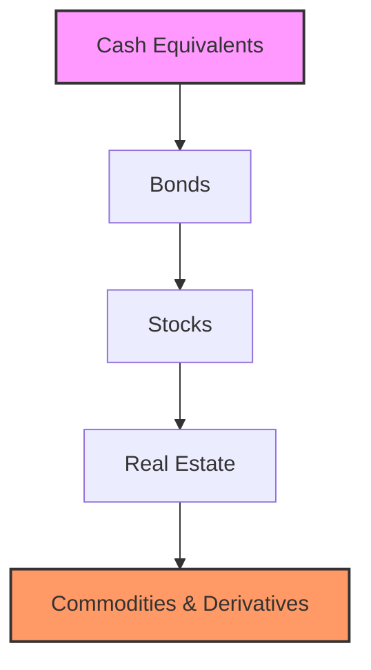

## 9.1 The Concept of Risk and Return

In the world of investing, the concept of risk and return is a cornerstone principle that every investor must understand. This principle dictates that the potential return on an investment is directly related to the amount of risk undertaken. In this section, we'll delve into the intricacies of this relationship, explore various types of risks, and examine how different asset classes fit into the risk-return spectrum.

### Understanding the Trade-Off: Risk vs. Return

At the heart of investing is the trade-off between risk and return. This fundamental concept suggests that to achieve higher returns, an investor must be willing to accept a higher level of risk. Conversely, investments with lower risk typically offer lower potential returns.

#### What Is Risk?

Risk in investing refers to the possibility that the actual return on an investment will be different from the expected return. This could mean losing some or all of the original investment. Risk can arise from various factors, including market fluctuations, economic changes, and specific events affecting individual securities or markets.

#### What Is Return?

Return on Investment (ROI) is a measure used to evaluate the efficiency of an investment. It indicates the profitability of an investment relative to its cost. ROI is typically expressed as a percentage and calculated using the formula:

 \text{ROI} = \left( \frac{\text{Net Profit}}{\text{Cost of Investment}} \right) \times 100 

### Types of Risks in Investing

Understanding the different types of risks is crucial for making informed investment decisions. Here, we explore three primary categories of risk: market risk, credit risk, and liquidity risk.

#### Market Risk

Market risk, also known as systematic risk, is the risk of losses due to factors that affect the overall performance of financial markets. This type of risk is inherent to all investments and cannot be eliminated through diversification. Market risk can be influenced by economic changes, political events, and natural disasters.

**Example:** During the 2008 financial crisis, the stock market experienced significant declines, affecting nearly all sectors and leading to widespread losses for investors.

#### Credit Risk

Credit risk, or default risk, refers to the possibility that a borrower will fail to meet their obligations in accordance with the agreed terms. This type of risk is particularly relevant for bond investors, as it affects the likelihood of receiving interest payments and the return of principal.

**Example:** In 2011, Greece faced a sovereign debt crisis, raising concerns about its ability to meet debt obligations and leading to increased credit risk for investors holding Greek bonds.

#### Liquidity Risk

Liquidity risk is the risk that an investor may not be able to buy or sell an asset quickly without affecting its price. This risk is more pronounced in markets with low trading volumes or in times of financial stress.

**Example:** Real estate investments can be illiquid, meaning it may take time to sell a property at a fair market price, especially during economic downturns.

### The Risk-Return Spectrum

The risk-return spectrum is a visual representation that illustrates the relationship between the level of risk and the potential return for various asset classes. Understanding this spectrum helps investors align their investment choices with their risk tolerance and financial goals.

#### Asset Classes on the Risk-Return Spectrum

1. **Cash and Cash Equivalents:** These are the least risky investments, offering low returns. Examples include savings accounts, money market funds, and Treasury bills.

2. **Bonds:** Bonds generally offer higher returns than cash equivalents but come with increased risk. Government bonds are considered safer than corporate or municipal bonds due to the backing of the issuing government.

3. **Stocks:** Stocks represent ownership in a company and offer the potential for higher returns. However, they also come with higher risk due to market volatility.

4. **Real Estate:** Real estate investments can provide substantial returns through rental income and property appreciation. However, they involve risks such as market fluctuations and illiquidity.

5. **Commodities and Derivatives:** These investments can offer high returns but come with significant risk due to price volatility and leverage.

### Managing Risk in Your Investment Portfolio

Effective risk management is essential for achieving investment success. Here are some strategies to help manage risk:

#### Diversification

Diversification involves spreading investments across various asset classes to reduce exposure to any single asset or risk. By diversifying, investors can mitigate the impact of poor performance in one area with better performance in another.

**Example:** An investor might hold a mix of stocks, bonds, and real estate to achieve a balanced portfolio.

#### Asset Allocation

Asset allocation is the process of determining the optimal distribution of assets within a portfolio based on an investor's risk tolerance, time horizon, and financial goals. It involves deciding what percentage of the portfolio to allocate to each asset class.

**Example:** A conservative investor might allocate 60% to bonds, 30% to stocks, and 10% to cash equivalents.

#### Regular Portfolio Review

Regularly reviewing and rebalancing your portfolio ensures that it remains aligned with your investment objectives. This process involves adjusting the allocation of assets to maintain the desired risk-return profile.

**Example:** If stocks have outperformed and now represent a larger portion of the portfolio than intended, an investor might sell some stocks and reinvest in bonds to restore the original allocation.

### Practical Examples and Case Studies

Let's consider a practical example to illustrate the concept of risk and return:

**Case Study: Investing in Technology Stocks**

An investor decides to allocate 40% of their portfolio to technology stocks, attracted by the potential for high returns. However, they are aware of the high volatility associated with this sector. To balance the risk, they allocate 30% to government bonds and 30% to a diversified mutual fund.

Over the next year, the technology sector experiences significant growth, resulting in a 20% return on the tech stock portion of the portfolio. Meanwhile, the government bonds provide a steady 3% return, and the mutual fund yields 8%.

By diversifying their investments, the investor benefits from the high returns of the tech stocks while mitigating risk through the stability of bonds and the mutual fund.

### Best Practices and Common Pitfalls

- **Best Practices:**
  - Clearly define your investment goals and risk tolerance.
  - Diversify your portfolio to spread risk.
  - Regularly review and adjust your investment strategy.

- **Common Pitfalls:**
  - Failing to diversify, leading to overexposure to a single asset or sector.
  - Ignoring market trends and economic indicators.
  - Making impulsive investment decisions based on short-term market movements.

### Conclusion

Understanding the concept of risk and return is fundamental to making informed investment decisions. By recognizing the trade-offs and managing risks effectively, investors can optimize their portfolios to achieve their financial goals. Remember, while higher returns are attractive, they come with increased risk. It's essential to find a balance that aligns with your risk tolerance and investment objectives.

### Further Reading and Resources

- "The Intelligent Investor" by Benjamin Graham
- "A Random Walk Down Wall Street" by Burton G. Malkiel
- U.S. Securities and Exchange Commission (SEC) website for investor education resources

---

## Quiz Time!



### What is the fundamental trade-off in investing?

- [x] Risk and return
- [ ] Supply and demand
- [ ] Profit and loss
- [ ] Cost and benefit

> **Explanation:** The fundamental trade-off in investing is between risk and return, where higher potential returns are associated with higher levels of risk.

### What type of risk is associated with the overall performance of financial markets?

- [x] Market risk
- [ ] Credit risk
- [ ] Liquidity risk
- [ ] Operational risk

> **Explanation:** Market risk, also known as systematic risk, is associated with the overall performance of financial markets and affects all investments.

### Which asset class is considered the least risky?

- [x] Cash and cash equivalents
- [ ] Stocks
- [ ] Real estate
- [ ] Commodities

> **Explanation:** Cash and cash equivalents are considered the least risky asset class, offering low returns but high liquidity and stability.

### What is the formula for calculating Return on Investment (ROI)?

- [x] ROI = (Net Profit / Cost of Investment) x 100
- [ ] ROI = (Cost of Investment / Net Profit) x 100
- [ ] ROI = (Net Profit + Cost of Investment) x 100
- [ ] ROI = (Net Profit - Cost of Investment) x 100

> **Explanation:** ROI is calculated as (Net Profit / Cost of Investment) x 100, indicating the profitability of an investment relative to its cost.

### What does diversification help to achieve in a portfolio?

- [x] Spread risk across different assets
- [ ] Increase exposure to a single asset
- [ ] Maximize short-term gains
- [ ] Eliminate all risks

> **Explanation:** Diversification helps to spread risk across different assets, reducing the impact of poor performance in any single asset.

### Which type of risk involves the possibility of a borrower failing to meet their obligations?

- [x] Credit risk
- [ ] Market risk
- [ ] Liquidity risk
- [ ] Inflation risk

> **Explanation:** Credit risk, or default risk, involves the possibility that a borrower will fail to meet their obligations, affecting bondholders.

### How can investors manage risk in their portfolios?

- [x] Diversification and asset allocation
- [ ] Concentrating investments in one sector
- [ ] Ignoring market trends
- [ ] Making impulsive decisions

> **Explanation:** Investors can manage risk through diversification and asset allocation, spreading investments across various asset classes.

### What is the purpose of regular portfolio review?

- [x] Ensure alignment with investment objectives
- [ ] Increase exposure to high-risk assets
- [ ] Maximize short-term profits
- [ ] Eliminate all market risks

> **Explanation:** Regular portfolio review ensures that the portfolio remains aligned with investment objectives and the desired risk-return profile.

### What is an example of a high-risk, high-return asset class?

- [x] Commodities and derivatives
- [ ] Cash and cash equivalents
- [ ] Government bonds
- [ ] Savings accounts

> **Explanation:** Commodities and derivatives are considered high-risk, high-return asset classes due to their price volatility and leverage.

### True or False: Higher returns always come with higher risk.

- [x] True
- [ ] False

> **Explanation:** True. In investing, higher potential returns are typically associated with higher levels of risk, reflecting the risk-return trade-off.


