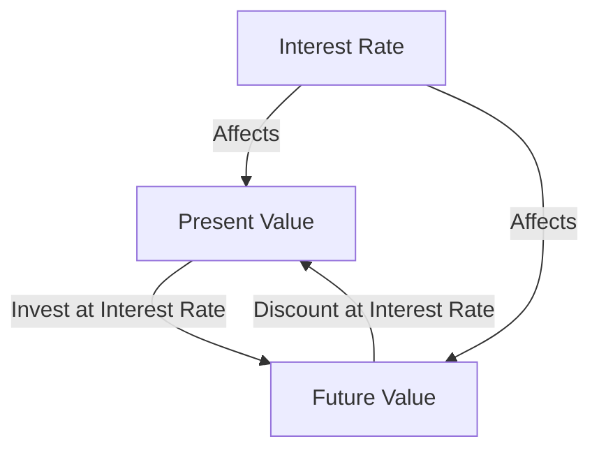

## 9.2 Time Value of Money

The Time Value of Money (TVM) is a fundamental financial principle that asserts money available today is worth more than the same amount in the future due to its potential earning capacity. This core concept underpins many investment decisions, financial calculations, and economic theories. Let's delve into the intricacies of TVM, exploring present and future value, the impact of interest rates, and the power of compounding.

### Understanding the Time Value of Money

At its essence, the Time Value of Money is about opportunity cost. When you have money today, you can invest it to earn returns over time. Conversely, money promised to you in the future cannot be invested until it is received. This delay in investment opportunity means future money is less valuable than money in hand today.

### Present Value and Future Value

To grasp the Time Value of Money, we must understand two key concepts: **Present Value (PV)** and **Future Value (FV)**.

#### Present Value (PV)

Present Value is the current worth of a sum of money that you expect to receive in the future, discounted at a specific interest rate. It answers the question: "How much is a future sum worth in today's dollars?"

The formula for calculating Present Value is:

 PV = \frac{FV}{(1 + r)^n} 

Where:
- \\( PV \\) = Present Value
- \\( FV \\) = Future Value
- \\( r \\) = interest rate (expressed as a decimal)
- \\( n \\) = number of periods until payment or receipt

**Example:**
Suppose you expect to receive $10,000 in 5 years, and the annual interest rate is 5%. The Present Value of this future amount is:

 PV = \frac{10,000}{(1 + 0.05)^5} = \frac{10,000}{1.27628} \approx 7,835.26 

This means $10,000 received in 5 years is worth approximately $7,835.26 today.

#### Future Value (FV)

Future Value is the amount of money that an investment made today will grow to over a period of time at a given interest rate. It answers the question: "What will my investment be worth in the future?"

The formula for calculating Future Value is:

 FV = PV \times (1 + r)^n 

Where:
- \\( FV \\) = Future Value
- \\( PV \\) = Present Value
- \\( r \\) = interest rate (expressed as a decimal)
- \\( n \\) = number of periods

**Example:**
If you invest $7,835.26 today at an annual interest rate of 5%, the Future Value in 5 years is:

 FV = 7,835.26 \times (1 + 0.05)^5 = 7,835.26 \times 1.27628 \approx 10,000 

This shows that $7,835.26 invested today will grow to $10,000 in 5 years at a 5% interest rate.

### The Role of Interest Rates and Compounding

Interest rates are pivotal in determining the Time Value of Money. They represent the cost of borrowing money or the return on investment. Higher interest rates increase the future value of investments and decrease the present value of future cash flows.

#### Simple vs. Compound Interest

- **Simple Interest** is calculated only on the initial principal. The formula is:

   \text{Simple Interest} = P \times r \times n 

  Where:
  - \\( P \\) = principal amount
  - \\( r \\) = interest rate
  - \\( n \\) = number of periods

- **Compound Interest** is calculated on the initial principal and the accumulated interest from previous periods. The formula is:

   A = P \times (1 + \frac{r}{n})^{nt} 

  Where:
  - \\( A \\) = the amount of money accumulated after n years, including interest.
  - \\( P \\) = principal amount
  - \\( r \\) = annual interest rate (decimal)
  - \\( n \\) = number of times that interest is compounded per year
  - \\( t \\) = time in years

**Example:**
Let's compare simple and compound interest for a $1,000 investment at a 5% annual interest rate over 3 years.

- **Simple Interest:**
   \text{Simple Interest} = 1,000 \times 0.05 \times 3 = 150 
  Total Amount = $1,000 + $150 = $1,150

- **Compound Interest (compounded annually):**
   A = 1,000 \times (1 + \frac{0.05}{1})^{1 \times 3} = 1,000 \times 1.157625 = 1,157.63 

The power of compounding results in a higher total amount than simple interest.

#### The Power of Compounding

Compounding magnifies the growth of investments over time. The more frequently interest is compounded, the greater the future value. This is why starting to invest early is crucial, as it allows more time for compounding to work its magic.

**Example of Compounding:**

Consider an investment of $5,000 at an annual interest rate of 6%, compounded quarterly, for 10 years.

 A = 5,000 \times (1 + \frac{0.06}{4})^{4 \times 10} = 5,000 \times (1.015)^40 \approx 9,031.27 

Here, the investment grows to approximately $9,031.27 due to quarterly compounding.

### Practical Applications of the Time Value of Money

Understanding TVM is essential for making informed financial decisions, from evaluating investment opportunities to planning for retirement.

#### Investment Evaluation

When assessing investment opportunities, comparing the present value of expected returns with the initial investment cost helps determine whether an investment is worthwhile.

**Example:**
Suppose you're considering an investment that promises $15,000 in 7 years. If your required rate of return is 8%, calculate the present value to decide if it's a good investment.

 PV = \frac{15,000}{(1 + 0.08)^7} = \frac{15,000}{1.71382} \approx 8,756.57 

If the cost of the investment is less than $8,756.57, it may be a good opportunity.

#### Retirement Planning

TVM is crucial in retirement planning, where individuals need to determine how much to save today to achieve a desired retirement income.

**Example:**
To receive $50,000 annually for 20 years in retirement, starting in 30 years, at an interest rate of 5%, calculate how much you need to save today.

First, calculate the present value of the annuity:

 PV = \frac{50,000 \times (1 - (1 + 0.05)^{-20})}{0.05} \approx 623,110.87 

Next, calculate how much to save today:

 PV = \frac{623,110.87}{(1 + 0.05)^{30}} \approx 144,766.45 

You need to save approximately $144,766.45 today to achieve this retirement goal.

### Visualizing the Time Value of Money

To better understand the Time Value of Money, let's visualize the relationship between present value, future value, and interest rates using a diagram.

This diagram illustrates how present value and future value are interconnected through interest rates, which influence the growth of investments and the discounting of future cash flows.

### Best Practices and Common Pitfalls

**Best Practices:**
- Start investing early to maximize the benefits of compounding.
- Regularly review and adjust your investment portfolio to align with your financial goals.
- Use present value and future value calculations to make informed investment decisions.

**Common Pitfalls:**
- Underestimating the impact of inflation on future cash flows.
- Failing to account for taxes and fees in investment calculations.
- Ignoring the risk associated with achieving expected returns.

### Conclusion

The Time Value of Money is a cornerstone of financial literacy, enabling investors to make informed decisions about the value of money over time. By understanding present and future value, interest rates, and compounding, we can better plan for our financial futures, whether it's evaluating investment opportunities or planning for retirement. Embracing these concepts empowers us to make strategic financial decisions that align with our long-term goals.

---

## Quiz Time!



### What does the Time Value of Money (TVM) principle state?

- [x] Money available today is worth more than the same amount in the future.
- [ ] Money in the future is worth more than money today.
- [ ] Money has the same value regardless of time.
- [ ] Money loses value over time.

> **Explanation:** The Time Value of Money principle states that money available today is worth more than the same amount in the future due to its earning potential.

### How is Present Value (PV) calculated?

- [x] \\( PV = \frac{FV}{(1 + r)^n} \\)
- [ ] \\( PV = FV \times (1 + r)^n \\)
- [ ] \\( PV = FV \div (1 - r)^n \\)
- [ ] \\( PV = FV + r \times n \\)

> **Explanation:** Present Value is calculated using the formula \\( PV = \frac{FV}{(1 + r)^n} \\), which discounts future cash flows to their value today.

### What is the formula for Future Value (FV)?

- [x] \\( FV = PV \times (1 + r)^n \\)
- [ ] \\( FV = \frac{PV}{(1 + r)^n} \\)
- [ ] \\( FV = PV - r \times n \\)
- [ ] \\( FV = PV \div (1 - r)^n \\)

> **Explanation:** Future Value is calculated using the formula \\( FV = PV \times (1 + r)^n \\), which projects the growth of an investment over time.

### What effect does compounding have on investments?

- [x] It increases the future value of investments.
- [ ] It decreases the future value of investments.
- [ ] It has no effect on investments.
- [ ] It only affects the present value.

> **Explanation:** Compounding increases the future value of investments by calculating interest on both the initial principal and accumulated interest.

### What is the difference between simple and compound interest?

- [x] Simple interest is calculated only on the principal, while compound interest is calculated on the principal and accumulated interest.
- [ ] Simple interest is calculated on the principal and accumulated interest, while compound interest is only on the principal.
- [ ] Simple interest and compound interest are the same.
- [ ] Simple interest is higher than compound interest.

> **Explanation:** Simple interest is calculated only on the initial principal, whereas compound interest is calculated on both the principal and accumulated interest.

### Why is it important to start investing early?

- [x] To maximize the benefits of compounding over time.
- [ ] To avoid paying taxes.
- [ ] To ensure higher interest rates.
- [ ] To reduce investment risks.

> **Explanation:** Starting to invest early maximizes the benefits of compounding, allowing investments to grow more significantly over time.

### What does a higher interest rate do to the present value of future cash flows?

- [x] It decreases the present value.
- [ ] It increases the present value.
- [ ] It has no effect.
- [ ] It doubles the present value.

> **Explanation:** A higher interest rate decreases the present value of future cash flows because the discounting effect is stronger.

### How does inflation affect the Time Value of Money?

- [x] It decreases the purchasing power of future money.
- [ ] It increases the purchasing power of future money.
- [ ] It has no effect on the Time Value of Money.
- [ ] It doubles the value of money over time.

> **Explanation:** Inflation decreases the purchasing power of future money, making it important to consider when evaluating the Time Value of Money.

### What is a common pitfall when calculating the Time Value of Money?

- [x] Failing to account for taxes and fees.
- [ ] Overestimating the impact of compounding.
- [ ] Ignoring the principal amount.
- [ ] Using the wrong currency.

> **Explanation:** A common pitfall is failing to account for taxes and fees, which can significantly impact the actual returns on an investment.

### True or False: The Time Value of Money is only relevant for long-term investments.

- [ ] True
- [x] False

> **Explanation:** False. The Time Value of Money is relevant for both short-term and long-term investments as it affects the valuation of cash flows over any period.


