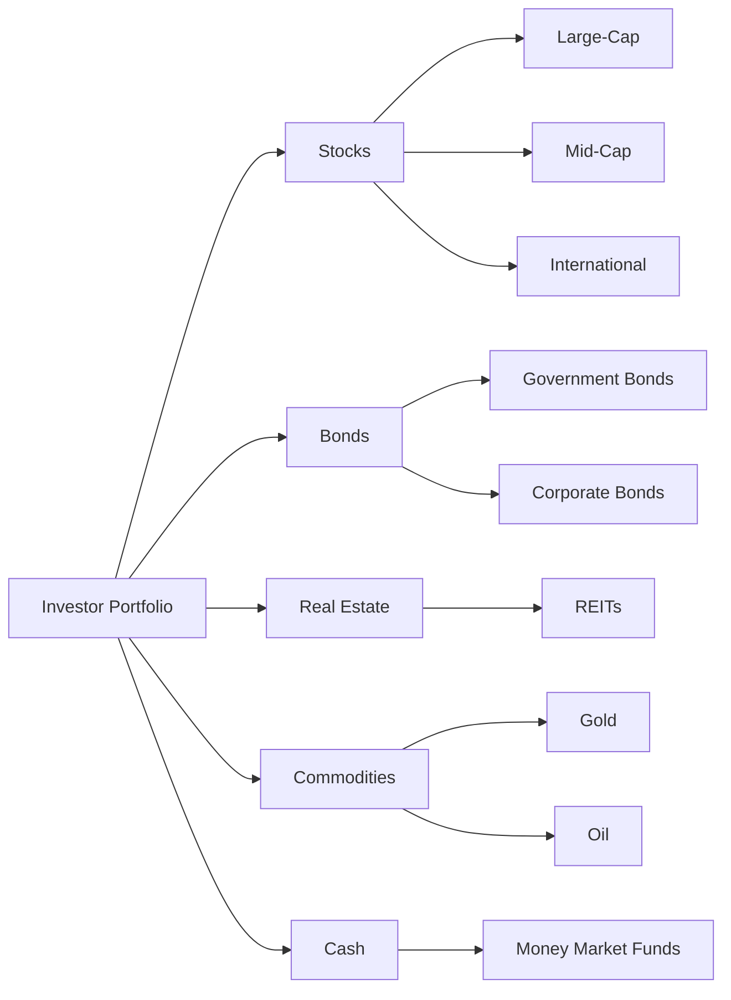

## 9.3 Diversification and Asset Allocation

In the world of investing, two fundamental principles stand out as cornerstones for building a robust and resilient investment portfolio: **diversification** and **asset allocation**. These strategies are crucial for managing risk, optimizing returns, and aligning your investments with your financial goals. In this section, we will delve into these concepts, explore their significance, and provide practical guidance on how to implement them effectively in your investment strategy.

### Understanding Diversification

**Diversification** is the practice of spreading investments across various asset classes, sectors, and geographic regions to reduce exposure to any single asset or risk. The primary objective of diversification is to minimize unsystematic risk, which is the risk associated with a specific company or industry. By holding a diversified portfolio, investors can mitigate the impact of poor performance in any one area, as gains in other areas can offset losses.

#### How Diversification Reduces Unsystematic Risk

Unsystematic risk, also known as specific or idiosyncratic risk, is unique to a particular company or industry. For instance, if you invest all your money in a single company's stock, you are exposed to the risk of that company's poor performance due to factors such as management decisions, product recalls, or regulatory changes. Diversification helps reduce this risk by spreading investments across multiple companies and sectors.

Consider this analogy: Imagine you are a farmer growing only one type of crop. If a pest outbreak affects that crop, your entire harvest is at risk. However, if you diversify and grow multiple types of crops, the impact of the pest on one crop is less detrimental, as the other crops may still thrive. Similarly, in investing, diversification acts as a buffer against the negative effects of unsystematic risk.

### The Role of Asset Allocation

**Asset allocation** refers to the process of dividing investments among different asset categories, such as stocks, bonds, and cash, to achieve a balance between risk and return. This strategy is crucial for aligning your investment portfolio with your risk tolerance, time horizon, and financial goals.

#### Aligning Investments with Risk Tolerance and Goals

Every investor has a unique risk tolerance, which is the degree of variability in investment returns that they are willing to withstand. Asset allocation helps tailor your portfolio to match your risk tolerance by adjusting the proportion of different asset classes. For instance, a conservative investor may allocate a larger portion of their portfolio to bonds, which are generally less volatile than stocks, while an aggressive investor may favor a higher allocation to stocks for potential higher returns.

Moreover, asset allocation considers your financial goals and investment horizon. If you are saving for a short-term goal, such as buying a house in the next few years, you might prefer a more conservative allocation to preserve capital. Conversely, for long-term goals like retirement, a more aggressive allocation could be suitable to capitalize on potential growth over time.

### Crafting a Diversified Portfolio

Creating a diversified portfolio involves selecting a mix of asset classes that complement each other and align with your investment objectives. Let's explore some examples of diversified portfolios:

#### Example 1: Conservative Portfolio

A conservative portfolio prioritizes capital preservation and income generation. It typically includes:

- **60% Bonds:** Government and corporate bonds provide stable income and lower volatility.
- **20% Stocks:** Blue-chip stocks offer potential for growth with relatively lower risk.
- **10% Real Estate:** Real estate investment trusts (REITs) provide income and diversification.
- **10% Cash:** Cash or cash equivalents ensure liquidity and safety.

#### Example 2: Balanced Portfolio

A balanced portfolio seeks a middle ground between growth and income. It may consist of:

- **40% Stocks:** A mix of large-cap and mid-cap stocks for growth potential.
- **40% Bonds:** A blend of government and corporate bonds for income and stability.
- **10% Real Estate:** REITs for additional diversification and income.
- **10% Commodities:** Exposure to commodities like gold for inflation protection.

#### Example 3: Aggressive Portfolio

An aggressive portfolio aims for maximum growth and is suitable for investors with a high risk tolerance. It might include:

- **70% Stocks:** A diverse mix of domestic and international stocks, including small-cap and emerging markets.
- **20% Alternative Investments:** Venture capital, hedge funds, or private equity for high-risk, high-reward potential.
- **10% Bonds:** High-yield bonds for income and diversification.

### Practical Steps for Implementing Diversification and Asset Allocation

1. **Assess Your Risk Tolerance:** Determine your comfort level with risk by considering factors such as your financial situation, investment experience, and emotional response to market fluctuations.

2. **Define Your Financial Goals:** Clearly outline your short-term and long-term financial objectives, such as buying a home, funding education, or retiring comfortably.

3. **Choose an Appropriate Asset Allocation:** Based on your risk tolerance and goals, select an asset allocation strategy that balances risk and return. Consider using online tools or consulting with a financial advisor for guidance.

4. **Select Diversified Investments:** Within each asset class, diversify your holdings by choosing a mix of securities, such as different sectors, industries, and geographic regions.

5. **Regularly Review and Rebalance:** Periodically review your portfolio to ensure it remains aligned with your goals and risk tolerance. Rebalance as needed to maintain your desired asset allocation.

### Visualizing Diversification and Asset Allocation

To better understand the concepts of diversification and asset allocation, let's use a diagram to illustrate a sample diversified portfolio:

In this diagram, we see a diversified portfolio that includes various asset classes and subcategories, demonstrating how diversification and asset allocation work together to optimize risk and return.

### Best Practices and Common Pitfalls

**Best Practices:**

- **Stay Informed:** Keep abreast of market trends and economic indicators that may impact your investments.
- **Diversify Within Asset Classes:** Don't just diversify across asset classes; ensure diversity within each class to further reduce risk.
- **Consider Tax Implications:** Be mindful of tax-efficient investing strategies, such as using tax-advantaged accounts.

**Common Pitfalls:**

- **Over-Diversification:** While diversification is beneficial, too much can dilute potential returns. Aim for a balanced approach.
- **Ignoring Rebalancing:** Failing to rebalance your portfolio can lead to unintended risk exposure.
- **Emotional Decision-Making:** Avoid making impulsive decisions based on market volatility; stick to your long-term strategy.

### Conclusion

Diversification and asset allocation are essential tools for building a resilient investment portfolio. By spreading investments across various asset classes and aligning them with your risk tolerance and financial goals, you can effectively manage risk and enhance the potential for achieving your desired returns. Remember to regularly review and adjust your portfolio to stay on track with your objectives.

---

## Quiz Time!



### What is the primary goal of diversification?

- [x] To reduce unsystematic risk
- [ ] To maximize returns
- [ ] To increase systematic risk
- [ ] To focus on a single asset class

> **Explanation:** Diversification aims to reduce unsystematic risk by spreading investments across different assets.

### How does asset allocation help investors?

- [x] By aligning investments with risk tolerance and goals
- [ ] By ensuring maximum returns at all times
- [ ] By focusing solely on high-risk investments
- [ ] By eliminating all types of risk

> **Explanation:** Asset allocation helps investors align their portfolios with their risk tolerance and financial goals.

### Which of the following is an example of unsystematic risk?

- [x] A company's CEO resigning unexpectedly
- [ ] A global economic recession
- [ ] Changes in interest rates
- [ ] Inflation rates increasing

> **Explanation:** Unsystematic risk is specific to a company or industry, such as a CEO's resignation.

### What is a key benefit of rebalancing a portfolio?

- [x] Maintaining the desired asset allocation
- [ ] Maximizing short-term gains
- [ ] Eliminating all investment risks
- [ ] Increasing exposure to a single asset class

> **Explanation:** Rebalancing helps maintain the desired asset allocation and risk level.

### In a conservative portfolio, which asset class typically has the highest allocation?

- [x] Bonds
- [ ] Stocks
- [ ] Commodities
- [ ] Real Estate

> **Explanation:** Conservative portfolios often allocate a larger portion to bonds for stability and income.

### What is a potential pitfall of over-diversification?

- [x] Diluting potential returns
- [ ] Increasing unsystematic risk
- [ ] Eliminating all risk
- [ ] Focusing on a single asset class

> **Explanation:** Over-diversification can dilute potential returns by spreading investments too thinly.

### Which asset class is typically more volatile?

- [x] Stocks
- [ ] Bonds
- [ ] Cash
- [ ] Real Estate

> **Explanation:** Stocks are generally more volatile compared to bonds and cash.

### What is the purpose of using tax-advantaged accounts in investing?

- [x] To minimize tax liabilities on investment returns
- [ ] To maximize short-term gains
- [ ] To increase exposure to high-risk assets
- [ ] To eliminate all investment risks

> **Explanation:** Tax-advantaged accounts help minimize tax liabilities on investment returns.

### Why should investors diversify within asset classes?

- [x] To further reduce risk
- [ ] To focus solely on high-risk investments
- [ ] To maximize returns in one sector
- [ ] To eliminate all types of risk

> **Explanation:** Diversifying within asset classes further reduces risk by spreading investments across different sectors and industries.

### True or False: Asset allocation is a one-time decision and does not require regular review.

- [ ] True
- [x] False

> **Explanation:** Asset allocation requires regular review and adjustment to remain aligned with financial goals and risk tolerance.


