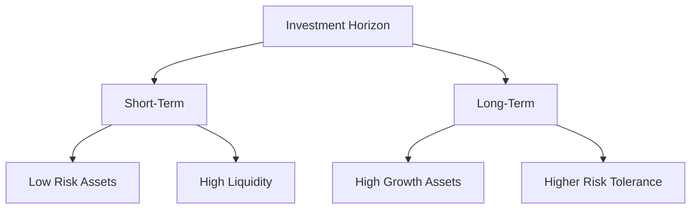

## 9.5 Understanding Investment Horizons

Investing is not just about choosing the right assets, but also about understanding the timeframe over which you expect to achieve your financial goals. This timeframe is known as your **investment horizon**, and it plays a crucial role in determining your investment strategy, risk tolerance, and asset selection. In this section, we'll explore the concept of investment horizons in depth, differentiating between short-term and long-term horizons, and discussing strategies tailored to each.

### Differentiating Between Short-Term and Long-Term Investment Horizons

**Investment Horizon** is the period over which an investor expects to hold an investment before taking the money out. It can range from a few months to several decades, depending on the investor's goals.

#### Short-Term Investment Horizons

A **short-term investment horizon** typically refers to a timeframe of one year or less. Investors with short-term horizons often prioritize liquidity and capital preservation, as they may need to access their funds quickly. Examples of short-term investment goals include saving for a vacation, a wedding, or a down payment on a car.

**Characteristics of Short-Term Investments:**

- **Liquidity:** The ability to quickly convert investments into cash without significant loss of value is crucial.
- **Lower Risk:** Short-term investments usually involve lower risk to protect the principal amount.
- **Examples:** Savings accounts, money market funds, short-term bonds, and Treasury bills.

#### Long-Term Investment Horizons

A **long-term investment horizon** typically spans several years, often five years or more. Investors with long-term horizons can afford to take on more risk, as they have time to ride out market fluctuations. This horizon is suitable for goals such as retirement savings, funding a child's education, or building wealth over time.

**Characteristics of Long-Term Investments:**

- **Growth Potential:** Long-term investments focus on growth and capital appreciation.
- **Higher Risk Tolerance:** Investors can withstand short-term volatility for potentially higher returns.
- **Examples:** Stocks, real estate, mutual funds, and ETFs.

### How Time Horizons Affect Risk Tolerance and Asset Selection

The length of your investment horizon directly influences your **risk tolerance**—the degree of variability in investment returns that you are willing to withstand. Generally, the longer your investment horizon, the higher your risk tolerance, as you have more time to recover from potential losses.

#### Risk Tolerance and Time Horizons

- **Short-Term Horizon:** Investors tend to have a low risk tolerance, favoring stable and liquid assets.
- **Long-Term Horizon:** Investors are typically more comfortable with higher risk, seeking assets with greater growth potential.

#### Asset Selection Based on Time Horizons

Selecting the right assets for your investment horizon involves balancing risk and return. Here's how different time horizons impact asset selection:

- **Short-Term Assets:** Include cash equivalents, short-term bonds, and money market funds. These assets offer stability and liquidity, making them ideal for short-term goals.
- **Long-Term Assets:** Include stocks, real estate, and long-term bonds. These assets may be more volatile in the short term but offer higher growth potential over time.

### Strategies for Different Investment Horizons

Choosing the right strategy for your investment horizon involves considering factors such as liquidity needs, volatility, and your financial goals.

#### Strategies for Short-Term Investment Horizons

1. **Prioritize Liquidity:** Ensure that your investments can be easily converted to cash without significant loss.
2. **Focus on Capital Preservation:** Choose low-risk investments to protect your principal.
3. **Minimize Volatility:** Avoid highly volatile assets that could lead to losses in the short term.

#### Strategies for Long-Term Investment Horizons

1. **Embrace Volatility:** Use market fluctuations to your advantage, buying assets at lower prices.
2. **Diversify Your Portfolio:** Spread investments across various asset classes to reduce risk.
3. **Invest in Growth Assets:** Focus on stocks and other high-growth investments to maximize returns over time.

### Practical Examples and Case Studies

Let's explore some practical examples to illustrate how investment horizons impact financial decisions.

#### Case Study 1: Short-Term Investment for a Home Down Payment

**Scenario:** Alex plans to buy a house in two years and needs to save for a down payment.

- **Investment Horizon:** 2 years (short-term)
- **Strategy:** Alex opts for a high-yield savings account and short-term bonds to ensure liquidity and capital preservation.

#### Case Study 2: Long-Term Investment for Retirement

**Scenario:** Jamie is 30 years old and wants to save for retirement at age 65.

- **Investment Horizon:** 35 years (long-term)
- **Strategy:** Jamie invests in a diversified portfolio of stocks and bonds, focusing on growth and reinvesting dividends to maximize returns over time.

### Diagrams and Visual Aids

To further enhance your understanding, let's visualize how investment horizons influence asset allocation.

### Best Practices and Common Pitfalls

**Best Practices:**

- **Align Investments with Goals:** Ensure your investment strategy matches your financial objectives and time horizon.
- **Regularly Review Your Portfolio:** Adjust your asset allocation as your goals and time horizon change.
- **Stay Informed:** Keep up with market trends and economic indicators that may impact your investments.

**Common Pitfalls:**

- **Ignoring Time Horizon:** Failing to consider your investment horizon can lead to inappropriate risk levels.
- **Overreacting to Market Volatility:** Short-term market fluctuations should not dictate long-term investment decisions.

### Encouraging Continuous Learning

Understanding investment horizons is a foundational aspect of financial planning. By aligning your investments with your time horizon, you can optimize your portfolio for both risk and return. We encourage you to continue exploring investment strategies and financial planning tools to enhance your knowledge and achieve your financial goals.

### Summary

Investment horizons are a critical component of any investment strategy. By differentiating between short-term and long-term horizons, understanding how they affect risk tolerance and asset selection, and implementing appropriate strategies, you can make informed decisions that align with your financial goals. Remember to regularly review and adjust your portfolio as your goals and circumstances evolve.

---

## Quiz Time!



### What is a short-term investment horizon?

- [x] An investment held for one year or less
- [ ] An investment held for five years or more
- [ ] An investment held for ten years or more
- [ ] An investment held for three years or less

> **Explanation:** A short-term investment horizon generally refers to an investment held for one year or less.

### Which of the following is a characteristic of long-term investments?

- [x] Higher growth potential
- [ ] High liquidity
- [ ] Low risk
- [ ] Short time frame

> **Explanation:** Long-term investments focus on higher growth potential, often at the expense of higher risk and lower liquidity.

### How does a long-term investment horizon affect risk tolerance?

- [x] Increases risk tolerance
- [ ] Decreases risk tolerance
- [ ] Has no effect on risk tolerance
- [ ] Requires immediate liquidity

> **Explanation:** A long-term investment horizon increases risk tolerance as investors have more time to recover from potential losses.

### What is a key strategy for short-term investment horizons?

- [x] Prioritize liquidity
- [ ] Focus on high-growth assets
- [ ] Embrace market volatility
- [ ] Invest in real estate

> **Explanation:** Prioritizing liquidity is crucial for short-term investment horizons to ensure funds can be accessed quickly.

### Which asset class is typically associated with long-term investment horizons?

- [x] Stocks
- [ ] Money market funds
- [ ] Short-term bonds
- [ ] Savings accounts

> **Explanation:** Stocks are typically associated with long-term investment horizons due to their growth potential.

### What should investors with short-term horizons avoid?

- [x] Highly volatile assets
- [ ] Low-risk investments
- [ ] Liquid assets
- [ ] Capital preservation

> **Explanation:** Investors with short-term horizons should avoid highly volatile assets to protect their principal.

### Why is diversification important for long-term investment horizons?

- [x] Reduces risk
- [ ] Increases liquidity
- [ ] Ensures capital preservation
- [ ] Minimizes volatility

> **Explanation:** Diversification reduces risk by spreading investments across various asset classes.

### What is a common pitfall for investors regarding time horizons?

- [x] Ignoring time horizon
- [ ] Over-diversifying
- [ ] Investing in low-risk assets
- [ ] Prioritizing liquidity

> **Explanation:** Ignoring time horizon can lead to inappropriate risk levels and investment choices.

### How can investors optimize their portfolios for their time horizon?

- [x] Align investments with goals
- [ ] Focus solely on high-risk assets
- [ ] Avoid reviewing their portfolio
- [ ] React to short-term market trends

> **Explanation:** Aligning investments with goals helps optimize portfolios for the investor's time horizon.

### True or False: Long-term investment horizons require immediate liquidity.

- [ ] True
- [x] False

> **Explanation:** Long-term investment horizons do not require immediate liquidity, allowing for investments in growth-oriented assets.


