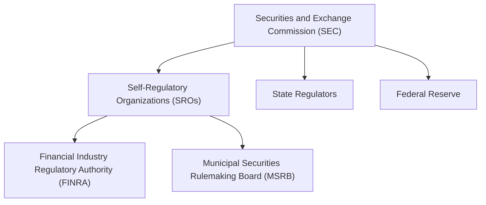

## 1.2 Exam Structure and Content Overview

The Securities Industry Essentials (SIE) Exam is a foundational step for anyone aspiring to enter the securities industry. Understanding the structure and content of the SIE Exam is crucial for effective preparation and success. This section provides an in-depth overview of the exam format, content areas, scoring criteria, and essential resources to help you navigate the exam with confidence.

### Exam Format

The SIE Exam is designed to assess your foundational knowledge of the securities industry. It consists of 85 multiple-choice questions, of which 75 are scored and 10 are unscored. These unscored questions are experimental and do not impact your final score, but they are indistinguishable from the scored questions during the exam. You will have 1 hour and 45 minutes to complete the exam, which requires efficient time management to ensure you address all questions thoroughly.

#### Key Points:
- **Total Questions:** 85 (75 scored, 10 unscored)
- **Time Allotted:** 1 hour and 45 minutes
- **Question Type:** Multiple-choice

### Content Areas

The SIE Exam covers four main content areas, each focusing on different aspects of the securities industry. Understanding these areas will help you allocate your study time effectively and identify the topics that require more attention.

#### 1. Knowledge of Capital Markets (16%)

This section evaluates your understanding of the capital markets, including the roles of various regulatory entities, market participants, and economic factors that influence the markets. Key topics include:

- **Regulatory Entities:** Understanding the functions of the Securities and Exchange Commission (SEC), Self-Regulatory Organizations (SROs), and other regulatory bodies.
- **Market Structure:** Differentiating between primary, secondary, third, and fourth markets, as well as electronic trading platforms.
- **Economic Factors:** Analyzing the impact of monetary and fiscal policies, business cycles, and global economic events on the securities markets.

#### 2. Understanding Products and Their Risks (44%)

This is the most extensive section of the exam, focusing on various securities products and the risks associated with them. Key topics include:

- **Equity Securities:** Characteristics and differences between common stock, preferred stock, and other equity instruments.
- **Debt Securities:** Understanding corporate bonds, government securities, and municipal bonds.
- **Packaged Products:** Exploring mutual funds, ETFs, and other investment vehicles.
- **Alternative Investments:** Examining hedge funds, private equity, and cryptocurrencies.
- **Risks:** Identifying market risk, credit risk, interest rate risk, and other potential risks associated with investment products.

#### 3. Understanding Trading, Customer Accounts, and Prohibited Activities (31%)

This section covers trading practices, customer account management, and ethical standards. Key topics include:

- **Trading Securities:** Types of orders, trade execution, and settlement processes.
- **Customer Accounts:** Different account types, documentation requirements, and suitability standards.
- **Prohibited Activities:** Recognizing insider trading, market manipulation, and other unethical practices.

#### 4. Overview of the Regulatory Framework (9%)

This section provides an overview of key regulations and the responsibilities of securities professionals. Key topics include:

- **Securities Acts:** Understanding the Securities Act of 1933, the Securities Exchange Act of 1934, and other significant legislation.
- **Self-Regulatory Organizations:** Functions and rules of FINRA, MSRB, and other SROs.
- **Compliance:** Registration, licensing requirements, and ethical practices.

### Scoring and Passing Criteria

To pass the SIE Exam, you need to achieve a score of 70% or higher. The exam is scored based on the 75 scored questions, and the unscored questions do not affect your final score. It is important to answer all questions, as there is no penalty for guessing.

#### Key Points:
- **Passing Score:** 70%
- **Unscored Questions:** Do not impact the final score

### Glossary

- **Multiple-Choice Questions:** Questions offering several answer options, with only one correct choice.
- **Content Areas:** Primary topics and subject matter categories covered in the exam.

### References

For further information and resources, you can refer to the following:

- **FINRA's Content Outline:** [SIE Exam Content Outline](https://www.finra.org/sites/default/files/SIE_Content_Outline.pdf)
- **Sample Questions:** Utilize resources that provide example questions for practice to familiarize yourself with the exam format and question types.

### Exam Preparation Tips

- **Time Management:** Practice managing your time effectively to ensure you can complete all questions within the allotted time.
- **Focus on High-Weight Sections:** Allocate more study time to sections with higher weight, such as "Understanding Products and Their Risks."
- **Practice Questions:** Regularly practice with sample questions to build confidence and identify areas for improvement.
- **Understand Key Concepts:** Ensure you have a strong grasp of key concepts, especially those frequently tested on the exam.

### Visual Aids

To enhance your understanding, consider using diagrams and charts to visualize complex concepts, such as the regulatory hierarchy or the process of securities registration.

### Summary

In summary, the SIE Exam is a comprehensive assessment of your foundational knowledge in the securities industry. By understanding the exam structure, content areas, and scoring criteria, you can effectively prepare and increase your chances of success. Utilize the resources provided, practice regularly, and focus on mastering the key concepts to excel in the exam.

## FINRA SIE Exam Practice Questions



### How many questions are scored on the SIE Exam?

- [x] 75
- [ ] 85
- [ ] 70
- [ ] 80

> **Explanation:** The SIE Exam consists of 85 questions, of which 75 are scored.

### What is the time allotted for the SIE Exam?

- [x] 1 hour and 45 minutes
- [ ] 2 hours
- [ ] 1 hour and 30 minutes
- [ ] 2 hours and 30 minutes

> **Explanation:** You have 1 hour and 45 minutes to complete the SIE Exam.

### Which section has the highest weight on the SIE Exam?

- [x] Understanding Products and Their Risks
- [ ] Knowledge of Capital Markets
- [ ] Overview of the Regulatory Framework
- [ ] Understanding Trading, Customer Accounts, and Prohibited Activities

> **Explanation:** "Understanding Products and Their Risks" accounts for 44% of the exam.

### What is the passing score for the SIE Exam?

- [x] 70%
- [ ] 75%
- [ ] 65%
- [ ] 80%

> **Explanation:** A passing score of 70% is required to pass the SIE Exam.

### What do unscored questions on the SIE Exam represent?

- [x] Experimental questions
- [ ] Incorrect questions
- [x] Questions that do not impact the score
- [ ] Questions that are scored later

> **Explanation:** Unscored questions are experimental and do not impact the final score.

### What type of questions does the SIE Exam consist of?

- [x] Multiple-choice
- [ ] True/False
- [ ] Short answer
- [ ] Essay

> **Explanation:** The SIE Exam consists of multiple-choice questions.

### Which regulatory body is primarily responsible for overseeing the securities industry?

- [x] Securities and Exchange Commission (SEC)
- [ ] Federal Reserve
- [x] FINRA
- [ ] MSRB

> **Explanation:** The SEC and FINRA are key regulatory bodies overseeing the securities industry.

### What is the primary focus of the "Knowledge of Capital Markets" section?

- [x] Regulatory entities and market structure
- [ ] Securities products and risks
- [ ] Trading practices and customer accounts
- [ ] Regulatory framework

> **Explanation:** This section focuses on regulatory entities, market structure, and economic factors.

### How many main content areas are covered in the SIE Exam?

- [x] Four
- [ ] Three
- [ ] Five
- [ ] Six

> **Explanation:** The SIE Exam covers four main content areas.

### The SIE Exam includes unscored questions.

- [x] True
- [ ] False

> **Explanation:** The SIE Exam includes 10 unscored questions that are experimental.


