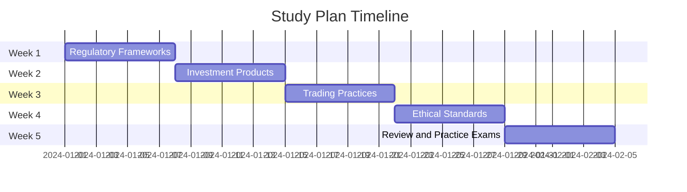

## 1.5 Study Strategies and Resources

Preparing for the Securities Industry Essentials (SIE) Exam requires a strategic approach to ensure you cover all necessary material effectively and efficiently. This section will guide you through creating a robust study plan, selecting the right study materials, utilizing practice exams, employing active learning techniques, and managing your time effectively.

### Creating a Study Plan

A well-structured study plan is the cornerstone of successful exam preparation. Here's how to create one that suits your needs:

#### Set a Realistic Timeline

1. **Determine Your Exam Date**: Start by identifying your exam date and work backward to set milestones. A typical preparation period ranges from 6 to 12 weeks, depending on your familiarity with the material and available study time.

2. **Allocate Time Based on Exam Weightings**: Focus on areas with higher exam weightings. For instance, if the exam heavily emphasizes regulatory frameworks, dedicate more time to understanding these concepts.

3. **Weekly Goals**: Break down your study plan into weekly goals. Allocate specific topics to each week, ensuring you cover all areas before the exam date.

4. **Flexibility**: Build flexibility into your plan to accommodate unexpected events or the need for additional review time.

#### Study Plan Example

### Study Materials

Selecting the right study materials is crucial for understanding the breadth of content covered in the SIE Exam.

#### Recommended Textbooks and Online Courses

1. **Textbooks**: Choose textbooks specifically tailored to the SIE Exam. Look for those that are comprehensive and up-to-date, such as "Securities Industry Essentials Exam for Dummies" or "Kaplan's SIE Exam Prep."

2. **Online Courses**: Consider enrolling in online courses from reputable providers like Kaplan or Wiley. These courses often include video lectures, quizzes, and interactive content.

3. **FINRA’s Study Tools**: Utilize FINRA’s [SIE Exam Study Tools](https://www.finra.org/registration-exams-ce/qualification-exams/sie/study-tools) for additional resources and practice questions.

#### Importance of Up-to-Date Materials

Regulations and market practices evolve, so ensure your study materials reflect the latest changes. Regularly check for updates or errata from publishers.

### Practice Exams

Practice exams are invaluable for building confidence and identifying areas that need improvement.

#### Benefits of Practice Exams

1. **Familiarity with Exam Format**: Practice exams mimic the actual exam format, helping you become comfortable with the question types and timing.

2. **Identify Weak Areas**: Analyze your practice exam results to pinpoint topics where you need further study.

3. **Build Confidence**: Regular practice reduces anxiety and increases your confidence level as you become more familiar with the exam content.

#### How to Use Practice Exams Effectively

1. **Simulate Exam Conditions**: Take practice exams in a quiet environment, adhering to the time limits to simulate real exam conditions.

2. **Review Incorrect Answers**: Spend time reviewing incorrect answers to understand your mistakes and learn from them.

3. **Track Progress**: Keep a record of your scores to track improvement over time.

### Active Learning Techniques

Active learning engages you in the material, making it easier to retain information and apply it effectively.

#### Flashcards for Key Terms and Concepts

1. **Create Flashcards**: Use flashcards for memorizing key terms, definitions, and concepts. Tools like Anki or Quizlet can be helpful.

2. **Regular Review**: Review flashcards regularly, focusing on areas where you struggle.

#### Study Groups and Online Forums

1. **Join Study Groups**: Collaborate with peers in study groups to discuss complex topics and clarify doubts.

2. **Participate in Online Forums**: Engage in forums like Reddit’s SIE Exam Prep community to exchange tips and resources.

### Time Management

Effective time management prevents burnout and ensures consistent progress.

#### Balancing Study Sessions with Breaks

1. **Pomodoro Technique**: Use the Pomodoro Technique, studying for 25 minutes followed by a 5-minute break, to maintain focus and avoid fatigue.

2. **Schedule Breaks**: Plan regular breaks throughout your study schedule to recharge and prevent burnout.

#### Time Management Tips

1. **Prioritize Tasks**: Focus on high-priority tasks first, ensuring you cover essential topics early in your study plan.

2. **Avoid Multitasking**: Concentrate on one topic at a time to maximize retention and understanding.

### Glossary

- **Study Plan**: An organized schedule outlining study activities and goals.
- **Practice Exam**: A simulated test reflecting the format and content of the actual exam.

### References and Additional Resources

- **FINRA’s Resources**: [SIE Exam Study Tools](https://www.finra.org/registration-exams-ce/qualification-exams/sie/study-tools)
- **Educational Providers**: Listings of accredited institutions offering SIE prep materials, such as Kaplan and Wiley.

## SIE Exam Practice Questions: Study Strategies and Resources



### What is the first step in creating an effective study plan for the SIE Exam?

- [x] Determine your exam date and work backward to set milestones.
- [ ] Purchase all recommended textbooks and materials.
- [ ] Join a study group.
- [ ] Take a practice exam.

> **Explanation:** The first step in creating an effective study plan is to determine your exam date and work backward to set milestones. This helps in organizing your study schedule effectively.

### Why is it important to use up-to-date study materials for the SIE Exam?

- [ ] To save money on older editions.
- [x] To ensure that you are studying the most current regulations and market practices.
- [ ] Because they are easier to understand.
- [ ] To avoid studying unnecessary content.

> **Explanation:** Using up-to-date study materials ensures that you are learning the most current regulations and market practices, which can change frequently.

### Which technique is recommended for managing study sessions and preventing burnout?

- [ ] Studying for 3 hours straight without breaks.
- [x] Using the Pomodoro Technique.
- [ ] Multitasking different subjects.
- [ ] Cramming all study sessions into one day.

> **Explanation:** The Pomodoro Technique, which involves studying for 25 minutes followed by a 5-minute break, is effective for maintaining focus and preventing burnout.

### What is a key benefit of taking practice exams?

- [ ] They are easier than the actual exam.
- [x] They help you become familiar with the exam format and identify weak areas.
- [ ] They are a substitute for studying.
- [ ] They guarantee a passing score.

> **Explanation:** Practice exams help you become familiar with the exam format and identify weak areas, which is crucial for targeted studying.

### What is the purpose of joining a study group?

- [ ] To avoid studying alone.
- [ ] To have fun with friends.
- [x] To discuss complex topics and clarify doubts.
- [ ] To reduce the amount of study time needed.

> **Explanation:** Joining a study group allows you to discuss complex topics and clarify doubts, enhancing your understanding through collaboration.

### How can flashcards be used effectively in SIE Exam preparation?

- [ ] By writing long paragraphs on each card.
- [x] By memorizing key terms, definitions, and concepts.
- [ ] By using them as bookmarks.
- [ ] By trading them with friends.

> **Explanation:** Flashcards are effective for memorizing key terms, definitions, and concepts, which are essential for the SIE Exam.

### What should you do if you consistently score low on a particular practice exam section?

- [ ] Ignore the section and focus on others.
- [x] Review the incorrect answers to understand mistakes and learn from them.
- [ ] Take the exam again immediately.
- [ ] Change your study materials.

> **Explanation:** Reviewing incorrect answers helps you understand your mistakes and learn from them, which is critical for improving your performance.

### Why is it important to simulate exam conditions when taking practice exams?

- [ ] To make the experience more enjoyable.
- [ ] To save time.
- [x] To become comfortable with the question types and timing.
- [ ] To impress friends.

> **Explanation:** Simulating exam conditions helps you become comfortable with the question types and timing, reducing anxiety on the actual exam day.

### What is a common pitfall when managing study time?

- [x] Multitasking different subjects.
- [ ] Prioritizing high-priority tasks.
- [ ] Scheduling regular breaks.
- [ ] Using a study plan.

> **Explanation:** Multitasking can lead to divided attention and reduced retention, making it a common pitfall in study time management.

### Which online resource is recommended for additional SIE Exam study tools?

- [ ] Wikipedia
- [ ] Social media groups
- [x] FINRA’s SIE Exam Study Tools
- [ ] Personal blogs

> **Explanation:** FINRA’s SIE Exam Study Tools provide authoritative and relevant resources specifically designed for the SIE Exam.



By following these study strategies and utilizing the recommended resources, you can effectively prepare for the SIE Exam and build a strong foundation for your career in the securities industry. Remember, consistent effort and a well-organized study plan are key to success.
