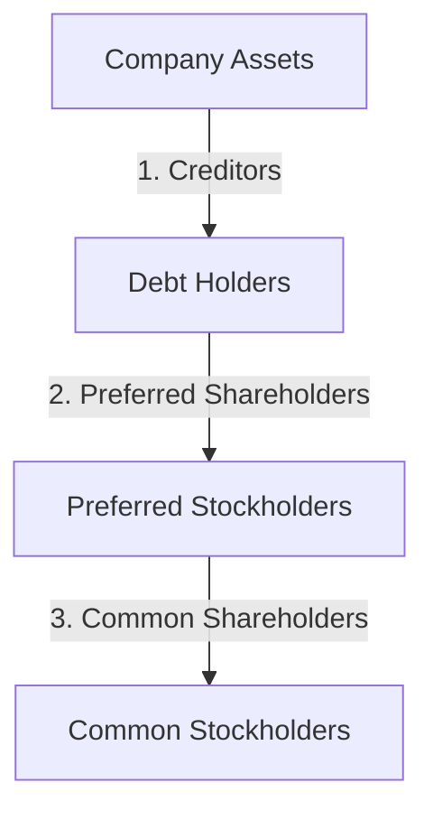

## 3.1.1 Common Stock

Common stock is a fundamental concept in the securities industry and a critical component of the SIE Exam. As an aspiring securities professional, understanding common stock's characteristics, rights, benefits, and risks is essential. This section provides a comprehensive overview of common stock, equipping you with the knowledge needed to excel in your exam and future career.

### Definition and Characteristics

Common stock represents ownership shares in a corporation. When you purchase common stock, you become a part-owner of the company, entitled to a portion of its profits and assets. Here are the key characteristics of common stock:

- **Ownership and Voting Rights:** Common stockholders have the right to vote on corporate matters, such as electing the board of directors and approving major corporate actions. Typically, each share grants one vote, allowing shareholders to influence the company's direction.
  
- **Dividends:** While not guaranteed, dividends are a portion of the company's profits distributed to shareholders. The board of directors decides whether to pay dividends and the amount, based on the company's performance and future needs.

- **Residual Claims:** In the event of liquidation, common stockholders have a residual claim on the company's assets. However, they are paid after creditors and preferred shareholders, which means they may receive nothing if the company's assets are insufficient.

- **Transferability:** Common stock is highly liquid and can be bought and sold freely in the secondary market, providing investors with flexibility and liquidity.

### Rights of Common Stockholders

Understanding the rights associated with common stock is crucial for both the SIE Exam and practical investment knowledge:

- **Voting Rights:** Shareholders can vote on important corporate matters, such as mergers, acquisitions, and changes to the corporate charter. This participation in corporate governance is a fundamental aspect of owning common stock.

- **Preemptive Rights:** Some companies offer preemptive rights, allowing existing shareholders to purchase new shares before they are offered to the public. This right helps shareholders maintain their proportional ownership in the company.

- **Dividends:** Common stockholders may receive dividends, providing a potential source of income. However, dividends are not guaranteed, and companies may choose to reinvest profits instead.

- **Transferability:** Common stock can be easily transferred between investors, providing liquidity and flexibility in managing investment portfolios.

### Benefits of Common Stock

Investing in common stock offers several advantages:

- **Capital Appreciation:** Common stock has the potential for significant capital appreciation. As the company grows and becomes more profitable, the stock's value may increase, providing investors with capital gains.

- **Dividend Income:** If a company declares dividends, common stockholders can benefit from regular income. Dividends can be reinvested or used as a source of cash flow.

- **Limited Liability:** Shareholders are not personally liable for the company's debts. Their losses are limited to their investment amount, providing a level of financial protection.

### Risks of Common Stock

While common stock offers benefits, it also carries risks:

- **Market Risk:** The value of common stock can be volatile, influenced by market conditions, economic factors, and company performance. Investors may experience capital loss if the stock price declines.

- **Dividend Risk:** Dividends are not guaranteed and may be reduced or eliminated if the company faces financial difficulties or chooses to reinvest profits.

- **Residual Claim:** In bankruptcy, common stockholders are paid after creditors and preferred shareholders. This means they may receive nothing if the company's assets are insufficient to cover its obligations.

### Common Stock and the SIE Exam

For the SIE Exam, you should focus on:

- Understanding the basic characteristics and rights associated with common stock.
- Recognizing the benefits and risks involved in owning common stock.
- Differentiating common stock from other equity securities, such as preferred stock.

### Glossary

- **Common Stock:** Securities representing ownership in a corporation, giving holders voting rights and a claim on profits.
- **Dividend:** A portion of a company's earnings distributed to shareholders.
- **Capital Appreciation:** An increase in the market value of an asset.
- **Limited Liability:** Legal protection where shareholders' losses are limited to their investment amount.

### Practical Examples and Case Studies

To illustrate the concepts discussed, consider the following real-world scenarios:

- **Voting Rights in Action:** Imagine a scenario where a tech company is considering a merger with another firm. As a common stockholder, you receive a proxy statement detailing the proposed merger and are invited to vote on the matter. Your vote, along with those of other shareholders, will influence the outcome of the merger decision.

- **Dividend Decisions:** A well-established consumer goods company has consistently paid dividends to its shareholders. However, during an economic downturn, the company decides to cut its dividend to preserve cash and invest in future growth opportunities. As a common stockholder, you need to assess how this decision impacts your investment strategy.

- **Market Volatility:** Consider a scenario where a pharmaceutical company announces a breakthrough drug, causing its stock price to surge. As a common stockholder, you experience capital appreciation. However, if regulatory hurdles arise, the stock price may decline, highlighting the market risk associated with common stock investments.

### Real-World Applications and Regulatory Scenarios

Common stock plays a vital role in the financial markets, and understanding its regulatory context is crucial:

- **Securities and Exchange Commission (SEC) Oversight:** The SEC regulates the issuance and trading of common stock to protect investors and maintain fair and efficient markets. Companies must comply with SEC regulations when issuing stock, including providing accurate and timely disclosures to investors.

- **Corporate Governance:** The rights of common stockholders, such as voting and preemptive rights, are governed by corporate bylaws and state laws. Understanding these legal frameworks is essential for investors and professionals in the securities industry.

### Step-by-Step Guidance

To deepen your understanding of common stock, consider the following steps:

1. **Review Corporate Disclosures:** Analyze a company's financial statements and proxy statements to understand its dividend policy, voting rights, and corporate governance structure.

2. **Evaluate Market Trends:** Monitor market trends and economic indicators that may impact the value of common stock, such as interest rates, inflation, and industry developments.

3. **Assess Risk Tolerance:** Determine your risk tolerance and investment goals to decide whether common stock aligns with your portfolio strategy.

4. **Practice Calculations:** Work through sample problems to calculate dividend yields, capital gains, and total returns on common stock investments.

### Diagrams and Visuals

To enhance your understanding, consider the following diagram illustrating the hierarchy of claims in a company's liquidation process:

### Best Practices and Common Pitfalls

- **Diversification:** Diversify your portfolio to mitigate market risk. Avoid concentrating your investments in a single stock or industry.

- **Stay Informed:** Keep abreast of company news, market trends, and economic indicators that may impact your investments.

- **Understand the Business:** Invest in companies you understand and believe in. Analyze their business models, competitive advantages, and growth prospects.

### References and Additional Resources

For further exploration, consider the following resources:

- **SEC Investor Publications:** [Investing in Stocks](https://www.investor.gov/introduction-investing/investing-basics/investment-products/stocks)
- **FINRA’s Understanding Stock Investments:** [FINRA - Stocks](https://www.finra.org/investors/learn-to-invest/types-investments/stocks)

### Summary

Common stock is a cornerstone of equity securities, offering ownership, voting rights, and potential financial benefits. However, it also carries risks that investors must understand and manage. As you prepare for the SIE Exam, focus on the characteristics, rights, benefits, and risks of common stock, and apply this knowledge to real-world scenarios and regulatory contexts.

## Quiz Time!



### Which of the following is a characteristic of common stock?

- [x] Ownership shares in a corporation
- [ ] Guaranteed dividends
- [ ] Priority over creditors in liquidation
- [ ] Fixed interest payments

> **Explanation:** Common stock represents ownership shares in a corporation, but dividends are not guaranteed, and common shareholders have residual claims after creditors in liquidation.

### What rights do common stockholders typically have?

- [x] Voting rights
- [x] Preemptive rights
- [ ] Guaranteed dividends
- [ ] Fixed interest payments

> **Explanation:** Common stockholders typically have voting and preemptive rights, but dividends and interest payments are not guaranteed or fixed.

### What is a potential benefit of owning common stock?

- [x] Capital appreciation
- [ ] Guaranteed capital gains
- [ ] Fixed dividend payments
- [ ] Immunity from market risk

> **Explanation:** Common stock offers the potential for capital appreciation, but gains are not guaranteed, and dividends are not fixed. Market risk remains a factor.

### What risk is associated with common stock?

- [x] Market risk
- [ ] Guaranteed dividend risk
- [ ] Fixed interest rate risk
- [ ] Immunity from bankruptcy

> **Explanation:** Common stock is subject to market risk, and dividends are not guaranteed. Common shareholders have residual claims, making them vulnerable in bankruptcy.

### In the event of liquidation, who is paid first?

- [x] Creditors
- [ ] Common stockholders
- [ ] Preferred stockholders
- [ ] Board of directors

> **Explanation:** In liquidation, creditors are paid first, followed by preferred stockholders, and finally common stockholders, if any assets remain.

### What is the primary regulatory body overseeing common stock issuance?

- [x] SEC
- [ ] FINRA
- [ ] Federal Reserve
- [ ] NASAA

> **Explanation:** The SEC regulates the issuance and trading of common stock to ensure fair and efficient markets.

### Which document provides details on a company's dividend policy?

- [x] Proxy statement
- [ ] Balance sheet
- [ ] Cash flow statement
- [ ] Income statement

> **Explanation:** A proxy statement provides details on a company's dividend policy, voting rights, and other corporate governance matters.

### What is a preemptive right?

- [x] Right to purchase new shares before the public
- [ ] Right to receive fixed dividends
- [ ] Right to vote on all corporate matters
- [ ] Right to sell shares at any time

> **Explanation:** Preemptive rights allow existing shareholders to purchase new shares before they are offered to the public, maintaining their proportional ownership.

### Which of the following is a risk specific to common stock?

- [x] Dividend risk
- [ ] Fixed interest rate risk
- [ ] Guaranteed capital loss
- [ ] Immunity from market volatility

> **Explanation:** Dividend risk is specific to common stock, as dividends may be reduced or not paid if the company underperforms.

### True or False: Common stockholders have limited liability.

- [x] True
- [ ] False

> **Explanation:** Common stockholders have limited liability, meaning their losses are limited to their investment amount.


