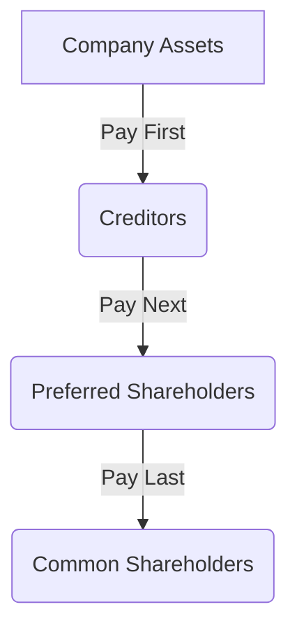

## 3.1.1 Common Stock

Common stock is a fundamental component of the equity securities market and represents an ownership stake in a corporation. As an aspiring securities professional, understanding the nuances of common stock is crucial for both the SIE Exam and your future career. This section provides a comprehensive exploration of common stock, covering its definition, characteristics, rights, benefits, risks, and its significance in the SIE Exam.

### Definition and Characteristics

Common stock is a type of security that signifies ownership in a corporation. It entitles shareholders to a portion of the company's profits and assets. Here are the key characteristics of common stock:

- **Ownership Shares:** Common stockholders own a piece of the corporation, which is represented by their shares.
- **Voting Rights:** Typically, each share of common stock grants the shareholder one vote in corporate matters, such as electing the board of directors and approving major corporate policies.
- **Dividends:** Shareholders may receive dividends, which are distributions of the company’s earnings. However, dividends are not guaranteed and depend on the company's profitability and board decisions.
- **Residual Claims:** In the event of liquidation, common stockholders have claims on the company's assets after all debts and other obligations have been paid. This places them at the end of the line in terms of payment priority.
- **Transferability:** Common stock can be freely bought and sold on secondary markets, providing liquidity to shareholders.

### Rights of Common Stockholders

Common stockholders enjoy several rights that are integral to their ownership:

- **Voting Rights:** Shareholders can vote on important corporate matters, such as mergers, acquisitions, and changes to the corporate charter. This right ensures that shareholders have a say in the company's governance.
- **Preemptive Rights:** These rights allow existing shareholders to maintain their proportional ownership in the company when new shares are issued, preventing dilution of their stake.
- **Dividends:** While not guaranteed, dividends are a potential benefit for common stockholders. Companies may distribute a portion of their profits to shareholders as dividends, providing a source of income.
- **Transferability:** Common stockholders can sell their shares on the secondary market, offering flexibility and liquidity.
  
### Benefits of Common Stock

Investing in common stock offers several potential benefits:

- **Capital Appreciation:** One of the primary attractions of common stock is the potential for capital appreciation. As the company grows and becomes more profitable, the value of its stock may increase, providing investors with gains.
- **Dividend Income:** If a company declares dividends, shareholders can receive regular income from their investment.
- **Limited Liability:** Shareholders are only liable for the amount they have invested in the company. They are not personally responsible for the company’s debts or liabilities.

### Risks Associated with Common Stock

While common stock can offer substantial rewards, it also carries risks:

- **Market Risk:** The value of common stock can be highly volatile, influenced by market conditions, economic factors, and company performance. This volatility can lead to significant capital losses.
- **Dividend Risk:** Dividends are not guaranteed and may be reduced or eliminated if the company faces financial difficulties.
- **Residual Claim:** In the event of bankruptcy, common stockholders are last in line to receive any remaining assets after creditors and preferred shareholders are paid. This often results in common shareholders receiving little to nothing.

### Common Stock and the SIE Exam

For the SIE Exam, it is essential to understand the basic characteristics and rights associated with common stock. Be prepared to differentiate between common stock and other types of equity securities, such as preferred stock. Familiarize yourself with the benefits and risks involved in owning common stock, as these concepts are frequently tested.

### Glossary

- **Common Stock:** Securities representing ownership in a corporation, providing voting rights and a claim on profits.
- **Dividend:** A portion of a company’s earnings distributed to shareholders.
- **Capital Appreciation:** An increase in the market value of an asset.
- **Limited Liability:** Legal protection where shareholders' losses are limited to their investment amount.

### Real-World Applications and Case Studies

Understanding common stock in real-world scenarios can enhance your comprehension and application of these concepts:

- **Case Study: Apple Inc.** Apple is a prime example of a company whose common stock has experienced significant capital appreciation. Early investors have seen substantial returns as the company grew from a small tech firm to a global powerhouse.
- **Scenario: Dividend Policy Changes** Consider a scenario where a company decides to cut its dividend due to declining profits. This decision can impact the stock price and investor sentiment, illustrating the dividend risk associated with common stock.

### Diagrams and Visuals

To better understand the hierarchy of claims in the event of liquidation, consider the following diagram:

This diagram illustrates the order of payment priority, emphasizing the residual claim nature of common stock.

### Best Practices and Exam Tips

- **Understand Key Concepts:** Focus on understanding the fundamental characteristics and rights of common stock.
- **Practice Differentiation:** Be able to distinguish between common stock and other equity securities.
- **Review Real-World Examples:** Apply your knowledge to real-world scenarios to solidify your understanding.

### References for Further Study

- **SEC Investor Publications:** [Investing in Stocks](https://www.investor.gov/introduction-investing/investing-basics/investment-products/stocks)
- **FINRA’s Understanding Stock Investments:** [FINRA - Stocks](https://www.finra.org/investors/learn-to-invest/types-investments/stocks)

---

## SIE Exam Practice Questions: Common Stock



### What is a primary characteristic of common stock?

- [x] It represents ownership in a corporation.
- [ ] It guarantees fixed dividends.
- [ ] It has priority over creditors in liquidation.
- [ ] It cannot be traded on secondary markets.

> **Explanation:** Common stock represents ownership in a corporation, providing shareholders with voting rights and a claim on profits. Unlike preferred stock, common stock does not guarantee fixed dividends.

### Which of the following rights is typically associated with common stockholders?

- [x] Voting on corporate matters
- [ ] Receiving fixed interest payments
- [ ] Priority in asset claims over creditors
- [ ] Guaranteed dividend payments

> **Explanation:** Common stockholders have the right to vote on corporate matters, such as electing the board of directors. They do not receive fixed interest payments or guaranteed dividends.

### What is a potential benefit of owning common stock?

- [x] Capital appreciation
- [ ] Guaranteed returns
- [ ] Fixed dividend payments
- [ ] Priority in bankruptcy proceedings

> **Explanation:** A potential benefit of owning common stock is capital appreciation, where the value of the stock increases over time. However, returns and dividends are not guaranteed, and common stockholders have the lowest priority in bankruptcy proceedings.

### In the event of a company's liquidation, who is paid last?

- [ ] Creditors
- [ ] Preferred shareholders
- [x] Common shareholders
- [ ] Bondholders

> **Explanation:** In liquidation, common shareholders are paid last, after creditors, bondholders, and preferred shareholders have been satisfied.

### Which of the following is a risk associated with common stock?

- [ ] Fixed income risk
- [x] Market risk
- [ ] Interest rate risk
- [ ] Inflation risk

> **Explanation:** Market risk is a significant risk associated with common stock, as share prices can be volatile and influenced by various factors. Common stock does not have fixed income risk, which is more relevant to bonds.

### What does limited liability mean for common stockholders?

- [ ] They are responsible for company debts.
- [x] Their losses are limited to their investment.
- [ ] They must pay company liabilities.
- [ ] They receive fixed dividends.

> **Explanation:** Limited liability means that common stockholders' losses are limited to their investment in the company. They are not personally responsible for the company's debts or liabilities.

### Which of the following statements about dividends is true for common stockholders?

- [ ] Dividends are guaranteed.
- [ ] Dividends are fixed.
- [x] Dividends are not guaranteed.
- [ ] Dividends must be paid annually.

> **Explanation:** Dividends for common stockholders are not guaranteed and depend on the company's profitability and board decisions. They are not fixed and may not be paid annually.

### What is the significance of preemptive rights for common stockholders?

- [ ] They guarantee dividend payments.
- [ ] They allow voting on all corporate matters.
- [x] They allow maintaining proportional ownership.
- [ ] They provide priority in asset claims.

> **Explanation:** Preemptive rights allow common stockholders to maintain their proportional ownership in the company when new shares are issued, preventing dilution of their stake.

### How does common stock differ from preferred stock?

- [x] Common stockholders have voting rights.
- [ ] Common stock pays fixed dividends.
- [ ] Common stock has priority in liquidation.
- [ ] Common stock is not traded on exchanges.

> **Explanation:** Common stockholders typically have voting rights, whereas preferred stockholders often do not. Preferred stock usually pays fixed dividends and has priority in liquidation.

### Why might an investor choose common stock over other securities?

- [x] Potential for higher returns through capital appreciation
- [ ] Guaranteed income through fixed dividends
- [ ] Priority in bankruptcy proceedings
- [ ] Fixed interest payments

> **Explanation:** An investor might choose common stock for the potential of higher returns through capital appreciation. Unlike bonds or preferred stock, common stock does not offer fixed dividends or interest payments, nor does it have priority in bankruptcy proceedings.



---

This comprehensive guide to common stock provides you with the foundational knowledge necessary for the SIE Exam and your future career in the securities industry. Understanding the characteristics, rights, benefits, and risks of common stock will enhance your ability to analyze and make informed investment decisions.
