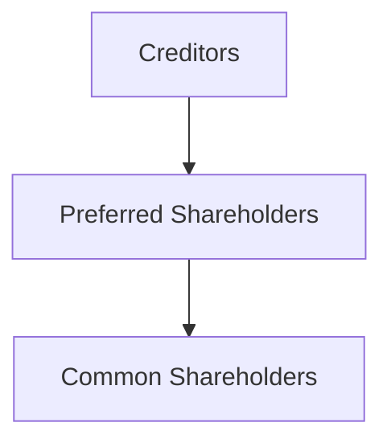

## 3.1.2 Preferred Stock

Preferred stock is a unique class of equity security that combines elements of both stocks and bonds, making it a vital topic for the Securities Industry Essentials (SIE) Exam. Understanding preferred stock is crucial for aspiring securities professionals, as it plays a significant role in investment portfolios and corporate finance. This section will delve into the characteristics, types, benefits, and risks associated with preferred stock, providing you with the comprehensive knowledge needed to succeed in the securities industry.

### Definition and Characteristics

Preferred stock is often described as a hybrid security because it embodies features of both equity and debt instruments. Here are the key characteristics that define preferred stock:

- **Dividend Priority:** Preferred stockholders receive dividends before common shareholders, typically at a fixed rate. This priority makes preferred stock appealing to investors seeking stable income.
- **Non-Voting Rights:** Generally, preferred stockholders do not have voting rights in corporate decisions, which distinguishes them from common shareholders.
- **Liquidation Preference:** In the event of liquidation, preferred shareholders have a higher claim on assets than common shareholders, but they are subordinate to creditors.
- **Fixed Income-Like Features:** The fixed dividend payments of preferred stock resemble the interest payments of bonds, offering predictability in income.

### Types of Preferred Stock

Preferred stock comes in various forms, each with unique features that cater to different investor needs. Understanding these types is essential for the SIE Exam:

#### Cumulative Preferred

Cumulative preferred stock ensures that any missed dividend payments accumulate and must be paid out before any dividends can be issued to common shareholders. This feature provides an additional layer of security for investors, making cumulative preferred stock attractive to those seeking reliable income.

#### Non-Cumulative Preferred

Unlike cumulative preferred, non-cumulative preferred stock does not accumulate unpaid dividends. If the issuing company decides to skip dividend payments, investors cannot claim these missed payments in the future. This type is riskier than cumulative preferred, as investors may forfeit income during financial downturns.

#### Convertible Preferred

Convertible preferred stock offers the option to convert shares into a predetermined number of common shares. This feature allows investors to benefit from the potential appreciation of common stock, providing a balance between income and growth potential.

#### Callable Preferred

Callable preferred stock gives the issuer the right to redeem the shares at a specified price after a certain date. This feature allows companies to repurchase shares when interest rates decline, potentially leaving investors to reinvest at lower rates. Callable preferred stock often includes a call premium to compensate investors for this risk.

#### Participating Preferred

Participating preferred stockholders may receive additional dividends beyond the fixed rate, contingent upon certain conditions, such as the company achieving specific financial targets. This type of preferred stock allows investors to participate in the company's profitability, offering a blend of fixed income and potential growth.

### Benefits of Preferred Stock

Preferred stock offers several advantages that make it an attractive investment option:

- **Stable Dividends:** Preferred stock provides regular income with higher priority over common stock dividends, appealing to income-focused investors.
- **Higher Claim on Assets:** In liquidation, preferred shareholders have preferential treatment over common stockholders, offering a degree of capital protection.
- **Potential for Conversion:** Convertible preferred stock allows investors to participate in the appreciation of common stock, providing growth opportunities.

### Risks of Preferred Stock

Despite its benefits, preferred stock carries certain risks that investors must consider:

- **Interest Rate Risk:** Preferred stock prices may decline when interest rates rise, as fixed dividend payments become less attractive compared to new issues with higher rates.
- **Dividend Risk:** In times of financial distress, companies may suspend dividend payments, impacting the income stream for preferred stockholders.
- **Limited Growth Potential:** Preferred stock typically offers less potential for capital appreciation compared to common stock, as its value is more closely tied to interest rates and dividend payments.

### Preferred Stock and the SIE Exam

For the SIE Exam, it is crucial to understand the following aspects of preferred stock:

- **Features and Types:** Be familiar with the characteristics and various types of preferred stock, including cumulative, non-cumulative, convertible, callable, and participating preferred.
- **Benefits and Limitations:** Understand the advantages of preferred stock, such as stable dividends and higher claims on assets, as well as its limitations, like interest rate sensitivity and limited growth potential.
- **Interest Rate Impact:** Recognize how changes in interest rates affect preferred stock prices and the implications for investors.

### Glossary

- **Preferred Stock:** An equity security with priority over common stock in dividends and liquidation, often without voting rights.
- **Cumulative Preferred:** Preferred stock where unpaid dividends accumulate and must be paid out before common dividends.
- **Convertible Preferred:** Preferred shares that can be exchanged for a specified number of common shares.
- **Callable Preferred:** Allows the issuer to repurchase shares at a set price after a certain date.

### References

- **SEC Investor Publications:** [Preferred Stocks](https://www.investor.gov/introduction-investing/investing-basics/investment-products/stocks)
- **Investopedia - Preferred Stock:** [Preferred Stock](https://www.investopedia.com/terms/p/preferredstock.asp)

### Real-World Applications and Regulatory Scenarios

Preferred stock plays a significant role in corporate finance and investment strategies. Understanding its real-world applications can enhance your comprehension and exam preparation:

- **Corporate Financing:** Companies may issue preferred stock to raise capital without diluting common shareholders' voting power. This strategy is often used by financial institutions and utilities seeking stable funding sources.
- **Portfolio Diversification:** Preferred stock can diversify an investment portfolio by providing fixed income-like returns with equity characteristics. It is particularly useful in low-interest-rate environments where bond yields are unattractive.
- **Regulatory Considerations:** Preferred stock issuances must comply with securities regulations, including registration requirements under the Securities Act of 1933. Understanding these regulatory frameworks is essential for professionals in the securities industry.

### Practical Examples and Case Studies

Consider the following scenarios to illustrate key points about preferred stock:

- **Case Study: Convertible Preferred Stock in Action**
  - A technology company issues convertible preferred stock to attract investors seeking income and growth potential. As the company's common stock appreciates, preferred shareholders opt to convert their shares, participating in the capital gains while initially benefiting from stable dividends.

- **Example: Callable Preferred Stock and Interest Rate Fluctuations**
  - A utility company issues callable preferred stock with a 5% dividend rate. When interest rates decline, the company exercises its call option, redeeming the shares at a premium. Investors must reinvest at lower prevailing rates, highlighting the interest rate risk associated with callable preferred stock.

### Step-by-Step Guidance

Understanding the mechanics of preferred stock is crucial for exam success. Here is a step-by-step guide to analyzing preferred stock features:

1. **Identify the Type:** Determine whether the preferred stock is cumulative, non-cumulative, convertible, callable, or participating.
2. **Assess Dividend Features:** Evaluate the dividend rate and any additional features, such as cumulative dividends or participation rights.
3. **Analyze Conversion Options:** For convertible preferred stock, understand the conversion ratio and the conditions under which conversion is beneficial.
4. **Evaluate Call Provisions:** For callable preferred stock, review the call price, date, and premium to assess potential impacts on investment returns.
5. **Consider Market Conditions:** Analyze how interest rate changes and economic factors may influence preferred stock prices and dividend stability.

### Diagrams and Visuals

To enhance your understanding of preferred stock, consider the following diagram illustrating the hierarchy of claims in liquidation:

### Best Practices and Common Pitfalls

When dealing with preferred stock, consider the following best practices and avoid common pitfalls:

- **Diversify Holdings:** Avoid concentrating investments in a single type of preferred stock to mitigate risks associated with interest rate fluctuations and issuer-specific issues.
- **Monitor Interest Rates:** Stay informed about interest rate trends, as they significantly impact preferred stock prices and yields.
- **Understand Terms:** Thoroughly review the terms and conditions of preferred stock issuances, including call provisions and conversion rights, to make informed investment decisions.

### Exam Tips and Mnemonics

To help remember the key features of preferred stock for the SIE Exam, consider the following mnemonic:

- **C** for **Cumulative Dividends**
- **N** for **Non-Cumulative Risk**
- **C** for **Convertible Opportunities**
- **C** for **Callable Risks**
- **P** for **Participating Benefits**

### Summary

Preferred stock is a versatile investment vehicle with unique features that blend equity and debt characteristics. Understanding its types, benefits, and risks is essential for the SIE Exam and a successful career in the securities industry. By mastering preferred stock concepts, you can confidently navigate the complexities of equity securities and enhance your investment strategies.

## FINRA SIE Exam Practice Questions



### Which of the following is a characteristic of preferred stock?

- [x] Fixed dividend payments
- [ ] Voting rights in corporate decisions
- [ ] Higher claim than creditors in liquidation
- [ ] Unlimited growth potential

> **Explanation:** Preferred stock typically offers fixed dividend payments, but it usually does not provide voting rights and has a lower claim than creditors in liquidation.

### What is the primary difference between cumulative and non-cumulative preferred stock?

- [x] Cumulative preferred stock accumulates unpaid dividends.
- [ ] Non-cumulative preferred stock pays dividends at a higher rate.
- [ ] Cumulative preferred stock offers voting rights.
- [ ] Non-cumulative preferred stock is convertible.

> **Explanation:** Cumulative preferred stock accumulates unpaid dividends, whereas non-cumulative preferred stock does not.

### Which type of preferred stock allows conversion into common shares?

- [x] Convertible preferred
- [ ] Callable preferred
- [ ] Cumulative preferred
- [ ] Participating preferred

> **Explanation:** Convertible preferred stock can be converted into a predetermined number of common shares.

### What risk is associated with callable preferred stock?

- [x] The issuer may redeem the shares at a set price.
- [ ] Dividends are not paid if missed.
- [ ] Shares cannot be converted into common stock.
- [ ] Dividends are paid at a variable rate.

> **Explanation:** Callable preferred stock allows the issuer to redeem the shares at a set price, potentially affecting investors' returns.

### Which of the following is a benefit of preferred stock?

- [x] Stable dividends
- [ ] Voting rights
- [ ] High growth potential
- [ ] Subordinate claim in liquidation

> **Explanation:** Preferred stock provides stable dividends, which is one of its main benefits.

### How do interest rates affect preferred stock prices?

- [x] Prices may decline when interest rates rise.
- [ ] Prices increase when interest rates rise.
- [ ] Prices are unaffected by interest rates.
- [ ] Prices fluctuate independently of interest rates.

> **Explanation:** Preferred stock prices may decline when interest rates rise, as fixed dividend payments become less attractive.

### What feature distinguishes participating preferred stock?

- [x] Potential for additional dividends
- [ ] Conversion into common shares
- [ ] Accumulation of unpaid dividends
- [ ] Redemption by the issuer

> **Explanation:** Participating preferred stock may receive additional dividends based on certain conditions.

### In liquidation, who has the highest claim on assets?

- [x] Creditors
- [ ] Preferred shareholders
- [ ] Common shareholders
- [ ] Bondholders

> **Explanation:** Creditors have the highest claim on assets in liquidation, followed by preferred shareholders.

### Which type of preferred stock does not accumulate unpaid dividends?

- [x] Non-cumulative preferred
- [ ] Cumulative preferred
- [ ] Convertible preferred
- [ ] Callable preferred

> **Explanation:** Non-cumulative preferred stock does not accumulate unpaid dividends.

### True or False: Preferred stockholders typically have voting rights in corporate decisions.

- [ ] True
- [x] False

> **Explanation:** Preferred stockholders typically do not have voting rights, distinguishing them from common shareholders.



By mastering the concepts of preferred stock, you will be well-equipped to tackle the SIE Exam and advance your career in the securities industry. Remember to review these key points and apply your knowledge through practice questions and real-world scenarios.
