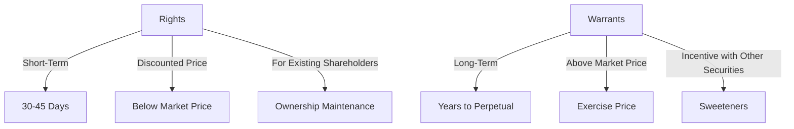

## 3.1.3 Rights and Warrants

In the realm of equity securities, understanding stock rights and warrants is crucial for anyone preparing for the Securities Industry Essentials (SIE) Exam. These instruments provide unique opportunities and risks for investors and play significant roles in corporate finance strategies. This section will delve into the details of rights and warrants, highlighting their characteristics, purposes, and implications for investors.

### Stock Rights (Subscription Rights)

**Definition and Purpose:**

Stock rights, also known as subscription rights, are short-term privileges granted to existing shareholders, allowing them to purchase additional shares of the company's stock, usually at a discount to the current market price. The primary purpose of issuing rights is to enable shareholders to maintain their proportional ownership in the company when new shares are issued, thereby preventing dilution of their existing holdings.

**Characteristics of Stock Rights:**

- **Short-Term Nature:** Rights are typically exercisable within a short period, generally 30 to 45 days from issuance. This limited time frame creates urgency for shareholders to decide whether to exercise their rights or sell them.
  
- **Discounted Purchase Price:** The exercise price of rights is usually set below the current market price of the shares, providing an incentive for shareholders to purchase additional shares.

- **Transferability:** Shareholders who do not wish to exercise their rights can sell them in the secondary market, allowing others to take advantage of the opportunity.

- **Proportional Allocation:** Rights are usually distributed to shareholders on a pro-rata basis, meaning the number of rights received is proportional to the number of shares owned.

**Example Scenario:**

Imagine a company, XYZ Corp, decides to issue additional shares to raise capital for expansion. To avoid diluting existing shareholders' ownership, XYZ Corp issues stock rights, allowing each shareholder to purchase one additional share for every ten shares they currently own, at a 20% discount to the market price. Shareholders have 30 days to decide whether to exercise or sell their rights.

**Regulatory Considerations:**

Issuance of rights is subject to regulatory oversight to ensure transparency and fairness. Companies must provide detailed information about the offering, including the terms and conditions, through a prospectus filed with the Securities and Exchange Commission (SEC).

### Stock Warrants

**Definition and Purpose:**

Stock warrants are long-term options issued by a company that grant the holder the right to purchase the company's stock at a specified price, known as the exercise or strike price. Warrants are often issued as "sweeteners" alongside bonds or preferred stock to make these securities more attractive to investors.

**Characteristics of Stock Warrants:**

- **Long-Term Duration:** Warrants typically have a longer life span than rights, ranging from several years to even perpetual durations. This extended time frame provides flexibility for investors to decide when to exercise the warrants.

- **Exercise Price Above Market Price:** At the time of issuance, the exercise price of warrants is usually set above the current market price of the stock. This means that warrants will only be exercised if the market price exceeds the exercise price before expiration.

- **Secondary Market Trading:** Warrants can be traded separately from the securities they were issued with, allowing investors to buy and sell them in the secondary market.

- **Leverage Potential:** Warrants offer investors the potential for significant leverage. A small increase in the stock price can lead to a substantial gain in the value of the warrant.

**Example Scenario:**

Consider ABC Corp, which issues bonds with attached warrants to attract investors. Each warrant allows the holder to purchase one share of ABC Corp stock at $50 per share, while the current market price is $45. If the stock price rises above $50 before the warrant expires, investors can exercise the warrants to buy shares at the lower exercise price.

**Regulatory Considerations:**

The issuance and trading of warrants are regulated to protect investors and ensure market integrity. Companies must disclose detailed information about the terms and conditions of the warrants in their offering documents.

### Differences Between Rights and Warrants

Understanding the differences between rights and warrants is essential for distinguishing their roles and implications in the securities market.

- **Time Frame:** Rights are short-term instruments, typically exercisable within 30-45 days, whereas warrants have a long-term duration, often lasting several years or more.

- **Exercise Price:** Rights usually have exercise prices set below the current market price, offering a discount to shareholders. In contrast, warrants have exercise prices set above the market price at issuance, requiring the stock price to rise for them to be valuable.

- **Purpose of Issuance:** Rights are primarily issued to existing shareholders to prevent ownership dilution during new share offerings. Warrants are often issued as incentives in conjunction with other securities, such as bonds or preferred stock.

**Mermaid Diagram: Rights vs. Warrants**

### Risks and Considerations

Investors must be aware of the risks associated with rights and warrants, as these instruments can significantly impact their investment strategies.

- **Dilution Risk:** The issuance of additional shares through rights or the exercise of warrants can dilute existing shareholders' ownership, potentially affecting the value of their holdings.

- **Market Risk:** The value of rights and warrants is directly linked to the performance of the underlying stock. If the stock price does not rise as expected, warrants may expire worthless, and rights may not be exercised.

- **Volatility:** Both rights and warrants can be subject to significant price volatility, influenced by market conditions and investor sentiment.

- **Regulatory Risk:** Changes in regulations or corporate governance practices can affect the terms and conditions of rights and warrants, impacting their value and exercisability.

### Rights and Warrants on the SIE Exam

For the SIE Exam, it is crucial to understand how rights and warrants function, their purposes, and key differences. You should be able to recognize how these instruments affect ownership and investment strategies, as well as their potential risks.

**Key Points to Remember:**

- Rights are short-term and allow existing shareholders to purchase additional shares at a discount.
- Warrants are long-term and provide the right to buy shares at a specified price, often issued with other securities as incentives.
- Understand the implications of dilution, market risk, and regulatory considerations.

### Glossary

- **Rights (Subscription Rights):** Short-term options allowing existing shareholders to buy additional shares at a discount.
- **Warrants:** Long-term securities giving the holder the right to purchase company stock at a specified price.
- **Exercise Price (Strike Price):** The price at which a security can be purchased or sold when exercising an option or warrant.

### References

- **SEC Investor Publications:** [Investor Bulletin on Warrants](https://www.sec.gov/oiea/investor-alerts-and-bulletins/ib_warrants)
- **Investopedia - Rights and Warrants:** [Understanding Rights Offerings and Warrants](https://www.investopedia.com/investing/rights-offerings-warrants/)

## SIE Exam Practice Questions: Rights and Warrants



### What is the primary purpose of issuing stock rights?

- [x] To enable existing shareholders to maintain their proportional ownership in the company.
- [ ] To raise capital from new investors.
- [ ] To provide long-term investment opportunities.
- [ ] To increase the company's stock price.

> **Explanation:** Stock rights are issued to existing shareholders to allow them to purchase additional shares and maintain their ownership percentage, preventing dilution when new shares are issued.

### How long are stock rights typically exercisable?

- [ ] 90 days
- [x] 30-45 days
- [ ] 60-75 days
- [ ] 15-20 days

> **Explanation:** Stock rights are usually exercisable within a short period, typically 30 to 45 days from issuance, creating urgency for shareholders to act.

### What is a common feature of stock warrants?

- [ ] They are always exercisable below the market price.
- [x] They often have exercise prices above the market price at issuance.
- [ ] They are non-transferable.
- [ ] They expire within a year.

> **Explanation:** Warrants often have exercise prices set above the market price at issuance, providing potential for leverage if the stock price rises.

### In what scenario might a company issue warrants?

- [ ] As a standalone investment product.
- [x] As an incentive alongside bonds or preferred stock.
- [ ] To replace existing stock options.
- [ ] To reduce outstanding shares.

> **Explanation:** Warrants are often issued as "sweeteners" alongside bonds or preferred stock to make these securities more attractive to investors.

### What risk is associated with the issuance of stock rights?

- [ ] Interest rate risk
- [ ] Currency risk
- [x] Dilution risk
- [ ] Credit risk

> **Explanation:** Issuing stock rights can lead to dilution risk, as the issuance of additional shares can dilute existing shareholders' ownership percentage.

### How do rights differ from warrants in terms of duration?

- [ ] Rights are long-term; warrants are short-term.
- [x] Rights are short-term; warrants are long-term.
- [ ] Both have the same duration.
- [ ] Rights have no expiration; warrants do.

> **Explanation:** Rights are short-term, typically exercisable within 30-45 days, whereas warrants are long-term, often lasting several years or more.

### What is the primary market risk associated with warrants?

- [ ] Interest rate fluctuations
- [ ] Currency exchange rates
- [x] The underlying stock's performance
- [ ] Changes in tax policy

> **Explanation:** The value of warrants is directly linked to the performance of the underlying stock. If the stock price does not rise as expected, warrants may expire worthless.

### What is a potential benefit of trading warrants in the secondary market?

- [ ] They are immune to market volatility.
- [x] They provide liquidity and flexibility for investors.
- [ ] They guarantee profits.
- [ ] They are exempt from regulatory oversight.

> **Explanation:** Trading warrants in the secondary market provides liquidity and flexibility, allowing investors to buy and sell them independently of the securities they were issued with.

### Why might a shareholder choose to sell their rights instead of exercising them?

- [ ] To avoid paying taxes.
- [ ] To increase their ownership percentage.
- [x] To gain immediate liquidity without investing additional capital.
- [ ] To decrease the company's market capitalization.

> **Explanation:** A shareholder might sell their rights to gain immediate liquidity without needing to invest additional capital to purchase more shares.

### What is a key consideration for investors holding warrants?

- [ ] They are risk-free investments.
- [ ] They are not affected by stock price movements.
- [x] They offer potential leverage but come with significant market risk.
- [ ] They cannot be traded in the secondary market.

> **Explanation:** Warrants offer potential leverage, as a small increase in the stock price can lead to a substantial gain in the value of the warrant, but they also come with significant market risk.



In summary, stock rights and warrants are vital components of the securities industry, offering unique opportunities and risks for investors. Understanding their characteristics, purposes, and implications is essential for success on the SIE Exam and in the securities profession.
