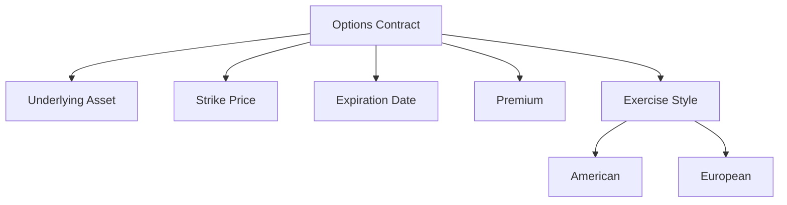

## 3.4.1 Basics of Options Contracts

Options contracts are a pivotal concept within the securities industry, offering investors unique opportunities for leverage, risk management, and strategic flexibility. Understanding the basics of options contracts is essential for anyone preparing for the Securities Industry Essentials (SIE) Exam. This section provides a comprehensive overview, breaking down the complexities into manageable insights.

### What is an Option?

An option is a type of derivatives contract that grants the holder the right, but not the obligation, to buy or sell an underlying asset at a predetermined price, known as the strike price, within a specified period. Options are versatile financial instruments used for hedging, speculation, and income generation.

### Types of Options

Understanding the two primary types of options—call options and put options—is crucial for mastering options contracts.

- **Call Option:** This option gives the holder the right to purchase the underlying asset at the strike price before the expiration date. Investors purchase call options when they anticipate that the price of the underlying asset will rise.

- **Put Option:** This option provides the holder the right to sell the underlying asset at the strike price before the expiration date. Investors buy put options when they expect the price of the underlying asset to decline.

### Key Components of Options Contracts

Options contracts consist of several key components that determine their value and functionality:

- **Underlying Asset:** The security or asset on which the option is based, such as stocks, indices, or commodities.

- **Strike Price (Exercise Price):** The fixed price at which the holder can buy (call) or sell (put) the underlying asset.

- **Expiration Date:** The date on which the option expires and becomes void. Options can have various expiration periods, ranging from days to years.

- **Premium:** The cost of purchasing the option, paid by the buyer to the seller (writer). The premium is influenced by factors such as the underlying asset's price, volatility, time until expiration, and interest rates.

### Option Positions

Investors can take different positions in options trading:

- **Long Position:** Involves buying options, either calls or puts. A long call position profits from rising prices, while a long put position benefits from falling prices.

- **Short Position:** Involves selling or writing options. A short call position profits when the underlying asset's price remains below the strike price, while a short put position benefits when the price stays above the strike price.

### Exercise Styles

Options contracts can be categorized based on their exercise styles:

- **American Options:** These can be exercised at any time up to the expiration date, providing greater flexibility for the holder.

- **European Options:** These can only be exercised on the expiration date, limiting the timing of the holder's decision to exercise the option.

### Benefits of Options

Options offer several advantages to investors:

- **Leverage:** Options allow investors to control a larger position with a relatively small investment, amplifying potential returns.

- **Flexibility:** With various strategies available, options can be used to profit in different market conditions, including bullish, bearish, and neutral scenarios.

- **Risk Management:** Options are effective tools for hedging against adverse price movements in the underlying asset, reducing potential losses.

### Risks of Options

While options provide numerous benefits, they also come with inherent risks:

- **Time Decay:** The value of options decreases as the expiration date approaches, particularly affecting out-of-the-money options.

- **Volatility Risk:** Changes in market volatility can significantly impact option prices, affecting both the premium and potential profitability.

- **Potential Losses:** Option buyers risk losing the entire premium paid if the option expires worthless. Sellers, especially those writing uncovered options, may face substantial losses if the market moves against their position.

### Regulatory Considerations

Options trading is subject to regulatory oversight to ensure fair and transparent markets:

- **Securities and Exchange Commission (SEC):** The SEC regulates options markets to protect investors and maintain market integrity.

- **Chicago Board Options Exchange (CBOE):** A leading exchange for options trading, providing a platform for buying and selling options contracts.

- **Brokerage Firm Approval:** Investors must obtain approval from their brokerage firm to trade options, with firms assigning different levels of trading permissions based on the investor's experience and financial situation.

### Options Disclosure Document

Before trading options, investors must receive the **Characteristics and Risks of Standardized Options** (Option Disclosure Document), which outlines the risks and characteristics of options trading. This document is crucial for understanding the complexities and potential risks involved in options trading.

### Options and the SIE Exam

For the SIE Exam, candidates should focus on understanding the basic mechanics of options contracts, including:

- Familiarity with key terminology and concepts.
- Recognizing the benefits and risks associated with options trading.
- Understanding the regulatory framework governing options markets.

### Glossary

- **Option:** A contract granting the right, but not the obligation, to buy or sell an asset at a specified price within a set time.
- **Call Option:** Grants the right to buy the underlying asset.
- **Put Option:** Grants the right to sell the underlying asset.
- **Premium:** The cost of purchasing an option contract.

### References

- **Options Clearing Corporation (OCC):** [Options Education](https://www.optionseducation.org/)
- **SEC's Investor Publications:** [Options](https://www.sec.gov/fast-answers/answersoptionshtm.html)

### Practical Examples and Scenarios

To illustrate the concepts discussed, let's explore a few practical examples:

#### Example 1: Call Option

Suppose you purchase a call option for Company XYZ with a strike price of $50, expiring in one month. The premium for this option is $2 per share. If the stock price rises to $60 before expiration, you can exercise the option, buy the stock at $50, and potentially sell it at the market price, realizing a profit.

#### Example 2: Put Option

Consider buying a put option for Company ABC with a strike price of $40, expiring in two months. The premium is $1.50 per share. If the stock price falls to $30, you can exercise the option, sell the stock at $40, and profit from the difference, minus the premium paid.

#### Scenario: Hedging with Options

An investor holding a substantial position in a tech stock anticipates potential market volatility. To hedge against a decline in the stock's price, the investor buys put options, providing downside protection while maintaining the opportunity for upside gains.

### Real-World Applications

Options are widely used in the securities industry for various purposes:

- **Speculation:** Traders use options to speculate on price movements without committing significant capital.
- **Income Generation:** Writing options can generate income through premiums, especially in stable market conditions.
- **Portfolio Diversification:** Options add diversity to investment portfolios, offering strategies that align with specific market outlooks.

### Step-by-Step Guidance

For those new to options trading, here is a step-by-step guide to understanding and engaging in options markets:

1. **Educate Yourself:** Begin by studying the basics of options, including key terms and strategies.
2. **Assess Your Financial Situation:** Determine your risk tolerance and investment goals.
3. **Obtain Approval:** Contact your brokerage firm to obtain approval for options trading.
4. **Develop a Strategy:** Choose an options strategy that aligns with your market outlook and risk profile.
5. **Monitor the Market:** Stay informed about market conditions and adjust your strategy as needed.
6. **Review and Evaluate:** Regularly review your options positions and evaluate their performance.

### Diagrams and Visuals

To enhance understanding, let's include a diagram illustrating the relationship between the key components of an options contract:

### Best Practices and Common Pitfalls

- **Best Practices:**
  - Diversify options strategies to manage risk effectively.
  - Stay informed about market trends and volatility.
  - Use options as part of a broader investment strategy, not in isolation.

- **Common Pitfalls:**
  - Overleveraging positions, leading to significant losses.
  - Ignoring time decay, which can erode the value of options.
  - Failing to understand the complexities of options pricing.

### Exam Strategies and Tips

- **Focus on Fundamentals:** Ensure you understand the basic concepts and terminology related to options.
- **Practice with Questions:** Use practice exams to familiarize yourself with the types of questions you may encounter.
- **Review Regulatory Frameworks:** Be aware of the regulatory bodies and rules governing options trading.

### Summary

Options contracts are a versatile and powerful tool in the securities industry, offering opportunities for leverage, risk management, and strategic flexibility. By understanding the basics of options, including their types, components, benefits, and risks, you can effectively prepare for the SIE Exam and apply these concepts in real-world scenarios.

---

## FINRA SIE Exam Practice Questions



### What is an option contract?

- [x] A derivatives contract giving the holder the right, but not the obligation, to buy or sell an underlying asset at a specified price within a certain period.
- [ ] A contract that obligates the holder to buy an underlying asset at a specified price.
- [ ] A contract that obligates the holder to sell an underlying asset at a specified price.
- [ ] A fixed-income security with a maturity date.

> **Explanation:** An option is a derivatives contract that provides the holder the right, but not the obligation, to buy or sell an underlying asset at a specified price within a certain period.

### Which of the following is true about a call option?

- [x] It grants the right to buy the underlying asset at the strike price.
- [ ] It grants the right to sell the underlying asset at the strike price.
- [ ] It obligates the holder to buy the underlying asset at the strike price.
- [ ] It obligates the holder to sell the underlying asset at the strike price.

> **Explanation:** A call option grants the holder the right to buy the underlying asset at the strike price before the expiration date.

### What is the premium in an options contract?

- [x] The price paid by the buyer to the seller for the option.
- [ ] The price at which the option can be exercised.
- [ ] The underlying asset's market price.
- [ ] The expiration date of the option.

> **Explanation:** The premium is the price paid by the buyer to the seller (writer) of the option for the rights granted by the contract.

### How does an American option differ from a European option?

- [x] An American option can be exercised at any time up to the expiration date.
- [ ] A European option can be exercised at any time up to the expiration date.
- [ ] An American option can only be exercised on the expiration date.
- [ ] A European option can only be exercised before the expiration date.

> **Explanation:** An American option can be exercised at any time up to the expiration date, offering more flexibility than a European option, which can only be exercised on the expiration date.

### Which of the following is a risk associated with options trading?

- [x] Time decay
- [ ] Dividend risk
- [x] Volatility risk
- [ ] Currency risk

> **Explanation:** Time decay and volatility risk are two significant risks associated with options trading. Time decay refers to the loss of value as expiration approaches, while volatility risk involves changes in market volatility affecting option prices.

### What is the underlying asset in an options contract?

- [x] The security on which the option is based.
- [ ] The premium paid for the option.
- [ ] The expiration date of the option.
- [ ] The strike price of the option.

> **Explanation:** The underlying asset is the security or asset on which the option contract is based, such as stocks, indices, or commodities.

### What is the purpose of the Options Disclosure Document?

- [x] To outline the risks and characteristics of options trading.
- [ ] To provide a list of available options contracts.
- [x] To detail the historical performance of options markets.
- [ ] To explain the tax implications of options trading.

> **Explanation:** The Options Disclosure Document outlines the risks and characteristics of options trading, helping investors understand the complexities and potential risks involved.

### What is a put option?

- [x] It grants the right to sell the underlying asset at the strike price.
- [ ] It grants the right to buy the underlying asset at the strike price.
- [ ] It obligates the holder to buy the underlying asset at the strike price.
- [ ] It obligates the holder to sell the underlying asset at the strike price.

> **Explanation:** A put option grants the holder the right to sell the underlying asset at the strike price before the expiration date.

### Which regulatory body oversees options trading?

- [x] Securities and Exchange Commission (SEC)
- [ ] Federal Reserve
- [ ] Financial Industry Regulatory Authority (FINRA)
- [ ] Commodity Futures Trading Commission (CFTC)

> **Explanation:** The Securities and Exchange Commission (SEC) regulates options markets to protect investors and maintain market integrity.

### True or False: Options can be used for both speculation and hedging.

- [x] True
- [ ] False

> **Explanation:** True. Options are versatile instruments used for both speculation, by betting on price movements, and hedging, by protecting against adverse price changes.



---

By mastering the basics of options contracts, you equip yourself with the knowledge to navigate the complexities of the securities industry and succeed in the SIE Exam. Continue exploring additional resources and practice questions to deepen your understanding and enhance your exam preparation.
