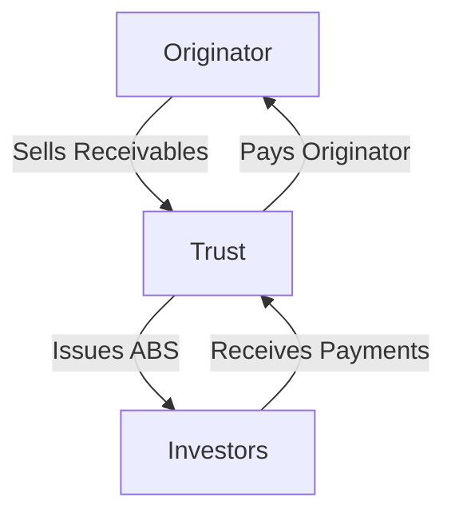

## 3.7.3 Asset-Backed Securities (ABS)

Asset-Backed Securities (ABS) are a cornerstone of modern financial markets, providing investors with opportunities to gain exposure to a diverse range of underlying assets. This section will delve into the intricate world of ABS, exploring their definition, structure, characteristics, benefits, risks, regulatory considerations, and their relevance to the Securities Industry Essentials (SIE) Exam.

### Definition and Structure

**Asset-Backed Securities (ABS)** are financial instruments that are backed by a pool of assets, typically loans or receivables other than mortgages. These underlying assets generate cash flows, which are used to pay interest and principal to ABS investors. Common examples of underlying assets include auto loans, credit card receivables, and student loans.

#### Securitization Process

The securitization process involves financial institutions pooling various receivables and selling them to a trust. This trust then issues ABS to investors. The process can be visualized as follows:

This process allows originators to offload risk and obtain liquidity, while investors gain access to a diversified pool of assets.

#### Tranching

ABS are often divided into different tranches, each with varying levels of risk and return. Tranching allows investors to choose securities that match their risk tolerance and investment goals. Higher tranches typically have lower risk and yield, while lower tranches offer higher risk and potential returns.

#### Credit Enhancement

To improve the credit ratings of ABS, issuers use credit enhancement techniques such as overcollateralization, where the value of the underlying assets exceeds the value of the ABS issued, or guarantees from third parties.

### Characteristics

#### Types of ABS

- **Auto Loan ABS:** Backed by payments from car loans.
- **Credit Card ABS:** Secured by credit card receivables.
- **Student Loan ABS:** Based on educational loan payments.

Each type of ABS offers unique risk and return profiles, influenced by the characteristics of the underlying assets.

### Benefits

#### Diversification

ABS provide investors with exposure to a broad range of consumer loans and receivables, enhancing portfolio diversification.

#### Potential for Higher Yields

Due to the additional risks associated with the underlying assets, ABS can offer higher yields compared to other fixed-income investments.

### Risks

#### Credit Risk

This is the risk of default on the underlying loans. If borrowers fail to make payments, the cash flows to ABS investors may be reduced.

#### Prepayment Risk

Borrowers may pay off their loans early, leading to changes in the expected cash flows. This can impact the returns on ABS, particularly for those with higher interest rates.

#### Extension Risk

If borrowers pay more slowly than expected, the expected payments to ABS investors may be delayed, affecting cash flow timing.

#### Complexity

The structure and associated risks of ABS can be complex, requiring a deep understanding to assess properly.

#### Liquidity Risk

Some ABS may not have active secondary markets, making it difficult to sell the securities quickly without affecting their price.

### Regulatory Considerations

ABS must be registered with the Securities and Exchange Commission (SEC), which requires disclosure of the underlying assets and risk factors. Firms must ensure that ABS offerings comply with securities laws and suitability requirements.

### Suitability Considerations

ABS are suitable for investors seeking income and willing to accept the risks associated with the underlying assets. They are not suitable for investors who require simple, less risky investments or need liquidity.

### ABS and the SIE Exam

For the SIE Exam, understanding the concept of securitization and how ABS are structured is crucial. Recognize the benefits and specific risks like credit and prepayment risk. Be familiar with regulatory considerations and investor suitability.

### Glossary

- **Asset-Backed Security (ABS):** A security backed by a pool of non-mortgage assets like loans or receivables.
- **Securitization:** The process of pooling assets and issuing securities backed by those assets.

### References

- **SEC Investor Publications:** [Asset-Backed Securities](https://www.sec.gov/fast-answers/answersassetbackedhtm.html)
- **FINRA Investor Alerts:** [Asset-Backed Securities—Beware of Complexities and Risks](https://www.finra.org/investors/alerts/asset-backed-securities)

---

## FINRA SIE Exam Practice Questions



### Which of the following is a characteristic of Asset-Backed Securities (ABS)?

- [x] Backed by a pool of non-mortgage assets
- [ ] Issued by the Federal Reserve
- [ ] Exclusively backed by mortgage loans
- [ ] Only available to institutional investors

> **Explanation:** ABS are backed by a pool of non-mortgage assets such as loans or receivables, unlike mortgage-backed securities.

### What is the primary purpose of tranching in ABS?

- [x] To offer varying levels of risk and return
- [ ] To increase the overall risk of the security
- [ ] To ensure all tranches have equal returns
- [ ] To reduce the number of investors

> **Explanation:** Tranching allows ABS to be divided into segments with different risk and return profiles, catering to various investor preferences.

### What is credit enhancement in the context of ABS?

- [x] Techniques to improve credit ratings
- [ ] A method to reduce interest rates
- [ ] A way to increase loan amounts
- [ ] A strategy to diversify assets

> **Explanation:** Credit enhancement involves techniques such as overcollateralization to improve the credit ratings of ABS.

### Which type of ABS is backed by payments from car loans?

- [x] Auto Loan ABS
- [ ] Credit Card ABS
- [ ] Student Loan ABS
- [ ] Mortgage-Backed Securities

> **Explanation:** Auto Loan ABS are backed by payments from car loans, providing investors exposure to this asset class.

### What is a potential benefit of investing in ABS?

- [x] Higher yields compared to other fixed-income investments
- [ ] Guaranteed returns
- [x] Diversification
- [ ] No associated risks

> **Explanation:** ABS can offer higher yields due to additional risks and provide diversification by exposing investors to a range of consumer loans.

### What risk involves borrowers paying off their loans early?

- [x] Prepayment Risk
- [ ] Credit Risk
- [ ] Liquidity Risk
- [ ] Extension Risk

> **Explanation:** Prepayment risk occurs when borrowers pay off loans early, affecting the expected cash flows to ABS investors.

### Why is liquidity risk a concern for some ABS?

- [x] They may not have active secondary markets
- [ ] They are always in high demand
- [x] Selling quickly can affect their price
- [ ] They are backed by government guarantees

> **Explanation:** Liquidity risk arises because some ABS may lack active secondary markets, making it difficult to sell without affecting the price.

### What regulatory body requires ABS to be registered?

- [x] Securities and Exchange Commission (SEC)
- [ ] Federal Reserve
- [ ] Financial Industry Regulatory Authority (FINRA)
- [ ] Department of the Treasury

> **Explanation:** The SEC requires ABS to be registered, ensuring disclosure of underlying assets and risk factors.

### Which of the following is NOT a type of ABS?

- [x] Mortgage-Backed Securities
- [ ] Auto Loan ABS
- [ ] Credit Card ABS
- [ ] Student Loan ABS

> **Explanation:** Mortgage-Backed Securities are not considered ABS; they are backed by mortgage loans, while ABS are backed by non-mortgage assets.

### True or False: ABS are suitable for investors who require simple, less risky investments.

- [ ] True
- [x] False

> **Explanation:** ABS are not suitable for investors who require simple, less risky investments due to their complexity and associated risks.


