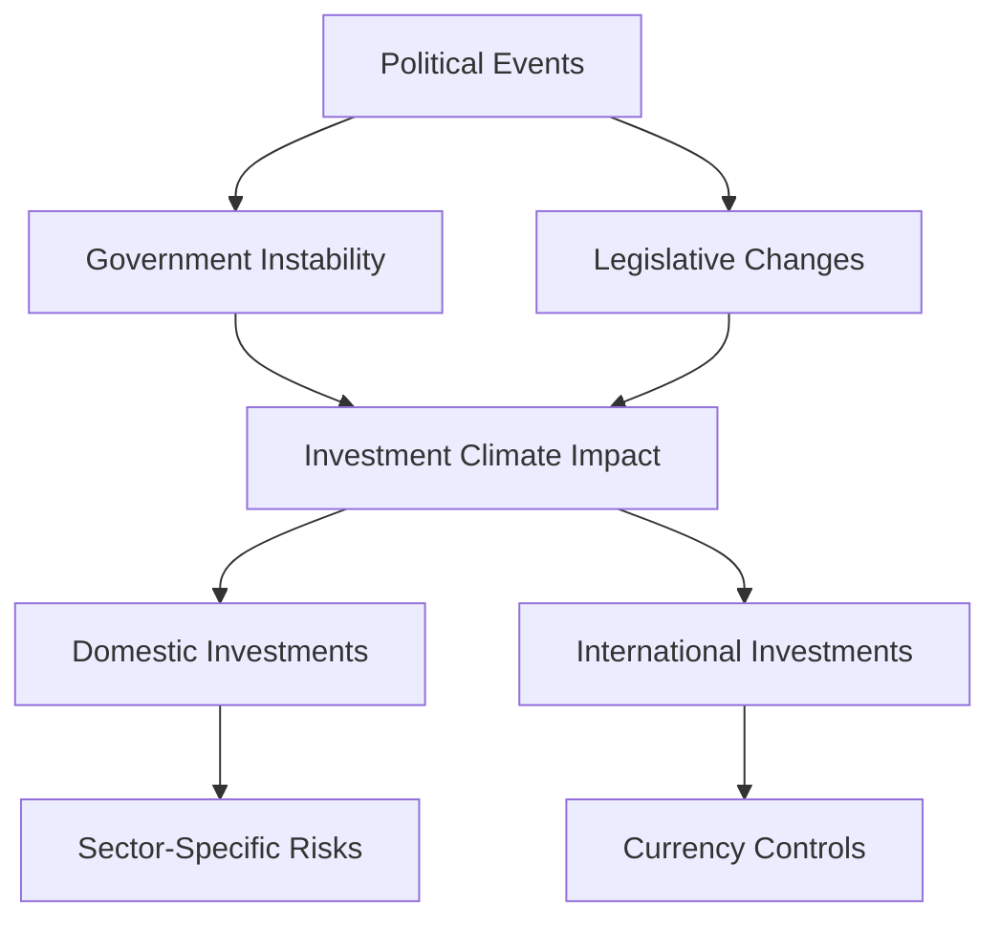

## 3.8.7 Political and Legislative Risk

Political and legislative risk is a critical consideration for investors in the securities market, as it involves the potential for investment losses due to changes or instability in government, legislation, or regulatory environments. This section will delve into the nuances of political and legislative risk, offering insights into its characteristics, impacts on investments, management strategies, and relevance to the Securities Industry Essentials (SIE) Exam.

### Definition

**Political and Legislative Risk**: This type of risk arises from the possibility that political decisions, events, or changes in legislation will adversely affect the value of investments. It encompasses a wide range of scenarios, from shifts in government policies to geopolitical tensions and regulatory reforms.

### Characteristics

#### Changing Laws and Regulations

- **New Legislation**: Changes in laws can have significant implications for various industries. For example, new tax laws can alter the profitability of certain investments, while environmental regulations might increase operational costs for companies in specific sectors.
- **Regulatory Changes**: Adjustments in regulatory frameworks can impact market operations. For instance, stricter financial regulations can affect the banking sector's profitability and operational flexibility.

#### Government Instability

- **Political Unrest**: Situations such as coups, revolutions, or civil unrest can destabilize investment climates, particularly in emerging markets. These events can lead to abrupt changes in economic policies or even the expropriation of foreign assets.
- **Leadership Changes**: A change in government leadership can result in policy shifts that affect economic stability and investor confidence.

#### Policy Shifts

- **Monetary Policy Changes**: Alterations in interest rates or central bank policies can influence economic conditions, affecting investment returns.
- **Fiscal Policy Adjustments**: Changes in government spending or taxation can impact economic growth and sector-specific investments.

### Impact on Investments

#### Domestic Investments

- **Sector-Specific Regulations**: Legislation targeting specific sectors, such as healthcare or energy, can lead to increased compliance costs or changes in market dynamics, affecting investment returns.

#### International Investments

- **Political Instability**: Countries with unstable political environments pose a higher risk of expropriation or nationalization of assets. Investors must be wary of such risks when investing abroad.
- **Currency Controls**: Government interventions in currency markets can create currency risk, affecting the value of international investments.

#### Currency Controls

- **Exchange Rate Policies**: Governments may implement controls to stabilize their currency, which can impact foreign exchange rates and, consequently, the value of international investments.

### Management Strategies

#### Political Risk Insurance

- **Coverage for Political Events**: Investors can purchase political risk insurance to protect against losses from specific political events, such as expropriation, political violence, or currency inconvertibility. This is particularly useful for investments in high-risk regions.

#### Diversification

- **Geographical Diversification**: By spreading investments across multiple countries and regions, investors can mitigate the impact of political and legislative risks in any single location.
- **Sector Diversification**: Investing in a variety of sectors can reduce exposure to sector-specific legislative changes.

#### Staying Informed

- **Monitoring Political Developments**: Keeping abreast of political and legislative changes allows investors to adjust their portfolios proactively. This involves following news, government announcements, and expert analyses.

### Political and Legislative Risk and the SIE Exam

For the SIE Exam, it is essential to understand how political and legislative changes can affect investments. Candidates should:

- **Recognize Risks**: Be aware of the heightened risk associated with investing in politically unstable regions.
- **Identify Strategies**: Familiarize themselves with strategies to manage political risk, such as diversification and political risk insurance.
- **Understand Impacts**: Grasp how changes in legislation can impact different sectors and investment products.

### Glossary

- **Political Risk**: The risk of investment losses due to political instability or changes in government policies.
- **Legislative Risk**: The risk that new laws or regulations will negatively impact investments.

### References

- **Investopedia**: [Understanding Political Risk](https://www.investopedia.com/terms/p/politicalrisk.asp)
- **World Bank**: [Political Risk Insurance](https://www.worldbank.org/en/programs/miga-political-risk-insurance)

### Diagrams and Visuals

To enhance understanding, consider the following diagram that outlines the relationship between political events and investment risks.

### Best Practices and Common Pitfalls

- **Best Practices**: Regularly review and adjust investment strategies to account for political and legislative developments. Consider consulting with experts or using analytical tools to assess risk levels.
- **Common Pitfalls**: Ignoring political developments or failing to diversify investments can lead to significant losses. Over-reliance on a single market or sector increases vulnerability to legislative changes.

### Exam Strategies and Tips

- **Focus on Key Concepts**: Prioritize understanding the definitions and characteristics of political and legislative risks.
- **Practice Application**: Use practice questions to apply knowledge of risk management strategies.
- **Stay Updated**: Keep informed about current political events and legislative changes, as these can provide context for exam questions.

### Summary

Political and legislative risk is an integral part of investment risk management. Understanding the potential impacts of political events and legislative changes on investments is crucial for aspiring securities professionals. By employing strategies such as diversification and political risk insurance, investors can mitigate these risks and safeguard their portfolios.

## SIE Exam Practice Questions: Political and Legislative Risk



### Which of the following best describes political risk?

- [x] The risk of investment losses due to political instability or changes in government policies.
- [ ] The risk of currency fluctuations affecting international investments.
- [ ] The risk of new technology disrupting existing markets.
- [ ] The risk of economic downturns impacting investment returns.

> **Explanation:** Political risk specifically refers to the potential for investment losses due to political instability or changes in government policies, which can affect the investment climate.

### How can investors manage political risk in their portfolios?

- [ ] By investing solely in domestic markets.
- [ ] By focusing on high-risk, high-reward investments.
- [x] By diversifying investments across multiple countries and sectors.
- [ ] By avoiding all investments in emerging markets.

> **Explanation:** Diversification across countries and sectors helps mitigate political risk by spreading exposure and reducing the impact of political events in any single location.

### What is legislative risk?

- [ ] The risk of interest rate changes affecting bond prices.
- [x] The risk that new laws or regulations will negatively impact investments.
- [ ] The risk of technological obsolescence.
- [ ] The risk of market volatility affecting stock prices.

> **Explanation:** Legislative risk involves the potential negative impact of new laws or regulations on investments, affecting their value or profitability.

### Which of the following is a characteristic of political risk insurance?

- [ ] It guarantees a fixed return on investments.
- [x] It protects against losses from specific political events affecting investments abroad.
- [ ] It eliminates all types of investment risk.
- [ ] It is only available for domestic investments.

> **Explanation:** Political risk insurance provides coverage against losses from specific political events, such as expropriation or political violence, particularly for investments in high-risk regions.

### What impact can government instability have on investments?

- [ ] It can lead to increased investment opportunities.
- [x] It can destabilize investment climates and lead to abrupt policy changes.
- [ ] It guarantees higher returns due to increased risk.
- [ ] It has no impact on investment decisions.

> **Explanation:** Government instability can destabilize investment climates, leading to abrupt policy changes and increased risk of expropriation or nationalization of assets.

### How do currency controls affect international investments?

- [x] They can impact currency risk by altering exchange rates.
- [ ] They guarantee stable returns on foreign investments.
- [ ] They eliminate the need for diversification.
- [ ] They have no effect on investment value.

> **Explanation:** Currency controls can impact currency risk by influencing exchange rates, affecting the value of international investments.

### Why is staying informed about political developments important for investors?

- [ ] It guarantees investment success.
- [x] It allows investors to adjust their portfolios proactively.
- [ ] It eliminates all investment risks.
- [ ] It is only relevant for domestic investments.

> **Explanation:** Staying informed about political developments enables investors to adjust their portfolios proactively, mitigating potential risks and capitalizing on opportunities.

### Which strategy is NOT effective in managing legislative risk?

- [x] Ignoring new laws and regulations.
- [ ] Diversifying investments across sectors.
- [ ] Monitoring regulatory changes.
- [ ] Consulting with legal and financial experts.

> **Explanation:** Ignoring new laws and regulations is not effective in managing legislative risk, as it increases vulnerability to negative impacts on investments.

### What is a potential consequence of policy shifts on investments?

- [ ] Guaranteed higher returns.
- [x] Changes in economic conditions affecting investment returns.
- [ ] Elimination of all investment risks.
- [ ] Increased investment stability.

> **Explanation:** Policy shifts, such as changes in monetary or fiscal policies, can alter economic conditions, impacting investment returns and stability.

### What role does diversification play in managing political and legislative risk?

- [ ] It eliminates all investment risks.
- [x] It spreads risk across different regions and sectors, reducing exposure.
- [ ] It guarantees a fixed return on investments.
- [ ] It focuses solely on high-risk investments.

> **Explanation:** Diversification spreads risk across different regions and sectors, reducing exposure to political and legislative risks in any single location.



By understanding and managing political and legislative risks, you can better navigate the complexities of the securities market and enhance your investment strategies. This knowledge is not only vital for the SIE Exam but also for a successful career in the securities industry.
