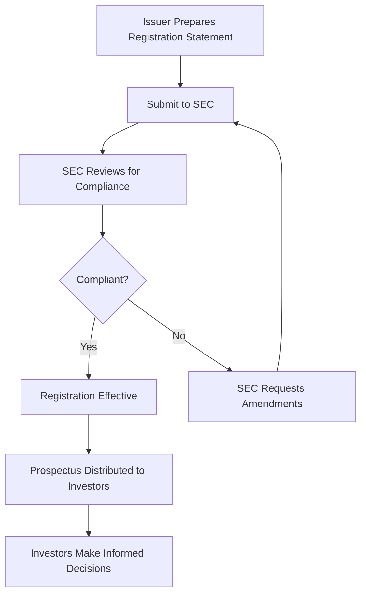

## 5.1.1 Securities Act of 1933

The Securities Act of 1933, often referred to as the "Truth in Securities Act," serves as a cornerstone of U.S. financial regulation. Enacted in the wake of the 1929 stock market crash and the Great Depression, this pivotal legislation aims to restore investor confidence by ensuring transparency and honesty in the securities markets. This section provides a comprehensive overview of the Act's purpose, key provisions, exemptions, and its implications for both investors and issuers, all of which are crucial for the Securities Industry Essentials (SIE) Exam.

### Purpose and Overview

The Securities Act of 1933 primarily aims to:

- **Protect Investors:** By mandating that investors receive significant information about securities being offered for public sale, the Act seeks to empower investors to make informed decisions.
- **Prevent Fraud:** The Act prohibits deceit, misrepresentations, and other fraudulent activities in the sale of securities.

The legislation requires that securities offered to the public must be registered with the Securities and Exchange Commission (SEC), ensuring that all material information is disclosed to potential investors. This transparency is intended to prevent the kind of speculative excesses that characterized the pre-Depression era.

### Key Provisions

#### Registration of Securities

One of the core components of the Securities Act of 1933 is the requirement for the registration of securities. This process involves:

- **Filing a Registration Statement:** Companies must file a registration statement with the SEC before offering securities for sale. This document provides detailed information about the issuer's business operations, financial condition, management, and the securities being offered.
  
- **Content of the Registration Statement:** It includes:
  - A description of the company's properties and business.
  - A description of the security to be offered for sale.
  - Information about the management of the company.
  - Financial statements certified by independent accountants.

The registration statement serves as a comprehensive disclosure document, ensuring that investors have access to all material information necessary to make an informed investment decision.

#### Prospectus Requirement

The prospectus is a critical component of the registration statement and must be provided to potential investors. It includes:

- **Material Information:** Details about the issuer's business, financial condition, and the securities being offered, allowing investors to make informed decisions.
- **Updates:** The prospectus must be updated to reflect any significant changes in the issuer's circumstances.

The prospectus acts as a selling document, offering investors a detailed overview of the investment opportunity and the risks involved.

#### Liability for Misstatements or Omissions

The Securities Act of 1933 imposes civil liability on issuers, underwriters, and others for any false or misleading statements or omissions of material facts in the registration statement or prospectus. This provision serves as a deterrent against fraudulent activities and ensures accountability in the securities market.

### Exemptions from Registration

While the Act mandates registration for most securities, it also provides several exemptions to facilitate capital formation without imposing undue burdens on issuers. Key exemptions include:

- **Private Placements (Regulation D):** Allows companies to raise capital through offers and sales to accredited investors and a limited number of non-accredited investors without registering with the SEC.
  
- **Intrastate Offerings (Rule 147/147A):** Securities sold within a single state to residents of that state are exempt from federal registration, provided they comply with state securities laws.

- **Government Securities:** Securities issued by federal, state, or local governments are exempt from registration.

- **Non-Public Offerings:** Limited offerings not involving a public solicitation are also exempt, allowing issuers to raise funds privately.

These exemptions are designed to balance the need for investor protection with the need to facilitate efficient capital markets.

### Role of the SEC

The SEC plays a crucial role in administering the Securities Act of 1933. Its responsibilities include:

- **Reviewing Registration Statements:** The SEC reviews registration statements for compliance with disclosure requirements but does not guarantee the accuracy or endorse the securities.
  
- **Enforcement:** The SEC can delay or stop an offering if requirements are not met, ensuring that issuers adhere to the Act's provisions.

The SEC's oversight helps maintain the integrity of the securities markets and protects investors from fraudulent activities.

### Importance for Investors and Issuers

#### Investors

For investors, the Securities Act of 1933 provides:

- **Access to Information:** Ensures that investors have access to essential information before making investment decisions, reducing the risk of fraud.
  
- **Protection:** The Act's provisions protect investors from deceit and misrepresentations in the securities market.

#### Issuers

For issuers, compliance with the Securities Act of 1933 is mandatory for accessing public capital markets. Key considerations include:

- **Mandatory Compliance:** Issuers must comply with the Act's registration and disclosure requirements to offer securities to the public.
  
- **Consequences of Non-Compliance:** Failure to comply can result in enforcement actions, fines, and liability for misstatements or omissions.

### The SIE Exam Focus

For the SIE Exam, it is essential to understand:

- **Purpose and Key Provisions:** Grasp the primary objectives of the Securities Act of 1933 and its key provisions, including registration and prospectus requirements.
  
- **Exemptions from Registration:** Recognize the various exemptions available under the Act and their implications for issuers and investors.

- **Liabilities and Penalties:** Comprehend the liabilities and penalties for violations of the Act, including civil liability for misstatements or omissions.

### Glossary

- **Registration Statement:** A set of documents, including a prospectus, that a company must file with the SEC before offering securities to the public.
  
- **Prospectus:** A legal document describing the details of an investment offering to potential investors.

- **Material Information:** Information that a reasonable investor would consider important in making an investment decision.

- **Accredited Investor:** An individual or entity that meets certain financial criteria, such as a high net worth or income level, allowing them to invest in unregistered securities.

### References

- **SEC's Guide to the Securities Act of 1933:** [Introduction - SEC](https://www.sec.gov/answers/about-lawsshtml.html#secacts)
  
- **Investor Publications on Securities Offerings:** [SEC - Offering Information](https://www.sec.gov/spotlight/investor-advisory-committee-2012/offering.pdf)
  
- **Investopedia:** [Securities Act of 1933](https://www.investopedia.com/terms/s/securitiesact1933.asp)

## Diagrams and Visuals

To enhance your understanding of the Securities Act of 1933, consider the following diagram that outlines the process of securities registration and the role of the SEC:

This diagram illustrates the flow of the registration process, highlighting the SEC's role in ensuring compliance and the distribution of the prospectus to investors.

## Best Practices and Common Pitfalls

### Best Practices

- **Thorough Disclosure:** Ensure all material information is disclosed in the registration statement and prospectus to avoid liability.
  
- **Regular Updates:** Keep the prospectus updated to reflect any significant changes in the issuer's circumstances.

- **Understand Exemptions:** Familiarize yourself with the various exemptions from registration to facilitate efficient capital raising.

### Common Pitfalls

- **Inadequate Disclosure:** Failing to disclose all material information can lead to civil liability and enforcement actions.
  
- **Non-Compliance with SEC Requirements:** Not adhering to SEC requirements can result in delays or the halting of an offering.

- **Misunderstanding Exemptions:** Misapplying exemptions can lead to unintentional violations of the Act.

## SIE Exam Practice Questions: Securities Act of 1933



### What is the primary purpose of the Securities Act of 1933?

- [x] To ensure transparency and prevent fraud in the securities market
- [ ] To regulate insider trading
- [ ] To establish the Federal Reserve System
- [ ] To control interest rates

> **Explanation:** The Securities Act of 1933 aims to ensure transparency and prevent fraud by requiring significant information disclosure in securities offerings.

### Which document must companies file with the SEC before offering securities to the public?

- [ ] Financial Statement
- [x] Registration Statement
- [ ] Annual Report
- [ ] Proxy Statement

> **Explanation:** Companies must file a Registration Statement with the SEC, which includes detailed information about the securities being offered.

### What is a prospectus?

- [ ] A summary of a company's financial health
- [x] A legal document describing an investment offering
- [ ] A report on insider trading activities
- [ ] A government-issued bond

> **Explanation:** A prospectus is a legal document that provides details about an investment offering to potential investors.

### Which of the following is an exemption from registration under the Securities Act of 1933?

- [ ] Public Offerings
- [ ] Initial Public Offerings (IPOs)
- [x] Private Placements
- [ ] Secondary Offerings

> **Explanation:** Private Placements are exempt from registration, allowing companies to offer securities to accredited investors without SEC registration.

### What role does the SEC play in the registration process?

- [ ] Guarantees the accuracy of the registration statement
- [x] Reviews registration statements for compliance
- [ ] Endorses the securities being offered
- [ ] Sets the price of the securities

> **Explanation:** The SEC reviews registration statements for compliance but does not guarantee accuracy or endorse securities.

### What is the consequence of failing to disclose material information in a registration statement?

- [ ] No consequence if unintentional
- [ ] Only a warning from the SEC
- [x] Civil liability for misstatements or omissions
- [ ] Automatic approval of the registration

> **Explanation:** Failing to disclose material information can result in civil liability for misstatements or omissions under the Securities Act of 1933.

### Which type of investor is typically involved in private placements?

- [ ] Retail Investors
- [x] Accredited Investors
- [ ] Institutional Investors
- [ ] Government Entities

> **Explanation:** Private placements are typically offered to accredited investors, who meet certain financial criteria.

### What must be included in a registration statement?

- [ ] Only financial statements
- [x] Description of the company's business, management, and securities
- [ ] Marketing materials
- [ ] Insider trading reports

> **Explanation:** A registration statement must include a description of the company's business, management, and the securities being offered.

### How does the Securities Act of 1933 protect investors?

- [x] By requiring disclosure of material information
- [ ] By setting fixed interest rates
- [ ] By guaranteeing investment returns
- [ ] By regulating foreign exchange rates

> **Explanation:** The Act protects investors by requiring the disclosure of material information, allowing them to make informed decisions.

### What is the main focus of the SIE Exam regarding the Securities Act of 1933?

- [ ] Understanding international securities regulations
- [ ] Mastering technical analysis techniques
- [x] Recognizing key provisions and exemptions
- [ ] Learning about corporate governance

> **Explanation:** The SIE Exam focuses on understanding the key provisions of the Securities Act of 1933, including registration requirements and exemptions.



---

This comprehensive guide to the Securities Act of 1933 provides the foundational knowledge necessary for success on the SIE Exam. By understanding the Act's purpose, key provisions, exemptions, and the SEC's role, you will be well-prepared to navigate questions related to this critical piece of securities legislation.
