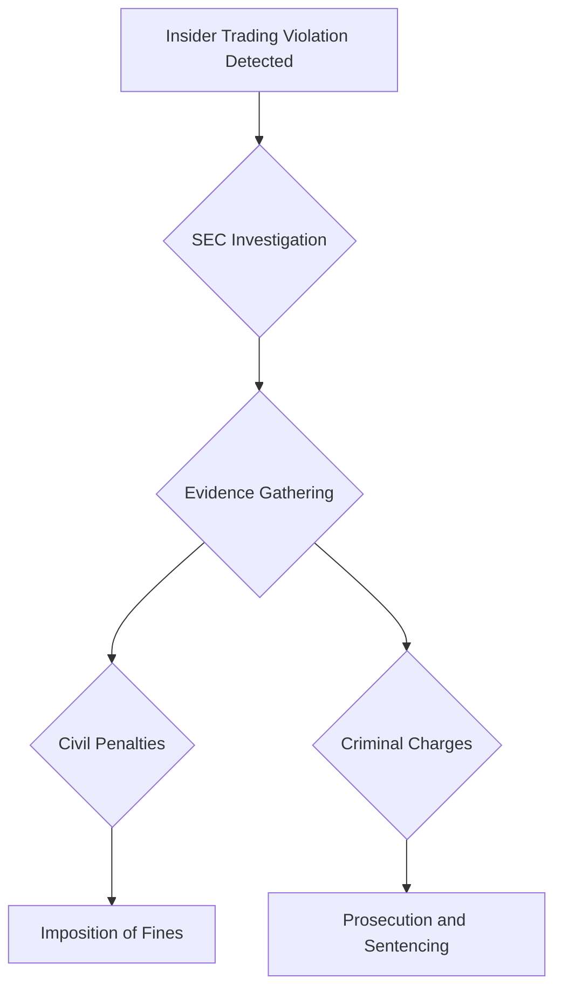

## 5.1.6 Insider Trading and Securities Fraud Enforcement Acts

Understanding the intricacies of insider trading laws and the enforcement acts that govern them is crucial for anyone preparing for the Securities Industry Essentials (SIE) Exam. This section delves into the key legislative acts that shape the regulatory framework for insider trading and securities fraud, providing you with the knowledge needed to excel in your exam and future career in the securities industry.

### Insider Trading Sanctions Act of 1984

#### Purpose

The Insider Trading Sanctions Act of 1984 was a pivotal piece of legislation aimed at strengthening the Securities and Exchange Commission's (SEC) ability to combat insider trading. Prior to this act, the SEC's enforcement capabilities were limited, and penalties were often seen as insufficient deterrents. This act marked a significant step in enhancing the regulatory framework to ensure fair and transparent markets.

#### Key Provisions

- **Increased Civil Penalties:** The act introduced treble damages, allowing the SEC to impose civil penalties up to three times the profit gained or loss avoided through insider trading. This punitive measure was designed to deter potential violators by significantly increasing the financial consequences of illegal trading activities.
  
- **Criminal Prosecutions:** The act empowered authorities to pursue criminal charges against individuals and entities involved in insider trading, with substantial fines and potential imprisonment. This dual approach of civil and criminal penalties underscored the seriousness of insider trading violations.

### Insider Trading and Securities Fraud Enforcement Act of 1988

#### Purpose

Building on the 1984 act, the Insider Trading and Securities Fraud Enforcement Act of 1988 further enhanced the regulatory framework by introducing broader enforcement measures and stiffer penalties. This act aimed to close gaps in the existing legislation and ensure that all parties involved in insider trading, directly or indirectly, could be held accountable.

#### Key Provisions

- **Extended Liability:** The act extended liability to controlling persons, such as broker-dealers, who fail to take appropriate measures to prevent insider trading. This provision emphasized the responsibility of firms to actively monitor and control trading activities within their organizations.

- **Mandatory Policies and Procedures:** Firms were required to implement written policies and procedures designed to prevent insider trading. This requirement highlighted the importance of proactive compliance measures and internal controls.

- **Increased Criminal Penalties:** The act increased the maximum criminal penalties for individuals and firms involved in insider trading. Individuals could face fines up to $5 million and/or imprisonment for up to 20 years, while firms could be fined up to $25 million.

- **Short-Swing Profit Rule:** Insiders were mandated to return profits from short-swing transactions, defined as profits made from buying and selling securities within a six-month period. This rule was intended to prevent insiders from exploiting their access to non-public information for quick gains.

### Definition of Insider Trading

Insider trading involves the buying or selling of a company's securities by individuals who have access to material, non-public information about the company. This illegal practice includes "tipping," where insiders provide confidential information to others who then trade on it. Insider trading undermines market integrity and investor confidence, making it a focal point for regulatory enforcement.

### Responsibilities of Firms and Individuals

To prevent and detect insider trading, firms and individuals must adhere to several key responsibilities:

- **Develop and Enforce Policies:** Firms must establish and enforce comprehensive insider trading policies and procedures. These should include clear guidelines on what constitutes insider trading and the consequences of violations.

- **Employee Education:** Regular training and education programs should be conducted to ensure that all employees understand insider trading laws and the firm's policies. This education is crucial for fostering a culture of compliance.

- **Monitoring and Surveillance:** Firms must actively monitor trading activities to detect any suspicious patterns or potential violations. This involves implementing robust surveillance systems and conducting regular audits.

- **Reporting Suspicious Activities:** Any suspicious trading activities should be promptly reported to the appropriate authorities, such as the SEC or FINRA. Timely reporting can prevent further violations and demonstrate the firm's commitment to compliance.

### Penalties for Violations

The penalties for insider trading violations are severe and can include both civil and criminal consequences:

#### Civil Penalties

- **Treble Damages:** Violators may be required to pay civil penalties up to three times the profits gained or losses avoided through insider trading. This significant financial penalty serves as a strong deterrent against illegal trading activities.

#### Criminal Penalties

- **Individuals:** Individuals convicted of insider trading can face fines up to $5 million and/or imprisonment for up to 20 years. These harsh penalties reflect the serious nature of insider trading violations.

- **Firms:** Firms found guilty of insider trading can be fined up to $25 million. This substantial penalty underscores the importance of corporate responsibility and the need for effective internal controls.

### Significance for the SIE Exam

For the SIE Exam, understanding the laws and regulations surrounding insider trading is essential. Key areas to focus on include:

- **Enforcement Capabilities:** Recognize how the Insider Trading Sanctions Act of 1984 and the Insider Trading and Securities Fraud Enforcement Act of 1988 enhanced the SEC's enforcement capabilities.

- **Obligations of Firms and Individuals:** Be aware of the responsibilities of firms and individuals to prevent and report insider trading, including the implementation of policies and procedures.

- **Penalties:** Understand the severe penalties associated with insider trading violations, including both civil and criminal consequences.

### Glossary

- **Treble Damages:** A monetary penalty amounting to three times the actual damages suffered. This punitive measure is designed to deter illegal activities by significantly increasing the financial consequences.

- **Controlling Person:** An individual or entity with the power to influence the management or policies of a firm. Controlling persons have a heightened responsibility to prevent insider trading within their organizations.

### References

- **SEC's Insider Trading Resources:** [SEC - Insider Trading Laws](https://www.sec.gov/about/laws/seclaws.htm#itsea84)
- **Investopedia:** [Insider Trading and Securities Fraud Enforcement Act of 1988](https://www.investopedia.com/terms/i/itsfea.asp)
- **FINRA's Information on Insider Trading:** [FINRA - Insider Trading](https://www.finra.org/rules-guidance/key-topics/insider-trading)

### Real-World Applications and Case Studies

To further illustrate the impact of insider trading laws, let's explore a few real-world examples and case studies:

#### Case Study: Martha Stewart

One of the most high-profile insider trading cases involved Martha Stewart, a well-known businesswoman and television personality. In 2001, Stewart sold shares of ImClone Systems based on non-public information about a negative FDA decision. Although Stewart was not charged with insider trading, she was found guilty of obstruction of justice and making false statements. This case highlights the importance of transparency and honesty in dealing with regulatory authorities.

#### Case Study: Raj Rajaratnam

Raj Rajaratnam, the founder of the Galleon Group, was convicted of insider trading in 2011. He was found guilty of making millions of dollars in profits by trading on confidential information obtained from insiders at various companies. Rajaratnam's case was one of the largest insider trading scandals in U.S. history and underscored the SEC's commitment to aggressively pursuing insider trading violations.

### Diagrams and Visual Aids

To enhance your understanding of the regulatory framework for insider trading, consider the following diagram illustrating the enforcement process:

This diagram provides a visual representation of the steps involved in investigating and prosecuting insider trading violations, highlighting the dual approach of civil and criminal enforcement.

### Best Practices and Common Pitfalls

When preparing for the SIE Exam, keep the following best practices and common pitfalls in mind:

- **Best Practices:**
  - Familiarize yourself with key legislation and enforcement acts.
  - Understand the roles and responsibilities of firms and individuals in preventing insider trading.
  - Stay updated on recent insider trading cases and regulatory developments.

- **Common Pitfalls:**
  - Overlooking the significance of civil and criminal penalties.
  - Failing to recognize the importance of internal controls and compliance measures.
  - Neglecting to study real-world case studies and their implications for the securities industry.

### Conclusion

Mastering the concepts related to insider trading and securities fraud enforcement acts is essential for success on the SIE Exam and in your future career in the securities industry. By understanding the legislative framework, responsibilities of firms and individuals, and penalties for violations, you'll be well-equipped to navigate the complexities of the securities market and uphold the highest standards of ethical conduct.

---

## SIE Exam Practice Questions: Insider Trading and Securities Fraud Enforcement Acts



### What is the primary purpose of the Insider Trading Sanctions Act of 1984?

- [x] To strengthen the SEC's ability to pursue and penalize insider trading violations.
- [ ] To eliminate all forms of securities fraud.
- [ ] To regulate the issuance of new securities.
- [ ] To provide tax incentives for securities trading.

> **Explanation:** The Insider Trading Sanctions Act of 1984 was designed to strengthen the SEC's enforcement capabilities specifically against insider trading violations by introducing treble damages and enhancing penalties.

### Under the Insider Trading and Securities Fraud Enforcement Act of 1988, who can be held liable for failing to prevent insider trading?

- [x] Controlling persons, such as broker-dealers.
- [ ] Only the individuals directly involved in trading.
- [ ] Only the company's CEO.
- [ ] The SEC itself.

> **Explanation:** The 1988 act extended liability to controlling persons, such as broker-dealers, who fail to take appropriate measures to prevent insider trading, emphasizing the responsibility of firms to monitor trading activities.

### What are treble damages?

- [x] A monetary penalty amounting to three times the actual damages suffered.
- [ ] A fine equal to the profit made from insider trading.
- [ ] A fixed penalty of $1 million.
- [ ] A penalty that involves imprisonment only.

> **Explanation:** Treble damages refer to a penalty that is three times the actual damages, designed to deter insider trading by significantly increasing financial consequences.

### What is considered insider trading?

- [x] Trading based on material, non-public information.
- [ ] Trading based on public press releases.
- [ ] Trading based on market rumors.
- [ ] Trading based on historical stock performance.

> **Explanation:** Insider trading involves buying or selling securities based on material, non-public information, which gives an unfair advantage and undermines market integrity.

### What is the maximum fine for individuals under the Insider Trading and Securities Fraud Enforcement Act of 1988?

- [ ] $1 million
- [ ] $2 million
- [x] $5 million
- [ ] $10 million

> **Explanation:** The 1988 act increased the maximum criminal penalties for individuals to $5 million, reflecting the seriousness of insider trading violations.

### Which rule requires insiders to return profits from short-swing transactions?

- [x] Short-Swing Profit Rule
- [ ] Long-Term Capital Gains Rule
- [ ] Insider Trading Compliance Rule
- [ ] Securities Exchange Act Rule

> **Explanation:** The Short-Swing Profit Rule mandates that insiders return profits made from buying and selling securities within a six-month period, preventing quick gains from non-public information.

### What is the role of firms in preventing insider trading?

- [x] Implementing written policies and procedures to prevent insider trading.
- [ ] Encouraging employees to trade frequently.
- [ ] Keeping all trading activities confidential.
- [ ] Allowing employees to trade based on company rumors.

> **Explanation:** Firms are required to implement written policies and procedures to prevent insider trading, emphasizing proactive compliance and internal controls.

### What is the maximum fine for firms under the Insider Trading and Securities Fraud Enforcement Act of 1988?

- [ ] $10 million
- [ ] $15 million
- [ ] $20 million
- [x] $25 million

> **Explanation:** Firms found guilty of insider trading can face fines up to $25 million, highlighting the importance of corporate responsibility and effective internal controls.

### Which of the following is a common pitfall when studying insider trading laws?

- [ ] Overemphasizing the role of the SEC.
- [ ] Focusing solely on civil penalties.
- [x] Overlooking the significance of both civil and criminal penalties.
- [ ] Ignoring the importance of employee education.

> **Explanation:** A common pitfall is overlooking the significance of both civil and criminal penalties, which are crucial for understanding the full scope of insider trading enforcement.

### Why is understanding insider trading laws important for the SIE Exam?

- [x] It helps recognize the obligations of firms and individuals to prevent and report insider trading.
- [ ] It is only relevant for legal professionals.
- [ ] It is not covered in the SIE Exam.
- [ ] It only applies to international markets.

> **Explanation:** Understanding insider trading laws is important for the SIE Exam as it helps recognize the obligations of firms and individuals to prevent and report insider trading, a key area of the exam.



By mastering the content in this section, you will be well-prepared to tackle questions on insider trading and securities fraud enforcement acts in the SIE Exam. Remember to review real-world cases and stay updated on recent regulatory developments to enhance your understanding and application of these crucial concepts.
