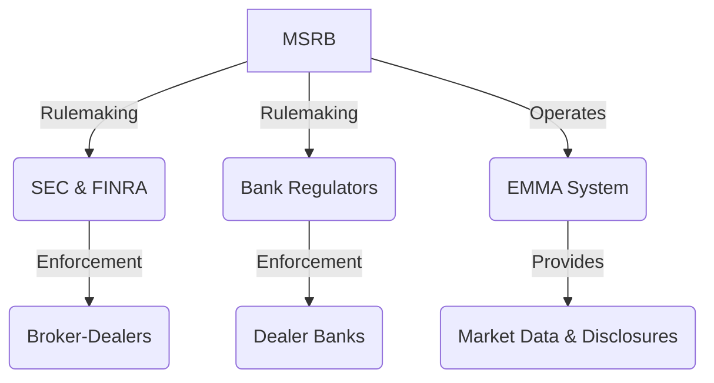

## 5.2.2 MSRB Rules for Municipal Securities

The Municipal Securities Rulemaking Board (MSRB) plays a pivotal role in the U.S. securities regulatory framework, specifically focusing on the municipal securities market. As a self-regulatory organization (SRO), the MSRB establishes rules and standards to ensure market integrity and protect investors. This section provides a comprehensive overview of the MSRB, its structure, key rules, and the significance of these rules for the Securities Industry Essentials (SIE) Exam.

### Overview of the MSRB

The MSRB was established by Congress in 1975 to create a fair and efficient municipal securities market. It develops rules for broker-dealers and banks involved in municipal securities transactions, as well as municipal advisors. The MSRB's mission is to protect municipal securities investors, issuers, and the public interest by promoting a fair and efficient market.

#### MSRB’s Structure and Authority

The MSRB is governed by a board of directors that includes representatives from regulated entities, public members, and municipal advisors. Its authority is primarily rulemaking, and it does not have enforcement power. Instead, the MSRB relies on the Securities and Exchange Commission (SEC), the Financial Industry Regulatory Authority (FINRA), and bank regulators to enforce its rules.

##### Rulemaking

The MSRB develops rules that regulate the activities of municipal securities dealers and advisors. These rules are designed to ensure ethical practices, transparency, and investor protection in the municipal securities market.

##### No Enforcement Power

While the MSRB writes rules, it does not enforce them. Enforcement is carried out by:

- **SEC and FINRA**: Responsible for broker-dealers.
- **Bank Regulators**: Oversee dealer banks.

##### EMMA System

The MSRB operates the Electronic Municipal Market Access (EMMA) system, which provides free public access to municipal securities disclosures, trade data, and other market information. EMMA is a critical tool for investors and market participants seeking transparency and timely information.

### Key MSRB Rules

The MSRB's rules are organized into a series known as the G-Rules. These rules cover various aspects of municipal securities activities, from ethical conduct to professional qualifications.

#### Rule G-17: Conduct of Municipal Securities Activities

Rule G-17 requires dealers to deal fairly with all persons and prohibits deceptive, dishonest, or unfair practices. This rule is fundamental in promoting ethical conduct and protecting investors in the municipal securities market.

##### Example Scenario

Imagine a municipal securities dealer who misrepresents the risks associated with a bond offering to a potential investor. Under Rule G-17, such conduct would be deemed unethical and subject to enforcement actions by the SEC or FINRA.

#### Rule G-19: Suitability of Recommendations

Rule G-19 mandates that dealers ensure their recommendations are suitable based on the customer's financial situation, investment objectives, and risk tolerance. This rule emphasizes the importance of understanding customer needs and providing appropriate investment advice.

##### Practical Application

A dealer recommending high-yield municipal bonds to a conservative investor without assessing their risk tolerance would violate Rule G-19. Dealers must conduct thorough due diligence to ensure their recommendations align with client profiles.

#### Rule G-37: Political Contributions and Prohibitions on Municipal Securities Business

Rule G-37 limits political contributions by dealers to prevent "pay-to-play" practices. It aims to eliminate the influence of political contributions on the awarding of municipal securities business.

##### Compliance Considerations

Dealers must track and report political contributions to ensure compliance with Rule G-37. Failure to comply can result in significant penalties and restrictions on conducting municipal securities business.

#### Rule G-42: Duties of Non-Solicitor Municipal Advisors

Rule G-42 outlines the obligations of municipal advisors, including fiduciary duties to their municipal entity clients. Advisors must act in the best interests of their clients, providing honest and transparent advice.

##### Case Study

A municipal advisor recommending a complex financial product that benefits their firm more than the client would breach their fiduciary duty under Rule G-42. Advisors must prioritize client interests above their own.

### Professional Qualification Requirements

The MSRB sets professional qualification standards for individuals involved in municipal securities activities. These include:

- **Series 52**: For Municipal Securities Representatives.
- **Series 53**: For Municipal Securities Principals.

These examinations ensure that professionals possess the necessary knowledge and skills to operate effectively in the municipal securities market.

### Municipal Advisor Regulation

Municipal advisors play a crucial role in advising municipal entities on financial products and securities issuance. The MSRB regulates these advisors to ensure they adhere to high ethical and professional standards.

#### Definition

Municipal advisors are individuals or firms that provide advice to or on behalf of municipal entities regarding municipal financial products or the issuance of municipal securities.

#### Registration and Compliance

Municipal advisors must register with both the SEC and the MSRB. They are required to comply with MSRB rules specific to municipal advisors, ensuring they uphold their fiduciary duties and provide transparent, honest advice.

### Significance for the SIE Exam

Understanding the MSRB and its rules is essential for success on the SIE Exam. Key areas to focus on include:

- The role of the MSRB and its relationship with other regulators.
- Key rules affecting municipal securities activities.
- Professional qualification requirements for municipal securities professionals.

### Glossary

- **Municipal Securities**: Debt securities issued by states, municipalities, or counties to finance public projects.
- **Municipal Securities Rulemaking Board (MSRB)**: The SRO responsible for regulating municipal securities dealers and advisors.
- **EMMA System**: An online platform providing access to municipal securities information.

### References

- **MSRB Official Website**: [MSRB](http://www.msrb.org/)
- **EMMA**: [Electronic Municipal Market Access](https://emma.msrb.org/)
- **MSRB Rulebook**: [MSRB Rules](http://www.msrb.org/Rules-and-Interpretations/MSRB-Rules.aspx)

## FINRA SIE Exam Practice Questions



### What is the primary role of the MSRB?

- [x] Rulemaking for municipal securities
- [ ] Enforcement of securities laws
- [ ] Trading municipal securities
- [ ] Providing investment advice

> **Explanation:** The MSRB is responsible for creating rules governing the municipal securities market, but it does not enforce these rules.

### Which rule requires dealers to deal fairly with all persons?

- [x] Rule G-17
- [ ] Rule G-19
- [ ] Rule G-37
- [ ] Rule G-42

> **Explanation:** Rule G-17 focuses on the ethical conduct of dealers, ensuring fair treatment and prohibiting deceptive practices.

### What does Rule G-19 focus on?

- [x] Suitability of recommendations
- [ ] Political contributions
- [ ] Fiduciary duties
- [ ] Market manipulation

> **Explanation:** Rule G-19 mandates that dealers ensure their recommendations are suitable based on customer information.

### What system does the MSRB operate to provide access to municipal securities information?

- [x] EMMA
- [ ] FINRA
- [ ] SEC
- [ ] NASDAQ

> **Explanation:** The MSRB operates the Electronic Municipal Market Access (EMMA) system for public access to municipal securities data.

### Which exam is required for Municipal Securities Representatives?

- [x] Series 52
- [ ] Series 53
- [ ] Series 7
- [ ] Series 63

> **Explanation:** The Series 52 exam is specifically for Municipal Securities Representatives.

### What is the purpose of Rule G-37?

- [x] To limit political contributions by dealers
- [ ] To ensure suitability of recommendations
- [ ] To regulate fiduciary duties
- [ ] To enforce market manipulation laws

> **Explanation:** Rule G-37 aims to prevent "pay-to-play" practices by limiting political contributions.

### Who enforces MSRB rules for broker-dealers?

- [x] SEC and FINRA
- [ ] MSRB
- [ ] Municipal advisors
- [ ] State regulators

> **Explanation:** The SEC and FINRA are responsible for enforcing MSRB rules for broker-dealers.

### What is a key responsibility of municipal advisors under Rule G-42?

- [x] Fiduciary duty to municipal clients
- [ ] Trading municipal securities
- [ ] Enforcing MSRB rules
- [ ] Conducting audits

> **Explanation:** Rule G-42 outlines the fiduciary duties of municipal advisors to act in the best interests of their clients.

### Municipal advisors must register with which organizations?

- [x] SEC and MSRB
- [ ] FINRA and NASDAQ
- [ ] State regulators and MSRB
- [ ] SEC and FINRA

> **Explanation:** Municipal advisors are required to register with both the SEC and the MSRB.

### True or False: The MSRB has the authority to enforce its rules.

- [ ] True
- [x] False

> **Explanation:** The MSRB does not have enforcement power; enforcement is carried out by other regulatory bodies such as the SEC and FINRA.


