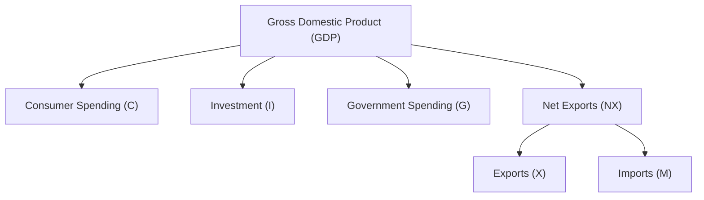

## 6.1.1 Gross Domestic Product (GDP)

Understanding Gross Domestic Product (GDP) is crucial for anyone preparing for the Securities Industry Essentials (SIE) Exam. As a primary indicator of economic health, GDP influences investment decisions, interest rates, employment, and inflation. This section will provide you with a comprehensive understanding of GDP, its components, and its significance in both the U.S. and global economic contexts.

### Understanding Gross Domestic Product (GDP)

#### Definition

Gross Domestic Product (GDP) is the total monetary value of all goods and services produced within a country's borders over a specific period, typically measured quarterly or annually. It serves as a comprehensive scorecard of a country's economic health, reflecting the economic activity and productivity of a nation.

#### Components of GDP

GDP is composed of four main components, each representing a different sector of the economy:

1. **Consumer Spending (C):** This is the total expenditure by households on goods and services. It includes spending on durable goods (e.g., cars, appliances), nondurable goods (e.g., food, clothing), and services (e.g., healthcare, education).

2. **Investment (I):** This component includes business expenditures on capital goods, such as machinery and equipment, and residential construction. It also covers changes in business inventories.

3. **Government Spending (G):** This is the total government expenditures on goods and services. It includes spending on defense, education, public safety, and infrastructure. However, it excludes transfer payments like pensions and unemployment benefits, as these do not reflect the production of new goods and services.

4. **Net Exports (NX):** This is the value of a country's exports minus its imports (Exports (X) - Imports (M)). A positive net export indicates that a country exports more than it imports, contributing positively to GDP.

The formula for calculating GDP is:

 \text{GDP} = C + I + G + (X - M) 

#### Nominal vs. Real GDP

Understanding the difference between nominal and real GDP is essential for assessing economic performance accurately.

- **Nominal GDP:** This measures the value of all finished goods and services produced within a country's borders at current market prices. It does not account for inflation, which can distort the true picture of economic growth.

- **Real GDP:** This is nominal GDP adjusted for inflation, reflecting the value of all goods and services produced at constant prices. Real GDP provides a more accurate assessment of economic growth over time, as it removes the effects of price changes.

**Importance of Real GDP:** Real GDP is crucial for comparing economic output from one year to another and for making informed policy and investment decisions. It allows economists and investors to determine whether an economy is genuinely growing or if apparent growth is merely the result of inflation.

#### GDP Growth Rate

The GDP growth rate is a key indicator of economic performance, showing how fast a country's economy is growing or contracting. It is typically expressed as a percentage increase or decrease from one period to the next.

- **Positive Growth:** Indicates economic expansion, suggesting increased production and consumption, which can lead to higher employment and income levels.

- **Negative Growth:** Indicates economic contraction. If this occurs over two consecutive quarters, it is typically considered a recession, signaling decreased economic activity and potential increases in unemployment.

#### GDP per Capita

GDP per capita is GDP divided by the population of a country. It serves as an indicator of a country's standard of living, providing insight into the average economic output per person. Higher GDP per capita usually suggests a higher standard of living and greater economic well-being.

### Significance for the SIE Exam

For the SIE Exam, understanding GDP is vital as it is a primary economic indicator affecting investment decisions. GDP influences interest rates, employment levels, and inflation, all of which are crucial considerations for securities professionals. You must be able to differentiate between nominal and real GDP and understand their implications on the economy and financial markets.

### Glossary

- **Gross Domestic Product (GDP):** The total value of all goods and services produced within a country.
- **Real GDP:** GDP adjusted for inflation, reflecting the value of goods and services at constant prices.
- **Nominal GDP:** GDP measured at current market prices without inflation adjustment.

### Real-World Applications and Regulatory Scenarios

GDP figures are closely monitored by investors, policymakers, and analysts as they provide insights into the economic health and potential future performance of an economy. For example, a rising GDP may lead to higher interest rates as central banks attempt to control inflation, affecting bond prices and yields. Conversely, a declining GDP might prompt monetary easing to stimulate growth, impacting equity markets positively.

### Practical Examples and Case Studies

Consider a scenario where the U.S. GDP growth rate is reported at 3% for a particular quarter. This positive growth suggests economic expansion, likely leading to increased business investments and consumer spending. As a securities professional, understanding these dynamics can help you anticipate market trends and make informed investment decisions.

### Step-by-Step Guidance: Calculating GDP

1. **Collect Data:** Gather data on consumer spending, investment, government spending, and net exports.

2. **Apply the GDP Formula:** Use the formula \\( \text{GDP} = C + I + G + (X - M) \\) to calculate GDP.

3. **Adjust for Inflation:** To find real GDP, adjust the nominal GDP using a GDP deflator or price index.

4. **Analyze Trends:** Compare GDP figures over multiple periods to identify trends and economic cycles.

### Diagrams and Visual Aids

To enhance understanding, consider the following diagram illustrating the components of GDP:

### Best Practices, Common Pitfalls, and Strategies

- **Best Practices:** Regularly review GDP reports and economic forecasts to stay informed about economic conditions. Use real GDP for long-term economic analysis to account for inflation.

- **Common Pitfalls:** Avoid relying solely on nominal GDP for economic assessments, as it can be misleading due to inflation. Be cautious of overinterpreting short-term GDP fluctuations without considering broader economic contexts.

- **Strategies:** Use GDP growth rates to assess economic cycles and inform investment strategies. Monitor GDP per capita for insights into potential market opportunities in different regions.

### References and Additional Resources

- **Bureau of Economic Analysis (BEA):** [U.S. GDP Data and Reports](https://www.bea.gov/data/gdp/gross-domestic-product)
- **World Bank GDP Information:** [World Bank - GDP Data](https://data.worldbank.org/indicator/NY.GDP.MKTP.CD)
- **Investopedia:** [Gross Domestic Product (GDP) Definition](https://www.investopedia.com/terms/g/gdp.asp)

### Summary

Gross Domestic Product (GDP) is a fundamental economic indicator that provides insights into the health and performance of an economy. Understanding its components, differences between nominal and real GDP, and its implications for investment decisions is crucial for success in the SIE Exam. By mastering GDP analysis, you will be better equipped to navigate the complexities of the securities industry and make informed financial decisions.

## FINRA SIE Exam Practice Questions



### What does GDP stand for?

- [x] Gross Domestic Product
- [ ] General Domestic Product
- [ ] Gross Domestic Profit
- [ ] General Domestic Profit

> **Explanation:** GDP stands for Gross Domestic Product, which measures the total monetary value of all goods and services produced within a country's borders.

### Which of the following is NOT a component of GDP?

- [ ] Consumer Spending
- [ ] Government Spending
- [x] Transfer Payments
- [ ] Investment

> **Explanation:** Transfer payments are not included in GDP as they do not reflect the production of new goods and services.

### How is real GDP different from nominal GDP?

- [x] Real GDP is adjusted for inflation
- [ ] Real GDP is measured at current prices
- [ ] Real GDP excludes government spending
- [ ] Real GDP includes only consumer spending

> **Explanation:** Real GDP is adjusted for inflation, providing a more accurate assessment of economic growth over time.

### What does a positive GDP growth rate indicate?

- [x] Economic expansion
- [ ] Economic contraction
- [ ] Inflation
- [ ] Deflation

> **Explanation:** A positive GDP growth rate indicates economic expansion, suggesting increased production and consumption.

### How is GDP per capita calculated?

- [x] GDP divided by the population
- [ ] GDP multiplied by the population
- [ ] GDP minus net exports
- [ ] GDP plus government spending

> **Explanation:** GDP per capita is calculated by dividing GDP by the population, serving as an indicator of a country's standard of living.

### Which organization provides official U.S. GDP data?

- [x] Bureau of Economic Analysis (BEA)
- [ ] Federal Reserve
- [ ] World Bank
- [ ] International Monetary Fund (IMF)

> **Explanation:** The Bureau of Economic Analysis (BEA) provides official U.S. GDP data and reports.

### What is the formula for calculating GDP?

- [x] GDP = C + I + G + (X - M)
- [ ] GDP = C + G + (X - M)
- [ ] GDP = I + G + C
- [ ] GDP = C + I + G

> **Explanation:** The formula for calculating GDP is GDP = C + I + G + (X - M), where C is consumer spending, I is investment, G is government spending, and X - M is net exports.

### Why is real GDP important?

- [x] It provides a more accurate assessment of economic growth
- [ ] It measures economic output using current prices
- [ ] It excludes consumer spending
- [ ] It includes only government spending

> **Explanation:** Real GDP is important because it provides a more accurate assessment of economic growth by adjusting for inflation.

### What does a negative GDP growth rate over two quarters indicate?

- [x] Recession
- [ ] Expansion
- [ ] Inflation
- [ ] Deflation

> **Explanation:** A negative GDP growth rate over two consecutive quarters typically indicates a recession.

### True or False: Nominal GDP is adjusted for inflation.

- [ ] True
- [x] False

> **Explanation:** False. Nominal GDP is not adjusted for inflation; it measures the value of economic output using current prices.


