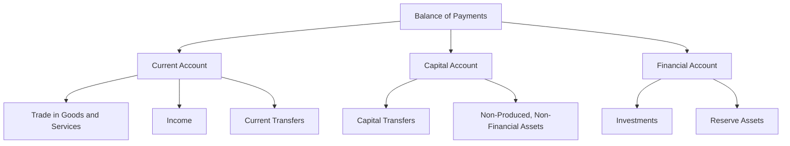

## 6.3.1 Balance of Trade and Payments

Understanding the Balance of Trade (BOT) and Balance of Payments (BOP) is crucial for anyone preparing for the Securities Industry Essentials (SIE) Exam. These economic indicators provide insights into a country's economic health, its position in the global market, and the potential implications for currency valuation and investment decisions. This section will delve into the definitions, components, and significance of BOT and BOP, offering practical examples and scenarios to aid comprehension.

### Balance of Trade (BOT)

#### Definition

The Balance of Trade (BOT) is the difference between the value of a country's exports and imports of goods and services over a specific period. It is a critical component of a nation's current account and reflects the net exports of an economy.

- **Exports:** Goods and services sold to other countries.
- **Imports:** Goods and services purchased from other countries.

#### Trade Surplus and Deficit

- **Trade Surplus:** Occurs when a country's exports exceed its imports. A surplus indicates that a country is selling more abroad than it is buying from foreign markets, which can be a sign of economic strength.
  
  **Example:** If Country A exports $200 billion worth of goods and imports $150 billion, it has a trade surplus of $50 billion.

- **Trade Deficit:** Occurs when a country's imports exceed its exports. A deficit suggests that a country is buying more from abroad than it is selling, which can lead to borrowing from foreign lenders to finance the excess imports.
  
  **Example:** If Country B exports $150 billion and imports $200 billion, it has a trade deficit of $50 billion.

#### Implications of BOT

- **Economic Growth:** A trade surplus can stimulate economic growth as it may lead to higher production and employment levels.
- **Currency Valuation:** Persistent trade deficits can lead to depreciation of a country's currency, making exports cheaper and imports more expensive.
- **Policy Measures:** Countries may implement tariffs or quotas to protect domestic industries and reduce trade deficits.

### Balance of Payments (BOP)

#### Definition

The Balance of Payments (BOP) is a comprehensive record of all economic transactions between residents of a country and the rest of the world during a specific period. It includes the current account, capital account, and financial account, providing a detailed picture of a country's economic interactions with the global economy.

#### Components of BOP

1. **Current Account:**
   - **Trade in Goods and Services:** Records exports and imports of goods and services.
   - **Income:** Includes earnings on investments and wages.
   - **Current Transfers:** Includes remittances, foreign aid, and gifts.

   **Example:** If a country exports $500 billion in goods and services but imports $600 billion, the current account will reflect a deficit of $100 billion.

2. **Capital Account:**
   - **Capital Transfers:** Includes debt forgiveness and transfer of ownership of fixed assets.
   - **Non-Produced, Non-Financial Assets:** Covers transactions involving natural resources and patents.

   **Example:** A foreign company donating machinery to a domestic firm would be recorded in the capital account.

3. **Financial Account:**
   - **Investments:** Records investments in businesses, real estate, bonds, and stocks.
   - **Reserve Assets:** Includes foreign exchange reserves held by the central bank.

   **Example:** If a domestic company invests $50 billion in foreign stocks, it will be recorded as an outflow in the financial account.

#### Importance of BOP

- **Economic Stability:** A balanced BOP indicates a stable economy, while persistent deficits may suggest economic challenges.
- **Exchange Rates:** BOP influences currency exchange rates, affecting international trade competitiveness.
- **Investment Decisions:** Investors use BOP data to assess the economic health of a country and make informed investment decisions.

### Factors Affecting BOT and BOP

#### Exchange Rates

Exchange rates play a pivotal role in determining the BOT and BOP. A stronger currency makes exports more expensive and imports cheaper, potentially leading to a trade deficit. Conversely, a weaker currency can boost exports by making them cheaper for foreign buyers.

#### Economic Policies

Governments may implement various policies to influence BOT and BOP:

- **Tariffs:** Taxes on imports to protect domestic industries.
- **Quotas:** Limits on the quantity of goods that can be imported.
- **Trade Agreements:** Negotiations with other countries to facilitate trade.

**Example:** The North American Free Trade Agreement (NAFTA) aimed to reduce trade barriers between the U.S., Canada, and Mexico, impacting the BOT and BOP of these nations.

#### Competitiveness

A country's productivity, cost of labor, and technological advancements impact its competitiveness in the global market. Higher competitiveness can lead to a trade surplus, while lower competitiveness may result in a trade deficit.

### Significance for the SIE Exam

Understanding the concepts of BOT and BOP is essential for the SIE Exam. These indicators provide insights into international transactions and their impact on economic indicators. Knowledge of how BOT and BOP affect currency valuation and investment decisions is crucial for aspiring securities professionals.

### Glossary

- **Balance of Trade (BOT):** The difference between the value of a country’s exports and imports.
- **Balance of Payments (BOP):** The record of all economic transactions between residents of a country and the rest of the world.

### References

- **International Monetary Fund (IMF):** [Balance of Payments Statistics](https://www.imf.org/en/Data)
- **Investopedia:** [Balance of Trade Definition](https://www.investopedia.com/terms/b/bot.asp)

### Diagrams and Visuals

To enhance understanding, the following Mermaid.js diagram illustrates the components of the Balance of Payments:

### Summary

- The Balance of Trade (BOT) measures the difference between exports and imports, indicating trade surpluses or deficits.
- The Balance of Payments (BOP) records all economic transactions between a country and the rest of the world, including the current, capital, and financial accounts.
- Exchange rates, economic policies, and competitiveness are key factors affecting BOT and BOP.
- Understanding these concepts is crucial for the SIE Exam and for making informed investment decisions.

## Quiz Time!



### What is the Balance of Trade (BOT)?

- [x] The difference between the value of a country's exports and imports.
- [ ] The total value of a country's exports.
- [ ] The total value of a country's imports.
- [ ] The record of all economic transactions between a country and the rest of the world.

> **Explanation:** The Balance of Trade (BOT) measures the difference between the value of a country's exports and imports.

### When does a trade surplus occur?

- [x] When exports exceed imports.
- [ ] When imports exceed exports.
- [ ] When exports equal imports.
- [ ] When there are no imports or exports.

> **Explanation:** A trade surplus occurs when a country's exports exceed its imports.

### What does the Balance of Payments (BOP) include?

- [x] Current account, capital account, and financial account.
- [ ] Only the current account.
- [ ] Only the capital account.
- [ ] Only the financial account.

> **Explanation:** The Balance of Payments (BOP) includes the current account, capital account, and financial account.

### Which factor can affect the Balance of Trade?

- [x] Exchange rates.
- [ ] Population size.
- [ ] Climate conditions.
- [ ] Political elections.

> **Explanation:** Exchange rates can significantly affect the Balance of Trade by influencing the cost of exports and imports.

### What is recorded in the financial account of the BOP?

- [x] Investments in businesses, real estate, bonds, and stocks.
- [ ] Trade in goods and services.
- [ ] Income and current transfers.
- [ ] Capital transfers.

> **Explanation:** The financial account records investments in businesses, real estate, bonds, and stocks.

### How can a country achieve a trade surplus?

- [x] By exporting more than it imports.
- [ ] By importing more than it exports.
- [ ] By having equal exports and imports.
- [ ] By reducing both exports and imports.

> **Explanation:** A trade surplus is achieved when a country exports more than it imports.

### What does the current account of the BOP include?

- [x] Trade in goods and services, income, and current transfers.
- [ ] Only trade in goods and services.
- [ ] Only income.
- [ ] Only current transfers.

> **Explanation:** The current account includes trade in goods and services, income, and current transfers.

### Which component of the BOP records capital transfers?

- [x] Capital account.
- [ ] Current account.
- [ ] Financial account.
- [ ] Reserve account.

> **Explanation:** The capital account records capital transfers.

### What is the impact of a persistent trade deficit?

- [x] It can lead to currency depreciation.
- [ ] It strengthens the currency.
- [ ] It has no impact on the currency.
- [ ] It leads to currency appreciation.

> **Explanation:** A persistent trade deficit can lead to currency depreciation, making exports cheaper and imports more expensive.

### True or False: The Balance of Payments only includes transactions in goods and services.

- [ ] True
- [x] False

> **Explanation:** The Balance of Payments includes all economic transactions, not just goods and services, but also income, transfers, and financial transactions.


